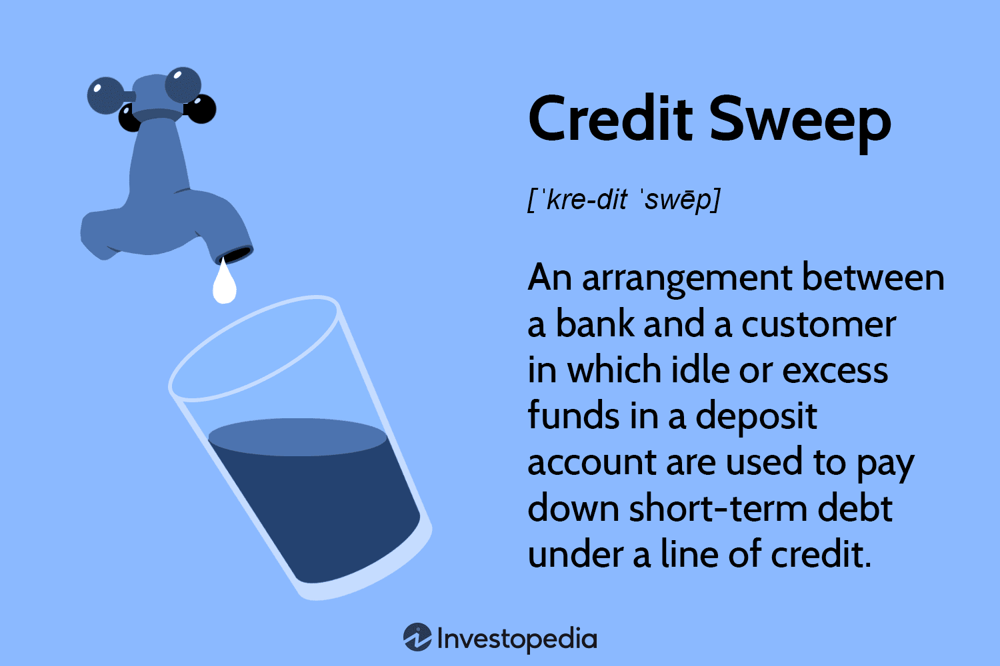

In the rapidly evolving financial landscape, managing costs effectively is essential for maximizing returns. As financial markets continue to grow in complexity, the need for individuals and institutions to optimize cost efficiency has become increasingly crucial. By carefully managing expenses, investors are better positioned to enhance their overall financial strategies and subsequently improve their profitability. This article examines the intersection of cost management, financial advisor fees, and algorithmic trading, focusing on strategies to reduce financial expenses.

Financial advisor fees have a direct impact on net returns. Understanding these fees—ranging from asset-based fees, which may average around 1% of assets under management, to flat or hourly fees for specific services—enables investors to identify areas where savings can be achieved. For high-net-worth individuals, sliding scales can offer reduced percentage charges for larger portfolios, potentially minimizing costs further.



Algorithmic trading, characterized by its ability to execute trades based on predefined criteria, presents a compelling approach for cost-conscious investors. By leveraging automated systems, traders can benefit from increased speed and accuracy, reduced human error, and lower transaction costs. This technological advancement helps capitalize on minute market fluctuations, thereby optimizing trade execution and financial efficiency.

The aim of this article is to equip investors with the knowledge to strategically reduce financial advisor fees and effectively use algorithmic trading. By understanding the critical role both elements play in financial strategy, investors can better position themselves to enhance their financial outcomes. This guide seeks to empower investors to grow their investments more efficiently by minimizing costs and maximizing returns.

Let us begin by examining the typical costs associated with financial advisors.

## Table of Contents

## Understanding Financial Advisor Fees

Financial advisors typically charge clients through various fee structures, which can significantly impact the overall cost of financial services. Understanding these fees is critical for investors seeking to optimize their financial planning expenses.

### Types of Financial Advisor Fees

**Asset-Based Fees**: These are calculated as a percentage of the assets under management (AUM). On average, a financial advisor charges about 1% of AUM annually. For example, if an investor has $500,000 managed by an advisor, the annual fee might be $5,000. However, the percentage can vary based on the advisor and the total assets managed. High-net-worth individuals often benefit from sliding scales, where larger amounts under management incur lower percentage charges.

**Commission-Based Fees**: Advisors may earn commissions by recommending specific financial products. While this model can seem cost-effective initially, it may lead to potential conflicts of interest, as advisors might prioritize products offering higher commissions over those best suited for the client.

**Fee-Only and Commission-Based Advisors**: Fee-only advisors charge clients directly without earning commissions on products, thereby reducing conflict of interest. They might charge a percentage of AUM, flat fees, or hourly rates. Commission-based advisors, conversely, rely on product-based income, which might not always align with client interests.

### Alternative Fee Structures

**Flat Fees**: Some investors prefer to pay a flat fee for specific financial services rather than a percentage of their assets. This might be suitable for clients needing occasional advice rather than continuous management.

**Hourly Rates**: Similar to flat fees, hourly rates offer a transparent method for paying for only the services needed. This structure benefits clients who seek financial consultations on particular topics or projects.

### Strategies to Reduce Fees

To minimize advisor fees, investors should begin by thoroughly understanding their fee structures:

1. **Evaluate Fee Structures**: Scrutinize whether asset-based, commission-based, or alternative structures align with your financial goals.

2. **Negotiate**: Engage in discussions with your advisor about potential fee reductions, especially if your portfolio grows significantly.

3. **Compare Advisors**: Shopping around can yield better contracts, as advisory services can differ in cost and quality.

4. **Opt for Fee-Only Advisors**: This might ensure that the advisor's interests are more aligned with yours, eliminating product bias.

By understanding and managing these fees, investors can significantly impact their net returns, resulting in more capital for investment growth.

## Why Reducing Fees Matters

Advisory fees can significantly affect the net return on investments, making their careful management essential for investors aiming to optimize their financial performance. The impact of these fees is particularly pronounced over extended periods. Even small percentage reductions in fees can accumulate into substantial savings, especially when managing large portfolios. 

For instance, consider an investor with a portfolio valued at $1,000,000. If the financial advisor charges a standard fee of 1% of assets under management (AUM), the annual fee would amount to $10,000. By reducing the fee to 0.8%, the investor saves $2,000 annually. Over a decade, assuming no growth or additional investments, this reduction alone could accumulate to $20,000 in savings, emphasizing the long-term financial benefits of minimizing fees.

Beyond simple arithmetic, lower fees directly correlate with higher amounts invested, thus profiting from compound growth. Compound interest can be illustrated with the formula:
$$
A = P (1 + r/n)^{nt}
$$
where $A$ is the amount of money accumulated after n years, including interest. $P$ is the principal amount, $r$ is the annual interest rate (as a decimal), $n$ is the number of times that interest is compounded per year, and $t$ is the number of years the money is invested for.

By minimizing fees, more of the principal $P$ remains for compounding, leveraging the exponential benefits of compounded returns. For example, investing $10,000 annually at a 6% return compounded annually over 30 years will yield approximately $838,017.83 without fees. With a 1% fee reducing the effective return to 5%, the final amount decreases to approximately $697,964.55, highlighting a significant difference of $140,053.28 due to a single percentage fee.

Minimizing advisory fees does not need to compromise the quality of advice received. Savvy investors often seek cost-efficient services while maintaining high standards by considering fee-only advisors who operate without conflicts of interest inherent in commission-based structures.

Ultimately, understanding how to manage and reduce these fees is paramount for meeting long-term financial goals. This begins with being informed about different fee structures, actively negotiating terms, and strategically selecting financial advisory services. Investors who prioritize effective fee reduction strategies not only enhance their potential returns but also lay a foundation for sustainable financial growth.

## Algorithmic Trading: An Overview

Algorithmic trading uses automated systems to perform trades according to fixed parameters, substantially enhancing trading practices through speed and precision. This method allows for handling substantial volumes of trades efficiently and at low costs, contributing to its increasing popularity among investors. Algorithmic trading systems operate with minimal human intervention, reducing transaction costs while ensuring consistent executions.

The main goal of [algorithmic trading](/wiki/algorithmic-trading) is to optimize profits while minimizing exposure to risk. This dual objective makes it particularly attractive to budget-conscious investors. The automated nature of these systems helps in eliminating emotional biases and improving decision-making, resulting in better financial outcomes.

Algorithmic trading strategies encompass a variety of elements and approaches. These typically involve leveraging computer algorithms to identify key trading opportunities, optimize trade execution, and ensure cost efficiency. Strategies may include statistical [arbitrage](/wiki/arbitrage), market timing, and trend-following. Each of these plays a crucial role in not only reducing financial fees but also in enhancing overall investment returns.

A deeper understanding of algorithmic trading mechanisms and strategies offers significant potential for reducing financial fees and improving yields. By operating with increased accuracy and speed, algorithmic trading provides a comprehensive solution for investors seeking to bolster their profitability while tightly managing associated costs.

## How Algorithmic Trading Reduces Costs

Algorithmic trading platforms significantly reduce costs through various mechanisms, offering an efficient alternative to traditional trading methods. One of the primary cost-saving opportunities is the reduction in bid-ask spreads. Algorithmic trading systems are designed to execute trades at the most advantageous prices, narrowing the spread between the buying price and the selling price. This capability is critical in markets where even the slightest variation in spread can lead to substantial cost differences over numerous transactions.

These platforms also enhance cost efficiency by optimizing trade execution. Algorithms are programmed to evaluate market conditions in real time, making rapid decisions to buy or sell assets. This process minimizes slippage—the difference between the expected price of a trade and the actual price at which it is executed—thus preserving capital. The ability to execute high-frequency trades allows algorithms to capitalize on minute price discrepancies that manual traders might overlook.

Moreover, automated systems mitigate emotional biases that often plague human traders. By adhering unfailingly to predefined criteria, algorithms ensure that trading decisions are based on logic rather than emotional reactions. This objectivity leads to consistently rational financial decisions and circumvents costly errors driven by human psychology, such as panic selling or irrational exuberance.

The high speed of algorithmic trading is another key [factor](/wiki/factor-investing) in its cost reduction capability. Algorithms can process information and execute trades within microseconds, a feat impossible for human traders. This speed means that algorithms can respond instantly to market movements, locking in optimal prices before the market adjusts.

Furthermore, algorithmic trading reduces transaction costs. The diminished need for human intervention translates to fewer manual errors, and the streamlined process of automated trading cuts the costs of brokerage services. The economies of scale achieved by processing large volumes of trades rapidly mean that the average cost per trade decreases.

Lastly, the integration of advanced trading algorithms enhances the cost efficiency of trades. Modern algorithms employ techniques such as [machine learning](/wiki/machine-learning) and [artificial intelligence](/wiki/ai-artificial-intelligence) to continually refine their strategies based on historical data and ongoing market trends. These advanced capabilities enable the system to predict market movements with greater accuracy, further optimizing cost-efficiency and enhancing returns on investment.

In summary, algorithmic trading reduces costs by leveraging technological advancements to optimize trade execution, eliminate emotional bias, and facilitate rapid transactions. Its ability to scale operations efficiently and refine strategies through machine learning contributes significantly to cost savings, making it an appealing choice for investors seeking to minimize expenses while maximizing returns.

## Strategies for Effective Cost Management

Engaging fee-based advisors rather than those who work on commission-based structures can lead to substantial savings on financial advisor fees. Fee-based models offer transparency and align the advisor’s interests more closely with those of the client, as advisors are compensated directly by their clients rather than through commissions on products sold. This structure encourages unbiased advice focused on the client’s specific needs and goals.

Utilizing low-cost trading platforms is another essential strategy for effective cost management. Many platforms now offer zero or minimal transaction fees, which can significantly reduce the cost of trading. Investors are advised to research and choose platforms that offer competitive fees without sacrificing quality service. Furthermore, negotiating fees with financial service providers can also lead to cost reductions. Many providers are open to discussion on their fee structures, especially for clients with substantial accounts or those who bundle various services.

Opting for passive investment strategies can be more cost-effective than active management. Passive strategies, like investing in index funds or exchange-traded funds (ETFs), generally have lower fees due to reduced management expenses. These investments track market indices, therefore incurring fewer costs compared to active management strategies, which involve frequent buying and selling of assets.

Backtesting algorithmic trading strategies is crucial to ensure they are cost-effective when applied under actual market conditions. Backtesting involves simulating the deployment of trading algorithms on historical data to evaluate their effectiveness in terms of returns and costs. This process helps identify potential issues and calibrate strategies to enhance cost-efficiency before applying them in real markets. A basic Python script for [backtesting](/wiki/backtesting) might involve libraries such as `pandas` for data manipulation and `numpy` for numerical calculations:

```python
import pandas as pd
import numpy as np

def backtest_strategy(data, strategy_function):
    # Apply the strategy function to the data
    signals = strategy_function(data)

    # Calculate returns based on signals
    data['returns'] = data['price'].pct_change()
    data['strategy_returns'] = signals * data['returns']

    # Sum strategy returns to get cumulative return
    cumulative_return = (1 + data['strategy_returns']).cumprod() - 1

    return cumulative_return.iloc[-1]

# Example strategy function
def simple_moving_average(data, window=50):
    sma = data['price'].rolling(window=window).mean()
    signals = np.where(data['price'] > sma, 1, -1)
    return signals
```

Finally, employing tools like Transaction Cost Analysis (TCA) is critical to understanding and managing trading fees. TCA evaluates the total costs incurred when executing trades, including explicit costs like commissions and implicit costs such as market impact. By analyzing these factors, investors can identify inefficiencies in their trading processes and make informed adjustments to reduce expenses and improve the overall cost-effectiveness of their investment strategies.

## Conclusion

Effective cost management is essential for enhancing investment portfolios and meeting financial objectives. A comprehensive approach that includes understanding and reducing financial advisor fees while incorporating algorithmic trading can lead to significant cost savings. 

Financial advisor fees form a crucial component of investment costs. By gaining a thorough understanding of these fees, investors can identify opportunities to reduce expenses without compromising the quality of advice. This might involve opting for fee-based advisors over commission-based ones, or exploring flat fee or hourly rate structures for specific services.

Algorithmic trading represents a technology-driven strategy to efficiently manage costs. Algorithms offer the potential to identify and execute trades at optimal times and prices, thus reducing transaction costs. By minimizing manual intervention, automated systems can make rational financial decisions without the emotional biases typical of human traders. This leads to more consistent performance across various market conditions.

It's crucial for investors to balance these cost reductions with the need for quality advice and strategic planning. Although reduced fees and lower transaction costs are beneficial, the value of a well-informed financial strategy cannot be underestimated. Leveraging both technology and professional financial advice ensures a robust approach to managing investments efficiently.

This integration of cost management techniques not only aims to preserve existing investment capital but also to fuel growth. By strategically minimizing fees and harnessing the efficiencies of algorithmic trading, investors can maximize their returns while navigating the complexities of financial markets. This dual strategy of cost reduction and strategic investment positions investors to achieve their long-term financial goals with enhanced effectiveness.

## References & Further Reading

[1]: Bergstra, J., Bardenet, R., Bengio, Y., & Kégl, B. (2011). ["Algorithms for Hyper-Parameter Optimization."](https://papers.nips.cc/paper/4443-algorithms-for-hyper-parameter-optimization) Advances in Neural Information Processing Systems 24.

[2]: ["Advances in Financial Machine Learning"](https://www.amazon.com/Advances-Financial-Machine-Learning-Marcos/dp/1119482089) by Marcos Lopez de Prado.

[3]: ["Evidence-Based Technical Analysis: Applying the Scientific Method and Statistical Inference to Trading Signals"](https://www.amazon.com/Evidence-Based-Technical-Analysis-Scientific-Statistical/dp/0470008741) by David Aronson.

[4]: ["Machine Learning for Algorithmic Trading"](https://github.com/stefan-jansen/machine-learning-for-trading) by Stefan Jansen.

[5]: ["Quantitative Trading: How to Build Your Own Algorithmic Trading Business"](https://books.google.com/books/about/Quantitative_Trading.html?id=j70yEAAAQBAJ) by Ernest P. Chan.