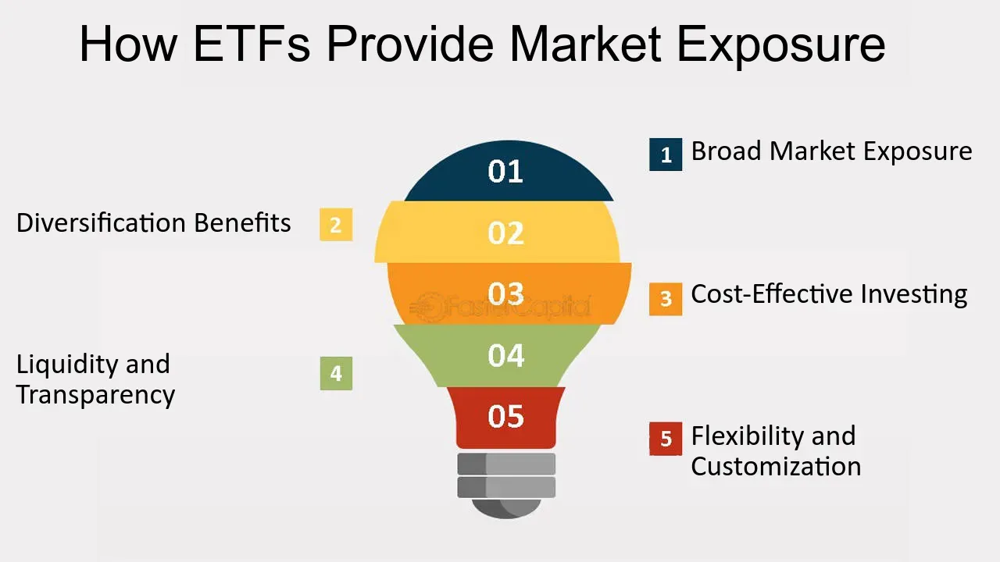

## Table of Contents

## What is an ETF and how does it work?

An ETF, or Exchange-Traded Fund, is a type of investment that works a lot like a mutual fund but trades on a stock exchange like a stock. It's a basket of securities, such as stocks or bonds, that you can buy and sell throughout the day at market prices. This means you can get in and out of your investment quickly, unlike mutual funds which only trade once a day after the market closes.

ETFs are popular because they offer a way to diversify your investments without having to buy each security individually. For example, if you want to invest in the technology sector, you can buy an ETF that holds a bunch of tech company stocks. This can be less risky than putting all your money into one or two tech companies. Plus, ETFs often have lower fees than mutual funds, which means you get to keep more of your returns.

## Why might someone want to reduce their stock market exposure?

Someone might want to reduce their stock market exposure if they think the market is going to go down. If the market drops, the value of their stocks will go down too. By selling some of their stocks, they can protect their money from big losses. It's like taking some chips off the table when you're winning at a game, so you don't lose everything if things go bad.

Another reason is if they need money for something important, like buying a house or paying for school. Stocks can be a good way to grow money over time, but they can also go up and down a lot. If someone needs money soon, they might not want it all in stocks because they could lose money if the market goes down right when they need it. So, they might sell some stocks to have cash ready for their plans.

Lastly, as people get closer to retiring, they often want to be safer with their money. Stocks can be risky, and if someone is about to stop working, they don't want to lose a lot of their savings right before they need it. By reducing their stock market exposure, they can move some of their money into safer investments like bonds, which don't go up and down as much. This helps them feel more secure about their future.

## How can ETFs be used to reduce stock market exposure?

ETFs can help you reduce your stock market exposure by letting you move your money into safer investments. If you think the stock market might go down, you can sell some of your stock ETFs and buy bond ETFs instead. Bond ETFs are usually safer because they don't go up and down as much as stocks. This way, you can protect your money from big drops in the stock market.

Another way ETFs can help is by letting you spread your money across different types of investments. You can buy ETFs that hold a mix of stocks, bonds, and other things like real estate or commodities. This mix can make your investments less risky because if one type of investment goes down, the others might not. It's like not putting all your eggs in one basket, which can help you feel more secure about your money.

## What are the different types of ETFs that can help in reducing stock market exposure?

One type of ETF that can help reduce stock market exposure is a bond ETF. These ETFs hold a bunch of bonds, which are safer than stocks because they don't go up and down as much. When you buy a bond ETF, you're putting your money into something that's less risky than the stock market. This can be a good choice if you're worried about the stock market going down and want to protect your money.

Another type is a diversified ETF. These ETFs hold a mix of different investments, like stocks, bonds, and even things like real estate or commodities. By spreading your money across different types of investments, you're not putting all your eggs in one basket. If the stock market goes down, the other parts of the ETF might not, which can help keep your money safer.

Lastly, there are sector rotation ETFs. These ETFs move money from one sector of the economy to another based on what's doing well. If you think stocks in one sector might go down, you can use these ETFs to shift your money to a different sector that might be safer. This can help you reduce your exposure to the stock market by focusing on parts of the economy that are less likely to drop in value.

## What are the benefits of using ETFs for reducing stock market exposure compared to other investment vehicles?

ETFs are a good choice for reducing stock market exposure because they are easy to buy and sell. You can trade them on the stock exchange just like you would with regular stocks. This means you can quickly move your money out of stocks and into safer investments like bonds if you think the market might go down. It's much easier than trying to sell a bunch of individual stocks or dealing with mutual funds, which only trade once a day after the market closes.

Another benefit of using ETFs is that they often have lower fees than other investment options like mutual funds. This means you get to keep more of your money, which is important when you're trying to protect your savings. ETFs also let you spread your money across different types of investments in one go. For example, you can buy a diversified ETF that holds stocks, bonds, and other things like real estate. This can make your investments less risky because if one type of investment goes down, the others might not, helping you feel more secure about your money.

## How do you select the right ETFs to minimize stock market risk?

To pick the right ETFs for reducing stock market risk, think about what you want to achieve. If you're worried about the stock market going down, you might want to choose bond ETFs. These hold a bunch of bonds, which are safer than stocks because they don't go up and down as much. Look for bond ETFs that focus on high-quality bonds, like government or top-rated corporate bonds, because they are less likely to lose value.

Another good choice is diversified ETFs. These hold a mix of different investments, like stocks, bonds, and even things like real estate or commodities. By spreading your money across different types of investments, you're not putting all your eggs in one basket. If the stock market goes down, the other parts of the ETF might not, which can help keep your money safer. When choosing a diversified ETF, check the mix of investments it holds to make sure it matches your risk comfort level.

You might also consider sector rotation ETFs if you want to shift your money away from risky parts of the stock market. These ETFs move money from one sector of the economy to another based on what's doing well. If you think stocks in one sector might go down, you can use these ETFs to shift your money to a different sector that might be safer. Always look at the ETF's past performance and the fees it charges, as these can affect how much money you keep in the end.

## What are the costs associated with ETFs and how do they impact the strategy of reducing stock market exposure?

ETFs have costs that you need to think about when you're trying to reduce your stock market exposure. The main cost is the expense ratio, which is like a yearly fee for owning the ETF. This fee is taken out of the ETF's total value, so the lower the expense ratio, the more money you get to keep. ETFs usually have lower expense ratios than mutual funds, which can help you save money over time. Another cost to watch out for is the trading fee, which is what you pay to buy or sell the ETF on the stock exchange. Some brokers don't charge trading fees, but if yours does, it can add up, especially if you're buying and selling a lot to adjust your exposure to the stock market.

These costs can affect your strategy for reducing stock market exposure in a few ways. If you're moving money from stock ETFs to bond ETFs or diversified ETFs, you want to pick ones with low expense ratios to keep more of your money safe. High fees can eat into your returns, making it harder to protect your savings. Also, if you're planning to trade ETFs often to adjust your exposure, you need to think about trading fees. If the fees are high, it might be better to make fewer trades or find a broker with lower or no trading fees. By choosing ETFs with low costs, you can make your strategy for reducing stock market risk more effective and keep more of your money safe.

## How does diversification through ETFs help in managing stock market risk?

Diversification through ETFs helps in managing stock market risk by spreading your money across different types of investments. Instead of putting all your money into one stock or one sector, you can buy an ETF that holds a bunch of different stocks, bonds, and other things like real estate or commodities. This way, if the stock market goes down, not all your money will be affected because some of it is in safer investments like bonds. It's like not putting all your eggs in one basket, which can help protect your savings from big drops in the stock market.

Using diversified ETFs also makes it easier to manage your risk because you don't have to buy each investment separately. You can just buy one ETF that already has a mix of different investments. This can save you time and money on fees. Plus, if you want to change how much risk you're taking, you can easily sell one ETF and buy another one that matches your new risk level. This flexibility helps you keep your money safer as the stock market changes.

## What are the tax implications of using ETFs to adjust stock market exposure?

When you use ETFs to adjust your stock market exposure, you need to think about taxes. If you sell an ETF for more than you paid for it, you'll have to pay capital gains tax on the profit. The tax rate depends on how long you held the ETF. If you held it for less than a year, it's a short-term capital gain, and you'll pay your regular income tax rate on it. If you held it for more than a year, it's a long-term capital gain, and the tax rate is usually lower. So, if you're selling ETFs often to change your stock market exposure, you might end up paying more in taxes.

Another thing to think about is how ETFs are structured. Some ETFs, like those that track broad market indexes, are more tax-efficient because they don't buy and sell their holdings as often. This means they might not pass on as many capital gains to you each year. But if you use ETFs that trade a lot, like sector rotation ETFs, they might pass on more capital gains, which could increase your tax bill. So, when you're picking ETFs to adjust your stock market exposure, think about how their structure might affect your taxes.

## How can one monitor and adjust their ETF portfolio to maintain desired levels of stock market exposure?

To keep your ETF portfolio at the right level of stock market exposure, you need to watch it closely. Check your ETFs often to see how they are doing. You can use tools like financial websites or apps to keep an eye on the value of your ETFs and how the stock market is doing. If you see that the stock market is going up a lot, you might want to sell some of your stock ETFs and buy more bond ETFs to keep your exposure where you want it. On the other hand, if the stock market goes down, you might want to buy more stock ETFs if you think they are a good deal.

Adjusting your ETF portfolio to maintain the right stock market exposure is all about balance. If your goal is to be safer, you might want to have more money in bond ETFs and less in stock ETFs. You can do this by selling some of your stock ETFs and using that money to buy bond ETFs. If you want to take more risk, you can do the opposite. Remember, every time you buy or sell ETFs, you might have to pay taxes on any profits, so think about that too. By keeping an eye on your ETFs and making changes when needed, you can keep your money safe and reach your investment goals.

## What are the potential risks and limitations of using ETFs to reduce stock market exposure?

Using ETFs to reduce stock market exposure can help you spread your money across different types of investments, but there are some risks and limits to think about. One big risk is that even though ETFs can help you diversify, the stock market can still go down a lot. If you have a lot of your money in stock ETFs, you could lose money if the market drops. Also, some ETFs, like sector rotation ETFs, might not always move your money to the safest places at the right time, which could leave your money at risk.

Another thing to watch out for is costs. ETFs have fees, like expense ratios and trading fees, which can eat into your savings over time. If you're trading ETFs a lot to adjust your stock market exposure, these fees can add up and make it harder to keep more of your money safe. Plus, every time you sell an ETF for a profit, you have to pay taxes on that gain, which can also take a bite out of your returns. So, while ETFs can be a good tool for managing risk, you need to be aware of these costs and limits to make the most of them.

## How do advanced strategies like inverse ETFs or leveraged ETFs play a role in managing stock market exposure?

Inverse ETFs and leveraged ETFs can be used to manage stock market exposure in more advanced ways. An inverse ETF is designed to go up when the stock market goes down. If you think the market is going to drop, you can buy an inverse ETF to try to make money from that drop. This can help you offset losses in your other stock investments. But, inverse ETFs can be risky because they use complex financial tools to achieve their goals, and they might not always move exactly opposite to the market.

Leveraged ETFs, on the other hand, aim to give you bigger returns by using borrowed money. If you think the market is going to go up, you can buy a leveraged ETF to try to make more money from that rise. For example, a 2x leveraged ETF tries to give you twice the daily return of the market. But, these ETFs can also lead to bigger losses if the market goes down. They are meant for short-term trading because their performance can change a lot over time, making them tricky to use for long-term investment goals.

## References & Further Reading

1. **Books**
   - Shobhit Seth, *ETF Trading Strategies Revealed: Best ETF Strategies for Successful ETF Trading*, McGraw-Hill, 2022. 
   - Ernest P. Chan, *Quantitative Trading: How to Build Your Own Algorithmic Trading Business*, Wiley, 2009.
   - David H. Weis, *Trades about to Happen: A Modern Adaptation of the Wyckoff Method*, Wiley, 2013.
   - Andreas F. Clenow, *Stocks on the Move: Beating the Market with Hedge Fund Momentum Strategies*, CreateSpace, 2015.

2. **Academic Papers**
   - Hendershott, T., & Riordan, R. (2014). Algorithmic trading and the market for liquidity. *Journal of Financial and Quantitative Analysis*, 49(4), 1001-1024.
   - Chordia, T., Roll, R., & Subrahmanyam, A. (2005). Evidence on the speed of convergence to market efficiency. *Journal of Financial Economics*, 76(2), 271-292.
   - Poterba, J. M., & Shoven, J. B. (2002). Exchange-traded funds: A new investment option for taxable investors. *American Economic Review*, 92(2), 422-427.

3. **Industry Reports**
   - BlackRock, *Understanding ETF Liquidity and Trading*, BlackRock ETF Trading and Liquidity Report, 2021.
   - Deloitte, *The Journey to Adopting Artificial Intelligence in Financial Services*, Deloitte Insights, 2020.
   - JP Morgan, *Machine Learning in Finance: Challenges and Opportunities*, JP Morgan AI Research, 2019.

4. **Online Resources**
   - Investopedia: Comprehensive guides on ETFs and algorithmic trading can be found on [Investopedia's website](https://www.investopedia.com).
   - ETF.com: Provides detailed insights and data on various exchange-traded funds.
   - QuantInsti Blog: Offers educational resources on algorithmic and quantitative trading.

5. **Software & Tools**
   - Python Libraries: 
     - `pandas` for data manipulation
     - `numpy` for numerical calculations
     - `scikit-learn` for machine learning models
     - `backtrader` for backtesting trading strategies
   - Online Platforms:
     - `QuantConnect` and `AlgoTrader` for real-time algorithmic trading environments.

These resources will expand your understanding and provide further technical and theoretical knowledge on ETFs and algorithmic trading strategies.

