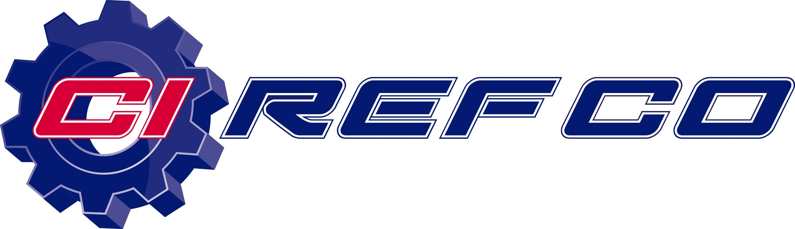

## Table of Contents

## What is Refco Inc. and what industry does it operate in?

Refco Inc. is a company that used to help people and businesses with buying and selling things like stocks, bonds, and other financial products. It was started a long time ago, in 1969, and it grew to be a big name in the world of finance. Refco worked with clients all over the world, helping them manage their money and investments.

The industry that Refco Inc. operated in is called the financial services industry. This industry includes banks, investment firms, and other companies that deal with money and investments. Refco was known for being a broker, which means it acted as a middleman to help people buy and sell financial products. However, in 2005, Refco ran into big problems and had to file for bankruptcy, which means it could not pay its debts and had to close down.

## When was Refco Inc. founded and by whom?

Refco Inc. was started in 1969. The person who founded it was a man named Ray E. Friedman. He wanted to create a company that would help people buy and sell financial products like stocks and bonds.

Ray E. Friedman's company grew over the years and became known around the world. Refco helped many clients manage their money and investments. It was a big part of the financial services industry until it faced serious problems in 2005.

## What are the main products and services offered by Refco Inc.?

Refco Inc. offered services that helped people and businesses buy and sell financial products. They were mainly known for being a broker, which means they acted as a middleman to help with trading. They dealt with things like stocks, bonds, commodities, and currencies. This meant that if someone wanted to buy or sell these financial products, Refco could help make the trade happen.

They also provided services like managing money for clients and giving advice on investments. This was useful for people who wanted to grow their money but didn't know exactly how to do it. Refco could help them figure out where to put their money to make it grow. They worked with clients all over the world, making sure they had the tools and information they needed to make smart financial decisions.

## How did Refco Inc. grow and expand over the years?

Refco Inc. started small in 1969 but grew a lot over the years. They began by helping people buy and sell financial products like stocks and bonds. As more people and businesses learned about Refco, the company got bigger. They opened offices in many different countries, which helped them reach more clients around the world. Refco also started offering more services, like managing money and giving investment advice. This made them a one-stop shop for financial needs, which helped them grow even more.

By the early 2000s, Refco had become a big name in the financial services industry. They had clients all over the world and were known for helping people make smart investment choices. Refco's growth was also helped by buying other companies that offered similar services. This made Refco even stronger and more well-known. However, their rapid growth came to a sudden stop in 2005 when they faced big financial problems and had to file for bankruptcy.

## What was the business model of Refco Inc. that led to its success?

Refco Inc.'s business model was based on being a broker, which means they helped people and businesses buy and sell things like stocks, bonds, commodities, and currencies. They acted as the middleman, making it easier for people to trade these financial products. Refco also offered other services like managing money for clients and giving advice on investments. This made them a helpful partner for people who wanted to grow their money but didn't know exactly how to do it.

The key to Refco's success was expanding their reach and services. They opened offices all over the world, which helped them get more clients from different countries. Refco also grew by buying other companies that offered similar services, making them even stronger and more well-known in the financial industry. By offering a wide range of services and being available in many places, Refco became a go-to place for people looking to trade and manage their investments.

## Can you describe the financial structure of Refco Inc. before its collapse?

Before Refco Inc. collapsed, its financial structure was complex. The company made money by charging fees for helping people buy and sell financial products like stocks and bonds. They also earned money from managing clients' investments and giving advice. Refco had a lot of debt, which means they borrowed a lot of money to grow their business. They used this borrowed money to buy other companies and open new offices around the world. This helped them get bigger and reach more clients, but it also meant they had to pay back a lot of money.

The problem came when it was found out that Refco had hidden a big debt. This debt was not shown in their financial reports, which made it look like the company was doing better than it really was. When this hidden debt was discovered, it caused a lot of trouble. People lost trust in Refco, and the company could not pay back all the money it owed. This led to Refco filing for bankruptcy in 2005, which means they had to close down because they could not pay their debts.

## What led to the bankruptcy of Refco Inc. in 2005?

Refco Inc. went bankrupt in 2005 because of a big problem with hidden debt. The company had borrowed a lot of money to grow its business, but it did not tell everyone about all of this debt. When people found out about the hidden debt, they lost trust in Refco. This hidden debt made it look like Refco was doing better than it really was, and when the truth came out, it caused a lot of trouble.

The discovery of the hidden debt led to a quick drop in Refco's stock price. Investors and clients started to pull their money out of the company, which made it even harder for Refco to pay back what it owed. In the end, Refco could not pay its debts and had to file for bankruptcy. This meant the company had to close down because it could not handle its financial problems.

## Who were the key figures involved in the Refco Inc. scandal?

The main person in the Refco Inc. scandal was Philip Bennett, who was the CEO of the company. He hid a big debt of about $430 million from the company's financial reports. This made it look like Refco was doing better than it really was. When people found out about this hidden debt, they lost trust in the company, and it led to big problems.

Another important person was Santo Maggio, who was Refco's chief financial officer. He worked with Bennett to hide the debt. Their actions made it hard for Refco to pay back what it owed, and this led to the company's bankruptcy in 2005. Both Bennett and Maggio faced legal trouble because of what they did.

## What were the legal and financial repercussions following the collapse of Refco Inc.?

After Refco Inc. collapsed, there were big legal and financial problems. The company's CEO, Philip Bennett, and its chief financial officer, Santo Maggio, were charged with hiding a big debt. They were found guilty of fraud and other crimes. Bennett went to prison for 16 years, and Maggio also faced jail time. The legal actions showed that what they did was wrong and helped to punish them for causing the company's problems.

The financial impact was huge. When Refco filed for bankruptcy, it meant they could not pay back all the money they owed. This hurt a lot of people and businesses that had trusted Refco with their money. The company's stock price dropped a lot, and many investors lost money. The bankruptcy also led to a big mess for everyone who was trying to figure out how to get their money back. It was a big lesson about the importance of being honest and clear about a company's financial situation.

## How did the Refco Inc. bankruptcy impact its clients and the broader financial market?

The Refco Inc. bankruptcy had a big impact on its clients. Many people and businesses had trusted Refco to help them with their money and investments. When Refco went bankrupt, it meant they could not get their money back right away. This was very upsetting and caused a lot of stress for clients. Some of them lost a lot of money because Refco could not pay back what it owed. The bankruptcy also made people lose trust in other financial companies because they worried that the same thing could happen to them.

The broader financial market also felt the effects of Refco's collapse. When news of Refco's hidden debt and bankruptcy came out, it made people nervous about the whole financial industry. The stock market saw a lot of ups and downs because of this. Other companies in the financial services industry had to work hard to show that they were different from Refco and that they were being honest about their finances. The Refco scandal was a big reminder for everyone in the financial world to be more careful and open about their money matters.

## What lessons can be learned from the rise and fall of Refco Inc. regarding financial regulation and corporate governance?

The story of Refco Inc. shows us how important it is to have good rules about money and how companies are run. Refco's big problem was hiding a lot of debt, which made it look like the company was doing better than it really was. If there had been stricter rules about showing all debts clearly, people might have known the truth earlier. This could have stopped the company from growing too fast and getting into so much trouble. It also shows that companies need to be honest and clear about their money situation, so people can trust them.

Another lesson from Refco is about who runs the company. The people in charge, like the CEO and CFO, need to be watched closely to make sure they are doing things the right way. In Refco's case, the CEO and CFO hid the debt, which hurt a lot of people. Better rules about how companies are run could have helped catch their bad actions sooner. This would have protected the company and its clients from the big problems that came later. In the end, the fall of Refco teaches us that good rules and honest leaders are key to keeping a company strong and trustworthy.

## What has been the legacy of Refco Inc. in the financial industry post-bankruptcy?

The legacy of Refco Inc. in the financial industry is a big lesson about being honest with money. After Refco went bankrupt, people learned that hiding debts can cause huge problems. It showed everyone that companies need to be clear about their financial situation. This led to tougher rules about how companies should report their money matters. Now, financial companies have to be more open about their debts and other financial details, so people can trust them more.

Refco's fall also changed how people think about who runs companies. It showed that leaders need to be watched closely to make sure they are doing things the right way. After Refco, there were more checks and balances put in place to stop bad actions by CEOs and other top people. This has helped make the financial industry safer and more trustworthy. Overall, Refco's legacy is about learning from mistakes and making sure they don't happen again.

## References & Further Reading

[1]: CFTC, & SEC. (2010). ["Findings Regarding the Market Events of May 6, 2010"](https://www.sec.gov/news/studies/2010/marketevents-report.pdf). U.S. Commodity Futures Trading Commission and U.S. Securities and Exchange Commission.

[2]: Chung, D., & Kogan, L. (2009). ["The Role of Institutional Investors in Financial Markets."](https://www.cambridge.org/core/journals/journal-of-financial-and-quantitative-analysis/article/abs/corporate-governance-and-institutional-ownership/E512121546CBA999BEBF65F195AA1E5C) National Bureau of Economic Research Working Paper.

[3]: Khandani, A. E., & Lo, A. W. (2007). ["What Happened To The Quants In August 2007?"](https://web.mit.edu/Alo/www/Papers/august07.pdf) Journal of Investment Management.

[4]: "The Dodd-Frank Wall Street Reform and Consumer Protection Act." (2010). Public Law 111-203, U.S. Congress. Available at: [Link](https://www.congress.gov/bill/111th-congress/house-bill/4173)

[5]: Lewis, M. (2014). ["Flash Boys: A Wall Street Revolt."](https://en.wikipedia.org/wiki/Flash_Boys) W. W. Norton & Company.