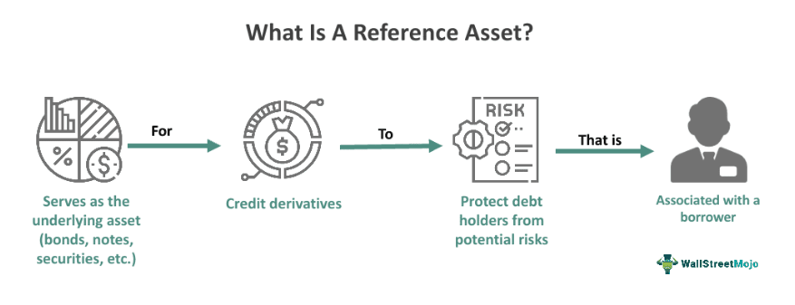

## Table of Contents

## What is a reference asset?

A reference asset is something that people use to compare or measure the value of other things. It's like a standard or a benchmark. For example, if you want to know how much your house is worth, you might compare it to similar houses that have been sold recently in your area. Those similar houses are the reference assets.

In finance, reference assets are very important. They help investors understand how well their investments are doing. For instance, if you invest in a stock, you might compare its performance to a stock market index like the S&P 500. The S&P 500 acts as a reference asset, showing whether your stock is doing better or worse than the overall market. This helps investors make smarter decisions about buying or selling their investments.

## Why are reference assets important in finance?

Reference assets are important in finance because they help people understand how well their investments are doing. Imagine you have some money invested in a company's stock. You want to know if that stock is doing well or not. By comparing it to a reference asset, like a stock market index, you can see if your stock is going up or down compared to the overall market. This helps you decide if you should keep your money in that stock or move it somewhere else.

Using reference assets also makes it easier to compare different types of investments. For example, if you have money in stocks, bonds, and real estate, you can use reference assets to see which one is performing the best. This way, you can make smarter choices about where to put your money. Without reference assets, it would be much harder to know if your investments are doing well or if you need to change your strategy.

## How do reference assets differ from other types of assets?

Reference assets are different from other types of assets because they are mainly used as a standard for comparison. While other assets like stocks, bonds, or real estate are bought and sold to make money, reference assets are not usually bought or sold in the same way. Instead, they help people measure the performance of their other investments. For example, a stock market index like the S&P 500 is a reference asset that shows how the overall market is doing, but you don't buy or sell the S&P 500 itself.

Another way reference assets differ is that they are often used to set benchmarks. This means they help investors see if their investments are doing better or worse than a standard. For instance, if you own a stock and it's doing better than the S&P 500, you might feel good about your investment. But if it's doing worse, you might think about selling it. Other types of assets don't usually serve this purpose; they are more about [earning](/wiki/earning-announcement) returns directly. So, reference assets are more about helping you make decisions than about making money directly.

## Can you give examples of common reference assets?

One common reference asset is the stock market index. A popular example is the S&P 500, which tracks the performance of 500 large companies in the United States. When people want to see how their own stocks are doing, they often compare them to the S&P 500. If their stocks are doing better than the S&P 500, they might feel good about their investment choices. If their stocks are doing worse, they might think about selling and trying something different.

Another common reference asset is the Consumer Price Index (CPI). This measures how prices for things like food, housing, and gas are changing over time. It helps people understand inflation, which is when prices go up. Investors might use the CPI to see if their investments are keeping up with rising prices. If their investments are not growing as fast as inflation, they might need to change their strategy to protect their money's value.

A third example is the yield on government bonds, like the 10-year U.S. Treasury bond. This is often used as a reference to see how safe investments are doing. If the yield on the 10-year Treasury bond goes up, it might mean that other investments need to offer higher returns to be attractive. Investors look at this to decide if they should move their money to safer or riskier investments based on what's happening in the bond market.

## How are reference assets used in derivative contracts?

Reference assets play a big role in derivative contracts. A derivative is a financial contract that gets its value from something else, like a stock or an index. In these contracts, the reference asset is what the derivative is based on. For example, if you have a futures contract on the S&P 500, the S&P 500 is the reference asset. The value of your futures contract will go up or down based on what happens to the S&P 500. This helps people bet on or protect against changes in the value of the reference asset without actually buying or selling it.

Using reference assets in derivatives helps investors manage risk. For instance, if you think the price of oil is going to go up, you could buy a futures contract on oil instead of buying oil itself. The price of that futures contract will be tied to the price of oil, which is the reference asset. This way, you can make money if oil prices go up, without having to store barrels of oil. On the other hand, if you own a lot of stocks and you're worried the market might go down, you could buy options based on the S&P 500 to protect your investments. The S&P 500 acts as the reference asset, helping you hedge against potential losses in your stock portfolio.

## What role do reference assets play in index funds?

Reference assets are very important for index funds. An index fund is a type of investment that tries to copy the performance of a certain index, like the S&P 500. The S&P 500 is a reference asset that shows how well 500 big companies in the U.S. are doing. When you invest in an S&P 500 index fund, your money is spread out among those 500 companies. The goal is to get the same returns as the S&P 500, without having to pick individual stocks yourself.

Using reference assets like the S&P 500 helps make index funds easy to understand and manage. Instead of trying to guess which stocks will do well, you can just follow the reference asset. This makes investing simpler and less risky. It also means that your investment will grow or shrink based on how the overall market does, which can be a good way to build wealth over time.

## How is the value of a reference asset determined?

The value of a reference asset is determined by looking at the prices or values of the things it represents. For example, if the reference asset is the S&P 500, its value comes from the prices of the 500 big companies it tracks. People add up the value of all these companies and use a special formula to figure out the S&P 500's value. This way, the reference asset shows how well those companies are doing as a group.

Sometimes, the value of a reference asset can change because of things like the economy, news, or what people think will happen in the future. If people think the economy will do well, they might buy more stocks, which can make the value of the S&P 500 go up. On the other hand, if there's bad news or people are worried about the future, they might sell their stocks, and the value of the S&P 500 could go down. So, the value of a reference asset is always moving, based on what's happening in the world and how people feel about it.

## What are the risks associated with using reference assets?

Using reference assets can help people understand how well their investments are doing, but there are some risks to think about. One big risk is that the reference asset might not be a perfect match for what you're trying to measure. For example, if you're comparing your small company stock to the S&P 500, the S&P 500 might not be a good fit because it's made up of big companies. This can make it hard to get a clear picture of how your stock is really doing.

Another risk is that the value of the reference asset can change a lot, and this can affect your decisions. If the S&P 500 goes down a lot, you might think your investments are doing badly and sell them, even if they're still okay. This can lead to making choices based on short-term changes instead of looking at the bigger picture. So, it's important to understand that reference assets are just tools and to use them carefully when making investment choices.

## How do regulatory bodies oversee the use of reference assets?

Regulatory bodies like the Securities and Exchange Commission (SEC) in the United States make sure that reference assets are used fairly and correctly. They create rules that companies and financial institutions must follow when they use reference assets in things like index funds or derivative contracts. This helps make sure that people are not tricked or treated unfairly. The regulators also check to make sure that the information about reference assets is clear and easy to understand, so investors can make good choices.

Sometimes, regulatory bodies also step in to stop problems before they start. They watch how reference assets are used and can take action if they see something wrong. For example, if a company is using a reference asset in a way that could hurt investors, the regulators might tell them to stop or even punish them. This helps keep the financial markets safe and fair for everyone.

## What advanced strategies involve the use of reference assets?

Some investors use reference assets in advanced ways to try to make more money or protect their investments better. One strategy is called "relative value investing." This means they look at how different investments are doing compared to a reference asset like the S&P 500. If they see that one investment is doing much better or worse than the reference asset, they might buy or sell it, hoping to make a profit from the difference. This can be tricky because it involves guessing how things will change in the future, but it can also help investors find good deals that others might miss.

Another advanced strategy is using reference assets in options trading. Options are contracts that give you the right to buy or sell something at a certain price. Investors might use a reference asset like the S&P 500 to create options that let them bet on where they think the market is going. For example, if they think the S&P 500 will go up, they could buy an option that pays off if it does. This can be a way to make money if their guess is right, but it can also be risky because they could lose money if the market doesn't go the way they thought it would.

## How can reference assets be used in portfolio diversification?

Reference assets help with portfolio diversification by giving investors a way to see how different parts of their investments are doing compared to something else. Imagine you have some money in stocks, some in bonds, and some in real estate. You can use a reference asset like the S&P 500 to see how your stocks are doing compared to the overall market. If your stocks are doing better than the S&P 500, you might feel good about keeping them. But if they're doing worse, you might decide to move some money into bonds or real estate to balance things out. This helps spread the risk so that if one type of investment goes down, the others might help keep your portfolio steady.

Another way reference assets help with diversification is by showing you how different types of investments move together. For example, if you notice that your stocks and the S&P 500 always go up and down at the same time, you might want to add some investments that don't move the same way. Maybe government bonds or gold, which might go up when stocks go down. By using a reference asset to understand these patterns, you can choose investments that help balance out your portfolio. This way, you're not putting all your eggs in one basket, and you're more likely to have a smoother ride in the long run.

## What future trends might impact the use of reference assets?

One future trend that might change how we use reference assets is the growth of new technology. As computers get better at handling lots of information quickly, people might start using more complicated reference assets. For example, instead of just looking at the S&P 500, investors could use a reference asset that tracks thousands of companies around the world. This could help them see a bigger picture of how the global economy is doing. Also, with more people using smartphones and the internet, information about reference assets could be shared faster and more easily, helping investors make quicker decisions.

Another trend is the focus on things like environmental, social, and governance ([ESG](/wiki/esg-investing)) factors. More and more, people want to invest in companies that are good for the planet and treat people well. This could lead to new types of reference assets that focus on ESG scores instead of just financial performance. For example, there might be an index that tracks companies with the best environmental practices. Investors could use these new reference assets to see if their investments are not only making money but also helping the world. This could change how people think about what makes a good investment and lead to more responsible investing overall.

## What is Understanding Financial Assets?

Financial assets are vital instruments in the financial markets, representing claims to future income and contractual rights associated with various entities. These monetary instruments can be easily traded or exchanged and are pivotal in constructing diversified investment portfolios, owing to their inherent liquidity and tradability.

Common examples of financial assets include stocks, bonds, mutual funds, and derivatives. Stocks signify ownership in a corporation, offering shareholders potential dividends and capital gains as the company's value increases. Bonds are fixed-income instruments that represent a loan made by an investor to a borrower, typically corporate or governmental, promising periodic interest payments and the return of the principal at maturity. Mutual funds pool money from numerous investors to purchase a diversified portfolio of stocks, bonds, or other securities, offering accessibility and risk diversification for individuals. Derivatives, such as options, futures, and swaps, derive their value from underlying assets or benchmarks and are primarily used for hedging risks or speculating on price movements.

The value of financial assets is predominantly based on contractual claims like future cash flow entitlements or ownership rights. For instance, a bondholder's claim might be structured as a series of interest payments over time, represented mathematically by the formula for the present value of an annuity:

$$
PV = C \times \left( \frac{1 - (1 + r)^{-n}}{r} \right)
$$

where $PV$ is the present value, $C$ is the periodic cash flow, $r$ is the interest rate, and $n$ is the number of periods.

The [liquidity](/wiki/liquidity-risk-premium) of financial assets refers to the ease with which they can be converted into cash without significantly affecting their price. This attribute is essential for investors seeking to quickly capitalize on market opportunities or meet short-term obligations. Equally important is the tradability of these assets, enabling investors to buy or sell them across various market platforms.

In conclusion, financial assets are indispensable to modern investment strategies, providing both income-generating potential and a mechanism for risk distribution. By understanding the characteristics and functions of these assets, investors can make informed decisions that enhance their portfolio's performance and resilience.

## References & Further Reading

[1]: Bergstra, J., Bardenet, R., Bengio, Y., & Kégl, B. (2011). ["Algorithms for Hyper-Parameter Optimization."](https://dl.acm.org/doi/10.5555/2986459.2986743) Advances in Neural Information Processing Systems 24.

[2]: ["Advances in Financial Machine Learning"](https://www.amazon.com/Advances-Financial-Machine-Learning-Marcos/dp/1119482089) by Marcos Lopez de Prado

[3]: ["Evidence-Based Technical Analysis: Applying the Scientific Method and Statistical Inference to Trading Signals"](https://www.amazon.com/Evidence-Based-Technical-Analysis-Scientific-Statistical/dp/0470008741) by David Aronson

[4]: ["Machine Learning for Algorithmic Trading"](https://github.com/stefan-jansen/machine-learning-for-trading) by Stefan Jansen

[5]: ["Quantitative Trading: How to Build Your Own Algorithmic Trading Business"](https://www.amazon.com/Quantitative-Trading-Build-Algorithmic-Business/dp/1119800064) by Ernest P. Chan