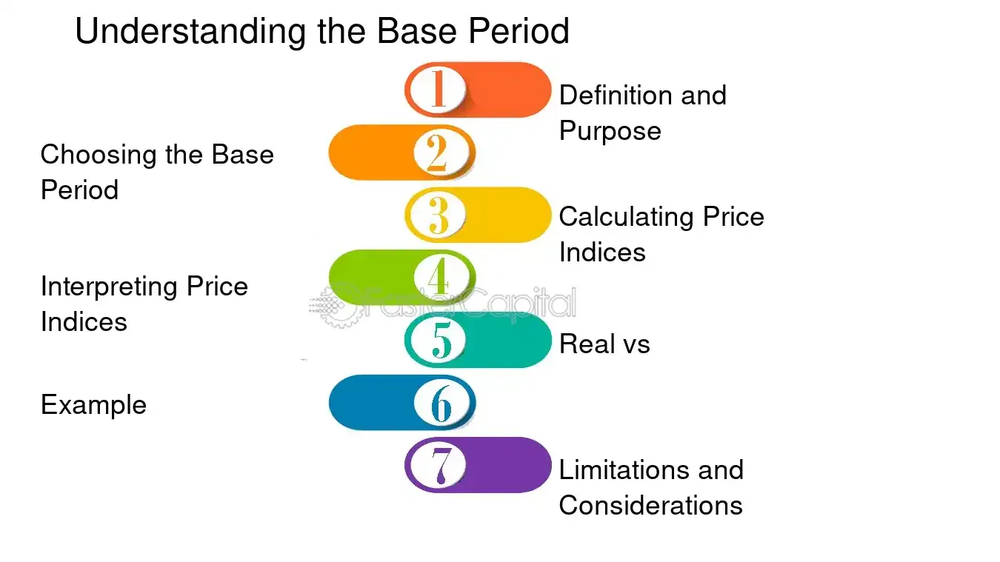

## Table of Contents

## What is a reference base period?

A reference base period is a specific time frame that is used as a standard for comparison in economic and statistical analysis. It helps to measure changes over time by providing a fixed point of reference. For example, if you want to see how prices have changed over the years, you might compare current prices to those from a chosen reference base period.

This period is important because it allows analysts to make meaningful comparisons. By using a consistent reference base period, they can track trends and understand how different factors affect the economy or other data sets. For instance, the Consumer Price Index (CPI) often uses a reference base period to show how inflation impacts the cost of living over time.

## Why is a reference base period important in data analysis?

A reference base period is really important in data analysis because it gives us a starting point to compare things. When we want to see how something has changed over time, like prices or unemployment rates, we need a fixed time to start from. This helps us understand if things are getting better or worse. Without a reference base period, it would be hard to tell if the changes we see are big or small.

Using a reference base period also makes sure everyone is looking at the same information. This is important when lots of people are studying the same data. If everyone uses the same base period, they can talk about their findings and compare them easily. It's like having a common language for data, which makes the analysis more reliable and useful.

## How is a reference base period used in economic indicators?

A reference base period is used in economic indicators to help us see how things change over time. For example, if we want to know how prices have changed, we can compare today's prices to the prices during the reference base period. This helps us understand if prices are going up or down. Many economic indicators, like the Consumer Price Index (CPI), use a reference base period to show how inflation affects the cost of living.

Using a reference base period also makes it easier for everyone to understand and talk about economic data. When economists and policymakers use the same reference period, they can compare their findings and make better decisions. For instance, if the unemployment rate is lower now than it was during the reference base period, it might mean the economy is doing better. This common starting point helps everyone see the bigger picture and make sense of the numbers.

## Can you explain the difference between a reference base period and a base year?

A reference base period and a base year are similar because they both help us compare things over time. A reference base period is a specific time frame that we use as a starting point to see how things have changed. It could be a month, a quarter, or any other period of time that makes sense for what we're looking at.

A base year, on the other hand, is a special kind of reference base period. It's always a full year, like 2010 or 2020. We use a base year a lot in economics, especially when we're looking at things like inflation or how much the economy has grown. So, while a reference base period can be any length of time, a base year is always one year long.

## What are the steps to select an appropriate reference base period?

Choosing the right reference base period is important for making good comparisons in data analysis. First, you need to think about what you want to study. If you're looking at prices, you might pick a year when prices were stable. If you're studying unemployment, you might choose a year when the job market was normal. It's also helpful to pick a time that has good data available, so you can be sure your starting point is accurate.

Next, consider how long the reference base period should be. It could be a year, a quarter, or even a month, depending on what makes sense for your study. For example, if you're looking at monthly sales, using a month as your base period might be best. Also, think about whether the period you choose will stay relevant over time. You want to make sure that future comparisons will still make sense. By thinking carefully about these things, you can choose a reference base period that helps you understand how things change over time.

## How does the choice of reference base period affect statistical comparisons?

The choice of reference base period can really change how we see the data when we make comparisons. If we pick a time when things were really different from now, like during a big economic change, our comparisons might make things look more different than they really are. For example, if we use a year when prices were super low as our reference, today's prices might seem a lot higher than they really are.

On the other hand, if we choose a time that's pretty normal and similar to now, our comparisons will be more fair and easier to understand. This helps us see real changes, not just differences because we started from a weird time. So, picking the right reference base period is important for making sure our data tells the true story.

## What are some common challenges faced when using a reference base period?

One big challenge when using a reference base period is picking the right time to start from. If you choose a year when things were really different, like during a big economic crisis, your comparisons might not show the real changes. For example, if prices were super low in your reference year, today's prices might look a lot higher than they really are. It's hard to find a time that's normal enough to make fair comparisons.

Another challenge is that over time, the reference base period might not stay relevant. Things change, and what was normal back then might not be normal now. This can make it hard to understand if the changes you see are because of real trends or just because the starting point is outdated. Keeping the reference base period useful means you might need to update it sometimes, which can be a lot of work.

## How can changes in a reference base period impact long-term data series?

Changing the reference base period can make long-term data series hard to understand. If you switch the starting point, all the numbers you've been tracking for a long time will look different. This can make it tough to see the real trends over the years. For example, if you were looking at how prices have changed and you switch the base year from 2000 to 2010, all your old data would need to be adjusted. This can confuse people who are used to seeing the numbers one way.

Also, changing the base period might make it hard to compare data from different times. If you've been using one base year for a long time, everyone knows what it means. But if you change it, people might not understand the new numbers as well. This can make it harder for everyone to talk about the data and make decisions based on it. So, it's important to think carefully before changing the reference base period in a long-term data series.

## What are the best practices for updating a reference base period?

When you need to update a reference base period, it's important to do it carefully so everyone understands the changes. Start by choosing a new base period that is normal and similar to the current times. This helps make sure the new comparisons will be fair and easy to understand. It's also a good idea to explain why you're making the change. Tell people how the new base period will help them see the data better. This way, everyone can adjust to the new numbers without getting confused.

Once you've picked the new base period, you need to update all the old data to match it. This means going back and changing the numbers so they all start from the new base period. It's a lot of work, but it's important to keep the data accurate. After you've made the changes, share the updated data with everyone who uses it. Make sure they know how to read the new numbers and what the changes mean. By doing this, you help keep the data useful and reliable for everyone.

## How do different industries apply the concept of a reference base period differently?

In the finance industry, a reference base period is often used to compare stock prices or economic indicators over time. For example, financial analysts might use a base year to track the performance of the stock market or to measure inflation rates. This helps them understand if investments are growing or if the cost of living is going up. Banks and investment firms also use reference base periods to set benchmarks for their financial products, making it easier to explain to clients how their investments are doing compared to a certain point in the past.

In the healthcare industry, a reference base period can be used to track changes in patient outcomes or healthcare costs. Hospitals and health organizations might choose a specific year to compare data on things like the number of patients treated or the average cost of treatments. This helps them see if they are improving care or if costs are going up. By using a reference base period, healthcare providers can make better decisions about where to focus their efforts to improve patient care and manage expenses.

In the retail industry, a reference base period is crucial for analyzing sales trends and consumer behavior. Retailers often use a base period to compare current sales figures with past performance, helping them understand if their sales are growing or if certain products are becoming more popular. This can guide decisions on inventory, marketing strategies, and even store layouts. By choosing a relevant base period, retailers can better predict future sales and adjust their business strategies accordingly.

## What are the implications of using multiple reference base periods within the same study?

Using multiple reference base periods in the same study can make things more complicated but also more useful. When you use different base periods, you can look at the same data in different ways. This can help you see how things have changed over time from different starting points. For example, if you're studying how prices have changed, using different base years might show you different trends. This can give you a fuller picture of what's happening, but it can also be hard to understand because the numbers will look different depending on which base period you use.

On the other hand, using multiple base periods can confuse people who are trying to understand the data. If everyone is used to seeing the numbers based on one base period, switching to another can make it hard to compare the old data with the new. It's important to explain clearly why you're using different base periods and how to read the new numbers. This way, people can still make sense of the data and use it to make good decisions.

## How can advanced statistical techniques improve the accuracy of analyses using a reference base period?

Advanced statistical techniques can make analyses using a reference base period more accurate by helping to adjust for changes over time. For example, techniques like regression analysis can help you see how different factors affect the data. If you're looking at prices, regression can show you how inflation or other economic changes have made prices go up or down. This helps you understand if the changes you see are because of real trends or just because of the base period you chose. By using these techniques, you can make sure your comparisons are fair and your conclusions are more reliable.

Another way advanced statistics can help is by smoothing out the data. Sometimes, the numbers can jump around a lot from year to year, making it hard to see the real trends. Techniques like moving averages or time series analysis can help smooth out these jumps, giving you a clearer picture of how things are changing over time. This makes it easier to compare the current data to the reference base period and understand if the changes are big or small. By using these advanced methods, you can make your data analysis more accurate and helpful.

## How is Time Series Analysis Applied in Algorithmic Trading?

Algorithmic trading significantly benefits from the application of time series analysis, as it assists in predicting market trends and making informed trading decisions. This quantitative approach involves dissecting time series data, such as stock prices and trading volumes, to discern patterns and trends that inform strategic trade executions. 

Time series analysis in [algorithmic trading](/wiki/algorithmic-trading) typically focuses on identifying and forecasting trends, seasonality, and cyclical behavior within the financial markets. For example, traders often use moving averages, autoregressive models, and exponential smoothing to filter noise and highlight underlying trends in stock price data. These models help in extrapolating future price movements, thus aiding in the timing of buy or sell decisions.

One of the primary tools used in this domain is the Autoregressive Integrated Moving Average (ARIMA) model, cherished for its ability to forecast future points in a time series by leveraging dependencies between earlier data points. The ARIMA model comprises three main parameters: $p$ (lag order), $d$ (degree of differencing), and $q$ (order of moving average). The model can be represented as:

$$
ARIMA(p, d, q) = \Theta(B)(1 - B)^dX_t = \Phi(B) \epsilon_t
$$

Where $B$ is the backshift operator, $\epsilon_t$ represents white noise, $\Theta$ denotes the polynomial in terms of autoregressive parameters, and $\Phi$ encapsulates the polynomial in moving average parameters.

In algorithmic trading, ensuring that time series models are well-prepared is crucial for effective risk management and enhancing decision-making processes. For instance, [machine learning](/wiki/machine-learning) algorithms, such as Long Short-Term Memory (LSTM) networks, have become popular for analyzing time series data due to their ability to capture temporal dependencies over long sequences more effectively. Below is a simple example of how LSTM can be implemented in Python using the Keras library:

```python
from keras.models import Sequential
from keras.layers import LSTM, Dense
import numpy as np

# Simulated time series data
data = np.sin(np.linspace(0, 100, 1000))

# Prepare data for LSTM
X = np.array([data[i:i+10] for i in range(len(data)-10)])
Y = data[10:]

# Reshape for LSTM layer [samples, time steps, features]
X = X.reshape(X.shape[0], X.shape[1], 1)

# Build the LSTM model
model = Sequential()
model.add(LSTM(50, activation='relu', input_shape=(10, 1)))
model.add(Dense(1))
model.compile(optimizer='adam', loss='mse')

# Train the model
model.fit(X, Y, epochs=200, verbose=0)
```

This example illustrates how traders can design models that predict stock price movements based on historical prices. By leveraging such advanced modeling techniques, traders can more accurately forecast price trends and [volatility](/wiki/volatility-trading-strategies), ultimately leading to more strategic trades and enhanced risk management.

In conclusion, using time series analysis in algorithmic trading facilitates robust predictive capabilities, which are integral for managing risks and executing trades effectively. Tools such as the ARIMA model and LSTM networks enable traders to dissect vast streams of financial data, thereby improving the accuracy of their predictive models and trading strategies.

## References & Further Reading

[1]: Cryer, J., & Chan, K. (2008). ["Time Series Analysis: With Applications in R"](https://mybiostats.files.wordpress.com/2015/03/time-series-analysis-with-applications-in-r-cryer-and-chan.pdf). Springer.

[2]: Hyndman, R. J., & Athanasopoulos, G. (2018). ["Forecasting: Principles and Practice"](https://otexts.com/fpp2/). OTexts.

[3]: Box, G. E. P., Jenkins, G. M., Reinsel, G. C., & Ljung, G. M. (2015). ["Time Series Analysis: Forecasting and Control"](https://onlinelibrary.wiley.com/doi/book/10.1002/9781118619193). Wiley.

[4]: Hamilton, J. D. (1994). ["Time Series Analysis"](https://archive.org/details/timeseriesanalys0000hami). Princeton University Press.

[5]: Shumway, R. H., & Stoffer, D. S. (2017). ["Time Series Analysis and Its Applications: With R Examples"](https://link.springer.com/book/10.1007/978-3-319-52452-8). Springer.

[6]: Hull, J. C. (2018). ["Options, Futures, and Other Derivatives"](https://www.semanticscholar.org/paper/Options%2C-Futures%2C-and-Other-Derivatives-Hull/89bdee500c8623864fc9eb7a471546aa713acc44). Pearson.

[7]: Pindyck, R. S., & Rubinfeld, D. L. (2012). ["Microeconomics"](https://archive.org/details/microeconomics0007pind). Pearson.

[8]: Zhang, P. G. (2003). ["Time Series Analysis: Forecasting and Control, 4th Edition by George E. P. Box, et al."](https://www.researchgate.net/publication/222735629_Zhang_GP_Time_Series_Forecasting_Using_a_Hybrid_ARIMA_and_Neural_Network_Model_Neurocomputing_50_159-175). Journal of the American Statistical Association.