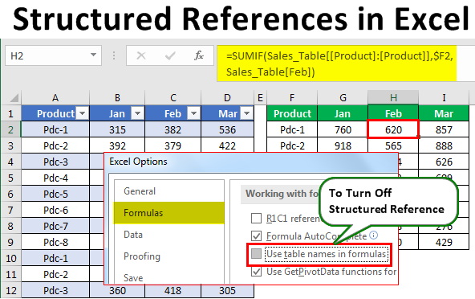

Time series analysis is crucial in economic analysis and predictive modeling, offering a framework to evaluate temporal data and draw meaningful inferences. At its core, this method involves scrutinizing sequences of data points to discern inherent structures or trends that can serve as predictive signals. Given its robust capabilities, time series analysis has become integral in interpreting economic indicators, shaping monetary policy, and enhancing algorithmic trading strategies.

This article aims to explain how time series analysis can be applied to understand economic indices, illustrating the pivotal role of a reference base period. The reference base period functions as an anchor point, allowing economists to make accurate temporal comparisons, especially when assessing metrics like inflation through indices such as the Consumer Price Index (CPI).



Furthermore, we explore how these principles are woven into algorithmic trading strategies, wherein historical financial data is analyzed to forecast price movements and execute trades with precision. This integration underscores a profound synergy between economic theory and practical trading, enabling traders and analysts to harness quantitative insights for improved forecast accuracy and informed decision-making in the financial markets.

By understanding these concepts, professionals in the field can leverage time series analysis to gain a competitive edge, navigating the complexities of economic indicators and volatile market conditions with greater confidence and acuity.

## Table of Contents

## Understanding Time Series Analysis

Time series analysis is a method used to analyze a sequence of data points collected over regular intervals. Its primary purpose is to identify underlying patterns and forecast future values based on historical data. This form of analysis is crucial in various domains, such as finance, meteorology, and economics, where predicting future trends is essential.

### Key Components

#### Trend
The trend component represents the long-term direction of the time series data. It indicates whether the data is increasing, decreasing, or remaining constant over time. Identifying the trend component is vital for understanding the overall movement in the data, which can be extracted using techniques such as moving averages. A common approach to model a trend is to apply linear regression, which helps determine if there's a systematic increase or decrease over time.

#### Seasonality
Seasonality refers to periodic fluctuations that occur at regular intervals due to seasonal factors. These patterns repeat over a specific time frame, such as days, months, or quarters. For instance, retail sales often increase during holiday seasons each year. Identifying seasonal patterns enables analysts to make more accurate predictions by accounting for these cyclical factors. Seasonal decomposition of time series (STL) is a method that helps in isolating the seasonal component from the data.

#### Cyclical Patterns
While similar to seasonality, cyclical patterns are broader levels of fluctuation that occur over longer periods and are often linked to economic cycles rather than calendar-based seasons. These cycles do not have a fixed or predictable length, making identification and forecasting challenging. Unlike seasonality, cyclical movements are not necessarily regular, and they depend significantly on the external economic environment.

### Application in Predictive Models

Time series analysis is integral in developing predictive models, as it allows analysts to establish the temporal links among data points that are crucial for projections. Techniques such as Autoregressive Integrated Moving Average (ARIMA) and Exponential Smoothing State Space Model (ETS) are often employed to create these models. An ARIMA model, for example, combines three components: autoregression (AR), differencing (I), and moving average (MA) to forecast future values. 

A simple example in Python to illustrate fitting an ARIMA model could be:

```python
import pandas as pd
from statsmodels.tsa.arima.model import ARIMA

# Loading the dataset
data = pd.read_csv('example_timeseries.csv')
series = data['values']

# Fit the ARIMA model
model = ARIMA(series, order=(1, 1, 1))
model_fit = model.fit()

# Make predictions
forecast = model_fit.forecast(steps=5)
print(forecast)
```

This code snippet loads a time series dataset, fits an ARIMA model, and forecasts future values. The choice of parameters (p, d, q) is crucial for an accurate fit and illustrates the need for understanding the components of time series data.

In conclusion, the successful application of time series analysis relies on dissecting data into its key components and accurately modeling these elements to forecast future outcomes. This understanding allows for informed decision-making across various fields, enhancing the ability to anticipate changes and trends.

## Economic Indicators and Reference Base Period

Economic indicators are statistical metrics used to evaluate the health and direction of an economy. They provide critical insights into various economic phenomena, such as inflation, employment rates, gross domestic product (GDP), and more. One of the most important indicators for assessing inflation is the Consumer Price Index (CPI). The CPI measures the average change over time in the prices paid by consumers for goods and services and is instrumental in understanding purchasing power and cost of living. 

The CPI uses a reference base period as a benchmark. During this period, the CPI is normalized to a value of 100. This normalization allows for a straightforward comparison of how prices have changed over time by providing a fixed point against which price movements are measured. For example, if the CPI is currently 115, it indicates that there has been a 15% increase in the price level compared to the base period. The choice of this base period is crucial as it impacts the interpretation of inflation [statistics](/wiki/bayesian-statistics). An improper selection may lead to skewed evaluations of inflation trends and economic policy effectiveness.

When selecting the reference base period, several factors should be considered. It should represent a period devoid of abnormal economic conditions, such as wars or economic crises, that could distort the index. Moreover, it should be recent enough to remain relevant for current economic conditions. Updating the base period periodically is often necessary to reflect changes in consumer behavior and economic structure, ensuring the CPI remains an accurate measure of inflation. 

The accurate interpretation of economic indicators like the CPI and the strategic selection of reference base periods are paramount for economists and policymakers. They inform decisions regarding monetary policies, cost of living adjustments, and economic forecasts. Inaccuracies in these processes can lead to suboptimal policy decisions, affecting everything from interest rates to wage negotiations. Thus, understanding how to utilize economic indicators and appropriately establish reference base periods is key to sound economic analysis and policy making.

## Application of Time Series Analysis in Algorithmic Trading

Algorithmic trading significantly benefits from the application of time series analysis, as it assists in predicting market trends and making informed trading decisions. This quantitative approach involves dissecting time series data, such as stock prices and trading volumes, to discern patterns and trends that inform strategic trade executions. 

Time series analysis in [algorithmic trading](/wiki/algorithmic-trading) typically focuses on identifying and forecasting trends, seasonality, and cyclical behavior within the financial markets. For example, traders often use moving averages, autoregressive models, and exponential smoothing to filter noise and highlight underlying trends in stock price data. These models help in extrapolating future price movements, thus aiding in the timing of buy or sell decisions.

One of the primary tools used in this domain is the Autoregressive Integrated Moving Average (ARIMA) model, cherished for its ability to forecast future points in a time series by leveraging dependencies between earlier data points. The ARIMA model comprises three main parameters: $p$ (lag order), $d$ (degree of differencing), and $q$ (order of moving average). The model can be represented as:

$$
ARIMA(p, d, q) = \Theta(B)(1 - B)^dX_t = \Phi(B) \epsilon_t
$$

Where $B$ is the backshift operator, $\epsilon_t$ represents white noise, $\Theta$ denotes the polynomial in terms of autoregressive parameters, and $\Phi$ encapsulates the polynomial in moving average parameters.

In algorithmic trading, ensuring that time series models are well-prepared is crucial for effective risk management and enhancing decision-making processes. For instance, [machine learning](/wiki/machine-learning) algorithms, such as Long Short-Term Memory (LSTM) networks, have become popular for analyzing time series data due to their ability to capture temporal dependencies over long sequences more effectively. Below is a simple example of how LSTM can be implemented in Python using the Keras library:

```python
from keras.models import Sequential
from keras.layers import LSTM, Dense
import numpy as np

# Simulated time series data
data = np.sin(np.linspace(0, 100, 1000))

# Prepare data for LSTM
X = np.array([data[i:i+10] for i in range(len(data)-10)])
Y = data[10:]

# Reshape for LSTM layer [samples, time steps, features]
X = X.reshape(X.shape[0], X.shape[1], 1)

# Build the LSTM model
model = Sequential()
model.add(LSTM(50, activation='relu', input_shape=(10, 1)))
model.add(Dense(1))
model.compile(optimizer='adam', loss='mse')

# Train the model
model.fit(X, Y, epochs=200, verbose=0)
```

This example illustrates how traders can design models that predict stock price movements based on historical prices. By leveraging such advanced modeling techniques, traders can more accurately forecast price trends and [volatility](/wiki/volatility-trading-strategies), ultimately leading to more strategic trades and enhanced risk management.

In conclusion, using time series analysis in algorithmic trading facilitates robust predictive capabilities, which are integral for managing risks and executing trades effectively. Tools such as the ARIMA model and LSTM networks enable traders to dissect vast streams of financial data, thereby improving the accuracy of their predictive models and trading strategies.

## Integrating Economic Indicators with Time Series Analysis

Economic indicators play a vital role in enhancing time series models by providing contextual data that reflect the broader market and economic conditions. By integrating indicators such as the Consumer Price Index (CPI), traders and analysts can create more robust predictive models that account for inflationary trends and other economic variables. This integration aids in refining trading strategies, allowing for a comprehensive evaluation of market movements.

Incorporating economic indicators into time series analysis involves aligning these data points with the regular flow of time series data, such as stock prices, interest rates, or trading volumes. By doing so, analysts can quantify how factors like inflation influence market behavior over time. For instance, a rising CPI might suggest a higher inflation rate, impacting consumer purchasing power and subsequently affecting stock market trends. This correlation can be modeled and tested using time series techniques to predict future movements.

Successful integration of economic indicators into time series models permits the forecasting of market reactions to changes in economic policies or shifts in macroeconomic factors. This predictive capability is valuable for traders looking to adapt their strategies based on anticipated policy changes like [interest rate](/wiki/interest-rate-trading-strategies) adjustments or fiscal stimulus. For example, an unexpected increase in CPI might forecast an interest rate hike by central banks, prompting traders to adjust their positions accordingly.

To integrate these indicators seamlessly, statistical methods such as vector autoregression (VAR) are often employed. VAR models allow for the analysis of multivariate time series, accommodating multiple economic indicators simultaneously, and capturing the relationship between these indicators and the primary time series data. This approach not only enhances the depth of analysis but also improves the accuracy of forecasts.

In practice, integrating economic indicators requires careful data handling and model validation. Python, with libraries such as `pandas` for data manipulation and `statsmodels` for statistical modeling, provides an efficient toolkit for such tasks. Here is a simplified example of how this integration might look in Python:

```python
import pandas as pd
from statsmodels.tsa.api import VAR

# Load time series data and CPI data
time_series_data = pd.read_csv('market_data.csv', index_col='Date', parse_dates=True)
cpi_data = pd.read_csv('cpi_data.csv', index_col='Date', parse_dates=True)

# Merge the datasets on time index
combined_data = pd.merge(time_series_data, cpi_data, left_index=True, right_index=True)

# Fit a VAR model
model = VAR(combined_data)
results = model.fit(maxlags=15, ic='aic')

# Forecast future values
forecast = results.forecast(combined_data.values[-results.k_ar:], steps=5)
```

This approach allows analysts to incorporate diverse economic indicators into comprehensive time series models, providing a greater understanding of market dynamics and enabling traders to craft well-informed strategies in response to economic shifts.

## Advanced Strategies and Challenges in Time Series Analysis

Advanced strategies in time series analysis, such as multivariate time series analysis and high-frequency data strategies, can provide deeper insights into complex datasets. Multivariate time series analysis involves examining multiple dependent variables simultaneously, allowing for the recognition of interdependencies and interactions that may not be apparent when analyzing a single variable. This approach provides a more comprehensive understanding of the data and can enhance the accuracy of predictive models.

High-frequency data strategies involve analyzing data points collected at very short intervals, such as seconds or milliseconds, which are common in fields like finance where rapid decision-making is critical. These strategies enable analysts and traders to detect subtle patterns and trends that could be missed with lower-frequency analysis.

However, several challenges are associated with advanced time series analysis techniques. One significant challenge is dealing with sporadic data points, which can result from missing data or irregular intervals between observations. This issue complicates the continuous analysis of time series data, often requiring sophisticated interpolation methods or data imputation strategies to maintain model integrity.

Ensuring model reliability is another prevalent issue. Models may overfit to historical data, capturing noise rather than underlying patterns, which adversely affects their predictive performance on future datasets. Regularization techniques, such as Lasso or Ridge regression, can be applied to mitigate overfitting by penalizing excessive complexity in the model. Additionally, model validation through techniques like cross-validation is essential in assessing the reliability and generalizability of predictive models.

Utilizing data science tools and methodologies can aid in overcoming these challenges to refine predictive models. Libraries in Python, such as `statsmodels` and `scikit-learn`, offer robust frameworks for implementing multivariate time series analysis. For high-frequency data analysis, tools like `pandas` and `numpy` facilitate efficient data manipulation and computation.

Here is a simple example in Python for handling a multivariate time series analysis:

```python
import pandas as pd
from statsmodels.tsa.vector_ar.var_model import VAR

# Load your multivariate time series data
data = pd.read_csv('multivariate_timeseries.csv')

# Preprocessing: Ensure the data is stationary
diff_data = data.diff().dropna()

# Fit the VAR model
model = VAR(diff_data)
results = model.fit(maxlags=15, ic='aic')

# Forecasting future values
forecast = results.forecast(diff_data.values[-15:], steps=5)
print(forecast)
```

These tools allow for effective handling of complex datasets, improving the robustness and accuracy of time series predictions. By leveraging advanced strategies and addressing prevalent challenges, analysts can significantly enhance their analysis and decision-making abilities in dynamic environments.

## Conclusion

Time series analysis stands as a key instrument for empowering economic forecasting and enhancing algorithmic trading. Its application in evaluating economic indicators such as inflation rates and GDP growth enables a clear understanding of market dynamics and economic trends. By effectively utilizing time series analysis, traders and analysts can detect emerging patterns, forecast potential changes, and adapt strategies to align with these insights. 

In trading, particularly algorithmic strategies, time series analysis aids in predicting market trends, thus facilitating timely and informed decision-making. For instance, by leveraging historical stock prices and trading volumes, traders can construct predictive models that estimate future price movements and market shifts. Such insights allow for the optimization of trading algorithms, improving the precision and effectiveness of trade executions.

Mastering time series analysis equips traders and analysts with the tools needed to navigate the uncertainties of volatile markets. The ability to anticipate market behavior in response to economic indicators and events not only improves profit potential but also enhances risk management. By integrating economic data such as the Consumer Price Index (CPI) and macroeconomic factors, traders can develop robust strategies that are resilient to market fluctuations. Ultimately, time series analysis is crucial for anyone aiming to make data-driven, strategic decisions in the fast-paced world of economics and trading.

## References & Further Reading

[1]: Cryer, J., & Chan, K. (2008). ["Time Series Analysis: With Applications in R"](https://mybiostats.files.wordpress.com/2015/03/time-series-analysis-with-applications-in-r-cryer-and-chan.pdf). Springer.

[2]: Hyndman, R. J., & Athanasopoulos, G. (2018). ["Forecasting: Principles and Practice"](https://otexts.com/fpp2/). OTexts.

[3]: Box, G. E. P., Jenkins, G. M., Reinsel, G. C., & Ljung, G. M. (2015). ["Time Series Analysis: Forecasting and Control"](https://onlinelibrary.wiley.com/doi/book/10.1002/9781118619193). Wiley.

[4]: Hamilton, J. D. (1994). ["Time Series Analysis"](https://archive.org/details/timeseriesanalys0000hami). Princeton University Press.

[5]: Shumway, R. H., & Stoffer, D. S. (2017). ["Time Series Analysis and Its Applications: With R Examples"](https://link.springer.com/book/10.1007/978-3-319-52452-8). Springer.

[6]: Hull, J. C. (2018). ["Options, Futures, and Other Derivatives"](https://www.semanticscholar.org/paper/Options%2C-Futures%2C-and-Other-Derivatives-Hull/89bdee500c8623864fc9eb7a471546aa713acc44). Pearson.

[7]: Pindyck, R. S., & Rubinfeld, D. L. (2012). ["Microeconomics"](https://archive.org/details/microeconomics0007pind). Pearson.

[8]: Zhang, P. G. (2003). ["Time Series Analysis: Forecasting and Control, 4th Edition by George E. P. Box, et al."](https://www.researchgate.net/publication/222735629_Zhang_GP_Time_Series_Forecasting_Using_a_Hybrid_ARIMA_and_Neural_Network_Model_Neurocomputing_50_159-175). Journal of the American Statistical Association.