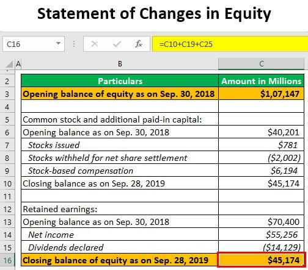

Equity represents ownership in an asset, such as a company, and is a cornerstone within financial markets. It forms the basis for various financial instruments and transactions, playing a crucial role in capital allocation and investment strategies. Equity markets offer a platform for companies to raise capital by issuing shares, while investors gain opportunities to participate in corporate growth. This interaction contributes to economic development and wealth creation, highlighting equity's foundational role.

Algorithmic trading refers to the use of computer algorithms to automate trading decisions and execution. It has become inherently intertwined with equity trading by enhancing productivity and accuracy. The integration of algorithmic systems optimizes trading processes, allowing traders to analyze market data, identify patterns, and execute orders at speeds beyond human capability. This systematic approach fosters precision, greatly influencing the overall trading landscape.



Reference equity serves as the underlying asset in many financial derivative contracts, such as options and swaps. These derivatives are often utilized for hedging against price fluctuations, enabling investors to manage risk. The significance of reference equity lies in its ability to offer a benchmark, or reference, for these contracts, thereby influencing their valuation and performance.

The trend of algorithmic trading continues to grow, significantly impacting how investors engage with equity markets. This rise is driven by technological advancements and the quest for efficiency and competitiveness in trading strategies. The implications for investors are profound, as algorithmic trading can lead to improved market liquidity, reduced transaction costs, and enhanced price discovery. However, it also introduces challenges such as increased market complexity and the need for regulatory oversight.

In understanding equity and algorithmic trading, one realizes the dynamic and evolving nature of today's financial markets. The interplay of technology and traditional equity concepts shapes the current and future landscape of investing, urging market participants to adapt and innovate continually. As the financial world leans towards greater reliance on technology, the insights gained from exploring these subjects become increasingly valuable for investors and financial professionals alike.

## Table of Contents

## Understanding Reference Equity

Reference equity plays a critical role in the financial derivatives market as it serves as the underlying asset upon which derivative contracts, such as options and swaps, are based. In its most basic form, reference equity is a stock or set of stocks from a corporation that is used to hedge or speculate on price movements.

In derivative contracts, reference equity functions as a tool for price movement protection by enabling investors to mitigate the risk of adverse price changes. For instance, when an investor holds a put option on a reference equity, the option becomes valuable if the price of the underlying stock falls below the strike price, thus providing a safety net against declines in the stock's value. This protective feature is pivotal for managing investment risks, especially in volatile markets.

Examples of reference equities include blue-chip stocks like those of Apple Inc. or Microsoft Corp., which are frequently used in derivatives due to their high [liquidity](/wiki/liquidity-risk-premium) and market capitalization. These equities provide a stable foundation for derivatives due to their established market presence and comprehensive historical data, which are essential for accurate pricing and risk assessment.

In credit default swaps (CDS), reference equity acts as a basis by serving as a benchmark to determine the premium payments and potential payouts. A CDS functions as a form of insurance against credit events, allowing investors to protect against default risk while referencing a specific corporation's credit quality. Here, the reference entity's creditworthiness, often reflected in its equity performance, is crucial in assessing the risk and return profile of the CDS.

The strategic role of reference equity in managing investment risks extends to its ability to diversify portfolios and strategically allocate risk. Through derivatives tied to reference equity, investors can achieve targeted exposure to specific market sectors or geographies, facilitating refined investment strategies that align with broader financial goals. This strategic deployment of reference equity in financial derivatives aligns with an investor's risk tolerance and return objectives, underscoring its fundamental influence in contemporary investment practices.

## Equity Algo Trading: An Overview

Algorithmic trading is the process of executing trades in equity markets using pre-defined rules and algorithms implemented through computer programs. This approach enhances trading by significantly boosting efficiency and execution speed. The elimination of manual intervention reduces the latency in transaction processes, allowing trades to be executed at precise moments to capitalize on market opportunities. Furthermore, [algorithmic trading](/wiki/algorithmic-trading) systems can process vast amounts of transaction data swiftly, making decisions based on complex quantitative models that could be impractical for humans to achieve in real-time.

There are multiple strategies employed in algorithmic trading, each designed to optimize performance under various market scenarios. Trend-following strategies, for instance, involve algorithms that analyze historical price patterns to predict future movement trends. These strategies commonly use technical indicators such as moving averages to make trading decisions. Arbitrage strategies, on the other hand, seek to profit from price discrepancies in different markets or financial instruments. By quickly identifying and exploiting these discrepancies, algorithms can execute trades with minimal risk and high-speed precision.

Algorithmic trading has a pronounced impact on market liquidity and price discovery. By executing trades quickly and efficiently, algorithms contribute to the continuous flow of buy and sell orders, thereby enhancing market liquidity. This heightened liquidity ensures tighter bid-ask spreads, providing a more favorable trading environment for all participants. Additionally, the instantaneous processing of market data by algorithms improves price discovery, the process by which markets determine the optimal price of a security. As algorithms react to new information and adjust trading actions, prices become more reflective of current market conditions.

However, while the benefits of algorithmic trading are notable, including increased efficiency, reduced trading costs, and improved accuracy, they also come with risks. One significant concern is the potential for market manipulation, where algorithms may be used to influence market prices deceptively. Another risk is the technology dependency inherent in algorithmic systems, which may suffer from malfunction or cyber threats. Furthermore, the high-speed nature of algorithmic trading poses the risk of contributing to market [volatility](/wiki/volatility-trading-strategies), potentially leading to events like flash crashes where prices rapidly plunge or spike within a very short time frame.

In evaluating the implementation of algorithmic trading systems, it is crucial to balance these benefits and risks. Investors and firms should thoroughly test and validate their algorithms using historical data to ensure robust performance before deployment in live markets. Proper risk management protocols and continuous monitoring are vital to safeguarding against both system failures and adverse market conditions. Overall, while algorithmic trading represents a significant advancement in equity markets, understanding its complexities and inherent risks is essential for successful implementation.

## Key Financial Concepts in Algo Trading

Algorithmic trading, often characterized by the employment of complex algorithms to automate trading decisions, is underpinned by key financial concepts that enable traders to devise strategies aimed at maximizing profitability while managing risk effectively. A foundational aspect of these strategies is quantitative analysis, which plays a critical role in the development and refinement of trading algorithms. Quantitative analysis involves the use of mathematical models, [statistics](/wiki/bayesian-statistics), and data analysis to identify trading opportunities and optimize decision-making processes. 

One pivotal step in algorithmic trading is [backtesting](/wiki/backtesting), which serves to validate trading strategies using historical data. By simulating the application of a trading algorithm on historical price data, traders can assess the potential effectiveness and profitability of the strategy before deploying it in live markets. Backtesting helps in identifying issues such as overfitting, where a model performs well with historical data but fails under real market conditions. Additionally, using statistical metrics such as the Sharpe ratio or maximum drawdown can provide further insights into the risk-adjusted returns of the strategy.

Key terms such as moving averages, volatility, and technical indicators are central to algorithmic trading strategies. Moving averages, for example, are used to smooth price data over a specified period, helping traders identify trend directions and potential entry or [exit](/wiki/exit-strategy) points. Volatility is another crucial concept, as it measures the degree of variation in a trading instrument's price over time and can significantly impact trading strategy outcomes. High volatility can increase both the potential for substantial profits and the risk of significant losses. Technical indicators such as the relative strength index (RSI) or the moving average convergence divergence (MACD) are used to analyze price movements and predict future market behavior.

Despite the potential benefits, algorithmic trading comes with challenges, particularly in coding and maintaining trading algorithms within dynamic markets. The financial markets are inherently volatile and influenced by myriad factors that can disrupt algorithmic strategies. Coding robust algorithms that can adapt to changing market conditions necessitates a deep understanding of both programming and market dynamics. Algorithms must be able to process large volumes of real-time data and execute trades swiftly to capitalize on fleeting market opportunities.

In coding trading algorithms, Python's simplicity and comprehensive libraries like NumPy, pandas, and scikit-learn have made it a popular choice among traders. However, robust error handling and testing are crucial to prevent unexpected failures during high-frequency trading operations. Consider the following example of a simple moving average crossover strategy implemented in Python:

```python
import pandas as pd

# Load historical price data into a DataFrame
data = pd.read_csv('price_data.csv')
data['SMA20'] = data['Close'].rolling(window=20).mean()
data['SMA50'] = data['Close'].rolling(window=50).mean()

# Generate trading signals based on moving average crossover
data['Signal'] = 0
data['Signal'][20:] = np.where(data['SMA20'][20:] > data['SMA50'][20:], 1, -1)

# Calculate returns based on signals
data['Returns'] = data['Close'].pct_change()
data['Strategy_Returns'] = data['Returns'] * data['Signal'].shift(1)

# Plot cumulative strategy returns
cumulative_returns = (1 + data['Strategy_Returns']).cumprod()
cumulative_returns.plot(title='Cumulative Strategy Returns')
```

These strategies emphasize the importance of flexibility and continuous improvement. As market conditions evolve, traders must regularly update and refine their algorithms to maintain their efficacy and profitability. Maintaining a keen eye on technological developments and regulatory changes can further aid in harnessing the full potential of algorithmic trading systems.

## Strategizing with Algorithmic Trading

Algorithmic trading strategies, like Volume-Weighted Average Price (VWAP) and Time-Weighted Average Price (TWAP), are critical tools deployed to optimize trade execution while minimizing the market impact. These algorithms operate by breaking larger orders into smaller, strategically executed trades throughout a predefined period. 

### Volume-Weighted Average Price (VWAP)

VWAP is a trading benchmark that calculates the average price a security has traded at throughout the day, based on both [volume](/wiki/volume-trading-strategy) and price. It is widely used to ensure that a trader's transactions align with the market’s average price movements, thereby reducing the potential market impact of large trades.

#### VWAP Formula:

$$
VWAP = \frac{\sum_{i=1}^{n} (P_i \times Q_i)}{\sum_{i=1}^{n} Q_i}
$$

where:
- $P_i$ is the price of the trade,
- $Q_i$ is the quantity of the trade,
- $n$ is the total number of trades.

Traders leveraging VWAP aim to execute their trades at prices as close to the VWAP as possible, balancing between participating in natural market liquidity and minimizing market impact. VWAP is particularly effective in stable market conditions where volume distribution is predictable.

### Time-Weighted Average Price (TWAP)

TWAP is another algorithmic trading strategy popular for its simplicity and utility in environments with less predictable volume patterns. It involves distributing orders evenly over the desired execution period, which helps in achieving an average price, mitigating the risks associated with concentrated trading.

#### TWAP Implementation in Python:

```python
def calculate_twap(prices, time_periods):
    total_price = sum(prices)
    total_time = sum(time_periods)
    return total_price / total_time

prices = [100, 102, 101, 103]
time_periods = [1, 1, 1, 1]
twap_price = calculate_twap(prices, time_periods)
print(f"TWAP: {twap_price}")
```

TWAP aims to execute trades at regular intervals, irrespective of volume, making it useful in situations where traders anticipate less predictable liquidity.

### Impact-Driven and Cost-Driven Algorithms

These strategies cater to different trading objectives. Impact-driven algorithms minimize market impact by timing trades in a way that avoids disrupting market prices, whereas cost-driven algorithms focus on reducing transaction costs. The choice between these depends on the specific trading objectives and market conditions. 

Impact-driven algorithms are particularly advantageous in volatile markets where the priority is to avoid large price fluctuations. In contrast, cost-driven algorithms thrive when transaction fees and spreads are the significant cost components.

### Effectiveness in Different Market Conditions

The choice of VWAP, TWAP, or other custom algorithms largely depends on market conditions. For instance, VWAP strategies may outperform during high-volume trading days due to their reliance on volume distribution, while TWAP is preferable in periods of low liquidity or when a trader aims to avoid signaling their intentions to the market.

### Strategic Considerations

Employing algorithmic trading tools requires a thorough understanding of market conditions and the strategic goals of the trade. Traders must consider factors such as market volatility, volume patterns, and execution speed. Additionally, the continuous evolution of trading technology necessitates regular strategy reviews and updates to ensure alignment with the latest market dynamics and regulatory standards. 

In conclusion, understanding and implementing VWAP and TWAP strategies, along with other algorithmic tools, is essential for achieving optimal trade execution and minimizing market impact, thereby contributing to more efficient market participation.

## Risks and Rewards of Algorithmic Trading in Equity Markets

Algorithmic trading in equity markets offers significant rewards but also comes with its unique set of risks. One of the primary concerns is market manipulation. Algorithms can be engineered to engage in practices that might be deemed manipulative, such as spoofing, where fake orders are placed to influence stock prices before being quickly canceled. These practices can distort the market and lead to unfair advantages for certain traders.

Technology dependency is another critical risk. As algorithmic trading relies heavily on advanced computing infrastructure, any technological failures, such as system crashes or delayed data feeds, can lead to substantial financial losses. Moreover, reliance on algorithmic systems makes traders vulnerable to cyber-attacks, which could lead to unauthorized transactions and market disruptions.

Market volatility and the risk of flash crashes are phenomena particularly associated with algorithmic trading. Flash crashes refer to rapid, deep, and volatile price movements within a short time frame. Such events are often exacerbated by algorithms acting on similar signals at high speeds, as evidenced in the 2010 Flash Crash where the Dow Jones Industrial Average plummeted nearly 1,000 points in mere minutes. 

Regulatory concerns also play a significant role in shaping the landscape of algorithmic trading. Regulators worldwide are continually evaluating trading practices to ensure market integrity and protect investors. Stringent regulations can impact the operation of algorithmic trading systems by imposing limits on trading speeds, scrutinizing algorithms for signs of market manipulation, and requiring more transparency and data sharing from traders.

On the flip side, algorithmic trading brings several advantages. It reduces trading costs by minimizing human intervention, thereby decreasing the likelihood of errors. Algorithms can execute trades with precision and speed, which improves order execution and potentially enhances profits for traders. Additionally, by efficiently processing large volumes of data, algorithms contribute to improved price discovery and narrower bid-ask spreads, thus fostering market efficiency.

Algorithmic trading plays a crucial role in enhancing the overall market structure. Its ability to handle complex calculations and execute in milliseconds allows for more competitive pricing and contributes to liquidity, rendering markets more efficient. Nevertheless, the balance between these rewards and the associated risks necessitates careful consideration by traders, market participants, and regulators alike.

## Getting Started with Equity Algo Trading

To embark on an algorithmic trading venture in equity markets, several technical and logistical requirements must be addressed. A foundational element is selecting a suitable trading platform and Application Programming Interfaces (APIs) that facilitate automated trading. Popular platforms like MetaTrader, [Interactive Brokers](/wiki/interactive-brokers-api), and TradingView provide robust APIs that allow for integration of custom algorithms. When choosing a platform, consider factors such as ease of use, available data feeds, execution speed, and transaction costs.

Developing and implementing algorithmic trading systems necessitates a specific skill set and knowledge base. Proficiency in programming languages such as Python, C++, or Java is crucial, given that these languages are commonly used for developing trading algorithms. Additionally, an understanding of statistical analysis, financial markets, and data analysis is imperative. Familiarity with [machine learning](/wiki/machine-learning) frameworks can also enhance algorithmic strategies by incorporating predictive analytics.

The initial steps in building and testing trading algorithms involve defining a clear trading strategy, which is typically guided by historical market data and financial theory. Backtesting the algorithm against historical data is critical to ascertain its potential effectiveness and risk profile. A typical backtesting process involves validating the algorithm's performance, where factors like the Sharpe ratio and maximum drawdown are analyzed. Here's a simple example in Python using the [backtrader](/wiki/backtrader) library:

```python
import backtrader as bt

class TestStrategy(bt.Strategy):
    def __init__(self):
        self.sma = bt.indicators.SimpleMovingAverage(self.data, period=15)

    def next(self):
        if self.data.close[0] > self.sma[0]:
            self.buy()
        elif self.data.close[0] < self.sma[0]:
            self.sell()

cerebro = bt.Cerebro()
cerebro.addstrategy(TestStrategy)
data = bt.feeds.YahooFinanceData(dataname='AAPL', fromdate=datetime.datetime(2020, 1, 1),
                                 todate=datetime.datetime(2021, 1, 1))
cerebro.adddata(data)
cerebro.run()
```

This code sets up a simple moving average crossover strategy, a common tactic in algorithmic trading.

Continuous monitoring and strategy adjustments are essential in algorithmic trading. Markets are dynamic, with conditions changing rapidly. A previously successful strategy may become obsolete due to market changes, technological advancements, or regulatory updates. Continuous monitoring helps identify when a strategy is no longer effective. Therefore, integrating real-time data analysis, performance evaluation, and adaptive learning into the trading algorithm can significantly enhance its performance over time.

In conclusion, successfully launching an algorithmic trading venture requires a comprehensive understanding of both the technical infrastructure and the financial markets. It involves selecting the right tools, acquiring necessary skills, and continuously refining strategies to adapt to market dynamics.

## Conclusion

This article has explored the interconnectedness of equity financial concepts and algorithmic trading, revealing how equity acts as a cornerstone in financial markets and how algorithmic trading represents a significant evolution in trade execution. Algorithmic trading enhances market efficiency by leveraging advanced algorithms to execute trades with high precision and speed. This technological approach has transformed trading dynamics, allowing for the efficient processing of large volumes of transactions that humans cannot perform manually.

Despite its advantages in efficiency and speed, algorithmic trading carries inherent risks that investors must carefully assess. Risks such as market manipulation and the occurrence of flash crashes underscore the importance of a balanced approach. Therefore, investors must strategically weigh the potential rewards against the associated risks before integrating algorithmic trading systems into their practices.

Looking towards the future, equity markets will increasingly rely on technology, ushering in a new era of trading practices where machine learning and [artificial intelligence](/wiki/ai-artificial-intelligence) may play pivotal roles. These advancements could further enhance predictive analytics and decision-making capabilities in trading. To fully harness the potential of algorithmic trading, there is a pressing need for continuous research and understanding. As markets evolve and new technologies emerge, it is crucial for investors, traders, and academics to engage in ongoing exploration of algorithmic trading dynamics. This will ensure robust systems that enhance market operations while safeguarding the financial ecosystem.

## References & Further Reading

[1]: Bergstra, J., Bardenet, R., Bengio, Y., & Kégl, B. (2011). ["Algorithms for Hyper-Parameter Optimization."](https://dl.acm.org/doi/10.5555/2986459.2986743) Advances in Neural Information Processing Systems 24.

[2]: ["Advances in Financial Machine Learning"](https://www.amazon.com/Advances-Financial-Machine-Learning-Marcos/dp/1119482089) by Marcos Lopez de Prado

[3]: ["Evidence-Based Technical Analysis: Applying the Scientific Method and Statistical Inference to Trading Signals"](https://www.amazon.com/Evidence-Based-Technical-Analysis-Scientific-Statistical/dp/0470008741) by David Aronson

[4]: ["Machine Learning for Algorithmic Trading"](https://github.com/stefan-jansen/machine-learning-for-trading) by Stefan Jansen

[5]: ["Quantitative Trading: How to Build Your Own Algorithmic Trading Business"](https://www.amazon.com/Quantitative-Trading-Build-Algorithmic-Business/dp/1119800064) by Ernest P. Chan

[6]: Harris, L. (2003). ["Trading and Exchanges: Market Microstructure for Practitioners"](https://academic.oup.com/book/52292) Oxford University Press.

[7]: Hasbrouck, J. (2007). ["Empirical Market Microstructure: The Institutions, Economics, and Econometrics of Securities Trading"](https://academic.oup.com/book/52241) Oxford University Press.

[8]: Aldridge, I. (2013). ["High-Frequency Trading: A Practical Guide to Algorithmic Strategies and Trading Systems"](https://www.amazon.com/High-Frequency-Trading-Practical-Algorithmic-Strategies/dp/1118343506) Wiley Trading Series. 

[9]: Cartea, Á., Jaimungal, S., & Penalva, J. (2015). ["Algorithmic and High-Frequency Trading"](https://assets.cambridge.org/97811070/91146/frontmatter/9781107091146_frontmatter.pdf) Cambridge University Press.