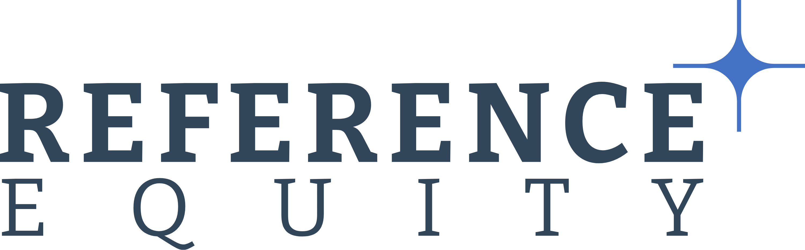

## Table of Contents

## What is reference equity?

Reference equity is a term used in marketing and branding. It refers to how well people recognize and feel about a brand. When a brand has high reference equity, it means that people know the brand well and have good feelings about it. This can help the brand sell more products because people trust it and like it.

For example, think about a famous brand like Coca-Cola. Many people around the world know Coca-Cola and have positive feelings about it. This is because Coca-Cola has built up strong reference equity over many years through advertising and good products. When people see the Coca-Cola logo, they feel happy and are more likely to buy it. This is the power of reference equity.

## How does reference equity differ from other types of equity?

Reference equity is different from other types of equity because it focuses on how well people recognize and feel about a brand. It's about the memories and emotions that come to mind when people see a brand's logo or hear its name. For example, when you see the Nike swoosh, you might think of sports and feel motivated. That's reference equity at work. It's all about the brand's presence in people's minds and hearts.

Other types of equity, like brand equity, can include reference equity but also cover other aspects. Brand equity is a broader term that includes not just recognition and feelings, but also the value that the brand adds to a product. For instance, brand equity might consider how much more people are willing to pay for a product because it has a certain brand name on it. Customer equity, on the other hand, focuses on the total value of a company's customer relationships. It's about how much money a company can expect to make from its customers over time. So, while reference equity is about recognition and emotion, other types of equity look at different parts of a brand's value.

## What are the key components of reference equity?

The key components of reference equity are brand awareness and brand associations. Brand awareness is about how well people know a brand. When a brand has high awareness, people recognize its logo, name, and products easily. For example, if you see the golden arches, you probably think of McDonald's right away. That's because McDonald's has strong brand awareness. The more people know a brand, the higher its reference equity.

Brand associations are the feelings and thoughts that come to mind when people think of a brand. These can be positive or negative. For instance, when you think of Apple, you might think of sleek design and innovation. Those are positive associations that add to Apple's reference equity. On the other hand, if a brand has negative associations, like poor quality or bad customer service, it can lower its reference equity. So, both awareness and associations play a big role in how much reference equity a brand has.

## Why is reference equity important in financial analysis?

Reference equity is important in financial analysis because it helps to understand how much a brand is worth. When a brand has high reference equity, people know it well and have good feelings about it. This can make the brand more valuable. For example, if a company wants to sell its brand or merge with another company, having high reference equity can make the brand worth more money. Financial analysts look at reference equity to see how it adds to the overall value of a company.

Also, reference equity can affect how well a company does in the market. When people trust and like a brand, they are more likely to buy its products. This can lead to higher sales and more profit. Financial analysts use reference equity to predict how well a company might do in the future. If a brand has strong reference equity, analysts might think the company will do well because people are likely to keep buying its products. So, reference equity is a key part of understanding a company's financial health and future potential.

## How can reference equity be calculated?

Calculating reference equity involves looking at how well people know a brand and the feelings they have about it. To do this, companies often use surveys and market research. They ask people if they recognize the brand and what they think about it. For example, they might ask if people associate the brand with quality or if they trust it. The more people know the brand and the better their feelings about it, the higher the reference equity. This information helps companies understand how strong their brand is in people's minds.

To put a number on reference equity, companies might use a scoring system. They can give points for how many people recognize the brand and more points for positive feelings. For instance, if 80% of people recognize a brand and 70% have positive feelings, the company can calculate a score based on these percentages. This score can then be compared to other brands or used to track changes over time. By doing this, companies can see how their efforts to build the brand are working and make better decisions about marketing and future plans.

## What are common methods used to evaluate reference equity?

To evaluate reference equity, companies often use surveys and market research to find out how well people know their brand and what they think about it. They ask people if they recognize the brand and if they have positive or negative feelings toward it. For example, they might ask if people think the brand is trustworthy or if it reminds them of quality. The more people who recognize the brand and the more positive their feelings, the higher the reference equity. This information helps companies understand how strong their brand is in people's minds.

Companies also use a scoring system to put a number on reference equity. They give points for how many people know the brand and more points for how positive their feelings are. If 80% of people recognize a brand and 70% have good feelings about it, the company can calculate a score based on these numbers. This score can be compared to other brands or used to see how the brand's equity changes over time. By doing this, companies can see if their efforts to build the brand are working and make better decisions about marketing and future plans.

## Can reference equity impact a company's valuation? If so, how?

Reference equity can have a big impact on a company's valuation. When people know a brand well and feel good about it, the brand is worth more money. This is because a strong brand can bring in more customers and make them more likely to buy the company's products. When a company wants to sell its brand or merge with another company, having high reference equity can make the company more valuable. Financial analysts look at reference equity to figure out how much a brand adds to the company's overall worth.

For example, if a company like Nike has high reference equity, it means that people around the world recognize the Nike logo and feel good about it. This strong brand recognition can lead to higher sales and profits because people trust and like Nike's products. When financial analysts see this, they might value Nike higher than a company with a less known or less liked brand. So, reference equity is a key part of understanding how much a company is worth and how well it might do in the future.

## What are the historical trends in reference equity usage?

Reference equity has become more important over time as companies have realized how much a brand's recognition and positive feelings can help them. In the past, companies mostly focused on making good products and did not think much about how people felt about their brand. But as markets got more competitive, companies started to see that a strong brand could help them stand out. They began using more advertising and marketing to build up their brand's reference equity. This shift started in the late 20th century and has kept growing as companies try to make their brands known and loved around the world.

Today, reference equity is a big part of how companies plan their business. They use surveys and market research to keep track of how well people know their brand and what they think about it. Companies like Apple and Coca-Cola have built up very high reference equity over the years, which helps them sell more products and be worth more money. As technology and social media have made it easier to reach people, companies are using these tools to keep building their reference equity. This focus on reference equity shows how important it is for a company's success in today's world.

## How do regulatory frameworks affect reference equity?

Regulatory frameworks can affect reference equity by setting rules about what companies can say or do in their advertising and marketing. If a company says something that is not true or if it does something that people do not like, it can hurt the brand's reference equity. For example, if a company gets in trouble for false advertising, people might start to distrust the brand. This can lower how well people know the brand and how good they feel about it. So, companies need to follow the rules to keep their reference equity strong.

Also, some regulations can help build reference equity. For example, if a company follows rules about being good to the environment, people might think better of the brand. They might see the company as responsible and caring, which can make them feel more positive about the brand. This can raise the brand's reference equity. So, while some regulations can harm reference equity if not followed, others can help build it up when companies do the right thing.

## What are the best practices for managing reference equity?

Managing reference equity well means making sure people know your brand and feel good about it. To do this, companies should always be working on their brand's image. They can use advertising and marketing to make sure people see their brand a lot. It's also important to make sure the brand is always shown in a good way. If people see the brand doing good things, like helping the environment or supporting a cause, they will feel better about it. Companies should also listen to what people say about their brand and fix any problems quickly. This helps keep the brand's reference equity strong.

Another important part of managing reference equity is making sure the brand stays the same over time. People like to see the same logo and hear the same message from a brand. If a brand changes too much, people might get confused and not feel as good about it. Companies should also keep an eye on what other brands are doing. If another brand is doing something that makes people like it more, a company might need to do something similar to keep up. By keeping the brand strong and well-known, companies can keep their reference equity high and make sure people keep feeling good about their brand.

## How does reference equity influence investment decisions?

Reference equity can affect how people decide to invest in a company. When a brand has high reference equity, it means a lot of people know the brand and feel good about it. This can make investors think the company will do well in the future. They might believe that more people will buy the company's products because they trust and like the brand. So, when a company has strong reference equity, investors might be more likely to put their money into it, thinking it will make them more money.

On the other hand, if a brand has low reference equity, it might make investors worried. They might think that not many people know the brand or that people do not feel good about it. This can make investors think the company might not sell as many products or make as much money. Because of this, they might choose not to invest in the company or only put a little money into it. So, reference equity is important for investors because it helps them guess how well a company might do in the future.

## What advanced strategies can be employed to optimize reference equity?

To optimize reference equity, companies can use advanced strategies like storytelling and emotional branding. Storytelling means sharing stories about the brand that people can relate to and remember. For example, a company might tell the story of how it started or how its products help people in their daily lives. This can make people feel closer to the brand and remember it better. Emotional branding is about making people feel good when they think of the brand. Companies can do this by using ads that show happy people using their products or by supporting causes that people care about. When people feel good emotions about a brand, they are more likely to remember it and buy its products.

Another strategy is using data and technology to understand what people think about the brand. Companies can use social media and online surveys to see what people are saying about them. They can then use this information to make their brand better known and more liked. For example, if people say they like a certain product, the company can focus more on advertising that product. Also, companies can use technology like AI to find out what kinds of ads work best for different groups of people. By using these advanced strategies, companies can make their reference equity even stronger and help their brand stand out in a crowded market.

## How can one strategize with algorithmic trading?

Algorithmic trading strategies, like Volume-Weighted Average Price (VWAP) and Time-Weighted Average Price (TWAP), are critical tools deployed to optimize trade execution while minimizing the market impact. These algorithms operate by breaking larger orders into smaller, strategically executed trades throughout a predefined period. 

### Volume-Weighted Average Price (VWAP)

VWAP is a trading benchmark that calculates the average price a security has traded at throughout the day, based on both [volume](/wiki/volume-trading-strategy) and price. It is widely used to ensure that a trader's transactions align with the market’s average price movements, thereby reducing the potential market impact of large trades.

#### VWAP Formula:

$$
VWAP = \frac{\sum_{i=1}^{n} (P_i \times Q_i)}{\sum_{i=1}^{n} Q_i}
$$

where:
- $P_i$ is the price of the trade,
- $Q_i$ is the quantity of the trade,
- $n$ is the total number of trades.

Traders leveraging VWAP aim to execute their trades at prices as close to the VWAP as possible, balancing between participating in natural market [liquidity](/wiki/liquidity-risk-premium) and minimizing market impact. VWAP is particularly effective in stable market conditions where volume distribution is predictable.

### Time-Weighted Average Price (TWAP)

TWAP is another [algorithmic trading](/wiki/algorithmic-trading) strategy popular for its simplicity and utility in environments with less predictable volume patterns. It involves distributing orders evenly over the desired execution period, which helps in achieving an average price, mitigating the risks associated with concentrated trading.

#### TWAP Implementation in Python:

```python
def calculate_twap(prices, time_periods):
    total_price = sum(prices)
    total_time = sum(time_periods)
    return total_price / total_time

prices = [100, 102, 101, 103]
time_periods = [1, 1, 1, 1]
twap_price = calculate_twap(prices, time_periods)
print(f"TWAP: {twap_price}")
```

TWAP aims to execute trades at regular intervals, irrespective of volume, making it useful in situations where traders anticipate less predictable liquidity.

### Impact-Driven and Cost-Driven Algorithms

These strategies cater to different trading objectives. Impact-driven algorithms minimize market impact by timing trades in a way that avoids disrupting market prices, whereas cost-driven algorithms focus on reducing transaction costs. The choice between these depends on the specific trading objectives and market conditions. 

Impact-driven algorithms are particularly advantageous in volatile markets where the priority is to avoid large price fluctuations. In contrast, cost-driven algorithms thrive when transaction fees and spreads are the significant cost components.

### Effectiveness in Different Market Conditions

The choice of VWAP, TWAP, or other custom algorithms largely depends on market conditions. For instance, VWAP strategies may outperform during high-volume trading days due to their reliance on volume distribution, while TWAP is preferable in periods of low liquidity or when a trader aims to avoid signaling their intentions to the market.

### Strategic Considerations

Employing algorithmic trading tools requires a thorough understanding of market conditions and the strategic goals of the trade. Traders must consider factors such as market [volatility](/wiki/volatility-trading-strategies), volume patterns, and execution speed. Additionally, the continuous evolution of trading technology necessitates regular strategy reviews and updates to ensure alignment with the latest market dynamics and regulatory standards. 

In conclusion, understanding and implementing VWAP and TWAP strategies, along with other algorithmic tools, is essential for achieving optimal trade execution and minimizing market impact, thereby contributing to more efficient market participation.

## References & Further Reading

[1]: Bergstra, J., Bardenet, R., Bengio, Y., & Kégl, B. (2011). ["Algorithms for Hyper-Parameter Optimization."](https://dl.acm.org/doi/10.5555/2986459.2986743) Advances in Neural Information Processing Systems 24.

[2]: ["Advances in Financial Machine Learning"](https://www.amazon.com/Advances-Financial-Machine-Learning-Marcos/dp/1119482089) by Marcos Lopez de Prado

[3]: ["Evidence-Based Technical Analysis: Applying the Scientific Method and Statistical Inference to Trading Signals"](https://www.amazon.com/Evidence-Based-Technical-Analysis-Scientific-Statistical/dp/0470008741) by David Aronson

[4]: ["Machine Learning for Algorithmic Trading"](https://github.com/stefan-jansen/machine-learning-for-trading) by Stefan Jansen

[5]: ["Quantitative Trading: How to Build Your Own Algorithmic Trading Business"](https://www.amazon.com/Quantitative-Trading-Build-Algorithmic-Business/dp/1119800064) by Ernest P. Chan

[6]: Harris, L. (2003). ["Trading and Exchanges: Market Microstructure for Practitioners"](https://academic.oup.com/book/52292) Oxford University Press.

[7]: Hasbrouck, J. (2007). ["Empirical Market Microstructure: The Institutions, Economics, and Econometrics of Securities Trading"](https://academic.oup.com/book/52241) Oxford University Press.

[8]: Aldridge, I. (2013). ["High-Frequency Trading: A Practical Guide to Algorithmic Strategies and Trading Systems"](https://www.amazon.com/High-Frequency-Trading-Practical-Algorithmic-Strategies/dp/1118343506) Wiley Trading Series. 

[9]: Cartea, Á., Jaimungal, S., & Penalva, J. (2015). ["Algorithmic and High-Frequency Trading"](https://assets.cambridge.org/97811070/91146/frontmatter/9781107091146_frontmatter.pdf) Cambridge University Press.