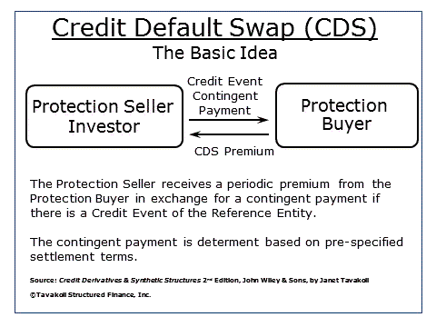

Credit derivatives are important financial instruments that enable investors to manage credit risk without the necessity of owning the underlying assets. This characteristic makes credit derivatives versatile tools for both speculation and risk management. At the heart of these instruments is the concept of the reference obligation, a specific debt instrument upon which credit derivative contracts are based. 

Understanding financial instruments like credit derivatives is essential for investors aiming to make informed decisions regarding investment and risk management. These derivatives allow for the transfer of credit risk between parties, thus providing mechanisms to hedge against potential credit events, such as defaults or downgrades, without holding the actual debt securities. This capability is particularly beneficial in managing structured financial products and complex investment strategies where credit exposure is a significant concern.



This article will explore various aspects of credit derivatives, delving into the intricacies of reference obligations. It will cover their types, methods for pricing, and creditworthiness assessments. Furthermore, the article will touch upon the risks associated with these instruments and highlight future trends influencing their evolution. 

Moreover, the role of algorithmic trading in managing these complex instruments in modern financial markets will be discussed. Algorithmic trading, driven by technological advancements and data analytics, has become a critical component in efficiently managing credit derivative strategies, ensuring rapid execution and optimal portfolio adjustments in response to market dynamics. Understanding these elements is crucial for investors who wish to strategically navigate the evolving landscape of credit derivatives.

## Table of Contents

## Understanding Credit Derivatives and Reference Obligations

Credit derivatives are financial instruments designed to manage credit risk by allowing traders and investors to separate and transfer the risk associated with credit events from the underlying credit exposure. Central to these instruments are reference obligations, specific debt securities upon which credit derivative contracts are based. These obligations serve as the benchmarks for assessing the credit risk of an entity, commonly referred to as the reference entity.

In credit default swaps (CDS), a prevalent form of credit derivatives, reference obligations are often utilized for hedging or speculating on the credit risk of a reference entity. In a CDS contract, the seller of the swap agrees to compensate the buyer in the event of a credit event, such as a default, failure to pay, or restructuring, affecting the reference entity. This arrangement allows the buyer to hedge against potential losses resulting from these credit events. The selection of reference obligations in CDS contracts is paramount, as it directly affects the pricing, performance, and success of the credit derivative strategy.

Successful implementation of credit derivative strategies hinges on selecting appropriate reference obligations, which requires assessing various factors, including the creditworthiness of the reference entity, the [liquidity](/wiki/liquidity-risk-premium) of the reference obligation, and prevailing market conditions. The reference obligation's credit rating, industry exposure, and maturity are also critical considerations. Moreover, the notional amount and terms of the reference obligation influence the CDS pricing and perceived risk.

The role of reference obligations in the credit derivatives market is critical; they determine the valuation and risk management efficiency of derivatives. Evaluating the impact of potential credit events on these obligations is essential for strategizing investment and risk mitigation processes. Understanding the intricacies of reference obligations helps market participants optimize their credit derivative strategies, achieving desired financial outcomes in a complex financial environment.

## Types of Reference Obligations

Reference obligations are integral to the structure of credit derivatives, providing the underlying basis upon which these financial instruments operate. The selection of reference obligations is pivotal as it directly influences the risk profile, returns, and pricing of credit derivative products. Various types of reference obligations serve distinct purposes in credit derivatives, each presenting unique characteristics, risks, and benefits to investors.

### Corporate Bonds

Corporate bonds are among the most common reference obligations. These are debt securities issued by corporations to raise capital, typically offering a fixed [interest rate](/wiki/interest-rate-trading-strategies) over a specified term. The credit risk associated with corporate bonds is highly contingent on the financial health and creditworthiness of the issuing corporation. Investors often choose corporate bonds as reference obligations due to their relative reliability and the wealth of available market data, aiding in the assessment of credit risk.

### Loans

Loans, particularly syndicated loans, are another prevalent form of reference obligation. These are often used in bespoke credit derivatives to transfer the credit risk of specific corporate borrowers. Loans can offer variable interest rates, making them appealing for investors seeking exposure to interest rate fluctuations. However, the illiquidity and lower market transparency associated with loans can increase the complexity of evaluating and trading these obligations.

### Asset-Backed Securities (ABS)

Asset-backed securities are financial instruments backed by a pool of underlying assets, such as receivables, loans, or leases. These securities securitize a diversified portfolio of assets, theoretically reducing idiosyncratic risk. Investors using ABS as reference obligations benefit from this diversification, though they must also contend with prepayment risk and complex credit structures inherent to securitized products.

### Collateralized Debt Obligations (CDOs)

Collateralized debt obligations represent another type of reference obligation, comprising portfolios of various debt instruments like bonds, loans, or other CDO tranches. CDOs offer opportunities for targeted exposure across different credit tranches, each with varying levels of risk and return. Understanding the intricate structure and credit rating distribution of CDOs is essential for investors to accurately assess the associated risks and identify suitable investment opportunities.

### Unique Characteristics, Risks, and Benefits

Each type of reference obligation brings distinct attributes to credit derivatives. Corporate bonds generally provide more stable returns with well-established credit ratings, while loans offer flexibility through variable rates but at the cost of lower liquidity. Asset-backed securities enhance diversification but require investors to thoroughly understand securitization structures. Meanwhile, collateralized debt obligations demand expertise in tranche selection and credit analysis, offering high potential returns alongside increased complexity and risk.

### Strategic Considerations

The selection of reference obligations should align with an investor's overall risk management and investment strategies. By understanding the nuances of each type, market participants can tailor their credit derivative exposures to match desired risk-return profiles and strategic objectives. Whether seeking stable returns, interest rate variability, diversification, or high-risk/high-return opportunities, the appropriate choice of reference obligation is key to optimizing credit derivative strategies.

## The Importance of Reference Obligations in Pricing Credit Derivatives

Accurate selection and evaluation of reference obligations are crucial for the precise pricing of credit derivatives. The value assigned to these instruments significantly influences investment decisions and the risk management strategies employed by financial entities. Various factors contribute to this valuation, including the credit rating of the reference entity, sector exposure, and prevailing market conditions.

Credit rating, provided by rating agencies such as Moody’s, Standard & Poor’s, and Fitch, serves as an indicator of the creditworthiness of the reference entity. These ratings help determine the likelihood of default, directly impacting the pricing of credit derivatives. A higher credit rating typically implies a lower risk of default, which may result in narrower credit spreads, while a lower rating suggests higher risk and broader spreads.

Sector exposure also plays a pivotal role. Different sectors [carry](/wiki/carry-trading) varying levels of risk due to economic cycles, regulatory changes, and other sector-specific factors. For instance, a reference obligation primarily linked to a volatile sector like technology may have a different risk and return profile compared to one in a more stable sector like utilities. Investors and traders must consider these industry-related risks when pricing credit derivatives linked to particular reference obligations.

Market conditions, including interest rate environments, liquidity conditions, and macroeconomic factors, are equally influential. Changes in interest rates can affect the discount rates used in pricing models, while liquidity in the market might influence the ease with which these instruments can be bought or sold, thereby affecting their pricing.

Diversification of reference obligations provides a pathway to enhance the risk-return profile of credit derivative portfolios. By spreading exposure across diverse reference obligations, investors can mitigate sector-specific risks and reduce the impact of adverse changes related to a single credit entity. This approach, grounded in the principle of diversification, potentially leads to a more resilient portfolio capable of withstanding unexpected market fluctuations. Mathematically, diversification can be assessed using statistical measures like variance and standard deviation, which help in understanding the spread of potential returns.

For example, consider a simplified Python model to evaluate diversification impact on portfolio variance:

```python
import numpy as np

# Expected returns
returns = np.array([0.05, 0.07, 0.03])

# Covariance matrix
cov_matrix = np.array([[0.01, 0.0018, 0.0011],
                       [0.0018, 0.02, 0.0012],
                       [0.0011, 0.0012, 0.03]])

# Portfolio weights
weights = np.array([0.4, 0.4, 0.2])

# Portfolio variance
portfolio_variance = np.dot(weights.T, np.dot(cov_matrix, weights))

print(f"Portfolio Variance: {portfolio_variance:.4f}")
```

This code snippet aids in calculating the portfolio variance, illustrating how diversification reduces overall risk. By carefully selecting reference obligations and aligning them with macro and microeconomic conditions, market participants can achieve optimal pricing strategies for credit derivatives. This informed approach not only enhances the financial outcomes but also supports sustainable risk management practices.

## Assessing the Creditworthiness of Reference Obligations

The creditworthiness of reference obligations is a critical component in the assessment of credit derivatives. It involves both fundamental and market-based analyses to ensure accurate evaluation and risk management. 

Fundamental analysis typically begins with a detailed review of financial statements, including balance sheets, income statements, and cash flow statements. This review helps in understanding the financial health and operational performance of the reference entity. Key ratios, such as the debt-to-equity ratio, current ratio, and interest coverage ratio, are often analyzed. For instance, a lower debt-to-equity ratio suggests that the entity is less leveraged, potentially indicating lower credit risk.

Market-based analysis includes assessing market indicators like credit spreads and yield curves. Credit spreads, which represent the difference in yield between a reference obligation and a risk-free benchmark of similar maturity, provide insights into the perceived risk of the reference entity. A widening credit spread may signal an increase in credit risk. Yield curves can indicate market expectations of an entity's creditworthiness. An upward-sloping yield curve implies positive market sentiment toward the entity's future ability to meet its obligations.

Credit rating agencies play a pivotal role by providing credit ratings that reflect their assessment of an issuer's default risk. Agencies like Standard & Poor's, Moody's, and Fitch Ratings use rating scales to signal the creditworthiness of issuers and their obligations. These ratings directly affect investment decisions and the pricing of credit derivatives. For example, a downgrade in credit rating can lead to a higher risk premium, affecting the pricing strategy of associated derivatives.

Market indicators such as stock price movements, bond yields, and credit default swap (CDS) spreads are also crucial. CDS spreads, similar to credit spreads, indicate the cost of insuring against a default and are highly sensitive to changes in credit risk perceptions.

A comprehensive evaluation of creditworthiness employs a combination of these methods. By integrating both fundamental and market-based analyses, investors can assess all relevant factors, leading to informed investment decisions. Tools like the Altman Z-score, which predicts a company's likelihood of bankruptcy using a blend of profitability, leverage, and liquidity indicators, can be mathematically represented as:

$$
Z = 1.2X_1 + 1.4X_2 + 3.3X_3 + 0.6X_4 + 0.999X_5
$$

where:
- $X_1$ = Working Capital / Total Assets
- $X_2$ = Retained Earnings / Total Assets
- $X_3$ = Earnings Before Interest and Taxes (EBIT) / Total Assets
- $X_4$ = Market Value of Equity / Book Value of Total Liabilities
- $X_5$ = Sales / Total Assets

Through these methodologies, the comprehensive assessment of the creditworthiness of reference obligations supports prudent risk management and enhances the strategy formulation process in credit derivatives trading.

## Risks Associated with Reference Obligations in Credit Derivatives

Credit derivatives, including instruments such as credit default swaps (CDS), are inherently associated with various risks linked to the reference obligations they involve. Recognizing and managing these risks is crucial for any market participant engaging in the credit derivatives market. Below are the primary risks associated with reference obligations in credit derivatives:

### Credit Risk

Credit risk is the possibility that the reference entity will default on its obligations. This is the most fundamental risk in credit derivatives, as the primary purpose of these instruments is to transfer or mitigate this risk. The assessment of credit risk involves analyzing the creditworthiness of the reference entity, typically performed through credit ratings and financial analysis. A default or downgrade can lead to significant losses for holders of credit derivatives if the credit event payment is triggered.

### Liquidity Risk

Liquidity risk pertains to the difficulty of buying or selling reference obligations without causing a substantial change in their price. In the context of credit derivatives, liquidity risk can impact the pricing and the ability to enter or [exit](/wiki/exit-strategy) positions readily. Illiquid reference obligations can result in unfavorable pricing and increased transaction costs, potentially leading to significant financial losses.

### Basis Risk

Basis risk arises when there is a discrepancy between the cash flows generated by the reference obligation and the cash flows on the credit derivative itself. This risk is particularly prevalent when a mismatch occurs in the terms of the reference obligation and that of the derivative, such as differences in interest rates or maturities. Managing basis risk involves careful alignment of the derivative contracts with their underlying reference obligations.

### Counterparty Risk

Counterparty risk refers to the potential that the other party in a credit derivative transaction might default on its contractual obligations. This risk became particularly prominent during the financial crisis of 2008 when several major financial institutions failed to honor their commitments. Measures to mitigate counterparty risk include dealing through central clearing parties (CCPs) or using collateralization agreements.

### Legal and Documentation Risk

Legal and documentation risk involves the potential for losses due to inadequate or ambiguous documentation of the terms and conditions of the credit derivative contracts. Inaccurate documentation can lead to disputes between parties, particularly during a credit event. Market participants must ensure that documentation, often outlined in International Swaps and Derivatives Association (ISDA) agreements, is clear, accurate, and comprehensive to avoid such risks.

Comprehensively understanding and mitigating these risks necessitates a robust risk management framework that includes both qualitative and quantitative risk assessment techniques. Investors and financial institutions typically employ various analytical tools and financial models to quantify these risks and develop strategies to manage them. By proactively addressing the risks associated with reference obligations, participants in the credit derivatives market can enhance their financial outcomes and ensure stability in their investment strategies.

## Impact of Reference Obligations on Credit Derivatives Markets

The choice of reference obligations has a profound impact on the efficacy and dynamics of credit derivatives markets. The selection process for these obligations influences liquidity, credit risk exposure, and the diversification potential of a credit derivatives portfolio, shaping both market efficiency and investment strategies.

**Liquidity considerations** are crucial in the context of credit derivatives. A reference obligation with high liquidity enables smoother trade execution, ensuring that investors can enter and exit positions without significantly impacting the market price. Liquidity facilitates tighter bid-ask spreads, reducing transaction costs and making the market more efficient. For instance, highly traded corporate bonds often serve as reference obligations precisely because of their superior liquidity characteristics. In contrast, illiquid obligations could result in higher volatility and increased costs for executing trades.

**Credit risk exposure** is another critical factor influenced by the choice of reference obligations. The inherent credit risk of a reference obligation is directly linked to the creditworthiness of the underlying entity. By selecting obligations of entities with different credit ratings or belonging to different sectors, investors can diversify their credit risk exposure, thus enhancing the risk-return profile of their portfolio. For example, choosing obligations from various industries can mitigate sector-specific risks, providing a buffer against downturns in any particular sector.

**Diversification** of reference obligations is a strategic approach employed by investors to enhance portfolio resilience. By incorporating a variety of obligations featuring differing maturities, sectors, and credit qualities, investors can achieve a well-balanced portfolio. Diversification helps in reducing systemic risks and potential losses arising from adverse events affecting a single issuer or sector. Algorithmically driven portfolio strategies may employ optimization techniques to select reference obligations, aiming to maximize diversification while adhering to specific investment constraints.

The **impact of reference obligations** extends to overall market efficiency and strategy formulation. Well-chosen reference obligations can improve market efficiency by providing reliable pricing benchmarks for derivative products. This enhances transparency and aids in the accurate assessment of market risk. Moreover, strategic selection influences the formulation of investment strategies. For example, market participants might prioritize obligations tied to emerging sector leaders, tapping into growth while managing risk through diversification.

In conclusion, reference obligations are pivotal in shaping the landscape of credit derivatives markets. Their attributes significantly influence liquidity conditions, credit risk profiles, and diversification strategies, fundamentally affecting market dynamics and the strategic decisions of investors. The careful selection and management of these obligations are essential for ensuring efficient market operations and optimal investment outcomes.

## Role of Credit Rating Agencies in Determining Reference Obligations

Credit rating agencies (CRAs) are integral to the financial markets, providing assessments of the creditworthiness of issuers, which are crucial in the selection of reference obligations for credit derivatives. These agencies, by providing ratings, influence investor decisions and perceptions of risk. Credit ratings are distilled assessments of a reference entity's ability to meet its financial obligations, forming a cornerstone for pricing credit derivatives, particularly in instruments such as credit default swaps (CDS).

The investment community heavily relies on the ratings provided by major CRAs such as Moody's, Standard & Poor's, and Fitch Ratings when selecting reference obligations. These agencies assign grades to potential obligors and specific debt issues, thereby facilitating an understanding of the default risk associated with the reference entity. For instance, an AAA rating indicates a high level of creditworthiness and low default risk, while a lower rating suggests increased risk. This risk assessment becomes pivotal in constructing credit derivatives as it directly affects the cost of buying or selling credit protection.

Credit ratings impact not just individual investment decisions but also broader market dynamics. High ratings can lead to narrower credit spreads, substantially impacting the pricing of credit derivatives. Conversely, downgrades typically lead to wider spreads, thus increasing the cost of credit protection and indicating increased risk premium. This sensitivity also reflects on investor sentiment and market liquidity; downgraded ratings often result in lower demand for associated financial products, including credit derivatives linked to the downgraded reference obligations.

While the traditional ratings system plays a significant role, alternative approaches to evaluating credit risk are gaining traction. These approaches include market-based indicators such as credit default swap spreads, which offer real-time insights into market perceptions of credit risk. CDS spreads are considered efficient indicators due to their reflection of market participants' collective expectations of default probabilities over a specific time horizon. The formula for calculating implied default probability $P(T)$ from CDS spreads can be given by the following approximation:

$$
P(T) = 1 - e^{- \frac{S}{1-R} \cdot T}
$$

where $S$ is the CDS spread, $R$ is the recovery rate, and $T$ is the tenor in years.

Moreover, financial technology and data analytics are increasingly enabling sophisticated analysis combining traditional ratings and market-based indicators, providing a more comprehensive picture of an entity's credit risk profile.

In summary, credit rating agencies significantly influence the choice and perception of reference obligations in credit derivatives. While conventional credit ratings provide structured assessments essential for risk evaluation, incorporating market-based data and technological advancements offers an enriched and dynamic view of credit risk, assisting investors in making more informed decisions.

## Future Trends and Developments in Reference Obligations in Credit Derivatives

In recent years, the landscape of reference obligations in credit derivatives has been evolving, influenced by emerging trends and technological advancements. A significant trend is the expanding universe of reference obligations, which now increasingly incorporate Environmental, Social, and Governance ([ESG](/wiki/esg-investing)) criteria. This shift reflects growing investor demand for sustainable investment practices, prompting issuers and market participants to integrate ESG considerations into their credit assessment processes. By doing so, they not only align with ethical investment standards but potentially enhance portfolio resilience against ESG-related risks.

The use of synthetic reference obligations represents another notable development. These instruments allow investors to gain or hedge credit exposure without the need to hold the underlying asset physically. By leveraging derivatives contracts, synthetic reference obligations facilitate more efficient capital use and provide broader market access. For example, Credit Default Swaps (CDS) on indices or bespoke baskets create opportunities for tailored risk management strategies, enabling market participants to hedge specific exposures more precisely.

Advancements in technology and data analytics are also significantly shaping reference obligations in credit derivatives. The integration of [artificial intelligence](/wiki/ai-artificial-intelligence) (AI) and [machine learning](/wiki/machine-learning) models has revolutionized credit risk assessment by enabling more accurate and timely analysis of vast datasets. This enhanced analytical capability aids in the identification of emerging credit risks, supporting informed decision-making. Python, with its extensive data processing libraries like pandas and machine learning frameworks like scikit-learn, offers robust tools for developing sophisticated risk assessment models. For instance, a Python script could be used to analyze large volumes of credit-related data:

```python
import pandas as pd
from sklearn.ensemble import RandomForestClassifier

# Load the dataset
data = pd.read_csv('credit_data.csv')

# Prepare features and target
X = data.drop('default', axis=1)
y = data['default']

# Initialize and train the model
model = RandomForestClassifier(n_estimators=100, random_state=42)
model.fit(X, y)

# Predict probabilities of default
probabilities = model.predict_proba(X)[:, 1]
```

Regulatory developments continue to play a crucial role in shaping the future of reference obligations and credit derivatives. Regulators are increasingly focusing on transparency, risk management, and the systemic implications of these financial instruments. New regulations are being introduced to enhance market stability and protect against systemic risks. This includes stricter reporting standards and improved data transparency practices, ensuring that all market participants have access to accurate and timely information. The implications of such regulatory changes are profound, as they impact the structure, pricing, and trading of reference obligations in the credit derivatives market.

Overall, the combination of expanding types of reference obligations, integration of ESG criteria, technological advancements, and evolving regulatory frameworks is driving significant changes in the credit derivatives market. These trends not only offer new opportunities for investors but also pose challenges that require continuous adaptation and innovation in investment and risk management strategies.

## Conclusion

Understanding reference obligations is integral for effectively navigating the complex landscape of credit derivatives. These specific debt securities are pivotal in shaping investment strategies by influencing pricing, risk exposure, and market dynamics. Consequently, comprehensively assessing credit risk is essential for informed decision-making and successful portfolio management.

Diversification across various reference obligations can mitigate risks associated with individual securities and enhance the risk-return profile of an investment portfolio. This strategy not only helps in managing credit risk more effectively but also provides stability in uncertain market conditions. As market dynamics continuously evolve, staying abreast of trends and developments ensures that investors remain agile and responsive to changing risk profiles.

Moreover, the strategic role of [algorithmic trading](/wiki/algorithmic-trading) cannot be underestimated in today's financial markets. Leveraging algorithms allows for rapid execution of strategies, encompassing both hedging and speculative positions, which is crucial in the fast-paced environment of credit derivatives. By utilizing advanced computational techniques and real-time data analytics, investors can optimize trade execution, refine risk management strategies, and enhance efficiency.

In conclusion, a thorough understanding of reference obligations, coupled with strategic diversification and advanced trading methodologies, forms the foundation for effective credit risk management and successful participation in credit derivatives markets.

## References & Further Reading

[1]: Hull, J. C. (2018). ["Options, Futures, and Other Derivatives"](https://www.semanticscholar.org/paper/Options%2C-Futures%2C-and-Other-Derivatives-Hull/89bdee500c8623864fc9eb7a471546aa713acc44) (10th Edition). Pearson.

[2]: Das, S. R. (1995). ["Credit risk derivatives."](https://srdas.github.io/Papers/Das-JOD1995.pdf) Journal of Derivatives, 2(4), 7-23.

[3]: "Credit Derivatives: A Primer on Credit Risk, Modeling, and Instruments" by George Chacko, Anders Sjöman, Hideto Motohashi, and Vincent Dessain.

[4]: Jorion, P. (2006). ["Value at Risk: The New Benchmark for Managing Financial Risk"](https://books.google.com/books/about/Value_at_Risk_3rd_Ed.html?id=nnblKhI7KP8C) (3rd Edition). McGraw-Hill.

[5]: Gregory, J. (2015). ["The xVA Challenge: Counterparty Credit Risk, Funding, Collateral, and Capital"](https://onlinelibrary.wiley.com/doi/book/10.1002/9781119109440) (3rd Edition). Wiley Finance.

[6]: O'Kane, D. (2008). ["Modelling Single-name and Multi-name Credit Derivatives."](https://onlinelibrary.wiley.com/doi/pdf/10.1002/9781119201960.fmatter) John Wiley & Sons.

[7]: Jamshidian, F. (2004). ["The Fixed Income Market and its Derivatives."](https://en.wikipedia.org/wiki/Farshid_Jamshidian) Wiley.

[8]: "Credit Risk: Pricing, Measurement, and Management" by Darrell Duffie and Kenneth J. Singleton.

[9]: Arora, N., Gandhi, P., & Longstaff, F. A. (2012). ["Counterparty credit risk and the credit default swap market."](https://www.sciencedirect.com/science/article/pii/S0304405X11002327) Journal of Financial Economics, 103(2), 280-293.

[10]: Roncoroni, A., Fusai, G., & Cummins, M. (2015). ["Handbook of Multi-Commodity Markets and Products: Structuring, Trading and Risk Management."](https://onlinelibrary.wiley.com/doi/book/10.1002/9781119011590) Wiley.