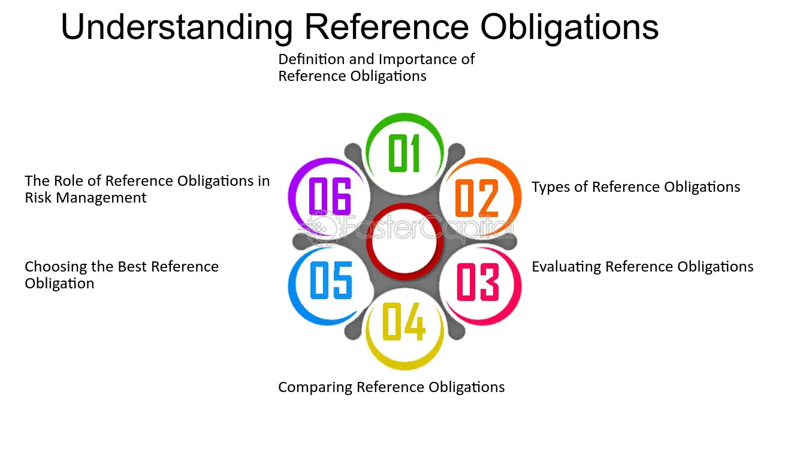

## Table of Contents

## What is a reference obligation?

A reference obligation is a specific debt or loan that is used as a benchmark in financial contracts, especially in credit derivatives like credit default swaps. It acts like a standard or example that helps define the terms of the contract. For instance, if a company has several loans, the reference obligation might be one particular loan that is used to determine if a credit event, like a default, has occurred.

In simpler terms, think of a reference obligation as a chosen loan that everyone agrees to use as a guide. If something goes wrong with this loan, like the borrower not paying it back, it triggers actions in the financial contract. This helps keep things clear and straightforward for everyone involved in the contract.

## Why are reference obligations important in financial contracts?

Reference obligations are important in financial contracts because they help make things clear and easy to understand. Imagine you and your friends are playing a game, and you need to agree on one specific rule to follow. In financial contracts, the reference obligation is like that rule. It's a specific loan or debt that everyone agrees to use as a guide. This way, if something goes wrong with that loan, like the borrower not paying it back, everyone knows exactly what to do next.

Using a reference obligation also helps avoid confusion and disagreements. When people enter into financial contracts, they want to know exactly what they're agreeing to. By having a clear reference obligation, it's easier to tell if a credit event, like a default, has happened. This makes the contract more reliable and trustworthy, which is really important in the world of finance where big money is at stake.

## How do reference obligations relate to credit default swaps (CDS)?

Reference obligations are super important in credit default swaps, or CDS for short. A CDS is like an insurance policy for a loan. If you buy a CDS, you're betting that the borrower of the loan will pay it back. But if they don't, the person who sold you the CDS has to pay you. The reference obligation is the specific loan that the CDS is based on. It's like the main thing everyone looks at to see if the borrower is in trouble.

So, if something bad happens with the reference obligation, like the borrower not paying it back, it triggers the CDS. This means the person who bought the CDS gets paid by the person who sold it. Having a clear reference obligation makes sure everyone knows exactly when this should happen. It keeps the CDS fair and straightforward, which is really important in finance where big money is involved.

## What are the typical components of a reference obligation?

A reference obligation usually includes a few key pieces of information that help everyone understand the loan it's based on. First, there's the name of the borrower, which is the person or company that took out the loan. Then, there's the amount of money borrowed, which is called the principal. There's also the [interest rate](/wiki/interest-rate-trading-strategies), which is how much the borrower has to pay on top of the principal. These details are important because they help everyone know exactly what the loan looks like.

Another part of a reference obligation is the maturity date, which is when the loan needs to be paid back completely. Sometimes, there are also covenants, which are rules the borrower has to follow while they have the loan. All these parts together make up the reference obligation and help everyone involved in a financial contract, like a credit default swap, know what to look out for. If something goes wrong with these parts, like the borrower not paying back the loan, it can trigger actions in the contract.

## Can you explain the difference between a direct and an indirect reference obligation?

A direct reference obligation is when the loan or debt used in a financial contract is very specific and clear. It's like pointing to one exact loan and saying, "This is the one we're talking about." For example, if a company has borrowed money from a bank, that specific loan can be the direct reference obligation in a credit default swap. If something goes wrong with that loan, like the company not paying it back, it triggers the actions in the contract.

An indirect reference obligation is a bit different. Instead of pointing to one specific loan, it's more like saying, "We'll use any loan that fits certain rules." For example, it might be any loan from a certain company that has a certain interest rate or maturity date. This way, if any loan that fits those rules has a problem, it can trigger the contract. Indirect reference obligations give more flexibility but can also make things a bit more complicated because you have to check if any loan fits the rules.

## How does the selection of a reference obligation affect the valuation of a derivative?

The selection of a reference obligation can really change how much a derivative, like a credit default swap, is worth. Think of it like this: if the reference obligation is a loan that's super safe and the borrower is likely to pay it back, the derivative might not be worth as much. That's because the chance of the borrower not paying back the loan is low, so the "insurance" part of the derivative isn't as valuable. But if the reference obligation is a risky loan with a borrower who might not pay it back, the derivative could be worth more because it's more likely that the insurance will be needed.

The way a reference obligation is chosen also matters because it affects how clear and reliable the derivative is. If the reference obligation is very specific and everyone knows exactly which loan it is, then the derivative is easier to value. People can look at the loan's details and decide how risky it is. But if the reference obligation is more general or indirect, it can be harder to figure out the value. This is because you have to look at lots of different loans to see if any of them match the rules, which makes things more complicated and can change how much the derivative is worth.

## What are the common challenges faced when determining a reference obligation?

Picking the right reference obligation can be tricky. One big challenge is making sure everyone agrees on which loan should be the reference obligation. If it's not clear or if people disagree, it can cause problems later on. Another challenge is that the loan chosen as the reference obligation needs to be a good example of the borrower's overall debt. If the loan is too different from the others, it might not be a good guide for what's happening with the borrower's finances.

Another common issue is keeping the reference obligation up to date. Over time, the borrower might take out new loans or pay off old ones, which can change what the reference obligation should be. This means the reference obligation needs to be checked and maybe changed to stay accurate. If it's not, the derivative might not work right when it's needed. It's a bit like making sure you're using the latest map when you're trying to find your way somewhere.

## How do market participants handle reference obligation substitutions?

When a reference obligation needs to be changed, market participants usually follow a set of rules to make sure everyone agrees on the new one. If the original loan is paid off or replaced, they might need to pick a new loan that's similar to the old one. This can be tricky because everyone needs to agree that the new loan is a good fit. They often use a process called substitution, where they look for another loan from the same borrower that has similar terms, like the same interest rate or maturity date. This helps keep the derivative working properly even when the original loan changes.

Sometimes, figuring out the new reference obligation can lead to disagreements among the people involved. They might not all see the new loan as a good match for the old one. To solve this, they might use a third party, like a committee or a neutral expert, to help decide on the best new reference obligation. This keeps things fair and makes sure the derivative continues to be reliable. It's important because the new reference obligation needs to work just as well as the old one to make sure the contract still makes sense and everyone knows what they're agreeing to.

## What role does the ISDA play in standardizing reference obligations?

The International Swaps and Derivatives Association, or ISDA, helps make reference obligations easier to understand and use. They do this by creating rules and guidelines that everyone in the market can follow. These rules help make sure that when people talk about a reference obligation, they're all talking about the same thing. This is super important because it helps avoid confusion and disagreements, which can be a big problem in the world of finance.

ISDA also works on making sure these rules are up to date. If something changes in the market, like new types of loans or new ways of doing things, ISDA updates their guidelines. This keeps everything clear and fair for everyone involved. By doing this, ISDA helps make sure that derivatives, like credit default swaps, work smoothly and that people can trust them to do what they're supposed to do.

## How do changes in reference obligations impact existing contracts?

When a reference obligation changes, it can affect existing contracts in a big way. If the original loan used as the reference obligation is paid off or replaced, the contract might need a new loan to take its place. This new loan needs to be similar to the old one, so everyone involved agrees that it's a good fit. If they can't agree, it can lead to disagreements and problems with the contract. The goal is to make sure the contract keeps working properly, even with the new reference obligation.

To handle these changes, people often use rules set by organizations like the ISDA. These rules help everyone follow the same steps to choose a new reference obligation. If there's a disagreement, they might bring in a neutral third party to help decide. This makes the process fair and keeps the contract reliable. By following these rules, people can make sure their contracts stay strong and continue to do what they're supposed to do, even when the reference obligation changes.

## What are the best practices for managing reference obligations in a portfolio?

Managing reference obligations in a portfolio is all about keeping things clear and up to date. It's important to regularly check the loans used as reference obligations to make sure they still fit well with the rest of the portfolio. If a loan is paid off or replaced, you need to find a new one that's similar. This helps keep your contracts working properly and avoids any surprises. It's also a good idea to follow the rules set by organizations like the ISDA, which can guide you on how to choose and change reference obligations.

Another key part of managing reference obligations is to keep good records. Write down all the details about each reference obligation, like the borrower's name, the loan amount, the interest rate, and when it needs to be paid back. This makes it easier to keep track of everything and know when changes need to be made. If you're working with other people, make sure to talk to them about any changes to the reference obligations so everyone stays on the same page. By doing these things, you can manage your reference obligations well and keep your portfolio strong and reliable.

## How can advanced analytics be used to optimize reference obligation strategies?

Advanced analytics can help you make smarter choices about reference obligations by looking at lots of data and finding patterns. For example, it can look at how likely a borrower is to pay back their loan, or how the loan's value might change over time. By using this information, you can pick reference obligations that are a good fit for your portfolio and help you avoid risks. It's like having a smart friend who can look at all the numbers and tell you the best way to go.

Analytics can also help you keep an eye on your reference obligations and make changes when you need to. If something about a loan changes, like the borrower's financial situation, advanced analytics can quickly spot this and suggest a new reference obligation that's a better match. This way, you can keep your contracts working well and make sure they're always based on the most up-to-date information. It's all about using data to make your decisions better and keep your portfolio strong.

## How can one assess the creditworthiness of reference obligations?

The creditworthiness of reference obligations is a critical component in the assessment of credit derivatives. It involves both fundamental and market-based analyses to ensure accurate evaluation and risk management. 

Fundamental analysis typically begins with a detailed review of financial statements, including balance sheets, income statements, and cash flow statements. This review helps in understanding the financial health and operational performance of the reference entity. Key ratios, such as the debt-to-equity ratio, current ratio, and interest coverage ratio, are often analyzed. For instance, a lower debt-to-equity ratio suggests that the entity is less leveraged, potentially indicating lower credit risk.

Market-based analysis includes assessing market indicators like credit spreads and yield curves. Credit spreads, which represent the difference in yield between a reference obligation and a risk-free benchmark of similar maturity, provide insights into the perceived risk of the reference entity. A widening credit spread may signal an increase in credit risk. Yield curves can indicate market expectations of an entity's creditworthiness. An upward-sloping yield curve implies positive market sentiment toward the entity's future ability to meet its obligations.

Credit rating agencies play a pivotal role by providing credit ratings that reflect their assessment of an issuer's default risk. Agencies like Standard & Poor's, Moody's, and Fitch Ratings use rating scales to signal the creditworthiness of issuers and their obligations. These ratings directly affect investment decisions and the pricing of credit derivatives. For example, a downgrade in credit rating can lead to a higher risk premium, affecting the pricing strategy of associated derivatives.

Market indicators such as stock price movements, bond yields, and credit default swap (CDS) spreads are also crucial. CDS spreads, similar to credit spreads, indicate the cost of insuring against a default and are highly sensitive to changes in credit risk perceptions.

A comprehensive evaluation of creditworthiness employs a combination of these methods. By integrating both fundamental and market-based analyses, investors can assess all relevant factors, leading to informed investment decisions. Tools like the Altman Z-score, which predicts a company's likelihood of bankruptcy using a blend of profitability, leverage, and [liquidity](/wiki/liquidity-risk-premium) indicators, can be mathematically represented as:

$$
Z = 1.2X_1 + 1.4X_2 + 3.3X_3 + 0.6X_4 + 0.999X_5
$$

where:
- $X_1$ = Working Capital / Total Assets
- $X_2$ = Retained Earnings / Total Assets
- $X_3$ = Earnings Before Interest and Taxes (EBIT) / Total Assets
- $X_4$ = Market Value of Equity / Book Value of Total Liabilities
- $X_5$ = Sales / Total Assets

Through these methodologies, the comprehensive assessment of the creditworthiness of reference obligations supports prudent risk management and enhances the strategy formulation process in credit derivatives trading.

## What is the role of credit rating agencies in determining reference obligations?

Credit rating agencies (CRAs) are integral to the financial markets, providing assessments of the creditworthiness of issuers, which are crucial in the selection of reference obligations for credit derivatives. These agencies, by providing ratings, influence investor decisions and perceptions of risk. Credit ratings are distilled assessments of a reference entity's ability to meet its financial obligations, forming a cornerstone for pricing credit derivatives, particularly in instruments such as credit default swaps (CDS).

The investment community heavily relies on the ratings provided by major CRAs such as Moody's, Standard & Poor's, and Fitch Ratings when selecting reference obligations. These agencies assign grades to potential obligors and specific debt issues, thereby facilitating an understanding of the default risk associated with the reference entity. For instance, an AAA rating indicates a high level of creditworthiness and low default risk, while a lower rating suggests increased risk. This risk assessment becomes pivotal in constructing credit derivatives as it directly affects the cost of buying or selling credit protection.

Credit ratings impact not just individual investment decisions but also broader market dynamics. High ratings can lead to narrower credit spreads, substantially impacting the pricing of credit derivatives. Conversely, downgrades typically lead to wider spreads, thus increasing the cost of credit protection and indicating increased risk premium. This sensitivity also reflects on investor sentiment and market liquidity; downgraded ratings often result in lower demand for associated financial products, including credit derivatives linked to the downgraded reference obligations.

While the traditional ratings system plays a significant role, alternative approaches to evaluating credit risk are gaining traction. These approaches include market-based indicators such as credit default swap spreads, which offer real-time insights into market perceptions of credit risk. CDS spreads are considered efficient indicators due to their reflection of market participants' collective expectations of default probabilities over a specific time horizon. The formula for calculating implied default probability $P(T)$ from CDS spreads can be given by the following approximation:

$$
P(T) = 1 - e^{- \frac{S}{1-R} \cdot T}
$$

where $S$ is the CDS spread, $R$ is the recovery rate, and $T$ is the tenor in years.

Moreover, financial technology and data analytics are increasingly enabling sophisticated analysis combining traditional ratings and market-based indicators, providing a more comprehensive picture of an entity's credit risk profile.

In summary, credit rating agencies significantly influence the choice and perception of reference obligations in credit derivatives. While conventional credit ratings provide structured assessments essential for risk evaluation, incorporating market-based data and technological advancements offers an enriched and dynamic view of credit risk, assisting investors in making more informed decisions.

## References & Further Reading

[1]: Hull, J. C. (2018). ["Options, Futures, and Other Derivatives"](https://www.semanticscholar.org/paper/Options%2C-Futures%2C-and-Other-Derivatives-Hull/89bdee500c8623864fc9eb7a471546aa713acc44) (10th Edition). Pearson.

[2]: Das, S. R. (1995). ["Credit risk derivatives."](https://srdas.github.io/Papers/Das-JOD1995.pdf) Journal of Derivatives, 2(4), 7-23.

[3]: "Credit Derivatives: A Primer on Credit Risk, Modeling, and Instruments" by George Chacko, Anders Sjöman, Hideto Motohashi, and Vincent Dessain.

[4]: Jorion, P. (2006). ["Value at Risk: The New Benchmark for Managing Financial Risk"](https://books.google.com/books/about/Value_at_Risk_3rd_Ed.html?id=nnblKhI7KP8C) (3rd Edition). McGraw-Hill.

[5]: Gregory, J. (2015). ["The xVA Challenge: Counterparty Credit Risk, Funding, Collateral, and Capital"](https://onlinelibrary.wiley.com/doi/book/10.1002/9781119109440) (3rd Edition). Wiley Finance.

[6]: O'Kane, D. (2008). ["Modelling Single-name and Multi-name Credit Derivatives."](https://onlinelibrary.wiley.com/doi/pdf/10.1002/9781119201960.fmatter) John Wiley & Sons.

[7]: Jamshidian, F. (2004). ["The Fixed Income Market and its Derivatives."](https://en.wikipedia.org/wiki/Farshid_Jamshidian) Wiley.

[8]: "Credit Risk: Pricing, Measurement, and Management" by Darrell Duffie and Kenneth J. Singleton.

[9]: Arora, N., Gandhi, P., & Longstaff, F. A. (2012). ["Counterparty credit risk and the credit default swap market."](https://www.sciencedirect.com/science/article/pii/S0304405X11002327) Journal of Financial Economics, 103(2), 280-293.

[10]: Roncoroni, A., Fusai, G., & Cummins, M. (2015). ["Handbook of Multi-Commodity Markets and Products: Structuring, Trading and Risk Management."](https://onlinelibrary.wiley.com/doi/book/10.1002/9781119011590) Wiley.