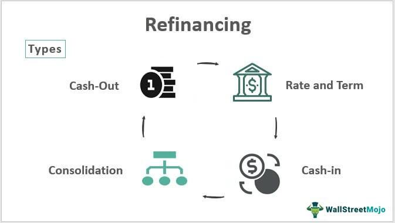

The fields of real estate, economic bubbles, and algorithmic trading have become increasingly intertwined, reflecting the complexities and rapid evolution of today's financial landscape. With the real estate market frequently experiencing significant fluctuations, understanding the interconnectedness of these domains is essential for investors and stakeholders striving to make informed decisions.

Real estate bubbles are characterized by a divergence between asset prices and their intrinsic values. These bubbles often emerge from speculative investments and can bring about substantial economic upheaval when they burst. Refinancing options, as part of financial strategies, become a focal point during these cycles, offering both opportunities and risks.



Algorithmic trading plays a pivotal role in this landscape, processing vast amounts of data to make rapid trading decisions. In real estate markets, algorithms are employed to trade securities like Real Estate Investment Trusts (REITs) and mortgage-backed securities. The integration of advanced technologies in trading adds another layer of complexity, influencing market behaviors and contributing to patterns of value fluctuation.

Understanding these interactions is vital as they have far-reaching implications for current and future market strategies. By recognizing the nuances of real estate bubbles and leveraging technology-driven trading mechanisms, investors can navigate these volatile environments with greater precision. The goal is to equip financial stakeholders with insights that foster effective investment management in the face of market unpredictability.

## Table of Contents

## Understanding Real Estate Market Dynamics

Real estate markets are complex systems influenced by a multitude of factors, including supply and demand, government policies, and overarching economic conditions. The equilibrium of supply and demand forms the backbone of real estate market dynamics. When the demand for property outpaces supply, property prices typically rise, leading to potential investment opportunities as well as risks associated with inflated asset values. Conversely, an oversupply can depress prices, affecting the profitability and liquidity of investments in the sector.

One key aspect influencing real estate dynamics is government policy. Interest rate adjustments, for instance, can significantly alter the cost of borrowing. Lower interest rates generally reduce mortgage costs, thereby increasing demand for real estate. This can stimulate market activity and push prices upward. Conversely, higher rates can dampen demand and lead to a slowdown in market activity. Policies related to property taxes, zoning laws, and housing regulations also play critical roles in shaping market conditions. For example, tax incentives can boost real estate investments, while stringent zoning restrictions might limit the supply of new developments, affecting property availability and pricing.

Recent trends such as urbanization and technological advancements are reshaping the manner in which real estate markets operate. Urbanization leads to increased demand for housing and commercial spaces in cities, putting upward pressure on prices in these areas. Meanwhile, technological advancements, including the use of data analytics and smart technologies, are transforming property management and investment strategies. These technologies enable more efficient market analyses and decision-making processes, allowing stakeholders to identify trends and opportunities with greater accuracy.

Understanding these dynamics is crucial for investors aiming to develop informed strategies. By acknowledging the driving forces behind real estate market behavior, investors can better anticipate market shifts and make strategic decisions that align with their financial goals. This understanding mitigates the risks associated with volatile market conditions and positions investors to capitalize on potential growth opportunities.

## Causes and Effects of Economic Bubbles

Economic bubbles occur when the prices of assets inflate rapidly, surpassing their fundamental or intrinsic value due to heightened market enthusiasm or exuberance. This detachment from intrinsic value is often fuelled by speculative behavior, where investors anticipate selling assets at higher prices rather than using them for their inherent utility or income generation potential.

### Key Drivers of Economic Bubbles

1. **Over-speculation**: Over-speculation arises when investors engage in aggressive purchasing, assuming continual price hikes. This behavior creates a self-reinforcing loop, where rising prices attract more investors, further inflating the bubble.

2. **Low Interest Rates**: Central banks may lower interest rates to stimulate economic activity. However, prolonged low-interest rates can lead to excessive borrowing, as investors find it easier and cheaper to finance asset purchases. This credit expansion can inflate prices beyond sustainable levels. The mathematical relationship can be expressed as:
$$
   P = \frac{C}{r - g}

$$

   Where $P$ is the asset price, $C$ is the cash flow, $r$ is the discount rate, and $g$ is the growth rate. Lowering $r$ increases $P$, inflating asset prices.

3. **Relaxed Credit Standards**: Lax credit standards, often coupled with low interest rates, encourage borrowing. Financial institutions may offer loans with minimal scrutiny, increasing the number of purchasers in the market who can bid up prices.

### Effects of Economic Bubbles

The aftermath of a bubble's burst can be economically damaging:

- **Foreclosures and Default Rates Increase**: As prices correct to reflect intrinsic values, many asset holders, especially those with high leverage, may find themselves underwater—owing more than the asset's current value. This scenario can lead to increased foreclosures, particularly in real estate.

- **Market Corrections and Economic Downturns**: The sudden drop in asset prices can result in significant market corrections, leading to broader economic contractions as wealth vanishes, decreasing consumer spending and investment.

### Historical Instance: The 2008 Housing Crash

The 2008 financial crisis is a profound example of a real estate bubble. Key factors such as speculative investment behavior, prolonged low-interest rates, and poor mortgage practices—like subprime lending—exacerbated the bubble. The resultant crash not only led to widespread foreclosures but also triggered a global economic recession, emphasizing the interconnectedness of financial systems.

### Risk Mitigation Strategies

Recognizing these patterns is crucial for mitigating future economic bubbles. Strategies may include:

- **Prudent Monetary Policy**: Monitoring and adjusting interest rates to prevent excessive borrowing.

- **Tighter Credit Regulations**: Ensuring stricter lending standards to reduce vulnerability to speculative excesses.

- **Market Surveillance and Data Analytics**: Implementing robust monitoring systems to detect and respond to overheating asset markets quickly.

By being vigilant and understanding these fundamental drivers and effects, policymakers and investors can better prepare for and potentially prevent the detrimental impacts associated with economic bubbles.

## Algorithmic Trading in Real Estate

Algorithmic trading leverages sophisticated algorithms to execute trades at high speed, significantly enhancing efficiency within real estate markets. These algorithms are widely applied in trading real estate-related securities, specifically Real Estate Investment Trusts (REITs) and mortgage-backed securities. By analyzing vast datasets, including interest rates and property valuations, algorithmic systems make swift trading decisions, optimizing the timing and pricing of transactions. This technological advancement allows for greater market [liquidity](/wiki/liquidity-risk-premium) and operational efficiency, thus attracting more participants and facilitating smoother market operations.

However, while the benefits of [algorithmic trading](/wiki/algorithmic-trading) in real estate are pronounced, it also introduces certain risks, particularly increased market [volatility](/wiki/volatility-trading-strategies). The rapid and automated nature of these trades can, at times, lead to significant fluctuations in asset prices, as the market reacts instantaneously to new information, whether accurate or speculative. This volatility can be exacerbated by the presence of high-frequency trading strategies, which might, in turn, create a feedback loop of price changes that affect investor sentiment and market stability.

Several case studies highlight both the advantages and potential pitfalls that accompany the integration of algorithmic trading systems in real estate. In some instances, algorithmic trading has enabled large-scale investors to manage their portfolios more effectively by swiftly executing large-[volume](/wiki/volume-trading-strategy) trades at optimal prices. Conversely, there have been occurrences where these systems, due to erroneous data input or unforeseen market conditions, have triggered abrupt downturns in real estate securities' prices.

Thus, while algorithmic trading represents a transformative shift in how real estate securities are traded, it necessitates careful management and oversight. Robust risk management strategies and regulatory frameworks are crucial to mitigate the inherent risks associated with this type of trading. Furthermore, ongoing advancements in [artificial intelligence](/wiki/ai-artificial-intelligence) and [machine learning](/wiki/machine-learning) continue to refine these algorithms, enhancing their predictive accuracy and decision-making capabilities, preparing the ground for an even more sophisticated integration of algorithmic trading in the real estate sector.

## Interplay Between Real Estate and Algorithmic Trading

Algorithmic trading significantly influences real estate markets through the use of various financial instruments such as derivatives and Real Estate Investment Trusts (REITs). These tools enable investors to engage in speculative activities based on real estate price movements and to implement automated investment strategies, respectively.

Derivatives, such as options and futures linked to real estate indices, allow investors to speculate on the future direction of real estate prices without directly owning the underlying assets. For instance, a futures contract might enable an investor to profit from anticipated changes in real estate market values, magnifying potential gains and losses. The nature of derivatives can create leverage, which amplifies the effects of market movements on the investor's capital. This heightened potential for profit can encourage speculative trading, thereby contributing to market volatility.

REITs, on the other hand, allow investors to hold shares in a diversified portfolio of real estate assets. Algorithmic trading in the context of REITs involves using automated systems to execute trades based on predefined criteria, enabling rapid and efficient responses to market signals. These strategies enhance liquidity and generally improve market efficiency, but they also pose the risk of exacerbating market fluctuations through rapid, high-frequency trading.

The interplay between algorithmic trading and real estate markets is further characterized by the presence of feedback loops. When algorithmic trading systems react to market movements, they may unintentionally amplify those movements through rapid buy or sell actions. For example, if algorithms detect a downward trend in real estate prices and start selling assets quickly to minimize losses, they could exacerbate the price drop, influencing other traders and systems to do the same, thus creating a loop that perpetuates market volatility.

Advanced data analytics and artificial intelligence (AI) technologies are crucial components of these algorithmic trading strategies. Machine learning models, for instance, analyze vast amounts of data to identify patterns and predict market trends with greater accuracy. These predictions inform trading decisions, enhancing the potential for profitability in various market conditions. An example Python snippet might involve using a machine learning library like Scikit-learn to model price predictions:

```python
from sklearn.model_selection import train_test_split
from sklearn.ensemble import RandomForestRegressor
import numpy as np

# Assuming feature_data and target_price are pre-defined datasets
X_train, X_test, y_train, y_test = train_test_split(feature_data, target_price, test_size=0.3, random_state=42)

model = RandomForestRegressor(n_estimators=100, random_state=42)
model.fit(X_train, y_train)

predictions = model.predict(X_test)
accuracy = model.score(X_test, y_test)

print(f"Model Accuracy: {accuracy:.2f}")
```

This script trains a Random Forest model to predict future real estate prices, which can be integrated into a broader trading algorithm to automate decision-making processes.

Understanding the complex relationships between algorithmic trading and real estate is vital for investors aiming to navigate these interconnected markets effectively. By recognizing how these elements interact, stakeholders can better strategize their investments, considering both the potential benefits and inherent risks involved.

## Future Outlook and Investment Strategies

Technological advancements are poised to significantly reshape real estate markets, with notable influences on transaction methods and property valuations. Artificial intelligence (AI) and blockchain technology are at the forefront of this transformation, enhancing transparency and predictive capabilities. AI algorithms are increasingly employed to analyze vast datasets, offering predictive insights into market trends, property values, and buyer preferences. This predictive power enables stakeholders to make more informed decisions, improving investment outcomes in fluctuating market conditions.

Blockchain technology plays a critical role in increasing transparency and security in transactions. By creating decentralized and immutable records, blockchain reduces the risk of fraud and errors, streamlining the buying and selling process. This technology also facilitates smart contracts, which execute transactions automatically when predefined conditions are met, further increasing efficiency and trust in real estate transactions.

Despite the innovative potential of these technologies, diversification continues to be a fundamental strategy to mitigate risks associated with economic bubbles. Diversifying investments across various asset classes, geographical regions, and property types can help minimize the impact of localized market downturns and reduce exposure to overinflated asset valuations. Furthermore, diversification across traditional and technology-driven investment opportunities can balance potential risks and returns.

The role of data analytics cannot be overstated in navigating volatile market environments. Advanced analytical tools enable investors to process and interpret large volumes of data, identifying trends and patterns that inform strategic investment decisions. By leveraging data analytics, investors can enhance their understanding of market dynamics, thereby improving their ability to anticipate and respond to changes effectively.

Continuous education on technological and market trends is essential for stakeholders aiming to remain competitive. As technology evolves, staying informed about emerging tools and methodologies is crucial for adapting to new market conditions and capitalizing on opportunities. Workshops, seminars, and online courses provide platforms for gaining insights into innovations and their implications for real estate investments.

In conclusion, as technological advancements redefine the landscape of real estate markets, strategic approaches that integrate diversification and data-driven decision-making are vital. Embracing ongoing education ensures that stakeholders are well-equipped to navigate the complexities of modern market environments, fostering resilience and competitiveness in the evolving financial landscape.

## Conclusion

Understanding real estate bubbles and the impact of algorithmic trading is crucial for both investors and policymakers aiming to successfully navigate today's complex financial landscape. The integration of strategic investment approaches, notably through risk diversification and data-driven decision-making, provides a robust framework for addressing market volatility. Diversification helps mitigate risk by spreading investments across various asset classes, thereby reducing exposure to any single market fluctuation. In parallel, leveraging data analytics enables investors to make informed decisions grounded in real-time market data and trends.

As technology continues to shape and redefine market dynamics, vigilance and adaptability become essential qualities. Investors must remain attentive to technological advancements, such as algorithm-driven trading platforms, which increase the speed and scope of transactions. These systems offer both opportunities and challenges, suggesting a need for agile strategies that can adapt to rapid changes.

Ongoing education is pivotal for maintaining a competitive edge in this evolving environment. By continuously updating knowledge on emerging technologies and market trends, investors position themselves to capitalize on new opportunities. This adaptability not only helps in grabbing potential rewards but also in mitigating the risks that accompany technological and market changes.

To maintain resilience in an evolving financial landscape, awareness of economic trends and best practices is vital. This awareness allows for timely adjustments in strategy and operations, ensuring that investors remain proactive rather than reactive to market shifts. Consequently, fostering a strategic, informed, and adaptable approach will be key to accessing opportunities and achieving long-term investment success.

## References & Further Reading

[1]: Shiller, R. J. (2005). ["Irrational Exuberance."](https://www.jstor.org/stable/j.ctt7st4s) Princeton University Press.

[2]: Li, Y., & Hyman, J. (2018). ["Algorithmic Trading and Real Estate Investment Trusts (REITs): Interaction and Mechanisms."](https://www.jstor.org/stable/44103282) Journal of Real Estate Research.

[3]: Reinhart, C. M., & Rogoff, K. S. (2009). ["This Time is Different: Eight Centuries of Financial Folly."](https://www.nber.org/system/files/working_papers/w13882/w13882.pdf) Princeton University Press.

[4]: Schiller, I. (2017). ["Real Estate Bubbles and Financial Crises."](https://www.spotblue.com/wiki/real-estate-bubble/) Elsevier.

[5]: Dash, M., & Basu, S. (2021). ["Algorithmic Trading: The Basics and Beyond."](https://www.sciencedirect.com/org/science/article/pii/S1546221824005800) Springer.