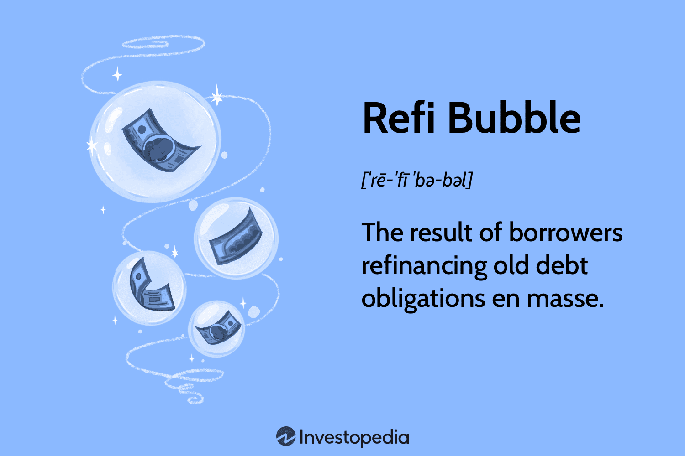

## Table of Contents

## What is refinancing?

Refinancing is when you replace your old loan with a new one. People usually do this to get a lower interest rate or to change the length of their loan. For example, if you have a mortgage and interest rates go down, you might refinance to save money on your monthly payments.

The process of refinancing involves applying for a new loan and using that money to pay off your old loan. You'll need to meet the lender's requirements, which might include a good credit score and enough income. It's important to consider the costs of refinancing, like fees and closing costs, to make sure it will actually save you money in the long run.

## What is a refinancing bubble?

A refinancing bubble happens when a lot of people refinance their loans at the same time. This often happens when interest rates are very low. People want to take advantage of the low rates to save money on their loans. When everyone is refinancing, it can create a bubble because the demand for refinancing goes up a lot.

If too many people refinance at once, it can cause problems. Lenders might get overwhelmed with applications and might not be able to handle all of them. Also, if interest rates go back up quickly, people who just refinanced might end up with higher payments than before. This can make the bubble burst, causing financial trouble for some people and the economy.

## How does a refinancing bubble form?

A refinancing bubble forms when lots of people decide to refinance their loans at the same time. This usually happens when interest rates are really low. People see that they can save money by getting a new loan with a lower [interest rate](/wiki/interest-rate-trading-strategies), so they all want to do it. When everyone is trying to refinance, it creates a big demand for refinancing services. Lenders start to see a lot more applications than usual.

If too many people are refinancing at the same time, it can cause problems. Lenders might have a hard time keeping up with all the applications. They might get overwhelmed and slow down the process. Also, if interest rates suddenly go up after a lot of people have refinanced, those people could end up paying more than they expected. This can make the bubble burst, causing financial problems for some people and affecting the economy.

## What are the signs of a refinancing bubble?

A refinancing bubble starts to show when a lot of people are refinancing their loans at the same time. This usually happens when interest rates are low. People want to save money, so they all try to get new loans with better rates. You can see this happening when there are long lines at banks and more ads about refinancing on TV and the internet.

Another sign is when lenders start to struggle with the number of applications they're getting. They might take longer to approve loans because they're so busy. If you hear about people waiting a long time to refinance, that could be a sign of a bubble. Also, if interest rates start to go up quickly after a lot of people have refinanced, it might mean the bubble is about to burst.

## What are the potential impacts of a refinancing bubble on the economy?

When a refinancing bubble happens, it can affect the economy in big ways. If a lot of people are refinancing at the same time, it can make banks and lenders very busy. They might have to hire more people or work longer hours to keep up with all the loan applications. This can be good for the economy because it creates more jobs and keeps money moving. But if the bubble gets too big, it can also cause problems. Lenders might get overwhelmed and start making mistakes or taking too long to approve loans, which can slow down the whole process.

If the refinancing bubble bursts, it can cause even bigger problems. When interest rates go up quickly, people who just refinanced might find themselves with higher payments than they expected. This can make it hard for them to pay their bills, and some might even lose their homes. When a lot of people are struggling, it can slow down the whole economy. People might spend less money, and businesses might not do as well. This can lead to a slowdown or even a recession if things get really bad.

## How can individuals be affected by a refinancing bubble?

When a refinancing bubble happens, people might think it's a good time to save money on their loans. They see low interest rates and decide to refinance their home or car loans. At first, this can feel good because they might pay less each month. But if too many people try to refinance at the same time, it can take a long time to get approved. This can be frustrating and might even make people miss out on the low rates if they go up before they can finish refinancing.

If the refinancing bubble bursts, it can cause big problems for people. If interest rates go up quickly after someone refinanced, their monthly payments might go up a lot. This can make it hard to pay bills and might even lead to losing their home or car. People might also find it hard to get new loans if banks are overwhelmed or if the economy slows down because of the bubble bursting. This can make life tough for a lot of people who were just trying to save some money.

## What historical examples of refinancing bubbles exist?

One big example of a refinancing bubble happened in the United States in the early 2000s. Interest rates were really low, and a lot of people wanted to refinance their home loans to save money. This led to a huge demand for refinancing. Banks were busy, and everyone was trying to get a piece of the low rates. But when interest rates started to go up, people who had just refinanced found themselves paying more than they expected. This caused a lot of financial trouble and was part of the bigger housing bubble that led to the 2008 financial crisis.

Another example happened in the late 1980s in the United States. Interest rates were dropping, and many people refinanced their adjustable-rate mortgages to fixed-rate ones to lock in the low rates. This caused a refinancing boom, with banks struggling to keep up with all the applications. When the economy started to slow down and interest rates went up again, people who had refinanced were hit hard. Many couldn't afford their new payments, leading to a wave of foreclosures and contributing to the savings and loan crisis of the early 1990s.

## What are the key differences between a refinancing bubble and a housing bubble?

A refinancing bubble and a housing bubble are different but can be related. A refinancing bubble happens when a lot of people want to change their loans at the same time, usually because interest rates are low. People see it as a chance to save money, so they all try to refinance their loans. This can cause banks to get very busy and might lead to problems if interest rates go up quickly after a lot of people have refinanced. A housing bubble, on the other hand, is when home prices go up a lot because everyone wants to buy houses. People think that home prices will keep going up, so they buy more houses, even if they can't really afford them.

The key difference is what drives the bubble. A refinancing bubble is driven by low interest rates and the desire to save money on loan payments. It's about changing existing loans. A housing bubble is driven by rising home prices and the belief that those prices will keep going up. It's about buying new homes. Both bubbles can cause big problems if they burst, but a refinancing bubble might lead to people struggling with higher payments, while a housing bubble can lead to a drop in home prices and a lot of people losing their homes. Sometimes, like in the 2008 financial crisis, a refinancing bubble can feed into a housing bubble, making things even worse when they both burst.

## How can policymakers mitigate the effects of a refinancing bubble?

Policymakers can help reduce the impact of a refinancing bubble by keeping a close eye on interest rates and the number of people refinancing. If they see too many people trying to refinance at the same time, they can raise interest rates a little bit to slow things down. This can help stop the bubble from getting too big. They can also make rules that stop banks from giving out too many loans too quickly, which can help keep things under control.

Another way policymakers can help is by making sure people understand the risks of refinancing. They can do this by working with banks to give clear information about what can happen if interest rates go up after someone refinances. This can help people make better choices and not get caught in a bubble. If a bubble does start to burst, policymakers can step in with programs to help people who are struggling with higher payments, like offering loan modifications or other financial help.

## What strategies can financial institutions use to manage risks associated with refinancing bubbles?

Financial institutions can manage the risks of refinancing bubbles by being careful about how many loans they approve when interest rates are low. They can set up rules to make sure they don't give out too many loans too quickly. This can help them avoid getting overwhelmed and making mistakes. They can also use technology to handle more applications without slowing down too much. By keeping a close eye on the market and interest rates, they can be ready to change their lending practices if they see a bubble starting to form.

Another way financial institutions can manage these risks is by making sure their customers understand what they're getting into. They can give clear information about the risks of refinancing, especially if interest rates might go up soon. This can help people make better choices and not get caught in a bubble. If a bubble does start to burst, financial institutions can work with customers to find solutions, like changing the terms of their loans to make payments more manageable. This can help keep their customers from getting into big financial trouble.

## What are the long-term consequences of a refinancing bubble bursting?

When a refinancing bubble bursts, it can cause big problems for a long time. A lot of people who refinanced their loans when interest rates were low might find themselves with higher payments than they expected. This can make it hard for them to pay their bills, and some might even lose their homes or cars. When many people struggle like this, it can slow down the whole economy. People might spend less money, and businesses might not do as well. This can lead to a slowdown or even a recession if things get really bad.

The long-term effects can also hurt banks and other financial institutions. If they gave out too many loans during the bubble, they might lose a lot of money when people can't pay them back. This can make them more careful about giving out loans in the future, which can make it harder for people to borrow money when they need it. It can take years for the economy to recover from a refinancing bubble bursting, and people might be more careful about refinancing their loans in the future because they remember how bad things got.

## How can advanced predictive models help in identifying an emerging refinancing bubble?

Advanced predictive models can help spot a refinancing bubble before it gets too big by looking at a lot of data. These models can see patterns in how many people are refinancing their loans and how interest rates are changing. If the models see that a lot of people are refinancing at the same time and interest rates are really low, they can warn that a bubble might be starting. This can help banks and policymakers take action to slow things down before the bubble gets too big.

By using these models, banks can also be more careful about how many loans they give out. If the models show that a bubble is starting, banks can make rules to not give out too many loans too quickly. This can help them avoid getting overwhelmed and making mistakes. Policymakers can also use these models to keep an eye on the economy and make changes to interest rates if they see a bubble forming. This can help stop the bubble from getting too big and causing big problems when it bursts.

## What are the causes and effects of economic bubbles?

Economic bubbles occur when the prices of assets inflate rapidly, surpassing their fundamental or intrinsic value due to heightened market enthusiasm or exuberance. This detachment from intrinsic value is often fuelled by speculative behavior, where investors anticipate selling assets at higher prices rather than using them for their inherent utility or income generation potential.

### Key Drivers of Economic Bubbles

1. **Over-speculation**: Over-speculation arises when investors engage in aggressive purchasing, assuming continual price hikes. This behavior creates a self-reinforcing loop, where rising prices attract more investors, further inflating the bubble.

2. **Low Interest Rates**: Central banks may lower interest rates to stimulate economic activity. However, prolonged low-interest rates can lead to excessive borrowing, as investors find it easier and cheaper to finance asset purchases. This credit expansion can inflate prices beyond sustainable levels. The mathematical relationship can be expressed as:
$$
   P = \frac{C}{r - g}

$$

   Where $P$ is the asset price, $C$ is the cash flow, $r$ is the discount rate, and $g$ is the growth rate. Lowering $r$ increases $P$, inflating asset prices.

3. **Relaxed Credit Standards**: Lax credit standards, often coupled with low interest rates, encourage borrowing. Financial institutions may offer loans with minimal scrutiny, increasing the number of purchasers in the market who can bid up prices.

### Effects of Economic Bubbles

The aftermath of a bubble's burst can be economically damaging:

- **Foreclosures and Default Rates Increase**: As prices correct to reflect intrinsic values, many asset holders, especially those with high leverage, may find themselves underwater—owing more than the asset's current value. This scenario can lead to increased foreclosures, particularly in real estate.

- **Market Corrections and Economic Downturns**: The sudden drop in asset prices can result in significant market corrections, leading to broader economic contractions as wealth vanishes, decreasing consumer spending and investment.

### Historical Instance: The 2008 Housing Crash

The 2008 financial crisis is a profound example of a real estate bubble. Key factors such as speculative investment behavior, prolonged low-interest rates, and poor mortgage practices—like subprime lending—exacerbated the bubble. The resultant crash not only led to widespread foreclosures but also triggered a global economic recession, emphasizing the interconnectedness of financial systems.

### Risk Mitigation Strategies

Recognizing these patterns is crucial for mitigating future economic bubbles. Strategies may include:

- **Prudent Monetary Policy**: Monitoring and adjusting interest rates to prevent excessive borrowing.

- **Tighter Credit Regulations**: Ensuring stricter lending standards to reduce vulnerability to speculative excesses.

- **Market Surveillance and Data Analytics**: Implementing robust monitoring systems to detect and respond to overheating asset markets quickly.

By being vigilant and understanding these fundamental drivers and effects, policymakers and investors can better prepare for and potentially prevent the detrimental impacts associated with economic bubbles.

## References & Further Reading

[1]: Shiller, R. J. (2005). ["Irrational Exuberance."](https://www.jstor.org/stable/j.ctt7st4s) Princeton University Press.

[2]: Li, Y., & Hyman, J. (2018). ["Algorithmic Trading and Real Estate Investment Trusts (REITs): Interaction and Mechanisms."](https://www.jstor.org/stable/44103282) Journal of Real Estate Research.

[3]: Reinhart, C. M., & Rogoff, K. S. (2009). ["This Time is Different: Eight Centuries of Financial Folly."](https://www.nber.org/system/files/working_papers/w13882/w13882.pdf) Princeton University Press.

[4]: Schiller, I. (2017). ["Real Estate Bubbles and Financial Crises."](https://www.spotblue.com/wiki/real-estate-bubble/) Elsevier.

[5]: Dash, M., & Basu, S. (2021). ["Algorithmic Trading: The Basics and Beyond."](https://www.sciencedirect.com/org/science/article/pii/S1546221824005800) Springer.