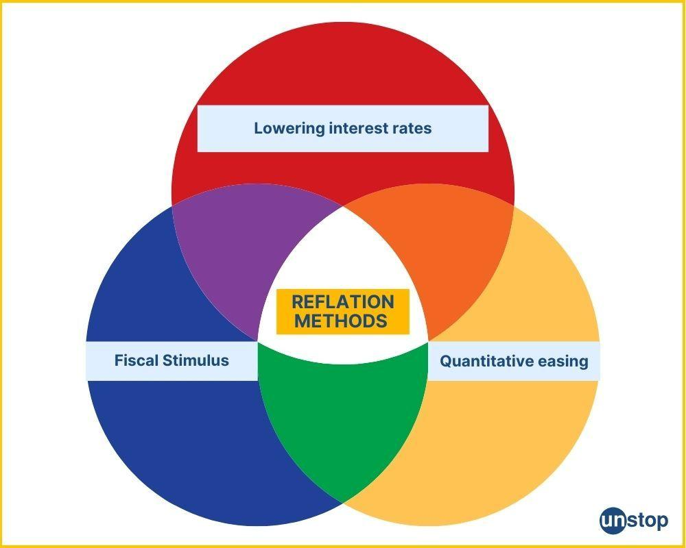

## Table of Contents

## What is reflation and how does it differ from inflation?

Reflation is when the government and central bank try to boost the economy after it has slowed down or gone into a recession. They do this by increasing the money supply and lowering interest rates. The goal is to get prices and economic activity back to where they were before the slowdown. It's like trying to pump air back into a balloon that has lost some of its air.

Inflation, on the other hand, is when the general level of prices for goods and services in an economy goes up over time. This means that the value of money goes down, so you need more money to buy the same things. Inflation can happen for many reasons, like when there's too much money chasing too few goods. Unlike reflation, inflation is not specifically aimed at recovering from an economic downturn; it's just a general rise in prices.

## Why might a government or central bank choose to implement reflationary policies?

A government or central bank might choose to implement reflationary policies when the economy is not doing well, like during a recession. They want to help the economy grow again by making it easier for people and businesses to borrow money. By lowering interest rates and increasing the money supply, they hope to encourage spending and investment. This can help businesses sell more, hire more workers, and get the economy moving again.

Reflationary policies are also used to bring prices back to where they were before the economic downturn. When prices fall too much during a recession, it can make people wait to buy things, hoping for even lower prices. This can make the economy worse. By boosting demand and pushing prices up a bit, reflation can help stabilize the economy and restore confidence. It's like giving the economy a gentle push to get it back on track.

## What are the basic tools used by central banks to pursue reflation?

Central banks use a few main tools to help with reflation. One big tool is lowering interest rates. When they do this, it costs less for people and businesses to borrow money. This can make them want to spend more and invest more, which helps the economy grow. Another tool is buying government bonds, which is called quantitative easing. When the central bank buys these bonds, it puts more money into the economy, which can also help boost spending and get prices moving back up.

Another important tool is setting targets for inflation. By aiming for a certain level of inflation, the central bank can guide expectations and help keep the economy stable. If people expect prices to go up a bit, they might be more willing to spend now instead of waiting. All these tools work together to try and get the economy back to where it was before the downturn, making sure it grows and stays healthy.

## Can you explain the concept of quantitative easing as a reflationary tool?

Quantitative easing is a way for central banks to put more money into the economy when things aren't going well. They do this by buying government bonds and other securities from banks and other financial institutions. When the central bank buys these bonds, it gives the banks more money to lend out. This can help lower interest rates and make it easier for people and businesses to borrow money. By doing this, the central bank hopes to encourage more spending and investment, which can help the economy grow again.

This tool is especially useful during times when just lowering interest rates isn't enough to get the economy moving. By pumping more money into the system, quantitative easing can help push prices up a bit, which is what reflation is all about. It's like trying to fill up a tire that's gone a bit flat. The goal is to get the economy back to where it was before the downturn, making sure it's strong and stable again.

## How does lowering interest rates contribute to reflation?

When a central bank lowers interest rates, it makes it cheaper for people and businesses to borrow money. If it costs less to borrow, more people and businesses will want to take out loans. They can use this money to buy things they need or want, like cars or new equipment for their businesses. This extra spending helps the economy grow because businesses sell more stuff and might hire more workers.

Lowering interest rates also makes saving money less attractive. When you can earn less interest on your savings, you might decide to spend that money instead. This extra spending can help push prices up a little bit, which is what reflation is all about. By getting more money moving around in the economy, lowering interest rates helps bring it back to life after a slowdown.

## What role do fiscal policies play in reflation, and how do they interact with monetary policies?

Fiscal policies are the tools that governments use to help the economy, like spending money on things like roads and schools, or cutting taxes. These actions can help with reflation by putting more money into people's pockets and encouraging them to spend. When the government spends more, it can create jobs and get the economy moving again. If they cut taxes, people have more money to spend, which can also help boost the economy. Fiscal policies are important because they can work directly and quickly to help when the economy is in trouble.

Monetary policies, which are controlled by central banks, work together with fiscal policies to help with reflation. Central banks can lower interest rates or use tools like quantitative easing to make it easier for people to borrow and spend money. When both fiscal and monetary policies are used together, they can be even more effective. For example, if the government spends more money and the central bank lowers interest rates at the same time, it can really help the economy recover faster. They work like a team, with fiscal policies giving the economy a direct boost and monetary policies making it easier for that boost to work well.

## Can you provide historical examples where reflationary policies were successfully implemented?

One good example of successful reflation happened in the United States after the Great Depression. In the 1930s, the economy was in bad shape, and many people were out of work. The government, led by President Franklin D. Roosevelt, started a bunch of programs called the New Deal. These programs included building roads and bridges, and helping people find jobs. At the same time, the Federal Reserve, which is like the central bank, started to lower interest rates and make it easier for banks to lend money. These reflationary policies helped the economy start to grow again and get people back to work.

Another example is Japan in the early 2000s. Japan had been stuck in a long period of slow growth and falling prices, which is called deflation. To fix this, the Bank of Japan, their central bank, started using a policy called quantitative easing. They bought a lot of government bonds to put more money into the economy. The government also spent a lot of money on things like building projects to help create jobs. These reflationary policies helped Japan's economy start to grow again and get prices moving up a bit, which was a big relief after years of struggling.

## What are the potential risks and drawbacks of using reflation as a monetary policy?

Using reflation as a monetary policy can have some risks. One big risk is that it might cause inflation to go too high. If the central bank puts too much money into the economy or keeps interest rates too low for too long, prices might rise a lot. This can make it hard for people to afford things and can cause problems for the economy. Another risk is that it might create a bubble in things like housing or stocks. If people borrow a lot of money because it's cheap, they might spend it on things that become too expensive, and when the bubble bursts, it can hurt the economy.

There are also some drawbacks to using reflation. It might not work as quickly as people hope. Sometimes, even if the central bank and government do a lot to help the economy, it takes a long time for things to get better. This can make people lose faith in the policies. Also, reflation can lead to more debt. If people and businesses borrow a lot of money because it's cheap, they might end up with too much debt. This can be a problem later on if they can't pay it back. So while reflation can help get the economy moving again, it's important to be careful about how it's used.

## How do reflationary policies affect different sectors of the economy?

Reflationary policies can have different effects on different parts of the economy. For example, when the government spends more money on building roads and bridges, the construction industry can do really well. More projects mean more jobs and more money for construction companies. On the other hand, sectors like retail might also benefit because people have more money to spend if taxes are cut or if they can borrow money more easily. But some industries, like savings and investment, might not do as well because lower interest rates mean people earn less on their savings.

Another way reflationary policies affect different sectors is through changes in prices. When the central bank tries to push prices up a bit, companies that sell things might see their profits go up if they can charge more for their products. But for businesses that need to buy a lot of materials, like manufacturing, higher prices can be a problem because their costs go up. Also, if reflation causes inflation to go too high, it can hurt everyone's buying power, making it harder for all businesses to sell their goods and services. So, while reflation can help some parts of the economy grow, it can also create challenges for others.

## What indicators do policymakers use to assess the effectiveness of reflationary measures?

Policymakers look at a few key things to see if reflationary measures are working. One important indicator is the growth of the economy, often measured by the Gross Domestic Product (GDP). If GDP starts to grow again after a slowdown, it's a good sign that reflation is helping. Another thing they watch is the unemployment rate. If more people are getting jobs, it means businesses are doing better and the economy is picking up. They also keep an eye on consumer spending. If people are spending more money, it shows they feel confident about the economy, which is what reflation aims to achieve.

Another set of indicators involves prices. Policymakers look at inflation rates to see if prices are starting to go up a bit, which is the goal of reflation. If inflation is moving towards the target set by the central bank, it's a sign that the economy is getting back on track. They also check business confidence surveys to see if companies feel better about the future. If businesses are more optimistic, they might invest more and hire more workers, which helps the economy grow. By looking at all these indicators together, policymakers can tell if their reflationary measures are working and if they need to make any changes.

## How can reflation lead to asset bubbles, and what measures can be taken to mitigate this risk?

Reflation can lead to asset bubbles when too much money is pumped into the economy and people start borrowing a lot because it's cheap. They might use this money to buy things like houses or stocks, which can drive up the prices of these assets really fast. If everyone thinks the prices will keep going up, more and more people want to buy, which makes the prices go even higher. But this can create a bubble, where the prices are much higher than they should be. If something happens to make people think the prices won't keep going up, everyone might try to sell at the same time, and the bubble can burst, causing prices to fall a lot and hurting the economy.

To stop asset bubbles from happening, central banks and governments can take some steps. One way is to keep a close eye on the prices of assets like houses and stocks. If they see prices going up too fast, they can raise interest rates a bit to make borrowing more expensive. This can slow down the buying and help keep prices from getting too high. Another way is to use rules that make it harder for people to borrow too much money, like requiring bigger down payments for houses. By being careful and watching the economy closely, policymakers can help prevent bubbles from forming and keep the economy stable.

## What are the current debates among economists about the long-term effects of sustained reflationary policies?

Economists have different views about what happens if reflationary policies are used for a long time. Some worry that if central banks keep interest rates low and keep pumping money into the economy for too long, it could lead to really high inflation. They think that too much money chasing too few goods can make prices go up a lot, which can be bad for the economy. They also worry about creating too much debt. If people and businesses keep borrowing more and more because it's cheap, they might end up with debts they can't pay back, which can cause problems later on.

On the other hand, some economists believe that long-term reflationary policies can help keep the economy stable and growing. They argue that if these policies are managed well, they can help prevent deflation, which is when prices keep falling and people stop spending because they think things will be cheaper later. They also think that low interest rates can help businesses invest more and create jobs, which is good for everyone. The key, they say, is to find the right balance so that reflation helps the economy without causing too many problems.

## References & Further Reading

[1]: ["Reflation and fiscal policy: What is needed?"](https://www.investopedia.com/terms/r/reflation.asp) by Joseph E. Stiglitz, VOX, CEPR Policy Portal

[2]: Bernanke, B. S. (2013). ["The Federal Reserve and the Financial Crisis"](https://press.princeton.edu/books/paperback/9780691165578/the-federal-reserve-and-the-financial-crisis), Princeton University Press.

[3]: ["Monetary Policy in the Great Recession and Beyond"](https://www.brookings.edu/articles/unconventional-monetary-policy-in-the-great-recession-and-beyond/) by David Wessel, Brookings Institution

[4]: ["Algorithmic Trading and DMA: An introduction to direct access trading strategies"](https://www.amazon.com/Algorithmic-Trading-DMA-introduction-strategies/dp/0956399207) by Barry Johnson

[5]: ["The role of high-frequency traders in markets"](https://www.sciencedirect.com/science/article/pii/S0927538X2300255X) by Evangelos Benos and Sagiri Kano, Bank of England Working Paper

[6]: ["Principles of Financial Engineering"](https://www.sciencedirect.com/book/9780123735744/principles-of-financial-engineering) by Salih N. Neftci