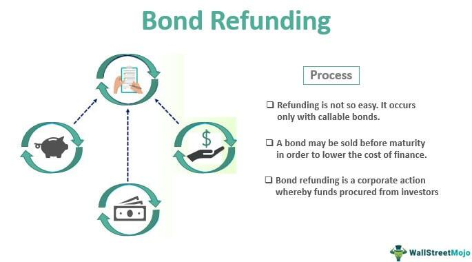

## Table of Contents

## What is a refunded bond?

A refunded bond is a type of bond where the issuer has set aside enough money to pay off the bond's principal and interest when it comes due. This money is usually held in an escrow account, which is a special account managed by a third party. The purpose of this is to make the bond safer for investors because it ensures that the money will be there to pay them back, even if the issuer faces financial difficulties.

When a bond is refunded, it often means that the issuer has refinanced the bond at a lower interest rate. This is similar to refinancing a mortgage to get a better rate. By doing this, the issuer can save money on interest payments. For investors, a refunded bond is considered very safe because the money to pay them back is already set aside and not dependent on the issuer's current financial health.

## How does a refunded bond differ from a regular bond?

A refunded bond is different from a regular bond because it has money set aside to pay back investors. This money is kept in a special account called an escrow account. It's like saving up to pay a bill ahead of time. Because of this, refunded bonds are safer for investors. Even if the company or government that issued the bond runs into money problems, the investors will still get paid back from the escrow account.

On the other hand, a regular bond doesn't have this safety net. With a regular bond, the issuer promises to pay back the money with interest over time, but they don't set aside the money in advance. If the issuer faces financial trouble, there's a risk they might not be able to pay back the bondholders. So, regular bonds can be riskier than refunded bonds.

## What is the purpose of issuing a refunded bond?

The main reason a company or government issues a refunded bond is to save money. When interest rates go down, they can issue new bonds at a lower rate and use the money from these new bonds to set aside enough money to pay off the old bonds. It's like getting a new loan with a better [interest rate](/wiki/interest-rate-trading-strategies) to pay off an old loan. This way, they can reduce the amount they have to pay in interest over time.

Another purpose is to make the bonds safer for investors. By setting aside money in an escrow account, the issuer makes sure that there will be money available to pay back the bondholders, even if they face financial problems later. This makes the bonds more attractive to investors because they know their investment is secure. So, issuing refunded bonds can help the issuer save money and attract more investors.

## What are the types of refunded bonds?

There are two main types of refunded bonds: pre-refunded bonds and advance-refunded bonds. Pre-refunded bonds happen when the issuer sets aside money in an escrow account to pay off the bond before its final due date. This makes the bond safer because the money is already there to pay back the investors. It's like saving up to pay a bill early.

Advance-refunded bonds are a bit different. With these, the issuer uses the money from new bonds to set aside money in an escrow account, but they don't pay off the old bonds right away. Instead, they wait until a certain time, often when the old bonds can be called back or when they mature. This helps the issuer save money on interest because they can issue new bonds at a lower rate. Both types make the bonds safer for investors and can help the issuer save money.

## How does the refunding process work?

The refunding process starts when a company or government wants to save money on interest payments. They do this by issuing new bonds at a lower interest rate. The money they get from these new bonds is put into a special account called an escrow account. This money is used to pay off the old bonds when they come due. It's like getting a new loan with a better rate to pay off an old loan.

There are two ways this can happen. The first way is called pre-refunding. In pre-refunding, the issuer puts money into the escrow account to pay off the old bonds before they are due. This makes the bonds safer for investors because the money is already there. The second way is called advance refunding. In advance refunding, the issuer puts money into the escrow account, but they don't pay off the old bonds right away. They wait until a certain time, like when the old bonds can be called back or when they mature. Both ways help the issuer save money and make the bonds safer for investors.

## What are the advantages of refunded bonds for issuers?

Refunded bonds help issuers save money. When interest rates go down, issuers can issue new bonds at a lower rate. They use the money from these new bonds to set aside enough money to pay off the old bonds. It's like getting a new loan with a better rate to pay off an old loan. This way, issuers pay less in interest over time, which saves them money.

Another advantage is that refunded bonds make the issuer look safer to investors. By setting aside money in an escrow account, the issuer shows that they have the money ready to pay back the bondholders, even if they face financial problems later. This makes the bonds more attractive to investors because they know their investment is secure. So, issuers can attract more investors and possibly get better terms on future borrowing.

## What are the risks associated with refunded bonds for investors?

Refunded bonds are usually safe for investors because the money to pay them back is set aside in an escrow account. But there can still be some risks. One risk is that the money in the escrow account might be invested in other things, like government bonds. If those investments don't do well, there might not be enough money to pay back the investors.

Another risk is that the issuer might not be able to keep up with the payments into the escrow account. If something goes wrong and they can't make the payments, the bond might not be as safe as it seems. Also, if interest rates go up after the bond is refunded, the investor might miss out on higher returns they could have gotten from new bonds. So, even though refunded bonds are safer than regular bonds, there are still some things investors need to watch out for.

## How does the interest rate environment affect refunded bonds?

The interest rate environment plays a big role in refunded bonds. When interest rates go down, it's a good time for issuers to issue new bonds at a lower rate. They can use the money from these new bonds to set aside enough money to pay off the old bonds. This is like getting a new loan with a better rate to pay off an old loan. By doing this, issuers can save money on interest payments over time.

On the other hand, if interest rates go up after a bond is refunded, it can be a problem for investors. They might miss out on higher returns they could have gotten from new bonds issued at the higher rates. But, because the money to pay back the refunded bond is already set aside in an escrow account, the bond is still safe. So, while the interest rate environment can affect how much money issuers save and how much return investors get, it doesn't change the safety of the refunded bond itself.

## What is the role of an escrow account in refunded bonds?

An escrow account is like a special savings account that holds money to pay back investors in refunded bonds. When a company or government wants to issue a refunded bond, they put money into this account. This money is used to pay off the old bonds when they come due. It's a way to make sure that the money will be there to pay back the investors, even if the issuer has money problems later.

The escrow account makes the refunded bond safer for investors. Because the money is already set aside, investors know they will get paid back. This is different from regular bonds, where the issuer promises to pay back the money but doesn't set it aside ahead of time. So, the escrow account is a key part of what makes refunded bonds a safer choice for people who invest in them.

## How are refunded bonds accounted for in financial statements?

When a company issues refunded bonds, they need to show this on their financial statements. They do this by recording the new bonds they issued at the lower interest rate as a liability on their balance sheet. The money they put into the escrow account to pay off the old bonds is shown as an asset. This way, anyone looking at the financial statements can see that the company has set aside money to pay back the old bonds.

The interest savings from the refunded bonds are also shown on the income statement. The company will record the lower interest expense from the new bonds, which makes their net income look better. This is important because it shows how the company is saving money by issuing new bonds at a lower rate. So, refunded bonds affect both the balance sheet and the income statement, showing the company's financial health and how they are managing their debt.

## What are the tax implications of investing in refunded bonds?

When you invest in refunded bonds, you need to think about taxes. The interest you earn from these bonds is usually taxable. This means you have to pay taxes on the money you get from the bond's interest. But, if the refunded bond is a municipal bond, the interest might be tax-free at the federal level, and sometimes at the state level too. It depends on where you live and the rules of the bond.

Another thing to think about is if you buy or sell the bond before it matures. If you sell it for more than you paid, you might have to pay capital gains tax on the profit. If you sell it for less, you might be able to claim a capital loss, which can help lower your taxes. Always talk to a tax advisor to understand how refunded bonds will affect your taxes, because the rules can be different for everyone.

## How do regulatory changes impact the issuance and management of refunded bonds?

Regulatory changes can have a big effect on refunded bonds. When the rules change, it can make it easier or harder for companies or governments to issue these bonds. For example, if new rules make it harder to set up an escrow account, issuers might not want to issue refunded bonds because it's too much trouble. Or, if the rules change about how much money has to be in the escrow account, it could change how much issuers save by issuing new bonds at a lower rate.

These changes can also affect how issuers manage refunded bonds. If the rules about what can be done with the money in the escrow account change, issuers might have to find new ways to invest that money. This could mean they earn less interest on the money, which affects how much they save. Also, if tax laws change, it could make refunded bonds more or less attractive to investors, which could change how issuers plan their bond issues.

## References & Further Reading

To gain a deeper understanding of [algorithmic trading](/wiki/algorithmic-trading) and its role in financial markets, certain foundational texts and resources are invaluable. Notably, the works of Marcos Lopez de Prado and David Aronson provide extensive insights into this domain.

Marcos Lopez de Prado is renowned for his contributions to the field of financial [machine learning](/wiki/machine-learning). His book, "Advances in Financial Machine Learning," is a key resource that offers a comprehensive examination of how machine learning techniques can be applied to develop sophisticated trading strategies. The text investigates into various aspects such as data structure, the development of algorithmic models, and the critical evaluation of model performance in real-world trading environments. For practitioners, this book also provides practical code examples, primarily in Python, illustrating how to implement these concepts efficiently.

David Aronson is another significant figure whose work, "Evidence-Based Technical Analysis," focuses on statistical techniques applied to trading. Unlike traditional technical analysis, which often relies on anecdotal evidence, Aronson advocates for a systematic, evidence-based approach. By employing rigorous statistical methods, he critiques conventional wisdom and emphasizes the importance of hypothesis testing in trading model development. His approach is particularly relevant for those in algorithmic trading who need to backtest and validate strategies with empirical data.

For those interested in further exploring these topics, additional readings include:

- "Machine Learning for Asset Managers" by Marcos Lopez de Prado, which specifically targets asset management professionals.
- Scholarly articles on machine learning applications in finance, often available through academic journals and databases.
- Online courses and lectures, such as those available on platforms like Coursera and edX, which sometimes feature lessons on algorithmic trading and machine learning by industry leaders and academics.

These resources can significantly enhance one's understanding of how technology and data science intersect with financial trading, providing a solid foundation for those aiming to navigate and innovate within algorithmic bond markets.

