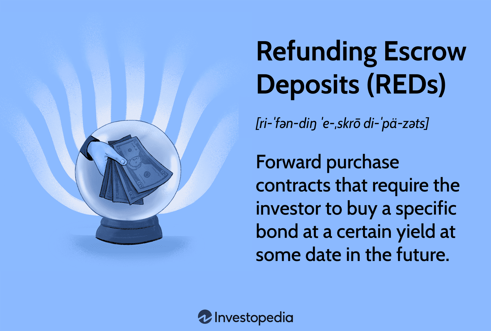

In this article, we will explore the interconnected topics of escrow accounts, escrow deposits, and the refund process. These mechanisms play a pivotal role in ensuring secure and efficient transactions in both the real estate and broader financial sectors. An escrow account acts as a safeguard, holding funds securely while conditions of a contractual agreement are yet to be fully met, thereby protecting both parties involved. The escrow deposit, a vital component, serves as a token of commitment, reinforcing trust within the transaction by demonstrating the buyer's intent.

We will also examine the utilization of algorithmic trading in financial markets. This automated trading approach leverages sophisticated algorithms to execute trades at remarkable speed and precision, minimizing human error and maximizing potential gains. Algorithmic trading has transformed how financial markets operate, offering innovative solutions in trade execution, market analysis, and risk management.



Understanding these concepts is crucial for both investors and participants in real estate transactions. As the financial landscape continues to evolve, grasping the intricacies of escrow and algorithmic trading becomes essential for making informed investment decisions and managing risks effectively. 

This article aims to break down complex ideas into simple explanations and provide a comprehensive guide to each subject. By demystifying these concepts, we seek to empower readers—whether seasoned investors or novices in the financial world—with valuable insights. From understanding the role of escrow accounts in housing markets to appreciating the sophisticated mechanisms behind algorithmic trading, this guide is designed to enhance your financial literacy and decision-making capabilities.

## Table of Contents

## Understanding Escrow Accounts and Escrow Deposits

Escrow accounts act as a secure repository for funds during transactions between two parties, typically a buyer and a seller. These accounts are governed by a neutral third party—often an escrow agent or a financial institution—who holds the funds until the agreed-upon conditions of the transaction are fulfilled. This arrangement ensures that both parties meet their contractual obligations before the funds are released, thereby mitigating the risks associated with direct fund transfers.

A core component of escrow accounts is the escrow deposit, which involves the buyer depositing funds or assets into the escrow account. This deposit serves as a good-faith demonstration that the buyer is committed to the transaction and reassures the seller of the transaction's eventual completion. Such deposits are particularly common in high-stakes transactions, such as real estate purchases, where they are often known as "earnest money."

Different types of escrow accounts cater to various transaction needs. In the real estate sector, mortgage escrow accounts are prevalent. They are used to manage taxes and insurance costs associated with a property, ensuring these expenses are paid on time. Homebuyers make monthly payments into the escrow account, from which the lender pays the property taxes and insurance premiums. This relieves homeowners from having to make large lump-sum payments periodically.

Another common type is the earnest money escrow account, used in property transactions. When a buyer makes an offer on a property, they often include an earnest money deposit to demonstrate their serious intent. This deposit is held in an escrow account until the transaction closes or is terminated. If the transaction proceeds, the earnest money is typically applied toward the purchase price. If the deal falls through due to contingencies not being satisfied (e.g., unsatisfactory inspection results), the funds may be refunded to the buyer, depending on the contract terms.

These escrow mechanisms are critical for maintaining trust and ensuring compliance in financial transactions, protecting both buyers and sellers by providing a structured method of holding and releasing funds.

## The Escrow Deposit Refund Process

Once the conditions of a transaction are met, the process to refund an escrow deposit begins. The steps involved in requesting and receiving a refund are critical to ensure a smooth transaction completion. Here is a step-by-step outline of the escrow deposit refund process:

1. **Verification of Fulfillment**: Before initiating a refund, verification that all contractual conditions have been met is essential. This includes confirming that the goods or services have been delivered or performed as agreed, as well as any other specific terms outlined in the contract.

2. **Request Initiation**: The party entitled to the refund must submit a formal request to the escrow agent. This request typically involves documentation that proves the fulfillment of the transaction’s conditions.

3. **Documentation Requirement**: The escrow agent will require specific documents to process the refund. These may include proof of transaction completion, the original escrow agreement, identification documents, and possibly a signed release form from all involved parties.

4. **Escrow Agent Review**: Upon receiving the refund request, the escrow agent will review all submitted documents and verify compliance with the escrow agreement. This review ensures that no contractual terms have been violated and that both parties are in agreement regarding the refund.

5. **Processing the Refund**: Once the review is complete, the escrow agent will process the refund. This involves transferring the escrow funds back to the original depositor or as otherwise directed by the concluded agreement.

6. **Notification of Refund Completion**: After the transfer, the escrow agent will notify all parties involved that the refund has been completed successfully.

Several factors can influence the timeline for receiving an escrow refund. The complexity of the contract terms, the efficiency of the escrow agent, and the promptness with which necessary documentation is provided can significantly affect how quickly the refund is processed. Typically, escrow agreements will specify a timeframe within which the refund is to be completed, often ranging from a few days to several weeks.

Understanding the mechanisms for dispute resolution in escrow transactions is vital for handling potential conflicts. Disputes may arise if there is a disagreement over whether the terms of the contract have been satisfied. In such cases, the escrow agent will often act as an intermediary to help resolve disputes, adhering to the stipulations laid out in the escrow agreement. Some escrow agreements may include provisions for arbitration or mediation to settle unresolved disputes efficiently.

In summary, the escrow deposit refund process requires careful adherence to the agreed terms and efficient communication between all parties. By ensuring that each step is completed accurately and promptly, potential delays and conflicts can be minimized, resulting in a smooth conclusion to the escrow transaction.

## Algorithmic Trading: An Overview

Algorithmic trading, often referred to as algo trading, is a method of executing trade orders using automated, pre-programmed trading instructions accounting for variables such as time, price, and [volume](/wiki/volume-trading-strategy). With the ability to process thousands of trades per second, [algorithmic trading](/wiki/algorithmic-trading) stands at the forefront of technological innovation in financial markets.

**Basics of Algorithmic Trading**

At its core, algorithmic trading leverages algorithms to make trading decisions. An algorithm, in this context, is a set of predefined rules or instructions programmed into computers. These algorithms analyze market data in real-time and can execute orders without human intervention.

For example, a simple algorithm might be programmed to buy a stock if its 50-day moving average surpasses its 200-day moving average, known as a "moving average crossover" strategy. Here's a basic Python example of such a strategy:

```python
# Assume we have Pandas DataFrame 'data' with historical stock prices
data['50_MA'] = data['Close'].rolling(window=50).mean()
data['200_MA'] = data['Close'].rolling(window=200).mean()

# Buy signal
data['Signal'] = 0
data['Signal'][50:] = np.where(data['50_MA'][50:] > data['200_MA'][50:], 1, 0)
```

**Benefits of Algorithmic Trading**

Algorithmic trading offers numerous advantages:

1. **Speed and Accuracy**: Algorithms can analyze large data sets quickly and execute orders in fractions of a second, much faster and often more accurately than human traders.
2. **Consistency**: Strategies are executed precisely according to the defined rules, ensuring consistency in trading actions.
3. **Cost Reduction**: Automation reduces transaction costs by minimizing the need for manual intervention and allowing for optimal execution.

**Risks Associated with Algorithmic Trading**

However, algorithmic trading also poses risks, primarily due to its dependency on technology:

1. **System Failures**: Technical glitches, such as connectivity issues or software bugs, can lead to significant trading errors.
2. **Market Impact**: The ability to execute large volumes of trades quickly can disrupt market conditions, potentially leading to price volatility.
3. **Over-optimization**: Relying heavily on historical data can lead to overfitting, where algorithms perform well on past data but poorly in live trading.

**Evolution and Impact on Financial Markets**

Since its inception, algorithmic trading has evolved significantly. Initially used by institutional investors for high-frequency trading ([HFT](/wiki/high-frequency-trading-strategies)), it now encompasses a broad range of strategies, including market-making, statistical [arbitrage](/wiki/arbitrage), and trading in various asset classes beyond stocks, such as commodities and currencies.

Algorithmic trading has transformed modern financial markets by improving market [liquidity](/wiki/liquidity-risk-premium) and efficiency. However, it has also increased market complexity and led to discussions about regulatory measures to mitigate risks and ensure market stability.

In conclusion, while algorithmic trading offers transformative benefits to financial markets, it requires careful management and oversight to address its inherent risks. As technology advances, the landscape of algorithmic trading will continue to evolve, impacting market dynamics and trading strategies.

## The Connection Between Escrow and Algorithmic Trading

Escrow and algorithmic trading, although distinct in their primary applications, share fundamental roles in managing risk and enhancing transaction efficiency. Escrow accounts serve as neutral holding places for funds, providing security in financial and real estate transactions. Similarly, algorithmic trading utilizes automated, rule-based systems to execute trades with precision and speed, minimizing human error and optimizing market engagement.

One major intersection where escrow and algorithmic trading meet is in the management of fund allocation. Algorithms can be employed to optimize the disbursement process within escrow accounts, ensuring timely and accurate release of funds based on predetermined conditions. This adds a layer of efficiency and reliability to transactions that involve multiple parties or complex contractual stipulations.

Additionally, in high-frequency trading environments, escrow mechanisms can be used to manage collateral requirements. Trading firms often need to post collateral to ensure fulfillment of contractual obligations. Through algorithmic systems, these firms can efficiently manage escrowed collateral, adjusting it dynamically in response to market movements and trading activities.

Consider the scenario where a financial institution engages in a complex derivatives transaction requiring collateral management. An algorithm could automatically adjust the collateral held in escrow, based on real-time calculations of exposure and market [volatility](/wiki/volatility-trading-strategies). This reduces the operational burden and enhances risk management by ensuring that collateral levels are always optimal.

Here is an example of how a simple algorithm could be set up in Python to manage escrow fund allocation:

```python
def manage_escrow_funds(transaction_conditions, escrow_balance):
    # This function checks transaction conditions and allocates funds accordingly.
    for condition in transaction_conditions:
        if condition['met']:
            escrow_balance -= condition['amount']
            print(f"Condition met. Released {condition['amount']} from escrow.")
        else:
            print("Condition not met. No funds released.")
    return escrow_balance

# Example conditions for a mock transaction
conditions = [
    {'name': 'inspection_complete', 'met': True, 'amount': 5000},
    {'name': 'financing_approved', 'met': False, 'amount': 10000},
    {'name': 'final_agreement_signed', 'met': True, 'amount': 15000}
]

current_escrow_balance = 30000
updated_escrow_balance = manage_escrow_funds(conditions, current_escrow_balance)

print(f"Updated escrow balance: {updated_escrow_balance}")
```

This script demonstrates automated fund management by checking transaction conditions before releasing funds from escrow. Similar logic can be applied to more sophisticated strategies in algorithmic trading contexts, establishing a robust connection between the two areas.

In essence, the integration of algorithms in managing escrow processes holds significant promise for enhancing financial stability and operational efficiency. This convergence, though currently niche, is rapidly developing and underscores the intelligent application of computer science principles in financial transaction management.

## Conclusion

A clear understanding of escrow accounts and algorithmic trading is essential for achieving financial literacy, as both concepts have become integral to modern investment strategies and real estate transactions. Escrow accounts provide security by ensuring that obligations in a financial contract are met before the transaction's funds are released. This mechanism is particularly valuable in complex dealings, such as in real estate, where it serves to protect the interests of both buyers and sellers.

Algorithmic trading, on the other hand, has revolutionized the financial markets by introducing efficiency and precision. By deploying computer algorithms to execute trades, it minimizes human error and optimizes decision-making processes. The computational aspect allows for processing vast datasets and generating insights that were previously unattainable. Algorithmic trading can lead to more strategic investment decisions and can help manage risk more effectively.

The interconnection between these domains is becoming increasingly poignant. Efficient fund management through escrow accounts can complement the systematic approach of algorithmic trading. By mastering these concepts, individuals can better navigate the complexities of financial transactions, evaluate risks, and ultimately make more informed decisions that align with their financial goals.

This article provides a comprehensive guide to these topics, aiming to equip readers with the knowledge needed to leverage these financial tools in their own lives. Understanding the fundamental principles of escrow accounts and algorithmic trading not only enhances an individual's capacity to engage with financial markets but also strengthens their ability to participate in informed decision-making, which is crucial for personal and professional financial success.

## References & Further Reading

[1]: Woolley, R. T. (2006). ["Escrow: The Key to Real Estate Transactions."](https://quizlet.com/344372436/re-law-exam-3-flash-cards/) Real Estate Transactions.

[2]: Hasbrouck, J. (1991). ["The Summary Informativeness of Stock Trades: An Econometric Analysis."](https://academic.oup.com/rfs/article/4/3/571/1580860) The Review of Financial Studies.

[3]: Aldridge, I. (2013). ["High-Frequency Trading: A Practical Guide to Algorithmic Strategies and Trading Systems."](https://onlinelibrary.wiley.com/doi/pdf/10.1002/9781119203803.fmatter) Wiley.

[4]: Zvi Bodie, Alex Kane, and Alan Marcus. ["Investments."](https://www.amazon.com/Investments-Zvi-Bodie/dp/0073530700) McGraw-Hill Education.

[5]: Narang, R. K. (2013). ["Inside the Black Box: A Simple Guide to Quantitative and High-Frequency Trading."](https://onlinelibrary.wiley.com/doi/book/10.1002/9781118662717) Wiley.