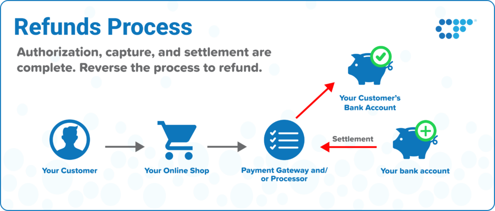

## Table of Contents

## What is a refund and why might a customer request one?

A refund is when a customer gets their money back for something they bought. This can happen if they return a product or if a service did not meet their expectations. Customers might ask for a refund because they are not happy with what they bought. Maybe the product was broken or did not work right. Or maybe the service was not good.

Sometimes, a customer might change their mind about a purchase. They might decide they do not need the item anymore or they found a better deal somewhere else. In these cases, they might want their money back so they can use it for something else. Refunds help make sure customers feel good about their shopping experience and trust the store or company.

## How does a basic refund process work in retail?

When a customer wants a refund in a retail store, they usually start by going to the customer service desk or the cashier with the item they want to return. They need to bring the receipt with them because it shows proof of purchase. The store worker will check the item to make sure it's in good condition and that it's within the return policy time frame. If everything is okay, the worker will process the refund.

Once the refund is processed, the money is usually returned to the customer in the same way they paid for the item. If they paid with cash, they get cash back. If they used a credit card, the money goes back to their card. Sometimes, the refund might take a few days to show up in their account, especially with credit cards. The whole process is meant to be quick and easy so customers feel taken care of.

## What are the steps involved in reversing a transaction?

When someone wants to reverse a transaction, they usually need to go back to the place where they made the purchase. They should bring the item they bought and the receipt that shows they paid for it. At the store, they will talk to a worker at the customer service desk or the cashier. The worker will check the item to make sure it's okay and that it's not too late to return it. If everything looks good, the worker will start the process to give the money back.

Once the worker agrees to reverse the transaction, they will process the refund. The money will go back to the customer in the same way they paid. If they used cash, they get cash back. If they used a card, the money goes back to their card. Sometimes, it might take a few days for the money to show up in their account, especially with card payments. The whole process is meant to be easy so that customers feel happy and trust the store.

## What are the differences between a refund and a chargeback?

A refund happens when a customer returns an item to the store and gets their money back. The store agrees to give the money back, and it's usually a quick and easy process. The customer needs to bring the item and the receipt to the store, and if everything is okay, the store will process the refund. The money goes back to the customer in the same way they paid, like cash or card.

A chargeback is different because it's when a customer asks their bank or credit card company to take the money back from the store. This can happen if the customer is not happy with the purchase but the store won't give a refund. The customer contacts their bank, and the bank talks to the store's bank to get the money back. This process can take longer and might be more complicated. Sometimes, the store can argue against the chargeback, and there might be fees involved for both the customer and the store.

## How do online refund processes differ from in-store refunds?

Online refunds are a bit different from in-store refunds. When you want to return something you bought online, you usually start by going to the website where you made the purchase. You'll need to find the section for returns or contact customer service. They will give you instructions on how to send the item back. You might need to print a return label and package the item yourself. Once the store gets the item and checks it, they will process the refund. The money goes back to your account, but it might take a few days to show up, especially if you used a card.

In-store refunds are usually quicker and easier. You just take the item and the receipt to the store and talk to a worker at the customer service desk or the cashier. They will check the item to make sure it's okay and that you're within the return time frame. If everything is good, they will give you your money back right away. If you paid with cash, you get cash back. If you used a card, the money goes back to your card, but it might take a few days to show up in your account. The main difference is that online refunds involve more steps and waiting, while in-store refunds are more direct.

## What documentation is typically required for processing a refund?

When you want to get a refund, you usually need to bring the receipt. The receipt shows that you bought the item and helps the store know how much money to give back. Sometimes, you might also need to show your ID, like a driver's license, to prove that you are the person who made the purchase. If you bought something online, you might need to give your order number or the email address you used to make the purchase.

For some items, like electronics or big purchases, you might need to bring the original packaging and any accessories that came with it. This is to make sure the item is still in good shape and that the store can sell it again. If you are returning something because it's broken or not working right, you might need to show proof, like a picture of the problem or a report from a repair shop. Having all these documents ready helps make the refund process go smoothly and quickly.

## What are the common reasons for transaction reversals in banking?

Transaction reversals in banking happen for a few common reasons. One big reason is when someone uses their card to buy something, but then they find out the item is not what they expected or it's broken. They might ask their bank to take the money back from the store. This is called a chargeback. Another reason is if there's a mistake with the transaction, like if the wrong amount of money was taken out or if the money was taken out twice by accident. The bank can fix these mistakes by reversing the transaction.

Sometimes, transaction reversals happen because of fraud. If someone steals a card and uses it to buy things, the real owner can tell their bank to stop the payments and get their money back. Banks also reverse transactions if they think the transaction might be suspicious or not safe. This helps keep people's money safe. In all these cases, the bank works to put the money back into the account as quickly as they can.

## How can businesses manage and track refunds efficiently?

Businesses can manage and track refunds efficiently by using special computer programs called refund management systems. These programs help keep track of all the refunds that happen in the store or online. They can show how many refunds are happening, why people are asking for them, and how much money is being given back. This helps the business see if there are any problems with their products or services. The systems also make it easy to process refunds quickly and correctly, so customers are happy and trust the business.

It's also important for businesses to have clear rules about refunds. They should tell customers how long they have to return things and what they need to bring back. Having good rules helps make sure everyone knows what to do. Businesses should also train their workers well so they know how to handle refunds the right way. By keeping good records and following their rules, businesses can manage refunds well and make sure they are doing things fairly for everyone.

## What are the financial implications of frequent refunds for a business?

When a business has a lot of refunds, it can lose money. Every time someone gets their money back, the business does not keep that money. If too many people return things, the business might not make enough profit. They also have to pay for the cost of sending things back if it's an online store. Plus, if the business has to throw away returned items because they can't sell them again, that's more money lost. All these things can make it hard for the business to stay healthy financially.

Frequent refunds can also hurt a business's reputation. If people keep hearing that others are returning things, they might think the business sells bad products or has bad service. This can make fewer people want to buy from the business. To fix this, the business might need to spend more money on making their products better or on advertising to show they are trying to improve. So, while refunds are important for keeping customers happy, too many of them can cause big financial problems for a business.

## How do international transactions complicate the refund process?

International transactions can make the refund process more complicated because of different rules in different countries. Each country has its own laws about how long you have to return something and what you need to do to get your money back. This means a business might have to follow many different rules depending on where the customer is from. Also, the business might need to deal with different languages and time zones, which can slow things down.

Another problem with international refunds is the money part. When you buy something from another country, you usually pay in a different currency. When you want a refund, the business has to change the money back into your currency. This can take time and might cost extra money because of changing exchange rates. Sometimes, the amount of money you get back might be different from what you paid because of these changes. All these things can make international refunds more difficult and take longer than regular refunds.

## What technological solutions exist to automate refund and reversal processes?

Businesses use special computer programs to make refunds and reversals easier and faster. These programs are called refund management systems. They help keep track of all the refunds that happen, both in stores and online. The systems can show how many refunds are happening, why people are asking for them, and how much money is being given back. This helps the business see if there are any problems with their products or services. The programs also make it easy to process refunds quickly and correctly, so customers are happy and trust the business.

Another technology that helps with refunds is automated payment systems. These systems can handle the money part of refunds without people having to do it by hand. For example, if someone returns something they bought with a credit card, the system can automatically send the money back to the card. This makes the process faster and less likely to have mistakes. Using these technologies helps businesses manage refunds better and save time and money.

## What are the legal and regulatory considerations businesses must adhere to when processing refunds and reversals?

Businesses have to follow many rules when they give refunds and reverse transactions. These rules can be different depending on where the business is and where the customer is. For example, some places have laws that say how long a customer has to return something and get their money back. Businesses need to know these rules and make sure they follow them. If they don't, they could get in trouble with the law. They also need to be clear with customers about their return policy so everyone knows what to expect.

Another important thing is keeping customer information safe. When a business processes a refund, they often need to use the customer's personal details, like their name and card number. There are strict rules about how to keep this information safe and private. Businesses must follow these rules to protect their customers and avoid getting fined. By understanding and following all these legal and regulatory considerations, businesses can handle refunds and reversals the right way and keep their customers happy and safe.

## References & Further Reading

[1]: Kirilenko, A. A., Kyle, A. S., Samadi, M., & Tuzun, T. (2017). ["The Flash Crash: High-Frequency Trading in an Electronic Market"](https://www.jstor.org/stable/26652722). Journal of Finance, 72(3), 967-998.

[2]: Narang, R. K. (2009). ["Inside the Black Box: The Simple Truth About Quantitative Trading"](https://onlinelibrary.wiley.com/doi/book/10.1002/9781118267738) Wiley.

[3]: Lopez de Prado, M. (2018). ["Advances in Financial Machine Learning"](https://www.amazon.com/Advances-Financial-Machine-Learning-Marcos/dp/1119482089) Wiley.

[4]: Aldridge, I. (2013). ["High-Frequency Trading: A Practical Guide to Algorithmic Strategies and Trading Systems"](https://www.amazon.com/High-Frequency-Trading-Practical-Algorithmic-Strategies/dp/1118343506) Wiley.

[5]: Gomber, P., Arndt, B., Lutat, M., & Uhle, T. (2011). ["High-frequency trading"](https://papers.ssrn.com/sol3/papers.cfm?abstract_id=1858626). Electronic Markets, 21(2), 93-103.

[6]: O'Hara, M. (2015). ["High Frequency Market Microstructure"](https://www.sciencedirect.com/science/article/pii/S0304405X15000045). Annual Review of Financial Economics, 7(1), 133-146.