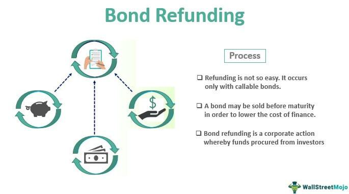

In today's fast-paced financial landscape, understanding financial transactions is crucial for both consumers and businesses. These transactions form the backbone of the global economy, facilitating the exchange of goods, services, and funds. As digital technologies evolve, the complexity and volume of financial transactions continue to increase, making it essential for individuals and organizations to grasp their underlying mechanisms.

A comprehensive understanding of financial transactions encompasses several key processes, including transaction reversals, refunds, and algorithmic trading. Transaction reversals and refunds play a significant role in addressing errors, fraud, and customer satisfaction, while algorithmic trading has revolutionized market dynamics by executing trades at speeds and efficiencies beyond human capability. These components are interconnected within the financial ecosystem, influencing how transactions are initiated, processed, and finalized.



This article provides insights into the mechanics and implications of these processes. By shedding light on transaction reversals, refunds, and the role of algorithmic trading, we aim to enhance the knowledge of consumers and businesses, enabling them to navigate the modern financial terrain more effectively. As technology continues to advance, an informed approach to financial transactions will remain indispensable for leveraging opportunities and managing risks in the market.

## Table of Contents

## Understanding Financial Transactions

Financial transactions are fundamental exchanges involving the transfer of goods, services, or funds between two parties. These exchanges form the backbone of any economic system and are pivotal in driving commerce and investments. The essence of financial transactions lies in their capacity to facilitate the movement of money or assets, which in turn propels both microeconomic activities—like individual purchases—and macroeconomic processes—like cross-border trade.

Central to the execution of financial transactions are payment processors, which are intermediaries that enable secure and efficient transfer of funds from payer to payee. Payment processors, often banks or dedicated financial service providers, ensure that transactions are authenticated, authorized, and completed without discrepancies. Their role becomes increasingly vital in digital transactions, where they implement security protocols to safeguard against fraudulent activities and data breaches. For instance, encryption and tokenization are common methods used to protect transaction data from unauthorized access, ensuring that sensitive information remains secure.

Understanding the intricacies of these transactions requires familiarity with the mechanisms and technologies involved. Traditionally, financial transactions were executed through physical means, such as the exchange of currency or checks. However, with technological advancements, digital payments have taken precedence, introducing complexities related to data security, cross-border transactions, and fluctuating exchange rates.

Key elements involved in digital transactions include:

1. **Authentication**: Verifying the identity of the transaction initiator, usually via passwords, biometrics, or two-factor authentication.

2. **Authorization**: Obtaining the necessary permissions to execute the transaction, ensuring the payer has sufficient funds or credit.

3. **Clearing**: The process of reconciling transaction details between banks or financial institutions.

4. **Settlement**: The finalization of a transaction where funds are transferred to the payee's account.

In modern commerce, understanding financial transactions extends beyond basic exchanges to encompass complex processes facilitated by various electronic platforms. The exponential growth of e-commerce and online services necessitates efficient transaction systems that can function across different currencies and regulatory environments. Moreover, the rise of cryptocurrencies introduces an alternative form of financial transaction, utilizing blockchain technology to offer decentralized and secure exchanges.

In conclusion, financial transactions are not merely economic exchanges; they represent a complex web of processes and technologies integral to the global financial ecosystem. Grasping the nuances of how transactions are processed and the role of payment processors is essential for navigating today's interconnected economic landscape.

## Transaction Reversal: An In-depth Analysis

Transaction reversals are critical mechanisms in financial transactions, serving as safeguards against errors and fraud. These reversals occur before a transaction reaches its settlement phase. By halting the completion of incorrect transactions promptly, reversals ensure that neither party is unfairly impacted financially.

Processor initiation is a key characteristic of transaction reversals. Once an anomaly is detected, the payment processor steps in to halt the transaction. This proactive measure prevents the incorrect settlement of funds and minimizes potential disputes between the payer and the payee. The processor's role is crucial in detecting unusual patterns or charges that warrant such reversals, often using sophisticated technology and algorithms to identify problematic transactions.

Several scenarios necessitate the reversal of a transaction. First and foremost among them is the occurrence of fraudulent activities. These include unauthorized transactions where a third party gains illegal access to payment information. On detecting such activities, reversing the transaction becomes imperative to protect account holders and maintain trust in the payment system.

Duplicate charges represent another common scenario requiring reversal. These occur due to system glitches or human errors that result in a transaction being processed more than once. By reversing the duplicate transactions, financial institutions ensure that customers are not overcharged and that account balances reflect accurate amounts.

Significant transaction errors, such as entering an incorrect amount or selecting the wrong payee, also necessitate reversals. These errors can have serious consequences, especially in high-value transactions or those involving international payments. Transaction reversals provide a rectification pathway, allowing corrections before undue financial impact occurs.

Efficient management of transaction reversals is essential for maintaining the integrity of financial transactions. It involves the combined efforts of banks, payment processors, and technology platforms. By understanding the mechanisms and scenarios that lead to such reversals, stakeholders can better prepare and respond, thereby safeguarding consumer confidence and enhancing the overall reliability of the financial system.

## Refunding: Process and Implications

Refunds are an integral component of the post-transaction process in the financial landscape, primarily serving as a mechanism for customer reimbursement. These are generally prompted by product returns or dissatisfaction with services rendered. The fundamental mechanism of a refund involves transferring funds back to the customer's original payment method. This process is typically customer-initiated, having recognized an issue worth rectifying, either through direct interaction with the seller or via a digital platform.

Refund processes are crucial for maintaining positive consumer relations and trust. Efficient refund mechanisms are vital for businesses to manage expectations and mitigate potential reputational harm. They play a pivotal role in customer service strategies, often forming a core aspect of consumer rights and protection frameworks. Understanding the reasons behind refunds is essential for businesses, as it aids in inventory management, cash flow analysis, and improving product or service offerings based on customer feedback.

Mitigating the financial implications of refunds requires businesses to implement strategic approaches like developing transparent refund policies, utilizing technology to streamline operations, and training staff to handle refund requests efficiently. These measures are key to ensuring minimal disruption to business processes while preserving customer satisfaction. Businesses must also consider the impact on [liquidity](/wiki/liquidity-risk-premium) when issuing refunds, as returning funds can momentarily shift cash flow dynamics.

From a customer perspective, refunds foster a sense of security within the transaction process, knowing there is recourse if purchases fail to meet expectations. Therefore, businesses committed to a seamless refund process often enhance customer loyalty and encourage repeat patronage.

In conclusion, the role of refunds stretches beyond mere reimbursement; they are a strategic tool in the broader scope of customer relations management and business operations. As commerce evolves, especially with technological advancements in payment systems, the refund process will continue to adapt, necessitating constant evaluation and optimization by businesses to meet the dynamic needs of consumers.

## Algorithmic Trading: Transforming the Financial Markets

Algorithmic trading involves the use of complex algorithms to automate trading decisions and execution. These algorithms operate at speeds far beyond the capacity of human traders, significantly enhancing market efficiency. This approach has revolutionized the financial markets, particularly in securities such as stocks and foreign exchange ([forex](/wiki/forex-system)).

Algorithms in trading are designed to process vast quantities of data, identifying market trends and [arbitrage](/wiki/arbitrage) opportunities almost instantaneously. They employ various strategies, from [statistical arbitrage](/wiki/statistical-arbitrage) to sentiment analysis, leveraging historical data trends, market signals, and news sentiment. The speed at which these algorithms can execute trades allows for seizing opportunities that might only exist for a fraction of a second.

The advantages of using [algorithmic trading](/wiki/algorithmic-trading) in financial markets are numerous. Primarily, it offers unparalleled speed and efficiency. Trades can be executed in milliseconds, which is essential in highly volatile markets where prices change rapidly. Furthermore, algorithmic trading removes human emotions from the decision-making process. Emotional decisions can lead to errors and inconsistent trading results; algorithms, however, adhere strictly to their programming and logic.

Despite these advantages, algorithmic trading also introduces several challenges. One of the primary concerns is the increased market [volatility](/wiki/volatility-trading-strategies) (Kirilenko et al., 2017). High-frequency trades executed by algorithms can lead to rapid fluctuations in market prices. Additionally, these algorithms, if not designed correctly, can behave erratically, leading to unintended consequences.

Implementing robust risk management strategies is crucial to mitigate such risks. This includes setting appropriate safeguards and testing algorithms in various market conditions before deployment. Regulators are increasingly focusing on algorithmic trading to ensure it does not compromise market integrity or investor protection.

Algorithmic trading represents a transformative force in financial markets. Its ability to process and react to information at incredible speed continues to push the boundaries of what's possible in trading, promising enhanced market dynamics yet requiring judicious oversight.

## Benefits and Risks of Financial Transaction Processes

Refunds and reversals are key elements in financial transaction processes that serve to protect consumers from errors, fraud, and other discrepancies. These mechanisms ensure that customers do not suffer financial losses due to mistakes or manipulative activities. However, while these processes provide significant consumer protection, they can also pose challenges to businesses, particularly in terms of cash flow and inventory management.

From a business perspective, refunds and reversals can create uncertainties in cash flow, as they may temporarily reduce available funds. This reduction can make financial planning more complex, particularly for small businesses that operate with tight margins. Inventory management can also be affected, as returned products need to be reintegrated into stock, potentially leading to additional logistical and administrative costs.

Algorithmic trading, widely used in modern financial markets, offers considerable benefits by enhancing market efficiency and providing high-speed trade execution. Algorithms are capable of processing massive amounts of data at unprecedented speeds, thereby identifying and leveraging trading opportunities in real-time. This capacity significantly increases market liquidity and can lead to more stable and accurate pricing.

Despite these advantages, algorithmic trading is not without risks. A primary concern is the potential for increased market volatility. High-frequency trading activities, often driven by algorithms, can amplify price swings and lead to heightened market instability if not properly managed. Furthermore, the complexity of these systems requires robust risk management strategies to prevent unintended consequences, such as erroneous trades or flash crashes.

Mitigating the risks associated with both refunds, reversals, and algorithmic trading involves implementing clear policies and procedures. For businesses, this includes establishing transparent refund and reversal policies, ensuring effective communication with customers to manage expectations, and integrating advanced technological solutions that streamline transaction processing and risk assessment. In the context of algorithmic trading, adhering to regulatory standards and employing sophisticated risk management tools are crucial for maintaining stable and secure trading environments. By responsibly leveraging technology and setting clear guidelines, businesses and traders can navigate the complexities of financial transaction processes effectively, balancing protection and efficiency.

## Impact of Algorithmic Trading on Financial Transactions

Algorithmic trading, commonly known as algo trading, significantly reshapes the landscape of financial transactions, particularly influencing processes within high-frequency trading ([HFT](/wiki/high-frequency-trading-strategies)) environments. This form of trading leverages computer algorithms to execute orders based on pre-defined criteria and rules, which may include times, prices, or any other mathematical model. This technological advancement facilitates the rapid assessment and execution of trades, thereby enhancing execution speed and market liquidity.

### Execution Speed and Market Liquidity

One of the most significant impacts of algorithmic trading is its ability to improve execution speed. By removing the human element from the decision-making process, trades can be executed in milliseconds, which is essential for high-frequency trading. This speed allows traders to capitalize on minute pricing differentials, which would be impossible with human intervention alone. Increased execution speed also promotes market liquidity, as trades can be made and completed at a much faster rate, contributing to a more efficient market. Enhanced liquidity means more transactions can occur without causing large price swings, benefiting both traders and the market ecosystem at large.

Python code implementation of a simple trading algorithm could look like this:

```python
import pandas as pd

def moving_average_strategy(prices, short_window=40, long_window=100):
    signals = pd.DataFrame(index=prices.index)
    signals['signal'] = 0.0

    signals['short_mavg'] = prices['Close'].rolling(window=short_window, min_periods=1, center=False).mean()
    signals['long_mavg'] = prices['Close'].rolling(window=long_window, min_periods=1, center=False).mean()

    signals['signal'][short_window:] = np.where(signals['short_mavg'][short_window:] > signals['long_mavg'][short_window:], 1.0, 0.0)
    signals['positions'] = signals['signal'].diff()

    return signals
```

This function calculates moving averages and generates buy/sell signals based on crossover points, a fundamental strategy utilized in algorithmic trading.

### Regulatory Oversight

Despite its benefits, algorithmic trading necessitates heightened regulatory oversight. The complexity and speed of automated transactions can exacerbate risks, including market manipulation and systemic failures like the infamous "flash crash" of 2010. Regulators must ensure that the algorithms do not lead to unfair market advantages or systemic risk. This requires robust monitoring systems and possibly the design of circuit breakers to prevent catastrophic outcomes caused by errant algorithms.

### Interplay with Financial Transactions

Understanding how financial transactions interplay with algorithmic trading is pivotal for anyone involved in modern financial markets. Algorithms dictate the initiation, alteration, and cancellation of trades, affecting how transactions are recorded and reported. The seamless integration of algorithms into trading processes necessitates an evolving understanding of data analytics, risk management, and the regulatory landscape to ensure that the benefits of algo trading are maximized while mitigating potential disadvantages. Enhanced collaborations between technologists and financial professionals can drive better insights and controls, fostering a resilient and robust trading environment.

Algorithmic trading is not merely a technical innovation; it represents a significant shift in how financial transactions are processed. Improved execution speeds and enhanced liquidity are balanced with the need for comprehensive regulatory measures to manage risks effectively. Understanding this interplay is vital for anyone navigating today's financial markets.

## Conclusion

Refunds, reversals, and algorithmic trading significantly impact modern financial transactions, presenting both opportunities and challenges. Each of these elements plays a specific role: refunds provide consumers with confidence and businesses a chance to build trust; reversals prevent errors and fraud from disrupting financial interactions; and algorithmic trading enhances efficiency and speed in financial markets. Being informed about these processes allows consumers to make secure financial decisions and businesses to optimize operations and customer satisfaction.

As technology progresses, the landscape of financial transactions is expected to transform further. Innovations such as [artificial intelligence](/wiki/ai-artificial-intelligence) and blockchain technology could redefine transaction security, efficiency, and transparency. To navigate this evolving financial environment adeptly, continuous learning and adaptation are paramount. Embracing technological advancements while maintaining robust risk management and regulatory standards will help exploit the benefits and mitigate the risks inherent to financial transactions. The ability to effectively manage these dynamics is crucial for thriving in the ever-evolving global financial ecosystem.

## References & Further Reading

[1]: Kirilenko, A. A., Kyle, A. S., Samadi, M., & Tuzun, T. (2017). ["The Flash Crash: High-Frequency Trading in an Electronic Market"](https://www.jstor.org/stable/26652722). Journal of Finance, 72(3), 967-998.

[2]: Narang, R. K. (2009). ["Inside the Black Box: The Simple Truth About Quantitative Trading"](https://onlinelibrary.wiley.com/doi/book/10.1002/9781118267738) Wiley.

[3]: Lopez de Prado, M. (2018). ["Advances in Financial Machine Learning"](https://www.amazon.com/Advances-Financial-Machine-Learning-Marcos/dp/1119482089) Wiley.

[4]: Aldridge, I. (2013). ["High-Frequency Trading: A Practical Guide to Algorithmic Strategies and Trading Systems"](https://www.amazon.com/High-Frequency-Trading-Practical-Algorithmic-Strategies/dp/1118343506) Wiley.

[5]: Gomber, P., Arndt, B., Lutat, M., & Uhle, T. (2011). ["High-frequency trading"](https://papers.ssrn.com/sol3/papers.cfm?abstract_id=1858626). Electronic Markets, 21(2), 93-103.

[6]: O'Hara, M. (2015). ["High Frequency Market Microstructure"](https://www.sciencedirect.com/science/article/pii/S0304405X15000045). Annual Review of Financial Economics, 7(1), 133-146.