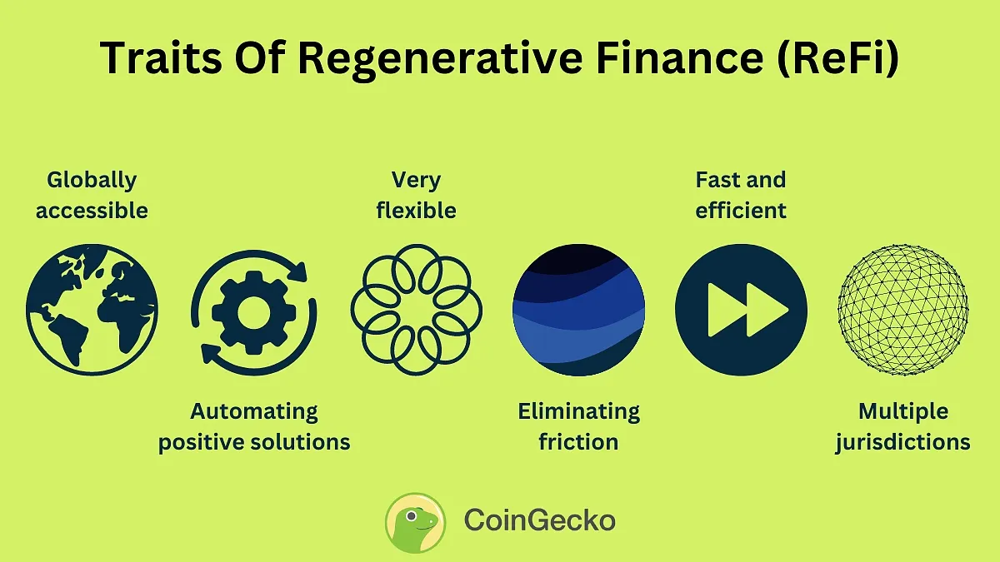

## Table of Contents

## What is Regenerative Finance (ReFi)?

Regenerative Finance, or ReFi, is a new way of thinking about money and finance that focuses on making the world a better place. It's about using money to help the environment and society, not just to make more money. ReFi tries to fix problems like climate change and inequality by supporting projects that are good for the planet and people.

ReFi uses things like cryptocurrencies and blockchain technology to make this happen. These tools help to create systems where money can flow directly to projects that help the environment, like planting trees or cleaning up oceans. By using these new technologies, ReFi aims to build a financial system that helps to heal the world instead of hurting it.

## How does Regenerative Finance differ from traditional finance?

Regenerative Finance, or ReFi, is different from traditional finance because it focuses on helping the environment and society, not just making money. Traditional finance is all about earning profits and growing wealth, often without thinking about the impact on the planet or people. ReFi, on the other hand, uses money to support projects that are good for the earth, like planting trees or cleaning up pollution, and to help communities thrive.

Another big difference is that ReFi uses new technologies like cryptocurrencies and blockchain. These tools help money go directly to the projects that need it, without going through big banks or other middlemen. Traditional finance usually involves a lot of these middlemen, which can slow things down and make it harder to see where the money is going. With ReFi, everything is more open and direct, making it easier to support the causes that matter.

## What are the core principles of Regenerative Finance?

The core principles of Regenerative Finance, or ReFi, are all about using money to make the world a better place. ReFi believes that finance should not just be about making profits, but about helping the environment and society. This means supporting projects that help the planet, like planting trees or cleaning up oceans, and helping communities grow and thrive. ReFi wants to fix problems like climate change and inequality by using money in a way that heals the world instead of hurting it.

Another important principle of ReFi is using new technologies like cryptocurrencies and blockchain to make this happen. These tools help money go directly to the projects that need it, without going through big banks or other middlemen. This makes the whole process more open and direct, so people can see exactly where their money is going and know that it's being used to help the planet and people. By using these new technologies, ReFi aims to build a financial system that is good for everyone and everything.

## Can you explain the role of blockchain in Regenerative Finance?

Blockchain plays a big role in Regenerative Finance, or ReFi. It's like a special computer system that keeps track of money and other things in a very safe and open way. In ReFi, blockchain helps make sure that money goes straight to projects that help the environment, like planting trees or cleaning up oceans. Because blockchain is so open and safe, everyone can see where the money is going and know that it's being used to help the planet.

Another way blockchain helps ReFi is by cutting out the middleman. In traditional finance, big banks and other companies often get in the way, making it harder for money to reach the projects that need it. But with blockchain, money can go directly from people to the projects they want to support. This makes the whole process faster and easier, and it helps more money go to helping the environment and communities.

## What are some examples of Regenerative Finance projects?

One example of a Regenerative Finance project is the Regen Network. This project uses blockchain to help people earn money by doing things that are good for the environment, like planting trees or taking care of the land. People can get paid in a special kind of money called "regen tokens," which they can use to buy things or trade with others. This helps more people want to help the environment because they can see how it can help them too.

Another example is the Toucan Protocol. This project uses blockchain to make it easier for people to buy and sell carbon credits. Carbon credits are like special tickets that companies can buy to help make up for the pollution they create. By using blockchain, Toucan Protocol makes it easier for people to see where their money is going and know that it's being used to help the planet. This helps more people and companies want to do their part to fight climate change.

A third example is the Celo platform. Celo is a type of cryptocurrency that focuses on helping people in poorer countries. It makes it easier for people to send and receive money without needing a bank account, which can be really helpful in places where banks are hard to find. Celo also supports projects that help the environment and communities, like building solar power stations or helping farmers grow food in a way that's good for the earth. By using Celo, people can help make the world a better place while also helping themselves and their families.

## How does ReFi contribute to environmental sustainability?

Regenerative Finance, or ReFi, helps the environment by using money to support projects that make the world a better place. It's all about putting money into things like planting trees, cleaning up oceans, and taking care of the land. These projects help to fight climate change and make the planet healthier. By using money in this way, ReFi makes sure that the environment gets the help it needs to stay strong and healthy.

ReFi also uses new technology like blockchain to make sure that money goes straight to these important projects. This means that people can see exactly where their money is going and know that it's being used to help the environment. By cutting out the middleman, ReFi makes it easier and faster for money to reach the projects that need it. This helps more people want to support the environment because they can see how their money is making a real difference.

## What are the economic benefits of implementing Regenerative Finance?

Implementing Regenerative Finance, or ReFi, can bring a lot of economic benefits. One big benefit is that it can create new jobs and businesses. When people invest in projects that help the environment, like planting trees or cleaning up oceans, they need workers to do the work. This means more jobs for people and more money flowing into the economy. It also means that new businesses can start up to support these projects, which can help the economy grow.

Another economic benefit of ReFi is that it can save money in the long run. By supporting projects that help the environment, we can avoid the costs of things like climate change and pollution. For example, if we invest in planting trees now, we might not have to spend as much money later on fixing problems caused by too much carbon in the air. This can help keep the economy strong and healthy over time, because we're not spending as much money on fixing problems that could have been prevented.

## How can individuals and businesses get involved in Regenerative Finance?

Individuals and businesses can get involved in Regenerative Finance, or ReFi, by investing in projects that help the environment and society. For example, they can buy special kinds of money called cryptocurrencies that support projects like planting trees or cleaning up oceans. By doing this, they help these projects get the money they need to do their work. They can also use platforms like the Regen Network or the Toucan Protocol to find and support projects that are good for the planet.

Another way to get involved is by using new technologies like blockchain to make sure their money goes straight to the projects they care about. This means they can see exactly where their money is going and know that it's being used to help the environment. Businesses can also start their own ReFi projects, like building solar power stations or helping farmers grow food in a way that's good for the earth. By doing this, they can help the planet while also helping their own business grow.

## What are the challenges and limitations of Regenerative Finance?

Regenerative Finance, or ReFi, faces some challenges and limitations. One big challenge is that it's still a new idea, so not everyone knows about it or understands how it works. This can make it hard for ReFi projects to get the money they need to do their work. Another challenge is that ReFi relies on new technologies like cryptocurrencies and blockchain, which can be hard to use and understand. Some people might not trust these new technologies or feel comfortable using them, which can slow down the growth of ReFi.

Another limitation of ReFi is that it can be hard to measure the impact of the projects it supports. It's not always easy to see how much a project is helping the environment or society, which can make it hard for people to decide which projects to support. Also, ReFi projects might not make as much money as traditional finance projects, which can make it harder for them to attract investors. Despite these challenges, many people believe that ReFi is worth supporting because it can help make the world a better place.

## How is Regenerative Finance regulated, and what are the compliance issues?

Regenerative Finance, or ReFi, is still a new idea, so it doesn't have a lot of rules yet. Different countries have different rules about cryptocurrencies and blockchain, which are the tools ReFi uses. Some countries have strict rules, while others are more relaxed. This can make it hard for ReFi projects to know what they're allowed to do and where they can work. As ReFi grows, more rules might be made to help keep it safe and fair for everyone.

One big compliance issue for ReFi is making sure that the money is used the right way. Because ReFi projects often use new technologies like blockchain, it can be hard to keep track of where the money is going. This means that ReFi projects need to be very open and honest about how they use the money they get. They also need to follow any rules about reporting and keeping records, which can be hard to do with new technologies. As ReFi grows, it will be important for projects to work hard to follow the rules and show that they are using money in a way that helps the environment and society.

## What future trends can we expect in the field of Regenerative Finance?

In the future, Regenerative Finance, or ReFi, is likely to become more popular as more people learn about it and see how it can help the environment and society. We can expect to see more projects that use cryptocurrencies and blockchain to support things like planting trees, cleaning up oceans, and helping communities grow. As these projects grow, they might start to work together more, creating a bigger network of people and businesses that all want to help the planet. This could make ReFi even stronger and more effective at making the world a better place.

Another trend we might see is that governments and big companies start to get more involved in ReFi. As more people support ReFi projects, governments might make new rules to help them grow safely and fairly. Big companies might also start to use ReFi to show that they care about the environment and want to help. This could bring more money and support to ReFi projects, making them even more successful. Overall, the future of ReFi looks bright, with more people and organizations working together to use money in a way that helps the planet and everyone on it.

## How can Regenerative Finance be integrated with other sustainable practices?

Regenerative Finance, or ReFi, can be integrated with other sustainable practices by working together with things like renewable energy and sustainable farming. For example, ReFi can help fund projects that use solar or wind power to make electricity. This helps the environment because it means less pollution from burning coal or oil. ReFi can also support farmers who grow food in a way that's good for the earth, like using natural ways to keep the soil healthy instead of chemicals. By putting money into these projects, ReFi helps them grow and do more to help the planet.

Another way ReFi can work with other sustainable practices is by supporting communities that want to live in a way that's good for the environment. This can mean helping people build homes that use less energy or helping them start businesses that don't hurt the planet. ReFi can also work with groups that teach people about how to live sustainably, like using less water or recycling more. By working together with these other practices, ReFi can help make the world a better place for everyone.

## References & Further Reading

[1]: Bullock, S., & Cliff, D. (2004). ["Simple adaptive strategies for decentralised market-based resource allocation."](https://bucketlistjourney.net/best-tv-series-to-watch/) Computational Economics, 24(1), 75-102.

[2]: Tapscott, D., & Tapscott, A. (2016). ["Blockchain Revolution: How the Technology Behind Bitcoin and Other Cryptocurrencies is Changing the World."](https://dl.acm.org/doi/10.5555/3051781) Penguin.

[3]: Nakamoto, S. (2008). ["Bitcoin: A Peer-to-Peer Electronic Cash System."](https://nakamotoinstitute.org/library/bitcoin/)

[4]: Zadeh, L. A. (1965). ["Fuzzy sets."](https://www.sciencedirect.com/science/article/pii/S001999586590241X) Information and Control, 8(3), 338-353.

[5]: Morecroft, J. D. (2007). ["Strategic Modelling and Business Dynamics: A feedback systems approach."](https://onlinelibrary.wiley.com/doi/book/10.1002/9781119176831) John Wiley & Sons.