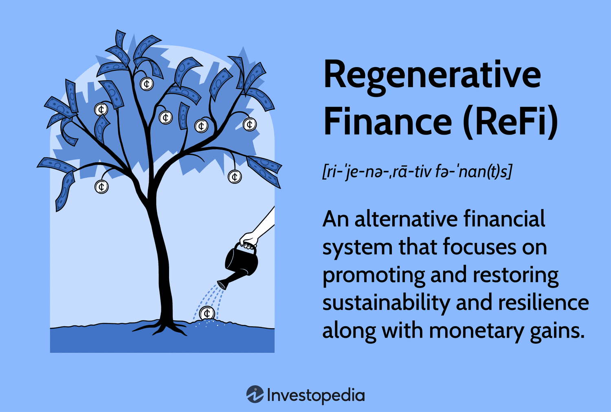

Regenerative Finance, commonly referred to as ReFi, represents a transformative shift at the confluence of finance and sustainability. This innovative concept seeks to leverage advanced technologies, notably blockchain, to construct an economic framework that actively promotes ecological and social regeneration. Traditional financial systems have long been critiqued for prioritizing short-term monetary gains often at the expense of environmental health and social equity. In contrast, ReFi aims to foster a financial ecosystem that supports regenerative processes — restoring and revitalizing ecological and social systems while maintaining economic viability.

Blockchain, a decentralized and immutable ledger technology, is pivotal to the ReFi initiative. Its application within ReFi is multifaceted; it ensures transparency and reduces transaction costs, thereby facilitating trust and security in financial activities aimed at sustainability. Additionally, blockchain enables the creation of decentralized platforms that empower local communities and support inclusive participation in sustainable development efforts.

This article examines the interplay between ReFi and algorithmic trading, a sophisticated form of trading that employs algorithms and artificial intelligence to make investment decisions. Algorithmic trading within ReFi emphasizes sustainable finance initiatives by optimizing investments in sectors like renewable energy and carbon offsets. This integration has the potential to redefine financial strategies, steering them toward sustainability while maintaining profitability.

The exploration of ReFi is not merely an academic exercise; it has profound implications for the global financial systems. By anchoring financial growth in sustainable practices, ReFi carries the promise of transforming financial markets into vehicles of positive environmental and social impact. This approach is not only about safeguarding future generations but also about enhancing the robustness and resilience of financial systems themselves. Through this lens, ReFi emerges as a critical mechanism for aligning economic incentives with the overarching goal of planetary stewardship.

## Table of Contents

## Understanding Regenerative Finance

Regenerative Finance (ReFi) represents a paradigm shift in financial systems by focusing on the restoration and enhancement of environmental and social systems, challenging the traditional financial models which often prioritize short-term profits. At its core, ReFi seeks to create financial mechanisms that incentivize activities positively affecting the planet and its inhabitants. Unlike conventional economic models, which often lead to depletion of resources, ReFi emphasizes sustainability and long-term ecological health.

One of the principal aims of ReFi is to foster an economy that does not merely survive but thrives on sustainability. This approach departs from viewing natural resources as expendable assets, instead embracing a model where ecological capacity is bolstered and regenerated. This process involves reinstating natural resources which, in turn, supports sustained economic activities. ReFi thus aligns itself with the principles of the circular economy, aiming to reduce waste and the continual use of resources.

The core principles of Regenerative Finance interact with environmental sustainability by ensuring that financial activities do not degrade, but instead aid in the restoration of the natural environment. Social impact is equally critical, as ReFi initiatives are designed to empower communities, reduce inequality, and enhance social capital. Financial viability remains a key pillar, ensuring that these sustainable and equitable practices are economically feasible and capable of thriving in competitive markets. By integrating these principles, ReFi builds a resilient financial framework that promotes well-being over mere profit, facilitating sustainable growth and significant ecological contributions.

In summary, Regenerative Finance transcends conventional economic models by prioritizing the rejuvenation of ecological and social systems, fostering an economic landscape where sustainability drives growth. The balance of environmental stewardship, social responsibility, and economic feasibility marks ReFi as a vanguard for the future of sustainable finance.

## Principles and Goals of ReFi

Regenerative Finance (ReFi) emerges as a transformative approach within the financial sector, striving to address and mitigate wealth disparities while enhancing social equity. At its core, ReFi emphasizes empowered participation and community involvement, acknowledging that sustainable economic growth cannot be achieved without inclusive practices that reflect the collective will and capabilities of diverse stakeholders.

One of the fundamental objectives of ReFi is correcting systemic wealth imbalances. This involves the creation of financial instruments and strategies explicitly designed to redistribute resources more equitably across populations and regions. By fostering mechanisms that facilitate fair dissemination of wealth and opportunities, ReFi advocates for social equity as a non-negotiable element of financial sustainability. Such a model not only seeks to rectify historical economic disparities but also ensures that future growth is distributed more fairly.

Additionally, ReFi is dedicated to nurturing a regenerative economy—a system that actively regenerates and revitalizes its underlying ecological and social systems, rather than merely sustaining them. This is achieved through initiatives that balance necessary climate actions with achievable financial growth. By prioritizing investments in renewable energy, sustainable agriculture, and green technologies, ReFi aligns economic activities with the pressing need to combat climate change and preserve the planet's natural resources. The regenerative economy thus represents a holistic view of progress, where environmental stewardship and economic prosperity are seen as complementary rather than conflicting goals.

The ultimate goal of ReFi is the conception and maintenance of a self-sustaining financial ecosystem. This ecosystem is characterized by its resilience and the capacity to perpetuate growth and equity autonomously. Self-sustaining implies that it functions efficiently without extensive external interventions by creating value and distributing it in a manner that continually reinforces the health of both economic and ecological systems. Such an ecosystem depends on circular economic principles where resources are utilized in closed loops, minimizing waste and maximizing resource efficiency.

In pursuit of these principles, ReFi incorporates innovative finance mechanisms such as green bonds, impact investing, and carbon credits. These tools are crafted to generate not only financial returns but also measurable positive social and environmental outcomes. Through deliberate design and strategic implementation, ReFi vehicles aim to generate a ripple effect, engendering systemic change across the global financial landscape.

In summary, the principles and goals of Regenerative Finance are intrinsically linked to fostering an equitable, sustainable, and resilient economic system. By prioritizing community participation, promoting social equity, and striving toward a regenerative economic model, ReFi charts a [course](/wiki/best-algorithmic-trading-courses) towards a financial future aligned with the health of our planet and its inhabitants.

## Integration with Algorithmic Trading

Algorithmic trading in Regenerative Finance (ReFi) represents a convergence of sustainability and technological advancement, utilizing [machine learning](/wiki/machine-learning) and [artificial intelligence](/wiki/ai-artificial-intelligence) (AI) to optimize investments aimed at ecological and social regeneration. These automated trading systems focus particularly on sectors such as renewable energy and carbon offset investments, which are pivotal in reducing environmental impact and contributing to a sustainable economy.

The primary goal of integrating [algorithmic trading](/wiki/algorithmic-trading) with ReFi is to enhance efficiency and precision in directing capital towards sustainable enterprises. By deploying advanced data analytics and predictive modeling, algorithmic trading systems can process vast datasets to identify high-impact investment opportunities. For instance, machine learning algorithms can assess historical financial data alongside environmental, social, and governance ([ESG](/wiki/esg-investing)) metrics to forecast the performance of green investments. This ability to process and analyze large volumes of data quickly enables ReFi systems to respond almost instantaneously to market shifts, thus maximizing the effectiveness of investment decisions.

Furthermore, algorithmic trading in ReFi emphasizes investing in renewable energy projects and carbon credits. By prioritizing these areas, ReFi trading systems contribute to the transition to a low-carbon economy. For example, algorithms can be designed to detect fluctuations in carbon credit markets and exploit these variations by executing trades that align with emissions reduction targets. This approach not only supports environmental objectives but also creates a potential for financial returns, thereby demonstrating the financial viability of sustainable investing.

The integration of ReFi and algorithmic trading also offers the potential to transform financial market strategies. Traditional trading strategies often prioritize short-term profitability, but ReFi-aligned algorithms can be programmed to account for long-term sustainability impacts. By incorporating ESG considerations into trading algorithms, financial markets can shift towards more responsible investment practices. This shift underscores a redefined financial market landscape where sustainability becomes an integral part of strategic decision-making processes.

In conclusion, the merger of ReFi with algorithmic trading systems marks a significant evolution in sustainable finance. It represents a strategic approach where technological tools are harnessed to drive investments that align with both financial profitability and ecological preservation goals. As this integration continues to evolve, it holds the promise of a financial system that not only measures success by economic gains but also by its contributions to a healthier planet.

## Applications and Impact

Regenerative Finance (ReFi) projects are at the forefront of reimagining the carbon markets, employing transparent blockchain technologies to enhance both accountability and efficiency. Blockchain's immutable ledger ensures transparency in carbon credit transactions, helping to verify and track carbon offsets effectively. This is particularly significant in combating climate change, as it addresses issues of double counting and fraud which have plagued traditional carbon markets.

One notable application of ReFi is in renewable energy projects. By using blockchain technology, these projects can secure funding, manage resources, and efficiently allocate carbon credits to investors. An example is Power Ledger, a blockchain-based platform that enables peer-to-peer energy trading, facilitating direct transactions between renewable energy producers and consumers. This not only incentivizes the production and consumption of renewable energy but also democratizes energy markets.

In addition to renewable energy, ReFi is making strides in cultural heritage preservation. Projects like Terra0 use blockchain smart contracts to allow forests to manage and sustain themselves by selling ecosystem services directly to the market. This approach ensures that cultural and natural heritage sites are preserved through sustainable financial mechanisms, turning conservation into a viable market activity.

ReFi also introduces novel platforms for crowdfunding sustainable projects, significantly expanding investment opportunities. Blockchain-based crowdfunding allows investors to directly fund eco-friendly initiatives, ranging from solar energy installations to reforestation efforts, while ensuring their investments are secure and traceable. Companies like SolarCoin provide a digital currency that incentivizes solar energy production by rewarding producers with tokens that can be traded or used in future transactions.

The transition towards Regenerative Finance represents a pivotal shift in the financial sector, highlighting an evolution towards more sustainable practices. By incorporating blockchain's transparency and security, ReFi projects can address global environmental challenges while offering tangible financial returns. This movement not only enhances sustainability but also attracts a broader range of investors seeking to align their investments with ecological and social governance (ESG) criteria. 

These developments mark a significant transformation in the finance industry as it adapts to the increasing demand for sustainability-driven investment solutions. The rise of ReFi underscores the importance of integrating financial and environmental goals, paving the way for a holistic approach to global economic and ecological sustainability.

## Risks and Challenges

Regenerative Finance (ReFi), while promising, comes with a suite of risks and challenges similar to those faced by other pioneering technologies. One significant risk is the prevalence of scams. Given its nascent status and the complexity of financial technologies involved, ReFi can become a target for fraudulent schemes. Scammers may exploit the lack of familiarity and understanding among potential investors to promote false projects, promising unrealistic returns on investments. Consequently, there is an urgent need for increased vigilance and due diligence in evaluating ReFi initiatives.

Regulatory hurdles represent another substantial challenge. As ReFi endeavors to intertwine finance with sustainability goals, it operates across various sectors—each potentially subject to different regulations. The absence of a standardized regulatory framework makes it difficult to enforce compliance and ensure project legitimacy. Appropriate regulations are essential to safeguard against misuse and to enhance the credibility of ReFi ventures. Policymakers and regulatory bodies must work collaboratively to develop frameworks that encourage innovation while protecting investors and ensuring that ReFi projects adhere to environmental and social governance principles.

Collaboration among stakeholders is critical to overcoming these challenges. Financial experts, technologists, environmental scientists, and policymakers must engage in dialogue to align ReFi practices with practical legislative structures. Furthermore, advancements in technology, such as improved blockchain security and transparency measures, are necessary to address vulnerabilities and build trust within the ReFi ecosystem.

For investors, diligence is paramount when engaging with ReFi projects. They must critically assess the authenticity and objectives of each project. This may involve verifying the credentials of the team behind the initiative, understanding the underlying technology, and ensuring that the project's goals align with realistic and measurable sustainability outcomes. By taking these precautions, investors can contribute to the success of genuine ReFi projects while protecting themselves against potential losses from fraudulent activities.

In conclusion, while ReFi presents an exciting avenue for sustainable finance, navigating its risks and challenges requires a concerted effort across the ecosystem to establish a robust and trustworthy foundation for growth.

## Conclusion

Regenerative Finance (ReFi) represents a transformative approach that successfully aligns financial markets with overarching sustainable goals. By integrating sophisticated algorithmic trading, ReFi is poised to drive substantial positive changes for both environmental and social fabrics. This integration leverages technologies such as machine learning and artificial intelligence to tailor investment strategies that prioritize ecological restoration and equitable growth. These systems can automatically allocate resources to sustainable ventures, ensuring a continuous and dynamic alignment with global sustainability targets.

The future of finance increasingly hinges on an equilibrium between achieving profitability and safeguarding the welfare of our planet. Traditional financial models predominantly focusing on short-term gains are being re-evaluated in light of pressing environmental concerns. The advancements in ReFi suggest that a balance can be achieved, creating robust systems that benefit both economies and ecosystems. Algorithmic mechanisms that account for climate risks and social impacts will likely become standard practice, guiding the financial sector towards more holistic and long-term decision-making paradigms.

Embracing ReFi could indeed pave the way for a financial landscape that is not only more equitable in terms of wealth distribution but also deeply committed to sustainability principles. This shift would empower communities, support biodiversity, and ensure that economic activities contribute positively to society at large. As ReFi continues to evolve, it holds the potential to restructure how financial growth is conceived, placing equal importance on ecological sustainability and prosperity for all societal layers.

## References & Further Reading

[1]: Bullock, S., & Cliff, D. (2004). ["Simple adaptive strategies for decentralised market-based resource allocation."](https://bucketlistjourney.net/best-tv-series-to-watch/) Computational Economics, 24(1), 75-102.

[2]: Tapscott, D., & Tapscott, A. (2016). ["Blockchain Revolution: How the Technology Behind Bitcoin and Other Cryptocurrencies is Changing the World."](https://dl.acm.org/doi/10.5555/3051781) Penguin.

[3]: Nakamoto, S. (2008). ["Bitcoin: A Peer-to-Peer Electronic Cash System."](https://nakamotoinstitute.org/library/bitcoin/)

[4]: Zadeh, L. A. (1965). ["Fuzzy sets."](https://www.sciencedirect.com/science/article/pii/S001999586590241X) Information and Control, 8(3), 338-353.

[5]: Morecroft, J. D. (2007). ["Strategic Modelling and Business Dynamics: A feedback systems approach."](https://onlinelibrary.wiley.com/doi/book/10.1002/9781119176831) John Wiley & Sons.