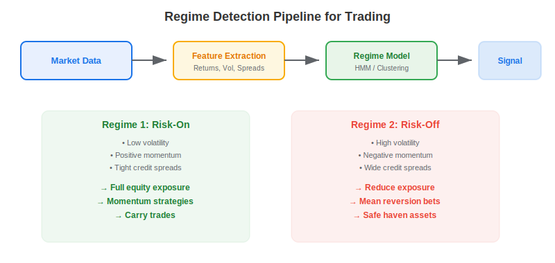
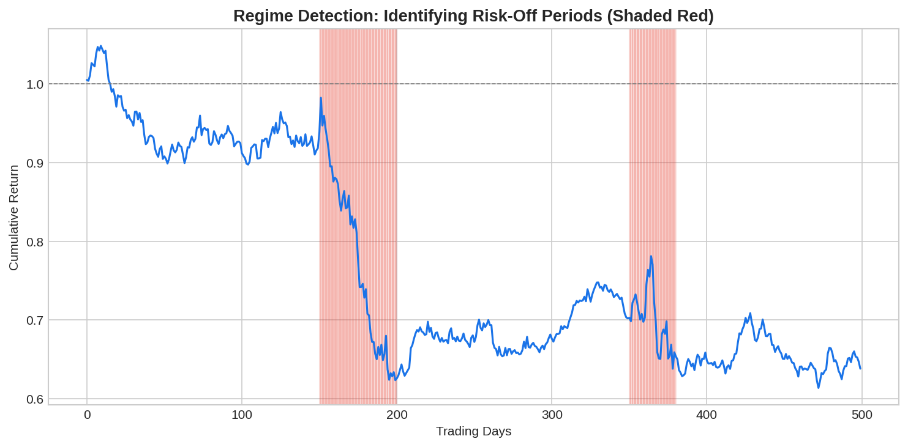

**Regime detection** is the process of identifying distinct market states — such as bull, bear, low-volatility, or crisis — and using these classifications to adapt trading strategies in real time. Markets do not behave the same way all the time: the statistical properties of returns (mean, variance, correlation) shift between regimes. A strategy optimized for calm, trending markets may suffer catastrophic losses during a volatility spike. Regime detection gives algo traders a structured way to recognize these shifts and respond.

## Why Regimes Matter for Trading

Financial returns are not stationary. Decades of empirical research confirm that markets alternate between distinct states characterized by different return distributions. During "risk-on" periods, equities trend upward with low volatility and positive autocorrelation. During "risk-off" periods, correlations spike, volatility explodes, and mean returns turn negative.

Strategies that ignore this reality face two problems: they overfit to a single regime during backtesting, and they fail to adapt when conditions change. Regime-aware strategies avoid this by dynamically adjusting position sizing, strategy selection, and risk limits based on the detected state.



## Common Regime Detection Methods

| Method | Approach | Strengths | Weaknesses |
|--------|----------|-----------|------------|
| Hidden Markov Model (HMM) | Probabilistic latent states with transition matrix | Principled, handles uncertainty | Assumes fixed number of states |
| K-Means / GMM Clustering | Groups return observations by similarity | Simple, fast | No temporal structure |
| Threshold Rules | VIX > 25 = crisis, < 15 = calm | Intuitive, interpretable | Arbitrary thresholds |
| Regime-Switching Models | Markov-switching GARCH/VAR | Captures volatility dynamics | Complex estimation |
| Change-Point Detection | Detects structural breaks in time series | No regime count assumption | Retrospective, slow to react |

The [Hidden Markov Model](https://paperswithbacktest.com/wiki/hidden-markov-models-trading) is the most widely used approach in quantitative finance because it naturally captures both the latent state structure and the probabilistic transitions between regimes.

## Python Implementation: HMM-Based Regime Detection

```python
import numpy as np
from hmmlearn.hmm import GaussianHMM

def detect_regimes(returns, n_regimes=2, n_iter=200):
    """
    Fit a Gaussian HMM to returns and decode regime sequence.
    Returns regime labels and model parameters.
    """
    model = GaussianHMM(
        n_components=n_regimes,
        covariance_type="full",
        n_iter=n_iter,
        random_state=42
    )
    X = returns.reshape(-1, 1)
    model.fit(X)
    regimes = model.predict(X)
    
    # Ensure regime 0 = low-vol, regime 1 = high-vol
    if model.covars_[0][0][0] > model.covars_[1][0][0]:
        regimes = 1 - regimes
    
    return regimes, model

# Example usage
np.random.seed(42)
returns = np.concatenate([
    np.random.normal(0.001, 0.008, 200),   # Calm period
    np.random.normal(-0.001, 0.025, 50),    # Crisis
    np.random.normal(0.0008, 0.01, 250),    # Recovery
])

regimes, hmm_model = detect_regimes(returns)

for i in range(2):
    mask = regimes == i
    mu = returns[mask].mean()
    vol = returns[mask].std()
    print(f"Regime {i}: mean={mu:.5f}, vol={vol:.5f}, days={mask.sum()}")
```



## Trading Applications

**Strategy selection**: Run [momentum strategies](https://paperswithbacktest.com/wiki/mean-reverting-vs-momentum-strategies) during trending regimes and mean-reversion strategies during range-bound periods. The regime model acts as a meta-strategy that selects among sub-strategies.

**Position sizing**: Reduce exposure during high-volatility regimes and increase it during calm periods. A simple rule: scale position size inversely with the regime's estimated volatility.

**Risk management**: Tighten stop-losses and widen profit targets during volatile regimes. Shift to defensive assets (bonds, gold) when the model detects a risk-off transition.

**Factor timing**: Macro regimes drive factor returns. Value tends to underperform during crises; momentum tends to underperform during sharp reversals. Regime detection helps time factor allocations.

## Limitations and Risks

Regime detection models face several practical challenges. The number of regimes must be chosen in advance — too few misses important states, too many overfits. HMMs can be slow to detect transitions because they rely on accumulated evidence. Most critically, regime labels are assigned retrospectively — the model may reclassify recent observations as the data window shifts, creating look-ahead bias if not handled carefully.

The best practice is to use regime detection as a risk overlay rather than a primary signal: reduce risk when the model flags danger, but don't bet aggressively on regime predictions alone.

## Conclusion

Regime detection provides a principled framework for adapting trading strategies to changing market conditions. By identifying distinct states in return distributions, traders can dynamically adjust their approach — selecting the right strategy, sizing positions appropriately, and managing risk more effectively. Combined with robust [backtesting](https://paperswithbacktest.com/wiki/backtesting-with-python), regime-aware strategies represent a significant improvement over static approaches.

---

**Explore further on PapersWithBacktest:**
- Browse [backtested regime-aware strategies](https://paperswithbacktest.com/strategies) with Python code and performance metrics
- Access [clean historical market data](https://paperswithbacktest.com/datasets) for equities, crypto, and futures
- Take the [algo trading course](https://paperswithbacktest.com/course) — 60+ video lessons and notebooks
- Related wiki pages: [Mean Reverting vs Momentum Strategies](https://paperswithbacktest.com/wiki/mean-reverting-vs-momentum-strategies) · [VIX Trading Strategy](https://paperswithbacktest.com/wiki/vix-trading-strategy) · [Backtesting with Python](https://paperswithbacktest.com/wiki/backtesting-with-python)
