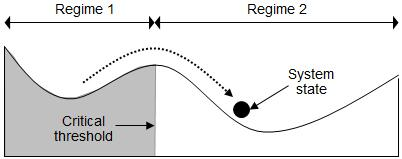

## Table of Contents

## What is a regime shift?

A regime shift is a big change in how a system works. It's like when a pond turns into a swamp. This can happen in nature, like with weather or animals, or in human systems, like money or politics. When a regime shift happens, the old rules don't work anymore, and new rules start to apply.

These shifts can be sudden or slow, but they are hard to reverse once they happen. For example, if a forest turns into a desert, it's very hard to bring back the trees. People need to be careful because our actions can cause these shifts. Understanding regime shifts helps us take better care of our world and plan for the future.

## What are some common examples of regime shifts in nature?

One common example of a regime shift in nature is when a lake changes from clear to murky. This can happen if too many nutrients, like from fertilizers, get into the lake. The nutrients make algae grow a lot, and when the algae dies, it uses up the oxygen in the water. Without enough oxygen, fish and other animals can't live, and the lake becomes a different place.

Another example is when a forest turns into a grassland. This can happen if there are too many fires or if people cut down too many trees. Without trees, the soil can dry out and it's harder for new trees to grow. The area might stay as grassland for a long time, even if people try to plant trees again.

These shifts show how sensitive nature can be. Small changes can lead to big differences in how an ecosystem works. It's important for us to understand these shifts so we can help protect nature and keep it healthy.

## How do regime shifts differ from gradual changes?

Regime shifts are different from gradual changes because they are big and sudden changes in how a system works. A gradual change is like slowly turning up the heat on a stove. You can see it happening little by little. But a regime shift is like flipping a switch. One moment the system is one way, and the next moment it's completely different. For example, a pond might slowly get a bit dirtier over time, but a regime shift would make it suddenly turn into a swamp.

These shifts are hard to reverse once they happen. If you slowly add more sand to a beach, you can always take some away if you want to. But if a forest turns into a desert because of a regime shift, it's very hard to bring back the trees. Gradual changes give us time to adjust and fix things if we need to, but regime shifts can catch us by surprise and leave us with a new situation that's tough to change back.

## What are the key drivers behind regime shifts?

The key drivers behind regime shifts are often changes in the environment or human actions. In nature, things like temperature, rainfall, or the number of certain animals can push a system towards a big change. For example, if it gets too warm, a lake might suddenly fill with algae and become murky. Human actions, like pollution or cutting down forests, can also cause these shifts. If people put too much fertilizer in a river, it can lead to a sudden increase in algae, turning the river into a different kind of place.

These drivers can work together to make regime shifts happen. Sometimes a small change can tip the balance and cause a big shift. For example, if a forest is already stressed from drought, a few big fires might be enough to turn it into a grassland. Understanding these drivers helps us see when a system might be close to a big change. By watching for these signs, we can try to stop regime shifts before they happen or prepare for them if they do.

## How can regime shifts impact ecosystems?

Regime shifts can change ecosystems in big ways. When a regime shift happens, it can turn a place into something very different. For example, if a lake goes from clear to full of algae, many fish and plants that used to live there might not be able to survive. The whole food chain can change, and new kinds of animals might move in. This can make the ecosystem less diverse and harder for some animals to find food or a safe place to live.

These shifts can also affect how the land or water works. If a forest turns into a desert, the soil can dry out and blow away in the wind. This can make it hard for new plants to grow, and the area might stay a desert for a long time. Changes like these can make it tough for people who live nearby, too. They might lose important resources like water or wood, and it can be hard to get them back once the shift has happened. Understanding how regime shifts impact ecosystems helps us take better care of our world and plan for the future.

## What methods are used to detect regime shifts?

Scientists use different ways to find out when a regime shift might happen. One way is by watching for early signs. These signs can be things like big changes in how many animals or plants there are in an area, or if the weather starts acting differently. By keeping an eye on these signs, scientists can guess if a big change is coming. They use tools like computers to look at lots of data and see patterns that might show a regime shift is close.

Another way to detect regime shifts is by studying the past. Scientists look at old records or take samples from places like lake bottoms or tree rings. These can show what the environment was like a long time ago and help them understand how it changed. By knowing what happened before, they can better predict what might happen next. This helps them warn people and maybe even stop a big change before it happens.

## Can regime shifts be predicted, and if so, how?

Yes, regime shifts can be predicted by watching for early warning signs and using computer models. Scientists look at things like big changes in the number of animals or plants, or unusual weather patterns. These signs can show that a big change is coming. By collecting a lot of data and using computers to find patterns, scientists can guess when a regime shift might happen. This helps them warn people and maybe even stop the shift before it's too late.

Another way to predict regime shifts is by studying the past. Scientists look at old records or take samples from places like lake bottoms or tree rings. These samples can tell them what the environment was like a long time ago and how it changed. By understanding past regime shifts, scientists can better predict what might happen in the future. This knowledge is important for planning and taking care of our world.

## What are the social and economic consequences of regime shifts?

Regime shifts can have big effects on people and money. When a place changes a lot, like a forest turning into a desert, people who live there might lose important things they need, like water or wood. This can make it hard for them to live and work. For example, farmers might not be able to grow crops anymore, and they might have to move to find new jobs. This can cause big problems for whole communities, making it tough for them to keep their way of life.

These changes can also hurt the economy. If a lake turns into a swamp because of too much pollution, it might not be safe for fishing or swimming anymore. This can mean less money for people who used to make a living from the lake. Businesses that depend on the lake, like restaurants or tour companies, might have to close down. Governments might have to spend a lot of money to fix the problem or help people who are affected. Understanding these consequences can help us plan better and maybe stop some of the bad effects before they happen.

## How do human activities contribute to regime shifts?

Human activities can cause big changes in nature that lead to regime shifts. When people cut down too many trees, it can turn a forest into a desert. This happens because without trees, the soil dries out and it's hard for new plants to grow. Pollution is another big problem. If too much fertilizer gets into a lake, it can make a lot of algae grow. When the algae dies, it uses up the oxygen in the water, and fish can't live there anymore. These actions can push nature over the edge and cause a big change.

Farming and building cities can also lead to regime shifts. When people farm in the same place for a long time, they can wear out the soil. This can make it hard to grow crops, and the land might turn into a different kind of place. Building cities can change how water flows and where animals live. If a river gets blocked or changed, it can affect the whole ecosystem. By understanding how our actions affect nature, we can try to be more careful and help prevent these big changes from happening.

## What strategies can be employed to manage or mitigate regime shifts?

To manage or mitigate regime shifts, people can take steps to be more careful with nature. One way is to watch for early warning signs, like big changes in the number of animals or plants. By keeping an eye on these signs, scientists can warn others that a big change might be coming. This gives people time to act. For example, if a lake is starting to get too much algae, people can stop putting fertilizer near the lake. This can help keep the lake from turning into a swamp.

Another way to manage regime shifts is by making rules to protect nature. Governments can set up laws to stop people from cutting down too many trees or polluting rivers. These rules can help keep ecosystems healthy and stop big changes from happening. People can also work together to take better care of their environment. By planting more trees, using less water, and cleaning up pollution, communities can help prevent regime shifts and keep their world safe and healthy.

## What role does resilience play in the context of regime shifts?

Resilience is like how strong and flexible a system is. It helps a place bounce back after something bad happens. In the context of regime shifts, resilience means how well an ecosystem can handle changes without turning into something completely different. If a system is very resilient, it can take a lot of stress, like pollution or cutting down trees, without having a big shift. This is important because it can stop a forest from turning into a desert or a lake from becoming full of algae.

Building resilience can help manage or stop regime shifts. People can make ecosystems more resilient by taking care of nature, like planting more trees or cleaning up pollution. When an ecosystem is resilient, it can handle small changes without breaking. This gives people time to fix problems before they get too big. By understanding and increasing resilience, we can help protect our world and keep it healthy for the future.

## How have recent advancements in technology and data analysis improved our understanding of regime shifts?

Recent advancements in technology and data analysis have made it easier for scientists to see and understand regime shifts. They use computers and special programs to look at a lot of information at once. This helps them find patterns and early signs that a big change might be coming. For example, satellites can take pictures of forests and lakes from space. Scientists can use these pictures to see how things are changing over time. This helps them predict when a forest might turn into a desert or when a lake might get too much algae.

These technologies also help scientists study the past to learn about regime shifts. They can take samples from places like lake bottoms or tree rings and use machines to find out what the environment was like a long time ago. By understanding how things changed in the past, scientists can better guess what might happen in the future. This information is important for making plans to stop or manage regime shifts. It helps people take better care of the world and be ready for big changes.

## How can we detect regime shifts?

Detecting regime shifts in [algorithmic trading](/wiki/algorithmic-trading) is crucial for aligning strategies with the current market dynamics. These shifts can be identified using various methodologies, primarily falling under statistical and [machine learning](/wiki/machine-learning) approaches. One of the most prominent statistical models used for this purpose is the Markov Switching Auto-regressive (MSAR) model.

The MSAR model is designed to capture changes in market trends by assuming that data can be segmented into distinct regimes, each with its own statistical properties. In this model, the underlying process is considered to follow a Markov chain, where transitions between regimes are governed by transition probabilities.

The general form of the Markov Switching Auto-regressive model is expressed as:

$$

y_t = \mu_{s_t} + \phi_{s_t} y_{t-1} + \varepsilon_t 
$$

where $y_t$ is the time series data (such as price returns), $\mu_{s_t}$ and $\phi_{s_t}$ are the regime-specific parameters for mean and AR coefficient respectively, $s_t$ represents the regime at time $t$, and $\varepsilon_t$ is the error term, often assumed to be normally distributed.

Machine learning approaches also offer powerful tools for detecting regime shifts. These typically involve supervised or unsupervised learning techniques, where historical market data is used to train models to recognize patterns that precede regime changes. Feature engineering and selection are crucial, as they ensure that the model is sensitive to market indicators that signify regime shifts, such as changes in [volatility](/wiki/volatility-trading-strategies), [volume](/wiki/volume-trading-strategy), or correlation structures.

Timely detection of regime shifts is crucial for adapting trading strategies. A delay in recognizing a shift can lead to significant losses or missed opportunities. Models such as MSAR and machine learning algorithms provide signals that help traders adjust their strategies accordingly, such as switching between trend-following and mean-reversion strategies, or altering position sizes to account for increased volatility.

In practice, it's essential for traders and analysts to maintain a real-time detection system, leveraging these models to monitor and interpret market data continuously. This proactive approach enables the swift adaptation of trading strategies, ultimately fostering consistent returns and risk management in the face of evolving market conditions.

## References & Further Reading

[1]: Bergstra, J., Bardenet, R., Bengio, Y., & Kégl, B. (2011). ["Algorithms for Hyper-Parameter Optimization."](https://papers.nips.cc/paper/4443-algorithms-for-hyper-parameter-optimization) Advances in Neural Information Processing Systems 24.

[2]: ["Advances in Financial Machine Learning"](https://www.amazon.com/Advances-Financial-Machine-Learning-Marcos/dp/1119482089) by Marcos Lopez de Prado

[3]: ["Evidence-Based Technical Analysis: Applying the Scientific Method and Statistical Inference to Trading Signals"](https://www.amazon.com/Evidence-Based-Technical-Analysis-Scientific-Statistical/dp/0470008741) by David Aronson

[4]: ["Machine Learning for Algorithmic Trading"](https://github.com/stefan-jansen/machine-learning-for-trading) by Stefan Jansen

[5]: ["Quantitative Trading: How to Build Your Own Algorithmic Trading Business"](https://books.google.com/books/about/Quantitative_Trading.html?id=j70yEAAAQBAJ) by Ernest P. Chan