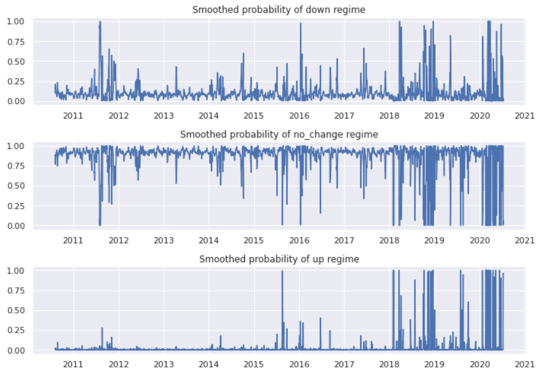

## Table of Contents

## What is a regime-switching model?

A regime-switching model is a type of statistical model that helps us understand how things can change over time. Imagine you're watching the weather, and it can switch between being sunny or rainy. A regime-switching model would help us predict when these switches might happen and how long each type of weather might last. These models are useful in many areas, like finance, where the economy can switch between good times and bad times, or in medicine, where a patient's health can switch between different states.

These models work by dividing time into different periods, or "regimes," where the behavior of what we're studying changes. For example, in the stock market, there might be a "bull market" regime where prices go up a lot, and a "bear market" regime where prices go down. The model uses past data to figure out when these switches happen and how likely they are to occur. By understanding these patterns, we can make better predictions and decisions based on what regime we're currently in and what might happen next.

## How do regime-switching models differ from traditional time series models?

Regime-switching models and traditional time series models both look at how things change over time, but they do it in different ways. Traditional time series models, like ARIMA, assume that the way things change stays the same over time. They use past data to predict future values, assuming that the patterns they see will keep happening. For example, if you're looking at sales data, a traditional model might assume that the ups and downs in sales follow a steady pattern that doesn't change much.

On the other hand, regime-switching models are more flexible. They recognize that the world can change in big ways, and they try to capture these changes. These models assume that there are different "regimes" or periods where the behavior of what you're studying can be very different. For instance, in the stock market, there might be times of growth and times of decline, and a regime-switching model would try to figure out when these switches happen and how they affect the market. This makes them better at dealing with sudden or big changes that traditional models might miss.

In short, while traditional time series models are good for steady, predictable changes, regime-switching models are better at handling situations where the rules of the game can change suddenly. This makes regime-switching models especially useful in fields like finance or economics, where big shifts can happen and affect everything.

## What are the common applications of regime-switching models?

Regime-switching models are often used in finance and economics. They help investors and economists understand and predict how markets and economies can change over time. For example, these models can show when the stock market might switch from a period of growth to a period of decline. By understanding these switches, investors can make better decisions about when to buy or sell stocks. Economists can also use these models to predict when an economy might go into a recession or start growing again, helping governments and businesses plan for the future.

Another common use of regime-switching models is in medicine and public health. These models can help doctors and researchers understand how a patient's health might change over time. For instance, a patient with a chronic illness might have periods where their health is stable and other times when it gets worse. Regime-switching models can help predict these changes, allowing doctors to adjust treatments and improve patient care. In public health, these models can be used to track and predict the spread of diseases, helping to plan public health responses and interventions.

Regime-switching models are also used in other fields like climate science and engineering. In climate science, these models can help predict changes in weather patterns, like when a region might switch from a drought to a rainy period. This information is crucial for planning water management and agriculture. In engineering, regime-switching models can help predict when a machine might switch from normal operation to a failure state, allowing for better maintenance and safety measures. These examples show how versatile and useful regime-switching models can be across different areas of study and practice.

## What are the key components of a regime-switching model?

A regime-switching model has two main parts: the regimes and the transitions between them. Regimes are different states or periods where the thing you're studying behaves in a certain way. For example, in the stock market, one regime might be when prices are going up a lot, and another regime might be when prices are going down. Each regime has its own set of rules or patterns that the model tries to understand. The model looks at past data to figure out what these regimes are and how they work.

The other key part of a regime-switching model is how it figures out when the thing you're studying switches from one regime to another. This is called the transition. The model uses past data to predict how likely it is that a switch will happen and when it might happen. For example, it might predict that the economy has a 30% chance of going into a recession next month. By understanding these transitions, the model can help predict what might happen next and how long each regime might last. This helps people make better decisions based on the current and future states of what they're studying.

## How is a regime-switching model typically estimated?

Estimating a regime-switching model involves using past data to figure out what the different regimes are and how likely it is that the thing you're studying will switch from one regime to another. One common way to do this is by using a method called maximum likelihood estimation. This method looks at the data and tries to find the set of rules and probabilities that make the data most likely to happen. For example, if you're looking at stock market data, the model might try different sets of rules for when the market is growing and when it's declining, and then pick the set that best fits the data.

Once the model has these rules and probabilities, it can then be used to predict future switches between regimes. This involves running the data through the model to see how well it matches the different regimes and how likely it is that a switch will happen next. This can be a bit tricky because the model has to balance fitting the data well with not being too complicated. Sometimes, simpler models that don't fit the data perfectly can still be very useful for making predictions. By understanding how the model was estimated, you can better trust its predictions and use them to make decisions.

## What is the role of the transition matrix in regime-switching models?

The transition matrix is a key part of regime-switching models. It's like a map that shows how likely it is to move from one regime to another. Imagine you're playing a board game where you can be in different places on the board. The transition matrix would tell you the chances of moving from one place to another. In a regime-switching model, it helps predict when the thing you're studying, like the economy or a patient's health, might switch from one state to another.

The numbers in the transition matrix are probabilities, which are always between 0 and 1. If a number is close to 1, it means there's a high chance of moving to that new regime. If it's close to 0, the chance is low. For example, if you're looking at the stock market, the transition matrix might show there's a 20% chance of switching from a growing market to a declining one next month. By using this matrix, the model can make better predictions about what might happen next, helping people make smarter decisions.

## How can regime-switching models be used for forecasting?

Regime-switching models help with forecasting by figuring out different states or periods, called regimes, and predicting when the thing you're studying might switch from one regime to another. For example, if you're looking at the economy, the model might see that there's a "growth" regime and a "recession" regime. By looking at past data, the model can guess which regime we're in now and how likely it is to switch to another regime soon. This helps people predict what might happen next, like whether the economy will keep growing or start shrinking.

To use these models for forecasting, you need to first estimate the model using past data. This means figuring out what the different regimes are and how likely it is to switch between them. Once you have this information, you can use the model to make predictions about the future. For example, if the model says there's a 30% chance of switching from a growth regime to a recession regime next month, you can plan for that possibility. This kind of forecasting is really helpful in fields like finance and medicine, where knowing what might happen next can make a big difference.

## What are the challenges in identifying regime shifts in data?

Identifying regime shifts in data can be tricky because it's not always clear when a change has happened. Imagine you're looking at the weather, and it's been sunny for a while. Suddenly, it starts raining, but it's hard to tell if this is just a short shower or the start of a rainy season. In data, it's the same. You might see some changes, but it's hard to know if these are just random ups and downs or if they signal a new regime. This makes it challenging to figure out the right time to say a shift has happened.

Another challenge is that data can be noisy and messy. In real life, things don't always follow neat patterns. For example, in the stock market, prices can jump around a lot, making it hard to see if there's a real shift happening or if it's just normal market noise. To figure out regime shifts, you need to use special tools and methods that can handle this messiness. But even with these tools, it's still hard to be sure you've got it right, which is why identifying regime shifts is a tough job.

## How do you validate the performance of a regime-switching model?

To validate the performance of a regime-switching model, you need to see how well it predicts future changes. One way to do this is by using a part of your data to build the model and another part to test it. This is called out-of-sample testing. You look at how well the model's predictions match what actually happened in the test data. If the model does a good job at guessing future regime shifts, it's a sign that it's working well. Another way to check is by using statistical tests to see if the model fits the data better than simpler models.

Another important way to validate the model is by looking at how useful its predictions are in real life. For example, if you're using the model to predict stock market changes, you could see if following the model's advice would have made you more money than other methods. This is called [backtesting](/wiki/backtesting). If the model's predictions help you make better decisions, it shows that the model is doing a good job. But remember, no model is perfect, so it's important to keep checking and updating the model as new data comes in.

## What advanced techniques can be used to enhance regime-switching models?

One advanced technique to make regime-switching models better is using [machine learning](/wiki/machine-learning). Machine learning can help the model learn from a lot of data and find patterns that might be hard for people to see. For example, it can look at many different things at once, like stock prices, interest rates, and news about the economy, to figure out when a regime shift might happen. This can make the model's predictions more accurate and helpful for making decisions.

Another way to improve regime-switching models is by using something called Bayesian methods. These methods help the model be more flexible and update its predictions as new data comes in. Instead of just using past data to make guesses about the future, Bayesian methods let the model keep learning and changing its mind. This is really useful in situations where things can change quickly, like in the stock market or in medicine, because it helps the model stay up-to-date and make better predictions.

## How do regime-switching models handle multiple regimes?

Regime-switching models can handle multiple regimes by figuring out different states or periods where things behave differently. Imagine you're watching the weather, and it can be sunny, rainy, or snowy. A regime-switching model would look at past weather data to understand these different regimes and how they work. It uses this information to predict when the weather might switch from one regime to another, like from sunny to rainy. The model does this by looking at patterns in the data and figuring out the chances of moving between regimes.

To make this work with multiple regimes, the model uses a special tool called a transition matrix. This matrix is like a map that shows how likely it is to move from one regime to another. For example, if you're looking at the economy, the model might see that there's a "growth" regime, a "recession" regime, and a "recovery" regime. The transition matrix would tell you the chances of switching from growth to recession, from recession to recovery, and so on. By using this matrix, the model can make better predictions about what might happen next, helping people plan for different possibilities.

## What are the current research trends in regime-switching models?

One big trend in research about regime-switching models is using machine learning to make them better. Researchers are using machine learning to look at a lot of data all at once, like stock prices, news, and other things, to find patterns that might be hard to see. This helps the models predict when a switch from one regime to another might happen more accurately. For example, in finance, machine learning can help predict when the market might go from growing to shrinking by looking at many different signs at the same time.

Another trend is using Bayesian methods to make regime-switching models more flexible. Bayesian methods let the models keep learning and updating their predictions as new data comes in. This is really helpful because things like the economy or a patient's health can change quickly, and the models need to stay up-to-date. By using these methods, researchers can make models that are better at handling sudden changes and giving more reliable predictions over time.

## What are Regime-Switching Models?

Regime-switching models operate under the assumption that financial data is influenced by multiple hidden states, each of which is associated with a distinct probability distribution. This concept allows the model to capture various market conditions that are not directly observable. These hidden states, or regimes, can be indicative of different market scenarios such as periods marked by high [volatility](/wiki/volatility-trading-strategies), which may occur during economic turbulence, or low volatility, often observed in stable market conditions. Additionally, these states could signify trending markets where prices consistently move in one direction, or mean-reverting markets characterized by prices oscillating around a particular average.

A widely recognized framework for regime-switching models is the Markov regime-switching model. Within this context, transitions between hidden states follow a Markov process. This implies that the probability of transitioning from one regime to another is contingent solely on the current state, and not on the sequence of events that preceded it. Each regime is governed by its own set of parameters, which define the statistical properties of the financial data within that state, such as mean, variance, and potentially other higher moments.

The transition probabilities between regimes in a Markov regime-switching model are typically represented in a transition matrix. For instance, in a two-regime system, this matrix might look like:

$$

\begin{bmatrix} 
p_{11} & p_{12} \\ 
p_{21} & p_{22} 
\end{bmatrix} 
$$

Here, $p_{ij}$ denotes the probability of moving from regime $i$ to regime $j$. The diagonal elements, $p_{11}$ and $p_{22}$, represent the probabilities of remaining in the same regime, while the off-diagonal elements, $p_{12}$ and $p_{21}$, indicate the probabilities of switching to a different regime.

This mathematical structure allows regime-switching models to dynamically adjust to changing market conditions by shifting between states based on calculated probabilities. Consequently, they provide a robust framework for analyzing financial time series data, encompassing the stochastic nature of market behavior and enabling more informed decision-making for financial practitioners.

## What are explanations of code?

To effectively utilize a Markov regime-switching model in analyzing market data, it is crucial to understand the code implementation process. Below are detailed explanations of the key steps and code involved in this analysis.

### Data Preprocessing

The first step is to fetch the necessary market data, specifically the S&P 500 index. Python's `yfinance` library is useful for obtaining historical stock data. Once the data is downloaded, the next task is to calculate the log returns. Log returns provide a continuous compounding perspective and are computed using the formula:

$$
\text{Log Return} = \ln\left(\frac{P_t}{P_{t-1}}\right)
$$

Here's a snippet to perform these tasks:

```python
import yfinance as yf
import numpy as np
import pandas as pd

# Download historical data
sp500_data = yf.download('^GSPC', start='2000-01-01', end='2023-01-01')

# Calculate log returns
sp500_data['Log Return'] = np.log(sp500_data['Close'] / sp500_data['Close'].shift(1))
```

### Markov Regression

Once the log returns are prepared, the next step involves setting up a Markov regime-switching model using the `MarkovRegression` class found in the `statsmodels` library. This model will help identify periods of high and low volatility based on the log returns.

```python
from statsmodels.tsa.regime_switching.markov_regression import MarkovRegression

# Define the model with two states for high and low volatility
model = MarkovRegression(sp500_data['Log Return'].dropna(), k_regimes=2, trend='nc', switching_variance=True)
```

### Model Fitting

Fitting the model is crucial to estimating the parameters for each identified regime. This is achieved using the `fit()` method, which optimizes the likelihood function to derive the most probable parameters for the given states.

```python
# Fit the model
results = model.fit()
print(results.summary())
```

The summary provides details such as the transition probabilities between regimes and the means and variances of each state. These parameters are critical in understanding the characteristics of different market conditions.

### Regime Probabilities

Finally, it's important to visualize the smoothed probabilities to understand when the market was in a particular regime. Smoothed probabilities give insight into the likelihood of the market being in a high or low volatility state at any given time.

```python
import matplotlib.pyplot as plt

# Plot smoothed probabilities
sp500_data['Regime 0 Prob'] = results.smoothed_marginal_probabilities[0]
sp500_data['Regime 1 Prob'] = results.smoothed_marginal_probabilities[1]

plt.figure(figsize=(12, 6))
plt.plot(sp500_data.index, sp500_data['Regime 0 Prob'], label='Low Volatility Regime')
plt.plot(sp500_data.index, sp500_data['Regime 1 Prob'], label='High Volatility Regime')
plt.title('Smoothed Regime Probabilities')
plt.legend()
plt.show()
```

This graphically represents the market's behavior over time, indicating periods of different volatility regimes and aiding in strategic decision-making based on current market conditions.

## References & Further Reading

[1]: Hamilton, J. D. (1989). ["A New Approach to the Economic Analysis of Nonstationary Time Series and the Business Cycle."](https://www.jstor.org/stable/pdf/1912559.pdf) Journal of Political Economy, 97(2), 357-384.

[2]: Krolzig, H. M. (1997). ["Markov-Switching Vector Autoregressions: Modelling, Statistical Inference, and Application to Business Cycle Analysis."](https://link.springer.com/book/10.1007/978-3-642-51684-9) Springer.

[3]: Lopez de Prado, M. (2018). ["Advances in Financial Machine Learning."](https://www.amazon.com/Advances-Financial-Machine-Learning-Marcos/dp/1119482089) Wiley.

[4]: Kim, C.-J., & Nelson, C. R. (1999). ["State-Space Models with Regime Switching: Classical and Gibbs-Sampling Approaches with Applications."](https://direct.mit.edu/books/monograph/3265/State-Space-Models-with-Regime-SwitchingClassical) MIT Press.

[5]: Jansen, S. (2020). ["Machine Learning for Algorithmic Trading: Predictive Models to Extract Signals from Market and Alternative Data for Systematic Trading Strategies with Python."](https://www.amazon.com/Machine-Learning-Algorithmic-Trading-alternative/dp/1839217715) Packt Publishing.