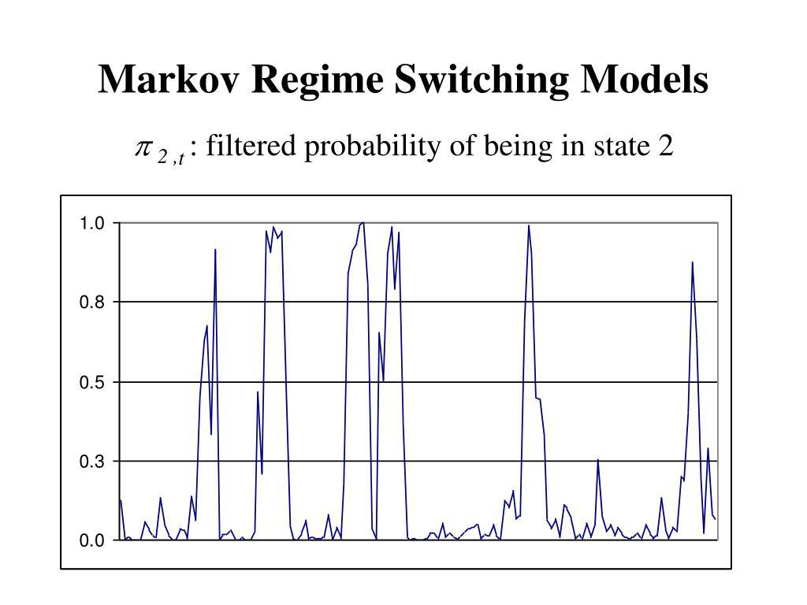

Regime-switching models have emerged as a pivotal tool in quantitative finance, primarily due to their ability to effectively capture the dynamic behavior of financial markets. Financial markets are inherently volatile, often transitioning between various regimes or states such as bullish, bearish, and neutral phases. These transitions are complex and can be influenced by numerous factors including economic data releases, geopolitical events, and market sentiment.

The utility of regime-switching models lies in their capacity to identify these market conditions and enable traders to adjust their strategies accordingly. By understanding the prevailing regime, traders can make informed decisions that align with the current state of the market, potentially enhancing profitability and managing risk more effectively.



This article focuses on regime-switching models, with a particular emphasis on the Markov regime-switching model, which is widely used in financial modeling. In the Markov framework, market states are treated as latent variables that follow a Markov process—this means that the probability of transitioning to a future state depends solely on the current state, not on the sequence of events that preceded it. Each regime is characterized by a distinct set of parameters that define its behavior, allowing for a flexible and robust modeling approach.

We aim to explore the theoretical underpinnings of these models, providing insights into how they function at a fundamental level. Furthermore, practical implementation will be demonstrated using Python, offering a step-by-step guide to executing a Markov regime-switching model. This will include code snippets and explanations to facilitate understanding.

Additionally, the article discusses practical applications of regime-switching models within trading strategies. By leveraging these models, traders can develop strategies that are sensitive to market volatility and other regime-specific characteristics, thereby optimizing trading performance and risk management.

## Table of Contents

## What are Regime-Switching Models?

Regime-switching models operate under the assumption that financial data is influenced by multiple hidden states, each of which is associated with a distinct probability distribution. This concept allows the model to capture various market conditions that are not directly observable. These hidden states, or regimes, can be indicative of different market scenarios such as periods marked by high volatility, which may occur during economic turbulence, or low volatility, often observed in stable market conditions. Additionally, these states could signify trending markets where prices consistently move in one direction, or mean-reverting markets characterized by prices oscillating around a particular average.

A widely recognized framework for regime-switching models is the Markov regime-switching model. Within this context, transitions between hidden states follow a Markov process. This implies that the probability of transitioning from one regime to another is contingent solely on the current state, and not on the sequence of events that preceded it. Each regime is governed by its own set of parameters, which define the statistical properties of the financial data within that state, such as mean, variance, and potentially other higher moments.

The transition probabilities between regimes in a Markov regime-switching model are typically represented in a transition matrix. For instance, in a two-regime system, this matrix might look like:

$$

\begin{bmatrix} 
p_{11} & p_{12} \\ 
p_{21} & p_{22} 
\end{bmatrix} 
$$

Here, $p_{ij}$ denotes the probability of moving from regime $i$ to regime $j$. The diagonal elements, $p_{11}$ and $p_{22}$, represent the probabilities of remaining in the same regime, while the off-diagonal elements, $p_{12}$ and $p_{21}$, indicate the probabilities of switching to a different regime.

This mathematical structure allows regime-switching models to dynamically adjust to changing market conditions by shifting between states based on calculated probabilities. Consequently, they provide a robust framework for analyzing financial time series data, encompassing the stochastic nature of market behavior and enabling more informed decision-making for financial practitioners.

## Example Use Case: Volatility Regimes

Financial markets are characterized by their inherently volatile nature, where periods of high and low [volatility](/wiki/volatility-trading-strategies) can occur due to various economic and geopolitical factors. High volatility periods might arise during times of economic uncertainty, such as financial crises or during significant macroeconomic announcements. Conversely, low volatility periods might occur in more stable conditions, such as when economic indicators show consistent growth and there are no major financial disruptions.

Regime-switching models are particularly useful in capturing these alternating volatility patterns, allowing traders to optimize their strategies accordingly. In a typical regime-switching setup, we might employ a Markov regime-switching model with two states: a high-volatility regime and a low-volatility regime. Each state has its own characteristics, and the transition between states is governed by a set of probabilities.

The high-volatility regime often features increased market fluctuations, larger spreads, and greater trading risks. In this scenario, traders might adopt strategies that focus on volatility trading, hedging, or using options to protect against adverse market moves. Stop-loss levels might be adjusted more tightly to limit exposure to large price swings.

In contrast, the low-volatility regime might encourage strategies that exploit steady trends or mean reversion, given that price movements are generally smaller and more predictable. Here, traders might prefer longer holding periods, trend-following strategies, or risk-adjusted position sizing to capitalize on the relatively calm market conditions.

Implementing a regime-switching model involves analyzing historical market data to identify and predict the current volatility regime. By utilizing Python, traders can efficiently build and apply these models. Here is a simplified approach for understanding the application using Python:

```python
import numpy as np
import pandas as pd
import matplotlib.pyplot as plt
from statsmodels.tsa.regime_switching.markov_regression import MarkovRegression

# Example of fetching and preprocessing data
# Assuming historical data is stored in 'data.csv' with a 'Close' column
data = pd.read_csv('data.csv')
data['Log_Returns'] = np.log(data['Close'] / data['Close'].shift(1))
data = data.dropna()

# Build the Markov regime-switching model
model = MarkovRegression(data['Log_Returns'], k_regimes=2, trend='c', switching_variance=True)
result = model.fit()

# Access the smoothed probabilities for each regime
regime_probs = result.smoothed_marginal_probabilities

# Plotting the results
plt.figure(figsize=(14, 7))
plt.plot(data.index, regime_probs[0], label='Low Volatility Regime Probability')
plt.plot(data.index, regime_probs[1], label='High Volatility Regime Probability')
plt.title('Smoothed Probabilities of Volatility Regimes')
plt.legend()
plt.show()
```

By integrating regime-switching models, traders can gain insights into the prevailing market conditions, enabling more informed decision-making. These models allow for adapting trading strategies dynamically, which is crucial for managing risk and optimizing returns in the ever-changing landscape of financial markets.

## Step-by-Step Code Implementation

To implement a two-state Markov regime-switching model for analyzing market data focused on periods of high and low volatility, follow these step-by-step instructions:

1. **Install Required Libraries**: Before diving into the implementation, ensure you have all the necessary Python packages installed. You can do this using pip:

   ```bash
   pip install numpy pandas statsmodels yfinance matplotlib
   ```

2. **Import Libraries**: Once the necessary libraries are installed, import them to handle data manipulation and modeling:

   ```python
   import numpy as np
   import pandas as pd
   import matplotlib.pyplot as plt
   from statsmodels.regression.markov_switching import MarkovRegression
   import yfinance as yf
   ```

3. **Download Historical Market Data**: Use the `yfinance` library to fetch historical stock data, such as the S&P 500 index. This will serve as the basis for our regime-switching analysis:

   ```python
   # Define the ticker symbol
   ticker = '^GSPC'

   # Download historical data from Yahoo Finance
   data = yf.download(ticker, start='2000-01-01', end='2023-01-01')

   # Display the first few rows of the data
   print(data.head())
   ```

4. **Plot the Log Returns**: Convert the historical price data into log returns to better understand the volatility across different periods. Log returns are calculated as the natural logarithm of the ratio of consecutive prices:

   ```python
   # Calculate log returns
   data['Log_Returns'] = np.log(data['Close'] / data['Close'].shift(1))

   # Plot log returns
   plt.figure(figsize=(14, 7))
   plt.plot(data.index, data['Log_Returns'], label='Log Returns')
   plt.title('Log Returns of S&P 500')
   plt.xlabel('Date')
   plt.ylabel('Log Returns')
   plt.legend()
   plt.show()
   ```

5. **Build the Regime-Switching Model**: Set up a two-state Markov regime-switching model using the `MarkovRegression` class from the `statsmodels` package. This model will differentiate between high and low volatility states:

   ```python
   # Initialize the Markov model with two states
   model = MarkovRegression(data['Log_Returns'].dropna(), k_regimes=2, trend='c', switching_variance=True)

   # Fit the model to the data
   result = model.fit()
   ```

6. **Model Summary**: Examine the results of the model fitting to interpret the estimated parameters and transition probabilities:

   ```python
   # Print the summary to examine the estimated parameters
   print(result.summary())

   # Access transition probabilities
   transition_probs = result.params[result.k_regimes:]
   print('Transition Probabilities:', transition_probs)
   ```

7. **Plot Regime Probabilities**: Visualize the smoothed probabilities for each regime to identify periods of high or low volatility in the market:

   ```python
   # Plot smoothed regime probabilities
   smoothed_probs = result.smoothed_marginal_probabilities[0]

   plt.figure(figsize=(14, 7))
   plt.plot(data.index[1:], smoothed_probs, label='Low Volatility Regime Probability')
   plt.title('Smoothed Probabilities of Low Volatility Regime')
   plt.xlabel('Date')
   plt.ylabel('Probability')
   plt.legend()
   plt.show()
   ```

By following these steps, you can effectively implement a regime-switching model to analyze financial market conditions and adjust trading strategies based on regime identification.

## Explanations of Code

To effectively utilize a Markov regime-switching model in analyzing market data, it is crucial to understand the code implementation process. Below are detailed explanations of the key steps and code involved in this analysis.

### Data Preprocessing

The first step is to fetch the necessary market data, specifically the S&P 500 index. Python's `yfinance` library is useful for obtaining historical stock data. Once the data is downloaded, the next task is to calculate the log returns. Log returns provide a continuous compounding perspective and are computed using the formula:

$$
\text{Log Return} = \ln\left(\frac{P_t}{P_{t-1}}\right)
$$

Here's a snippet to perform these tasks:

```python
import yfinance as yf
import numpy as np
import pandas as pd

# Download historical data
sp500_data = yf.download('^GSPC', start='2000-01-01', end='2023-01-01')

# Calculate log returns
sp500_data['Log Return'] = np.log(sp500_data['Close'] / sp500_data['Close'].shift(1))
```

### Markov Regression

Once the log returns are prepared, the next step involves setting up a Markov regime-switching model using the `MarkovRegression` class found in the `statsmodels` library. This model will help identify periods of high and low volatility based on the log returns.

```python
from statsmodels.tsa.regime_switching.markov_regression import MarkovRegression

# Define the model with two states for high and low volatility
model = MarkovRegression(sp500_data['Log Return'].dropna(), k_regimes=2, trend='nc', switching_variance=True)
```

### Model Fitting

Fitting the model is crucial to estimating the parameters for each identified regime. This is achieved using the `fit()` method, which optimizes the likelihood function to derive the most probable parameters for the given states.

```python
# Fit the model
results = model.fit()
print(results.summary())
```

The summary provides details such as the transition probabilities between regimes and the means and variances of each state. These parameters are critical in understanding the characteristics of different market conditions.

### Regime Probabilities

Finally, it's important to visualize the smoothed probabilities to understand when the market was in a particular regime. Smoothed probabilities give insight into the likelihood of the market being in a high or low volatility state at any given time.

```python
import matplotlib.pyplot as plt

# Plot smoothed probabilities
sp500_data['Regime 0 Prob'] = results.smoothed_marginal_probabilities[0]
sp500_data['Regime 1 Prob'] = results.smoothed_marginal_probabilities[1]

plt.figure(figsize=(12, 6))
plt.plot(sp500_data.index, sp500_data['Regime 0 Prob'], label='Low Volatility Regime')
plt.plot(sp500_data.index, sp500_data['Regime 1 Prob'], label='High Volatility Regime')
plt.title('Smoothed Regime Probabilities')
plt.legend()
plt.show()
```

This graphically represents the market's behavior over time, indicating periods of different volatility regimes and aiding in strategic decision-making based on current market conditions.

## Use Case: Applying Regime-Switching Models in Trading

Regime-switching models play a crucial role in the development and execution of effective trading strategies by identifying and adapting to different market regimes. Traders can utilize these models to tailor strategies that are sensitive to current market conditions, specifically accounting for volatility changes. Here, we will discuss three primary applications of regime-switching models in trading: adjusting trading strategies based on market regimes, dynamic risk management, and strategy [backtesting](/wiki/backtesting).

### Adjusting Trading Strategies Based on Market Regime

Regime-switching models enable traders to modify their trading strategies dynamically as they provide insights into the prevailing market regime, whether it is characterized by high or low volatility. For instance, during a high-volatility regime, traders may prefer shorter-term trading strategies that capitalize on rapid price movements, whereas, during low-volatility periods, long-term trend-following strategies might be more effective.

Consider a simple example of a trading strategy that uses a regime-switching model to adjust its parameters based on the detected regime:

```python
import numpy as np

def trading_strategy(log_returns, regime_probabilities, high_volatility_threshold=0.7):
    signals = []
    for i, probability in enumerate(regime_probabilities):
        if probability > high_volatility_threshold:
            # High volatility market condition
            signal = short_term_trade(log_returns[i])
        else:
            # Low volatility market condition
            signal = long_term_trade(log_returns[i])
        signals.append(signal)
    return signals

def short_term_trade(log_return):
    # Implement short-term strategy logic
    pass

def long_term_trade(log_return):
    # Implement long-term strategy logic
    pass
```

### Risk Management

Regime-switching models facilitate dynamic risk management by allowing traders to adjust position sizes and stop-loss levels according to the current market volatility. In a high-volatility environment, it may be prudent for traders to decrease their position sizes and tighten stop-loss thresholds to mitigate risk exposure. Conversely, in stable, low-volatility periods, traders might increase position sizes, as the likelihood of extreme price moves is reduced.

The adjustment of position size $P$ can be represented as:
$$
P_t = \frac{R}{V_t}
$$
where $R$ is the risk tolerance level, and $V_t$ is the current market volatility estimated from the regime-switching model.

### Strategy Backtesting

Backtesting trading strategies across different regimes is essential for developing robust algorithms that can withstand various market conditions. By utilizing regime-switching models, traders can simulate strategy performance under historical market regimes and validate the adaptability and effectiveness of their approaches. This involves running historical data through the model, applying the indicated strategy, and measuring performance across different regimes.

An exemplar of this process involves obtaining historical regime probabilities and corresponding strategy signals, and evaluating returns conditional on market state:

```python
def backtest_strategy(log_returns, regime_probabilities, strategy_signals):
    strategy_returns = []
    for i, signal in enumerate(strategy_signals):
        current_regime = 'high_volatility' if regime_probabilities[i] > 0.7 else 'low_volatility'
        if signal == 'buy':
            strategy_returns.append(log_returns[i] if current_regime == 'low_volatility' else -log_returns[i])
        elif signal == 'sell':
            strategy_returns.append(-log_returns[i] if current_regime == 'high_volatility' else log_returns[i])
    return np.mean(strategy_returns)

# Example invocation
# strategy_returns = backtest_strategy(mock_log_returns, mock_regime_probabilities, mock_strategy_signals)
```

Thus, regime-switching models provide traders with a robust framework for adjusting strategies in real-time, managing risk dynamically, and enhancing the integrity of strategy development through comprehensive backtesting.

## TL;DR

Regime-switching models offer a comprehensive framework for understanding and adapting to the complexities of financial markets. These models efficiently capture the transitions between different market conditions, such as shifts from bullish to bearish phases or transitions between high and low volatility periods. By recognizing these patterns, traders can tailor their strategies to align with current market characteristics, thereby enhancing decision-making processes amid fluctuating volatility.

Implementing Markov regime-switching models in Python aids traders in effectively managing strategies sensitive to volatility. These models enable a more refined approach to distinguishing market regimes and adjusting trading activities accordingly. By incorporating Python's robust data analysis libraries, traders can explore enhanced model features, fine-tuning prediction accuracy and response times to market changes. Consequently, this adaptive strategy model assists traders in optimizing performance and mitigating risks associated with volatility fluctuations.

## References & Further Reading

[1]: Hamilton, J. D. (1989). ["A New Approach to the Economic Analysis of Nonstationary Time Series and the Business Cycle."](https://www.jstor.org/stable/pdf/1912559.pdf) Journal of Political Economy, 97(2), 357-384.

[2]: Krolzig, H. M. (1997). ["Markov-Switching Vector Autoregressions: Modelling, Statistical Inference, and Application to Business Cycle Analysis."](https://link.springer.com/book/10.1007/978-3-642-51684-9) Springer.

[3]: Lopez de Prado, M. (2018). ["Advances in Financial Machine Learning."](https://www.amazon.com/Advances-Financial-Machine-Learning-Marcos/dp/1119482089) Wiley.

[4]: Kim, C.-J., & Nelson, C. R. (1999). ["State-Space Models with Regime Switching: Classical and Gibbs-Sampling Approaches with Applications."](https://direct.mit.edu/books/monograph/3265/State-Space-Models-with-Regime-SwitchingClassical) MIT Press.

[5]: Jansen, S. (2020). ["Machine Learning for Algorithmic Trading: Predictive Models to Extract Signals from Market and Alternative Data for Systematic Trading Strategies with Python."](https://www.amazon.com/Machine-Learning-Algorithmic-Trading-alternative/dp/1839217715) Packt Publishing.