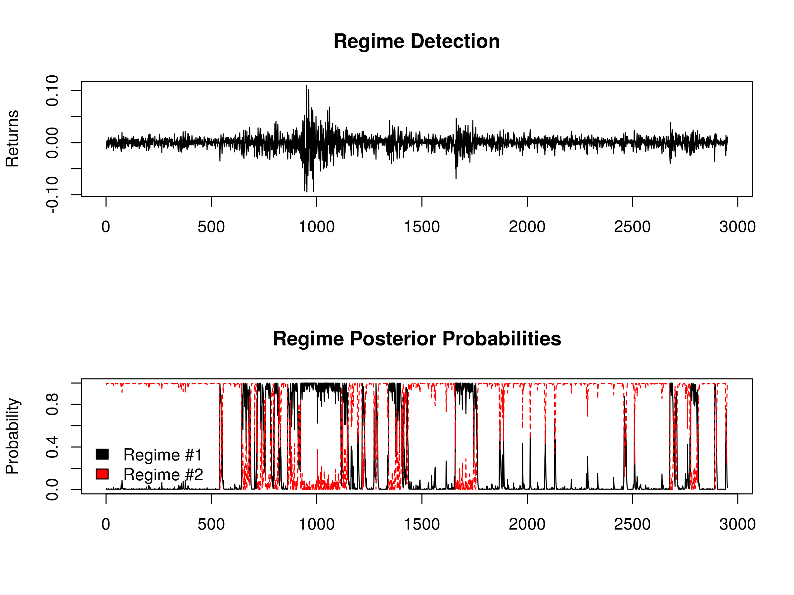

Regime switching in algorithmic trading represents a sophisticated approach designed to adapt trading strategies to fluctuating market conditions. This strategy is predicated on the identification of shifts in market trends that may influence the efficacy of trading algorithms. By recognizing different market phases, known as regimes, these models allow traders to adjust their strategies to optimize performance and returns.

One of the central frameworks employed in regime switching is the Markov regime-switching model, which is instrumental in tracking and predicting regime changes. This model functions by stipulating that markets operate under multiple distinct states, each characterized by unique statistical properties such as mean and variance. By leveraging historical data, this approach offers probabilistic insights into regime transitions, enabling traders to make informed adjustments to their trading algorithms.

The exploration of regime switching in algorithmic trading reveals both significant advantages and certain challenges. The primary advantage is the ability to enhance the robustness of trading strategies through adaptability, thus optimizing returns. By tailoring strategies to align with current market conditions, traders can potentially mitigate risks associated with market volatility.

In this article, we will examine the nuances of implementing regime switching strategies in algorithmic trading. We will delve into the application of models like the Markov regime-switching model, discuss the practical challenges encountered in real-time trading scenarios, and consider how these strategies can be integrated into broader trading systems to enhance performance. The ultimate objective is to leverage regime switching to improve trading outcomes by dynamically responding to evolving market landscapes.

## Table of Contents

## Understanding Regime Switching Models

Regime switching models play a crucial role in the detection and analysis of market pattern changes. These models are often constructed using hidden states to capture the inherent complexity and variability of financial markets. The underlying assumption of regime switching models is that markets function under multiple regimes or states, each possessing distinct characteristics that influence price movements and [volatility](/wiki/volatility-trading-strategies).

The Markov regime switching model is among the most widely adopted approaches due to its ability to manage state-dependent processes. This involves alternating mean and variance parameters as markets transition from one regime to another. Mathematically, it assumes that the probability of moving to a new state depends only on the current state, not on the sequence of events that preceded it, which is a property known as the Markov property. The model's general form can be expressed as follows:

$$
X_t = \mu_{S_t} + \sigma_{S_t}\epsilon_t
$$

where $X_t$ is the observed market variable at time $t$, $\mu_{S_t}$ and $\sigma_{S_t}$ are the mean and standard deviation corresponding to the regime $S_t$, and $\epsilon_t$ denotes the error term often assumed to follow a normal distribution.

One of the pivotal capabilities of the Markov regime switching model is its proficiency in evaluating probabilities of regime transitions based on historical data. Through this probabilistic framework, traders are equipped to estimate and anticipate changes in market regimes, thereby allowing for informed adjustments in trading strategies. For example, if a model predicts a high likelihood of a shift to a more volatile regime, traders might revise their risk management techniques to mitigate potential losses.

Understanding these transitions enables traders to align their strategies with prevailing market conditions, which is essential for optimal performance. This adaptability is particularly important given that financial markets are inherently dynamic and susceptible to abrupt changes. By leveraging regime switching models, traders can enhance their decision-making processes, leading to improved risk-adjusted returns.

In summary, regime switching models provide a sophisticated mechanism for capturing the multifaceted nature of markets, facilitating more responsive and adaptable trading strategies. Leveraging these models aids in identifying regime characteristics and transitions, thereby empowering traders to navigate complex market environments effectively.

## Practical Application of Regime Switching in Algo Trading

Regime switching plays a pivotal role in pairs trading by providing traders with a method to detect and respond to market deviations. Pairs trading involves the simultaneous buying and selling of two related securities, capitalizing on relative price movements. Regime switching aids in refining the trading signals for these pairs by recognizing shifts in market conditions that may influence the relationship between the paired assets.

One effective approach is employing the Markov switching model, which focuses on identifying different market regimes, each characterized by its statistical properties. In practice, a key step is the selection of appropriate stock pairs, often based on historical correlation and co-integration analysis. For instance, if Stocks A and B exhibit a strong historical relationship, they might be selected as a trading pair. 

Model calibration is essential, requiring the adjustment of parameters to reflect the specific behaviors observed in historical data. This could involve estimating parameters, such as transition probabilities between regimes, mean returns, and variances for each state. The calibration process ensures that the model accurately captures the dynamics of the stock pair under different market conditions.

Upon identifying distinct regimes, traders can adapt their trading rules accordingly. For example, during a volatile market regime characterized by high variance, a more conservative trading approach might be adopted to reduce potential risks. Conversely, during stable regimes, more aggressive strategies could be employed to capitalize on tighter spreads.

The successful application of regime switching models necessitates the integration of statistical tools and [backtesting](/wiki/backtesting) processes to validate model performance. Backtesting involves running the model on historical data to assess its predictive accuracy and profitability. This step is critical for ensuring that the model can adapt to real-time market environments without succumbing to overfitting, where the model performs well on past data but fails on new data. 

In summary, regime switching enhances pairs trading by allowing traders to dynamically adjust strategies in response to evolving market conditions, potentially reducing risks and improving returns. Effective implementation relies on careful stock pair selection, precise model calibration, and rigorous backtesting to ensure robust and adaptive trading strategies.

## Benefits and Limitations of Regime Switching

Regime switching models offer significant advantages in enhancing the adaptability of trading strategies to evolving market conditions. Their primary benefit lies in their ability to provide a robust framework that adjusts to various market states, potentially improving the stability and security of trading outcomes. By dynamically responding to shifts in market trends, these models help avoid catastrophic losses that could arise from strategies not resilient to market changes. For instance, a sudden transition from a bull market to a bear market can be effectively managed by anticipating these shifts, thus enabling traders to mitigate risks and optimize returns.

However, implementing regime switching models brings certain complexities. These models demand substantial data inputs and computational resources to accurately detect and respond to shifts in market regimes. The construction of a robust regime-switching framework involves complex modeling, which can increase computational overhead and necessitate sophisticated statistical analysis methods. 

Moreover, regime switching models face the risk of overfitting. Overfitting occurs when a model is excessively tailored to historical data, capturing noise rather than underlying patterns. This reduces the model's generalizability to unseen data, particularly in volatile or rapidly changing markets. The adaptability of these models in real-time is also a significant challenge, as market conditions can change quickly, requiring prompt model updates and responses.

To address these limitations, continuous refinement of the model is essential. This involves regular updating of model parameters and incorporation of new market data to enhance accuracy and adaptability. Additionally, ongoing market monitoring is crucial to ensure the model remains aligned with current market conditions. Employing advanced technologies and integrating [artificial intelligence](/wiki/ai-artificial-intelligence) could potentially offer solutions to some of these challenges, aiding in achieving higher levels of efficiency and precision in regime switching applications.

## Conclusion and Future Outlook

Regime switching is a critical component in developing sophisticated and adaptive trading strategies within [algorithmic trading](/wiki/algorithmic-trading). This approach allows traders to shift seamlessly between different market environments, thereby optimizing their strategies for varying market dynamics. As markets are inherently unpredictable, the ability to pivot according to detected regime changes is not only beneficial but necessary for maintaining profitability and managing risk effectively.

One of the primary challenges associated with regime switching is the complexity involved in implementing these models effectively. They require comprehensive data analyses, significant computational resources, and the expertise to interpret complex statistical outputs. Despite these challenges, the potential benefits in terms of enhanced risk management and improved returns are substantial. By identifying patterns and transitions in market states, traders can develop strategies that are both reactive and proactive, reducing exposure to unforeseen losses during market turbulence.

The future of regime switching in algorithmic trading appears promising, particularly with advancements in technology and artificial intelligence. AI techniques can enhance regime-switching models by improving their predictive capabilities, allowing for more accurate and timely transitions between market states. Machine learning algorithms, for instance, can process vast amounts of historical data to uncover hidden patterns, offering deeper insights into regime characteristics, transition probabilities, and market behaviors.

Traders are increasingly encouraged to integrate regime-switching models into their strategies to remain competitive in dynamic market environments. This integration not only aids in adapting to market changes but also supplements traditional trading strategies with robust statistical support, thereby increasing their effectiveness and security.

Continuous research and development efforts are crucial in further refining these methodologies. As the financial markets evolve, so too will the tools and models used to navigate them. Future advancements are likely to focus on enhancing model accuracy, real-time adaptability, and scalability, ensuring that traders can benefit from increasingly sophisticated tools in their algorithmic trading arsenal. This forward [momentum](/wiki/momentum) will likely result in a deeper understanding and more refined application of regime-switching techniques, paving the way for their broader adoption and success in trading circles.

## References & Further Reading

[1]: Hamilton, J. D. (1989). ["A New Approach to the Economic Analysis of Nonstationary Time Series and the Business Cycle."](https://www.jstor.org/stable/1912559) Econometrica, 57(2), 357-384.

[2]: Krolzig, H. M. (1997). ["Markov-Switching Vector Autoregressions: Modelling, Statistical Inference, and Application to Business Cycle Analysis"](https://link.springer.com/book/10.1007/978-3-642-51684-9) (Oxford University Press).

[3]: Kim, C. J., & Nelson, C. R. (1999). ["State-Space Models with Regime Switching: Classical and Gibbs-Sampling Approaches with Applications."](https://direct.mit.edu/books/monograph/3265/State-Space-Models-with-Regime-SwitchingClassical) MIT Press.

[4]: Maheu, J. M., & McCurdy, T. H. (2000). ["Identifying Bull and Bear Markets in Stock Returns."](https://www.jstor.org/stable/1392140) Journal of Business & Economic Statistics, 18(1), 100-112.

[5]: Ang, A., & Timmermann, A. (2012). ["Regime Changes and Financial Markets."](https://www.nber.org/papers/w17182) Annual Review of Financial Economics, 4(1), 313-337.