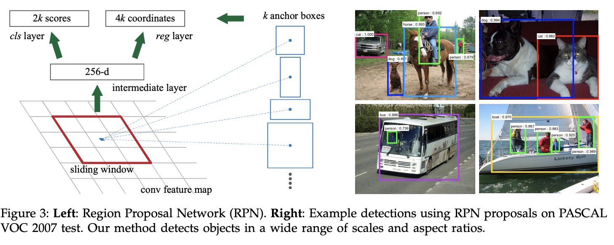

## Table of Contents

## What is a Region Proposal in the context of machine learning?

In machine learning, especially in the field of computer vision, a Region Proposal is a technique used to identify and isolate potential areas within an image that may contain objects of interest. This method is commonly used in object detection tasks, where the goal is to not only recognize what objects are present in an image but also to determine their locations. The process involves generating a set of bounding boxes, or regions, that are likely to enclose objects. These regions are then further analyzed by more complex algorithms to classify the contents within them.

Region Proposal algorithms, such as Selective Search or Region Proposal Network (RPN), help reduce the computational load by narrowing down the areas that need detailed examination. Instead of processing the entire image, which can be time-consuming and resource-intensive, these algorithms focus only on the proposed regions. This makes the overall object detection process more efficient. For example, in the RPN approach, a convolutional neural network is used to predict whether an anchor box contains an object and to refine the box's position, making the detection more accurate and faster.

## Why are Region Proposals important in object detection tasks?

Region Proposals are important in object detection tasks because they help make the process faster and more efficient. Instead of looking at every part of an image, which can take a lot of time and computer power, Region Proposals identify specific areas that might have objects. This means the computer only needs to focus on these smaller areas, making the whole task quicker. For example, if you're trying to find cars in a picture of a busy street, Region Proposals would suggest areas where cars are likely to be, so the computer doesn't have to check every single pixel.

Another reason Region Proposals are important is that they improve the accuracy of object detection. By narrowing down the areas to check, the computer can use more detailed and complex methods to figure out what's in those areas. This leads to fewer mistakes and better results. For instance, a Region Proposal might suggest a few boxes around what it thinks are people in a crowd, and then the computer can use more advanced techniques to confirm if those boxes really do contain people. This makes the detection more reliable and useful for real-world applications.

## What is the difference between Region Proposal Networks (RPN) and traditional methods like Selective Search?

Region Proposal Networks (RPN) and traditional methods like Selective Search are both used to find areas in an image that might contain objects, but they work in different ways. Selective Search looks at the image and groups pixels together based on things like color, texture, and size. It then combines these groups to form bigger regions that might contain objects. This method can be slow because it has to look at the whole image and do a lot of grouping and merging.

On the other hand, RPN uses a type of [artificial intelligence](/wiki/ai-artificial-intelligence) called a [neural network](/wiki/neural-network) to quickly find these regions. It looks at the image and suggests many small boxes, called anchor boxes, that might contain objects. Then, it uses the neural network to decide which of these boxes are good guesses and adjusts them to better fit the objects. This makes RPN much faster and more accurate than Selective Search because it can learn from examples and improve over time.

In summary, while Selective Search relies on traditional image processing techniques to find regions, RPN uses advanced [machine learning](/wiki/machine-learning) to do the same job more efficiently. This difference makes RPN a popular choice in modern object detection systems, where speed and accuracy are important.

## How does Selective Search generate region proposals?

Selective Search generates region proposals by starting with the smallest parts of an image, like individual pixels or small groups of similar pixels. It groups these small parts together based on how similar they are in terms of color, texture, size, and how close they are to each other. This process of grouping and merging continues, creating bigger and bigger regions. Each time it merges two regions, it checks if the new region is still likely to contain an object. This way, Selective Search builds up from small pieces to larger areas that might have objects in them.

Once Selective Search has created all these regions, it looks at how well each region fits the characteristics of an object. It uses a scoring system to decide which regions are the best candidates for containing objects. The regions with the highest scores are then chosen as the final region proposals. This method helps Selective Search find potential object areas without needing to look at every part of the image in detail, making it a useful but slower approach compared to more advanced methods like Region Proposal Networks.

## What are the advantages of using RPN over other region proposal methods?

RPN, or Region Proposal Network, has several advantages over other region proposal methods like Selective Search. One big advantage is speed. RPN uses a neural network to quickly look at an image and suggest many small boxes, called anchor boxes, that might contain objects. It then uses the same neural network to decide which of these boxes are good guesses and adjusts them to better fit the objects. This makes RPN much faster than methods like Selective Search, which have to look at the whole image and do a lot of grouping and merging.

Another advantage of RPN is its accuracy. Because RPN uses a neural network, it can learn from examples and get better over time. This means it can make better guesses about where objects might be in an image. RPN also uses the same neural network to both suggest regions and refine them, which makes the whole process more efficient and accurate. This is different from methods like Selective Search, which rely on traditional image processing techniques and can't improve in the same way.

Overall, RPN's use of neural networks makes it both faster and more accurate than other region proposal methods. This is why RPN is often used in modern object detection systems, where speed and accuracy are very important.

## Can you explain the architecture of a Region Proposal Network?

A Region Proposal Network (RPN) is a part of a bigger system that helps find objects in pictures. It works by looking at the whole image and suggesting small boxes, called anchor boxes, that might have objects in them. These anchor boxes come in different sizes and shapes to cover different kinds of objects. The RPN uses a special kind of computer program called a neural network to decide which of these anchor boxes are good guesses. It does this by looking at the image and figuring out if each anchor box has an object or not. If it thinks a box has an object, it also tries to make the box fit the object better by moving it a little and changing its size.

The neural network in an RPN has two main jobs. The first job is to look at each anchor box and say if it has an object or not. This is called objectness scoring. The second job is to adjust the position and size of the anchor boxes to make them fit the objects better. This is called bounding box regression. The RPN does these two jobs at the same time, which makes it very fast and efficient. By using the same neural network for both tasks, the RPN can quickly suggest good regions that might have objects, making the whole process of finding objects in pictures much faster and more accurate.

## How does CAG (Category-Agnostic Grouping) approach region proposal generation?

The Category-Agnostic Grouping (CAG) approach to region proposal generation focuses on finding regions in an image that might contain objects without caring about what kind of objects they are. CAG works by first dividing the image into many small parts, like tiny squares or rectangles. Then, it looks at how similar these parts are to each other, based on things like color, texture, and how close they are. By grouping these similar parts together, CAG creates bigger regions that might have objects. This method doesn't need to know what the objects are; it just tries to find any regions that look like they could contain something interesting.

Once CAG has grouped the parts together, it uses a scoring system to decide which of these regions are the best candidates for containing objects. The regions with the highest scores are chosen as the final region proposals. This approach helps CAG find potential object areas without needing detailed information about the objects themselves. By focusing on the similarity and grouping of image parts, CAG can be very effective at suggesting regions that might contain objects, making it a useful tool in object detection tasks.

## What is DeepMask and how does it contribute to region proposal?

DeepMask is a type of artificial intelligence that helps find objects in pictures. It works by looking at the whole image and figuring out which parts might have objects in them. DeepMask uses a special kind of computer program called a neural network to do this. The neural network looks at the image and creates a mask, which is like a see-through sheet that shows where the object might be. This mask helps DeepMask suggest areas, called region proposals, that could have objects.

DeepMask is good at finding objects because it can learn from examples. When it looks at a lot of pictures with objects, it gets better at figuring out where objects might be. This makes DeepMask very useful for tasks like object detection, where you need to find and identify objects in pictures. By using DeepMask, computers can quickly and accurately suggest regions that might contain objects, making the whole process of finding objects much easier and more efficient.

## How do EdgeBoxes generate region proposals and what makes them unique?

EdgeBoxes generate region proposals by looking at the edges in an image. Edges are the lines where different parts of the image meet, like where a car's outline meets the road. EdgeBoxes use a special way to find these edges and then group them into boxes that might contain objects. It does this by drawing many small boxes all over the image and checking how many edges are inside each box. If a box has a lot of edges, it might mean there's an object there, so EdgeBoxes will suggest that box as a region proposal.

What makes EdgeBoxes unique is that they focus on edges rather than other things like color or texture. This means EdgeBoxes can find objects even if they're different colors or patterns. Also, EdgeBoxes can be very fast because they only need to look at the edges, which makes the whole process of finding objects quicker. This makes EdgeBoxes a good choice for tasks where speed is important, like in real-time object detection systems.

## What are the performance metrics typically used to evaluate region proposal methods?

When people want to know how well a region proposal method works, they look at a few important numbers. One of these numbers is called the Average Recall (AR). AR tells us how many of the objects in the picture the method can find. If AR is high, it means the method is good at finding most of the objects. Another number is the Average Precision (AP), which shows how accurate the method is. If AP is high, it means the method not only finds objects but also does it with few mistakes. People also look at the speed of the method, measured in frames per second (FPS). A high FPS means the method can work quickly, which is important for things like video games or security cameras.

Another important thing to check is how many region proposals the method makes. If it makes too many, it might slow down the whole process because the computer has to look at too many areas. But if it makes too few, it might miss some objects. So, people try to find a good balance. They also check something called Intersection over Union (IoU), which is a way to see how well the suggested boxes fit around the objects. If IoU is high, it means the boxes fit the objects well. All these numbers help people decide which region proposal method is the best for their needs.

## How can region proposal methods be optimized for real-time applications?

Region proposal methods can be optimized for real-time applications by focusing on speed and efficiency. One way to do this is by using faster algorithms like Region Proposal Networks (RPN) instead of slower methods like Selective Search. RPN uses a neural network to quickly suggest areas that might have objects, which makes it much faster. Another way to speed things up is by reducing the number of region proposals. If the method suggests too many areas, it can slow down the whole process because the computer has to look at all of them. By finding a good balance, the method can work quickly without missing too many objects.

Another important way to optimize region proposal methods for real-time use is by using hardware that can handle a lot of work at once, like GPUs. These can process many parts of an image at the same time, making the whole process much faster. Also, techniques like pruning and quantization can be used to make the neural networks smaller and faster. Pruning removes parts of the network that aren't very important, and quantization makes the numbers the network uses simpler, which speeds things up. By using these methods, region proposal techniques can work well in real-time applications where speed is very important.

## What are the latest advancements in region proposal techniques and their impact on object detection?

The latest advancements in region proposal techniques have significantly improved the speed and accuracy of object detection. One of the key developments is the use of more advanced neural networks, like the Transformer architecture, which can better understand the context of an image. These networks help generate more accurate region proposals by learning from a large number of examples. Another advancement is the use of techniques like anchor-free methods, which do not rely on predefined anchor boxes. Instead, they directly predict the locations of objects, making the process more efficient and reducing the need for complex post-processing.

These advancements have a big impact on object detection. For example, methods like the CenterNet use a single network to both propose regions and detect objects, which makes the whole process faster. This is important for real-time applications, like self-driving cars or security cameras, where quick and accurate detection is crucial. Additionally, these new techniques often require less computational power, which means they can run on smaller devices like smartphones. This makes object detection more accessible and useful in everyday life.

## References & Further Reading

[1]: Girshick, R. (2015). ["Fast R-CNN."](https://ieeexplore.ieee.org/document/7410526) arXiv preprint arXiv:1504.08083.

[2]: Ren, S., He, K., Girshick, R., & Sun, J. (2015). ["Faster R-CNN: Towards Real-Time Object Detection with Region Proposal Networks."](https://ieeexplore.ieee.org/document/7485869) arXiv preprint arXiv:1506.01497.

[3]: Uijlings, J. R., van de Sande, K. E., Gevers, T., & Smeulders, A. W. (2013). ["Selective Search for Object Recognition."](https://link.springer.com/article/10.1007/s11263-013-0620-5) International Journal of Computer Vision, 104(2), 154-171.

[4]: Pinheiro, P. O., Collobert, R., & Dollar, P. (2015). ["Learning to Segment Object Candidates."](https://arxiv.org/abs/1506.06204) arXiv preprint arXiv:1506.06204.

[5]: Zitnick, C. L., & Dollar, P. (2014). ["Edge Boxes: Locating Object Proposals from Edges."](https://link.springer.com/chapter/10.1007/978-3-319-10602-1_26) European Conference on Computer Vision. Springer, Cham.

[6]: Law, H., & Deng, J. (2018). ["CornerNet: Detecting Objects as Paired Keypoints."](https://openaccess.thecvf.com/content_ECCV_2018/papers/Hei_Law_CornerNet_Detecting_Objects_ECCV_2018_paper.pdf) arXiv preprint arXiv:1808.01244.