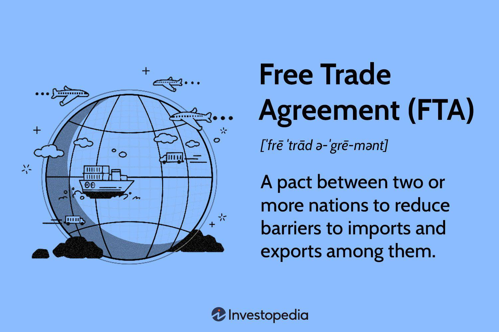

The Regional Comprehensive Economic Partnership (RCEP) represents a substantial free trade agreement comprising 15 nations from the Asia-Pacific region. It forms one of the largest trading blocs globally, accounting for approximately one-third of the world's Gross Domestic Product (GDP), illustrating its extensive economic impact. The fundamental objective of RCEP is to enhance trade relationships, stimulate economic growth, and shape trading regulations within the Asia-Pacific region. This agreement marks a significant milestone, having been signed on November 15, 2020, including major economies such as China, Japan, and South Korea.

The scope of RCEP extends to fostering an environment conducive to increased trade activities, which is crucial for the participating countries. By facilitating a reduction in trade barriers and harmonizing various economic policies, RCEP seeks to streamline and boost the economic exchanges among member countries. This initiative is particularly pertinent as it occurs during a time when global economic activities are recovering and redefining post the COVID-19 pandemic disruptions.



In the context of technological advancements, algorithmic trading, also known as algo trading or automated trading, is transforming the financial technology (FinTech) landscape. Algo trading employs computer algorithms to automatically make trading decisions, execute orders, and manage portfolios at speeds and frequencies that are impossible for human traders to match. This method has brought about new efficiencies and opportunities in markets, particularly those influenced by comprehensive trading agreements like RCEP. The integration of algo trading within these markets promises to amplify the advantages offered by such agreements, leveraging automation and data analytics to navigate and capitalize on the expanded trade networks efficiently.

RCEP sets a precedent in modern trade agreements by highlighting the evolving complexity and interdependence of global economies. As it takes effect, the world observes its potential to redefine economic interactions in the Asia-Pacific, and by extension, globally. The impact of RCEP, coupled with digital innovations such as algorithmic trading, is a testament to the dynamic nature of contemporary international trade, offering a glimpse into how economies might increasingly operate with higher efficiency and integrated technology.

## Table of Contents

## Overview of RCEP

The Regional Comprehensive Economic Partnership (RCEP) is a comprehensive free trade agreement that brings together 15 Asia-Pacific nations, comprising the 10 member countries of the Association of Southeast Asian Nations (ASEAN) along with influential economies such as China, Japan, South Korea, Australia, and New Zealand. This strategic agreement, heavily backed by China, aims to enhance economic ties within the Asia-Pacific region, thus forming one of the world’s largest trading blocs.

Central to RCEP’s framework is the reduction of tariffs among its member countries, which are designed to promote increased trade by lowering the costs of goods and services exchanged between these nations. By facilitating smoother flow of goods, RCEP aspires to boost economic cooperation and connectivity across the region. Moreover, beyond mere tariff reductions, RCEP establishes rules on investment, competition, and intellectual property, thereby creating a structured environment for businesses to operate more efficiently and fairly across borders.

However, it is noteworthy that the RCEP agreement lacks stringent labor and environmental standards, which has drawn criticism from various quarters. Despite this shortcoming, the establishment of RCEP is particularly beneficial for China, fortifying its economic influence in the Asia-Pacific region. As China seeks to extend its reach and solidify its role as a dominant economic power, the RCEP agreement is considered a strategic victory, potentially allowing it to shape regional trade practices more assertively.

Overall, RCEP seeks to create a cohesive economic landscape in the Asia-Pacific by leveraging trade liberalization principles while balancing the diverse economic interests of its member countries.

## The Role of Algo Trading in RCEP Markets

Algorithmic trading, also known as algo trading, is transforming financial markets by using computer programs to execute trading orders at speeds and frequencies impossible for a human trader. This automation optimizes both speed and accuracy, thereby maximizing profitability and efficiency. It involves complex algorithms considering a variety of market variables such as price, timing, and [volume](/wiki/volume-trading-strategy) to make trade decisions.

In the context of the Regional Comprehensive Economic Partnership (RCEP), algo trading offers significant opportunities due to the integration of markets and reduction in trade barriers within the bloc. The agreement encompasses 15 Asia-Pacific nations, creating a substantial trading community that algo trading mechanisms can exploit. By effectively processing a large volume of market data from these countries, firms can benefit from cross-border trade efficiencies established by RCEP.

The advancement in technology further equips algo trading systems with the ability to navigate these integrated markets. For instance, high-frequency trading ([HFT](/wiki/high-frequency-trading-strategies)), a subset of algo trading, takes advantage of computational power and high-speed data feeds to execute large volumes of trades at sub-second intervals. If a pattern emerges where one asset in an RCEP country consistently impacts another elsewhere within the bloc, an algorithm can be programmed to identify and exploit this for [arbitrage](/wiki/arbitrage) opportunities.

Moreover, algo trading can be enhanced through [machine learning](/wiki/machine-learning) techniques. By implementing models capable of evolving and improving from historical trade data, firms can optimize their entry and [exit](/wiki/exit-strategy) strategies. Consider this Python snippet that illustrates the basic framework for a trading strategy leveraging machine learning:

```python
from sklearn.ensemble import RandomForestClassifier
import numpy as np

# Sample feature data (historical market data)
X = np.array([[1.2, 0.5], [1.8, 0.55], [2.0, 0.6], [2.5, 0.65]])
# Sample target data (1 for buy, 0 for sell)
y = np.array([1, 0, 1, 0])

# Initialize the model
model = RandomForestClassifier()

# Fit the model
model.fit(X, y)

# Predict the trading action for new market scenarios
new_data = np.array([[2.1, 0.58]])
action = model.predict(new_data)

print("Trading Action:", "Buy" if action == 1 else "Sell")
```

Through such models, traders within RCEP-marketed spheres can leverage real-time analysis and predictive analytics to make informed decisions on transactions, ultimately leading to increased trading volumes and enhanced market [liquidity](/wiki/liquidity-risk-premium). Thus, algo trading does not only optimize current trading operations but also sets the foundation for the future landscape, potentially incorporating more sophisticated AI methodologies as the RCEP continues to evolve.

## Impact of RCEP on Global Trade

The Regional Comprehensive Economic Partnership (RCEP) is poised to exert a significant influence on global trade, particularly within the Asia-Pacific region. One of the most notable impacts of RCEP is its potential to streamline supply chains and lower trade costs among member countries. By harmonizing customs procedures and eliminating tariffs on a wide range of goods, RCEP facilitates easier and more cost-effective movement of products across borders. This efficiency can lead to reduced production costs and increased competitiveness for businesses within the trading bloc.

The COVID-19 pandemic has disrupted global trade and economic activities, making the timing of RCEP's implementation crucial for economic recovery efforts. As countries within the Asia-Pacific region work towards economic revitalization, RCEP serves as a strategic mechanism to enhance trade flows and stimulate growth. The agreement aims to boost intra-regional trade by removing barriers that previously hindered the seamless exchange of goods and services. This increased connectivity can support a more resilient supply chain infrastructure, allowing member economies to recover and expand more effectively.

RCEP's design focuses on addressing trade-related issues while deliberately sidestepping more contentious topics, such as labor rights and environmental standards, which often complicate trade negotiations. By concentrating on core elements like tariffs, the agreement provides a platform where member countries can achieve mutual economic gains without being bogged down by potentially divisive non-economic factors. This pragmatic approach helps maintain focus on enhancing trade and economic collaboration within the region.

In summary, RCEP is anticipated to play a transformative role in global trade by facilitating efficient supply chains, minimizing trade costs, and enhancing economic recovery within the Asia-Pacific. Its focus on tariff reduction and trade facilitation provides a streamlined pathway for strengthening regional economic ties, ultimately influencing broader global trade dynamics.

## Challenges and Criticisms of RCEP

The Regional Comprehensive Economic Partnership (RCEP), while significant in scale and scope, faces considerable challenges and criticisms that could impede its effectiveness and long-term success. One primary concern is the agreement's insufficient provisions regarding labor and environmental standards. Unlike other major trade agreements that emphasize high-standard regulations in these domains, RCEP lacks stringent commitments, which may hinder sustainable and equitable growth among its member countries. Economists argue that without robust labor protections, workers in less developed countries may not benefit equitably from increased trade activities, potentially exacerbating existing inequalities.

Moreover, the environmental provisions within RCEP are minimal, raising concerns about the long-term environmental sustainability of the economic growth it seeks to foster. The absence of binding environmental commitments could lead to increased pollution levels and resource depletion, offsetting economic benefits with environmental costs.

Another significant criticism directed at RCEP is its perceived role in reinforcing China's economic dominance in the Asia-Pacific region. As one of the leading economies within the partnership, China stands to gain considerably, leveraging the agreement to expand its trade influence. This dynamic has sparked worries among smaller economies within the bloc, which fear being overshadowed by China's economic power. Such concerns underline the risk of an imbalanced trading relationship, where gains are disproportionately skewed in favor of the larger economies at the expense of the smaller, developing ones.

In conclusion, while RCEP presents certain economic opportunities, the criticisms regarding labor and environmental protections, coupled with fears of reinforcing economic disparities, highlight the challenges that need to be addressed to ensure its success and equitable development among all member states.

## Future Prospects

The Regional Comprehensive Economic Partnership (RCEP) is positioning itself as a pivotal framework for future regional economic negotiations, with the potential for significant expansions, such as the inclusion of India. India's participation could add substantial economic heft to the partnership, given its vast market and strategic locations, thus redefining the economic landscape of RCEP. This potential expansion highlights RCEP’s appeal as a flexible and adaptive agreement capable of accommodating major economies showing renewed interest in Asian trade dynamics.

As the partnership evolves, there is considerable potential for RCEP to incorporate stringent labor rights and environmental standards. The original framework has faced criticism for its absence of these provisions, which are vital for sustainable and equitable economic growth. As member countries increasingly prioritize sustainable development goals, there is an expectation that RCEP could integrate these standards in future negotiations, aligning the agreement with global trade practices that emphasize ethical and sustainable production.

Furthermore, RCEP sets a precedent in regional cooperation that can influence global economic policies, particularly concerning digital trade and [artificial intelligence](/wiki/ai-artificial-intelligence) (AI). As trade progressively shifts toward digital platforms, RCEP could lead in establishing comprehensive rules for digital trade, protecting data privacy, and fostering innovation in AI. This evolution can streamline digital transactions and encourage technological advancements, ultimately boosting economic growth within member countries. By setting such standards, RCEP can serve as a model for other regional trade agreements aiming to integrate digital and AI components into their frameworks.

Overall, RCEP’s trajectory shows promising signs of adaptation and expansion, pointing towards a robust future that not only strengthens regional economic ties but also contributes to defining the future landscape of global trade policies.

## Conclusion

The Regional Comprehensive Economic Partnership (RCEP) is poised to be a transformative force in regional economic coexistence, with the potential to reshape trade patterns within the vast Asia-Pacific vicinity. By bringing together 15 nations, RCEP fosters a formidable economic alliance, compelling both policy shifts and market adaptations within member countries. The broader reach of the agreement, constituting approximately one-third of the global GDP, underscores its significance on the world stage.

The proliferation of [algorithmic trading](/wiki/algorithmic-trading) further enhances the utility and efficiency of trading operations across this vast economic bloc. This automated trading technique not only accelerates the trading process but also enhances accuracy and optimizes cost-effectiveness. By leveraging data analytics and real-time market insights, businesses within RCEP can hone their strategies, leading to more informed decision-making and improved operational outcomes. Python-based libraries such as `pandas` and `numpy` can be invaluable in creating algorithms that analyze trading data and execute trades based on predefined criteria.

```python
import pandas as pd
import numpy as np

# Sample algorithm for simple moving average crossover strategy
def simple_moving_average_strategy(prices, short_window, long_window):
    signals = pd.DataFrame(index=prices.index)
    signals['price'] = prices['Close'] 
    signals['short_mavg'] = prices['Close'].rolling(window=short_window, min_periods=1).mean()
    signals['long_mavg'] = prices['Close'].rolling(window=long_window, min_periods=1).mean()
    signals['signal'] = 0.0
    signals['signal'][short_window:] = np.where(signals['short_mavg'][short_window:] > signals['long_mavg'][short_window:], 1.0, 0.0)
    signals['positions'] = signals['signal'].diff()
    return signals

# Example usage
prices = pd.DataFrame({'Close': [101, 102, 103, 99, 100, 105, 107, 110]})
signals = simple_moving_average_strategy(prices, 3, 5)
print(signals)
```

Globally, the outcomes of RCEP have the capacity to serve as a template for other regions contemplating similar integrative economic attempts. By lowering trade barriers and establishing unified economic protocols among diverse economies, RCEP's model may stimulate similar agreements worldwide. However, for RCEP to achieve comprehensive success, it must concurrently address areas such as labor and environmental standards, ensuring that economic growth is both inclusive and sustainable. As the agreement matures, addressing these challenges will be crucial to its longevity and influence in global trade policy-making.

## References & Further Reading

[1]: Petri, P. A., & Plummer, M. G. (2020). ["East Asia Decouples from the United States: Trade War, COVID-19, and East Asia's New Trade Blocs"](https://www.semanticscholar.org/paper/East-Asia-Decouples-from-the-United-States%3A-Trade-Petri-Plummer/7205f9a2443679f336da8ccd0799ed1096655eb1). Peterson Institute for International Economics.

[2]: [ASEAN Secretariat. (2020). "Overview of RCEP Agreement".](https://www.allbrightlaw.com/EN/10475/1956afe635638861.aspx)

[3]: ["The Regional Comprehensive Economic Partnership: Impacts, Challenges, and Opportunities"](https://www.eria.org/publications/regional-comprehensive-economic-partnership-implications-challenges-and-future-growth-of-east-asia-and-asean/) by the French Institute of International Relations (Ifri).

[4]: López de Prado, M. (2018). ["Advances in Financial Machine Learning."](https://www.amazon.com/Advances-Financial-Machine-Learning-Marcos/dp/1119482089) Wiley.

[5]: Chan, E. P. (2008). ["Quantitative Trading: How to Build Your Own Algorithmic Trading Business."](https://github.com/ftvision/quant_trading_echan_book) Wiley.