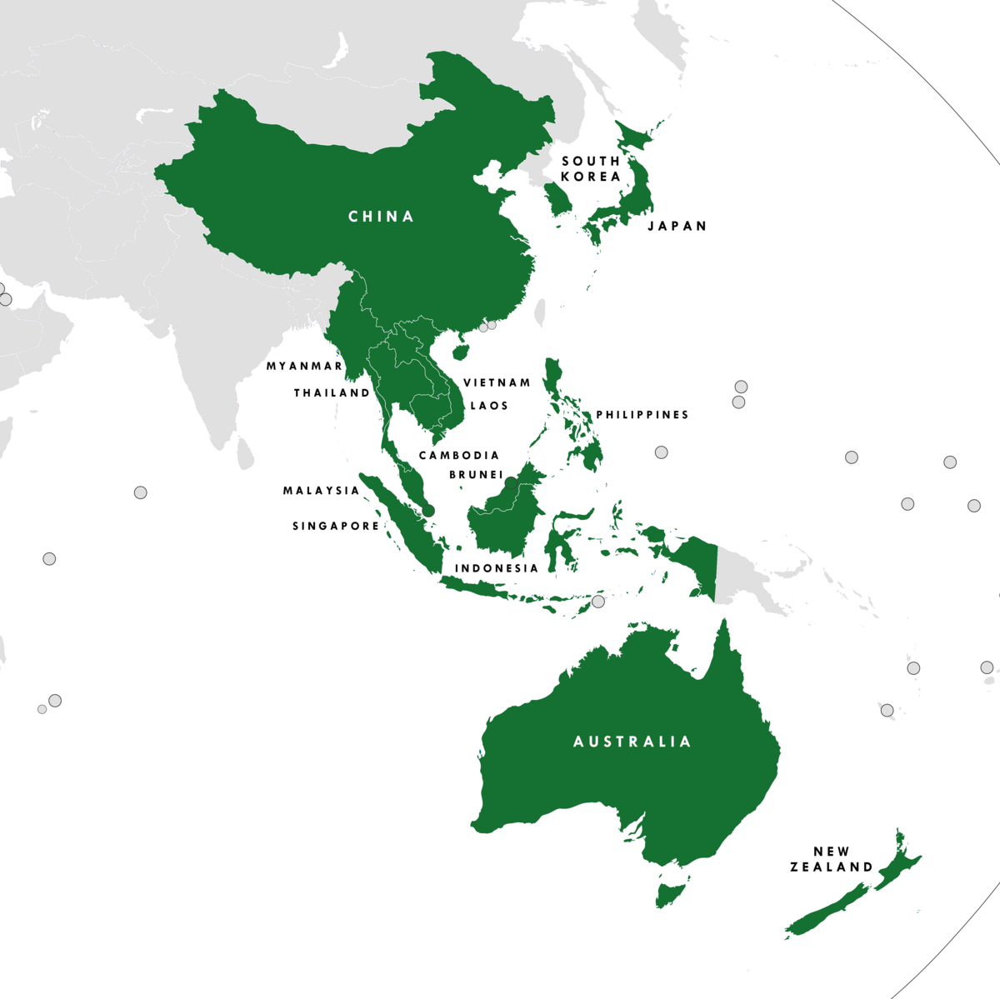

## Table of Contents

## What is the Regional Comprehensive Economic Partnership (RCEP)?

The Regional Comprehensive Economic Partnership (RCEP) is a big trade agreement between 15 countries in the Asia-Pacific region. These countries are Australia, Brunei, Cambodia, China, Indonesia, Japan, South Korea, Laos, Malaysia, Myanmar, New Zealand, the Philippines, Singapore, Thailand, and Vietnam. The agreement was signed in November 2020 and it aims to make trade easier among these countries by lowering tariffs, which are taxes on goods, and by making rules simpler for businesses.

RCEP helps these countries work together better by making it easier to trade goods and services. It also helps businesses from these countries to invest in each other's markets. This can lead to more jobs and economic growth. The agreement covers a big part of the world's population and economy, so it's very important for global trade.

## Which countries are members of the RCEP?

The Regional Comprehensive Economic Partnership (RCEP) includes 15 countries from the Asia-Pacific region. These countries are Australia, Brunei, Cambodia, China, Indonesia, Japan, South Korea, Laos, Malaysia, Myanmar, New Zealand, the Philippines, Singapore, Thailand, and Vietnam.

RCEP helps these countries trade more easily with each other. By lowering taxes on goods and making rules simpler, businesses can work together better. This can lead to more jobs and help the economies of these countries grow.

## When was the RCEP agreement signed?

The RCEP agreement was signed in November 2020. It is a big trade deal between 15 countries in the Asia-Pacific region. These countries are Australia, Brunei, Cambodia, China, Indonesia, Japan, South Korea, Laos, Malaysia, Myanmar, New Zealand, the Philippines, Singapore, Thailand, and Vietnam.

The agreement helps these countries trade more easily with each other. It does this by lowering taxes on goods and making rules simpler for businesses. This can lead to more jobs and help the economies of these countries grow.

## What are the main objectives of the RCEP?

The main goal of the Regional Comprehensive Economic Partnership (RCEP) is to make trade easier among the 15 countries in the Asia-Pacific region. It does this by lowering tariffs, which are taxes on goods, and by making the rules for trading simpler. This helps businesses from these countries to sell their products to each other more easily. When businesses can trade more easily, it can lead to more jobs and help the economies of these countries grow.

Another important objective of RCEP is to help these countries work together better. By having a common set of rules, it becomes easier for businesses to invest in each other's markets. This can lead to more economic growth and development across the region. RCEP covers a big part of the world's population and economy, so it's very important for global trade.

## How does the RCEP differ from other trade agreements like the Trans-Pacific Partnership (TPP)?

The Regional Comprehensive Economic Partnership (RCEP) and the Trans-Pacific Partnership (TPP) are both big trade agreements, but they have some key differences. RCEP includes 15 countries from the Asia-Pacific region, including China, while the TPP, now known as the Comprehensive and Progressive Agreement for Trans-Pacific Partnership (CPTPP), includes 11 countries but does not include China. RCEP focuses on making trade easier by lowering tariffs and simplifying rules, but it does not go as far as the TPP in setting high standards for labor, environment, and intellectual property rights.

Another difference is that RCEP is more about helping countries in the region work together better. It aims to create a common set of rules that make it easier for businesses to trade and invest across these countries. On the other hand, the TPP was designed to set new, higher standards for trade that go beyond just lowering tariffs. It includes strong rules on things like labor rights, environmental protection, and intellectual property, which are not as detailed in RCEP. So, while RCEP is more about making trade easier within the region, the TPP aims to set a higher bar for global trade standards.

## What are the key economic benefits that member countries expect from the RCEP?

The key economic benefits that member countries expect from the Regional Comprehensive Economic Partnership (RCEP) include easier trade and more jobs. By lowering tariffs, which are taxes on goods, it becomes cheaper for businesses in these countries to buy and sell products to each other. This can lead to more trade and help businesses grow. When businesses grow, they often need more workers, which can create new jobs and help the economy.

Another important benefit is that RCEP helps businesses invest in each other's markets more easily. With simpler rules, companies can set up operations in other member countries without facing too many hurdles. This can lead to more investment and economic growth across the region. Since RCEP covers a big part of the world's population and economy, it can also make these countries more important in global trade, which can bring more money and opportunities to their economies.

## How does the RCEP impact global trade dynamics?

The Regional Comprehensive Economic Partnership (RCEP) changes how countries trade with each other by making it easier for the 15 member countries in the Asia-Pacific region to do business together. By lowering taxes on goods and making rules simpler, RCEP helps businesses from these countries sell their products to each other more easily. This can lead to more trade and more jobs, which helps the economies of these countries grow. Since RCEP covers a big part of the world's population and economy, it can make these countries more important in global trade.

RCEP also changes how other countries around the world trade. Because RCEP makes it easier for its member countries to trade with each other, other countries might want to join in or make their own trade deals to stay competitive. This can lead to more trade agreements around the world, which can change how global trade works. Overall, RCEP can make the Asia-Pacific region a bigger player in global trade, which can affect how countries everywhere do business.

## What are the potential challenges and criticisms of the RCEP?

One of the main challenges of the RCEP is making sure all the different countries follow the rules. Each country has its own way of doing things, so it can be hard to get everyone to agree on the same rules for trade. Another challenge is that some countries might not benefit as much as others. For example, smaller countries might find it hard to compete with bigger countries like China and Japan. This can lead to some countries feeling left out or not getting as many benefits from the agreement.

There are also some criticisms of the RCEP. Some people worry that it might hurt workers in certain countries. They think that businesses might move to countries where they can pay workers less, which could lead to job losses in other countries. Another criticism is that RCEP does not have strong rules to protect the environment or workers' rights. Some people think that trade agreements should include these kinds of rules to make sure that trade helps everyone and does not harm the planet.

## How does the RCEP address issues like intellectual property rights and e-commerce?

The RCEP does not go into as much detail about intellectual property rights as some other trade agreements like the TPP. It has some basic rules to protect things like patents, trademarks, and copyrights. These rules help make sure that businesses in the member countries can protect their ideas and products. But, the rules are not as strict or detailed as in other agreements. This means that while RCEP helps with some protection, it might not be enough for businesses that need strong intellectual property rights.

When it comes to e-commerce, RCEP has some rules to make it easier for businesses to sell things online across the member countries. It helps by making sure that there are no extra taxes on digital products and by making it easier to send things across borders. But, like with intellectual property, the rules are not as detailed as in other agreements. This means that while RCEP helps with some parts of e-commerce, it might not cover everything that businesses need to grow their online sales.

## What mechanisms does the RCEP use to resolve disputes among member countries?

The RCEP has a way to help member countries solve problems they might have with each other. If two countries disagree about something in the agreement, they can talk to each other first to try to fix it. If talking doesn't work, they can ask for help from a group of people from other member countries. This group will listen to both sides and help them find a solution.

If the group can't help them agree, the countries can take the problem to a special court set up just for RCEP. This court will look at the problem and make a decision. Both countries have to follow what the court decides. This way, the RCEP makes sure that disagreements don't stop the countries from working together.

## How has the RCEP influenced regional supply chains and investment flows?

The RCEP has made it easier for businesses in the 15 member countries to work together and create regional supply chains. By lowering taxes on goods and making rules simpler, it's cheaper and easier for companies to move parts and products across these countries. This helps businesses set up factories and production lines in different places, which can make their supply chains more efficient. For example, a company might make parts in one country and assemble the final product in another, taking advantage of lower costs and better resources in each place.

RCEP also encourages more investment to flow between the member countries. With simpler rules, businesses find it easier to invest in other member countries. This can lead to more factories, offices, and other business projects being set up across the region. When businesses invest more, it can create new jobs and help the economies of these countries grow. Overall, RCEP helps make the Asia-Pacific region a more connected and economically strong area.

## What are the future prospects and potential expansions of the RCEP?

The future of the Regional Comprehensive Economic Partnership (RCEP) looks promising as it continues to help the 15 member countries trade more easily with each other. As businesses get used to the new rules and lower taxes, they might find more ways to work together and grow. This could lead to even more trade and investment in the region. Countries might also start to work on other areas like services and digital trade, which could make RCEP even more important for the global economy.

There is also a chance that RCEP could grow to include more countries. Some countries in the Asia-Pacific region that are not yet members might want to join to benefit from easier trade and investment. If more countries join, RCEP could become an even bigger part of global trade. But, adding new members would need everyone to agree on the rules, which can be hard. Still, if RCEP keeps growing and helping its members, it could play a big role in shaping how countries trade with each other in the future.

## References & Further Reading

[1]: Petri, P. A., & Plummer, M. G. (2020). ["East Asia Decouples from the United States: Trade War, COVID-19, and East Asia's New Trade Blocs"](https://www.semanticscholar.org/paper/East-Asia-Decouples-from-the-United-States%3A-Trade-Petri-Plummer/7205f9a2443679f336da8ccd0799ed1096655eb1). Peterson Institute for International Economics.

[2]: [ASEAN Secretariat. (2020). "Overview of RCEP Agreement".](https://www.allbrightlaw.com/EN/10475/1956afe635638861.aspx)

[3]: ["The Regional Comprehensive Economic Partnership: Impacts, Challenges, and Opportunities"](https://www.eria.org/publications/regional-comprehensive-economic-partnership-implications-challenges-and-future-growth-of-east-asia-and-asean/) by the French Institute of International Relations (Ifri).

[4]: López de Prado, M. (2018). ["Advances in Financial Machine Learning."](https://www.amazon.com/Advances-Financial-Machine-Learning-Marcos/dp/1119482089) Wiley.

[5]: Chan, E. P. (2008). ["Quantitative Trading: How to Build Your Own Algorithmic Trading Business."](https://github.com/ftvision/quant_trading_echan_book) Wiley.