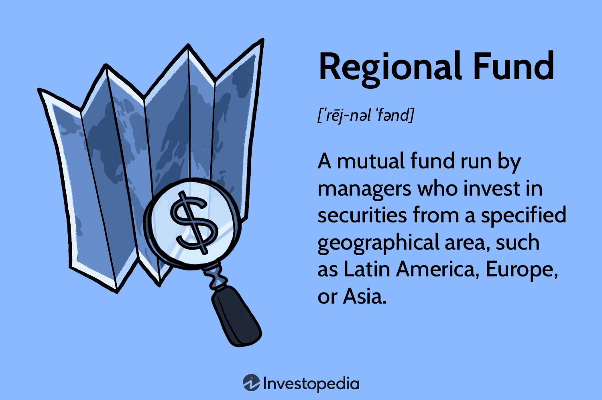

In today's complex financial landscape, regional fund financial management and investment fund algorithmic trading have emerged as pivotal elements in shaping investment strategies and fostering financial growth. Regional funds, which concentrate on assets within specific geographic areas, provide investors with unique opportunities to benefit from localized economic developments. Simultaneously, algorithmic trading, or algo trading, employs automated systems to execute trades at high speeds based on predefined criteria, thereby enhancing efficiency and precision in market operations.

This article seeks to explore the operational dynamics, benefits, and challenges presented by regional funds and algorithmic trading within the investment management sector. By examining these components, we aim to illustrate how they are revolutionizing investment strategies on a global scale. The focus will be on how these tools are utilized to navigate diverse economic environments and market conditions, offering a strategic advantage to investors and financial managers alike.



Furthermore, this exploration will emphasize the interplay between technological advancements and these financial tools, highlighting how innovations such as artificial intelligence and machine learning are reshaping future investment strategies. This article intends to offer a comprehensive perspective that not only elucidates the current state of regional fund management and algo trading but also provides insights into their potential for future financial landscapes. These insights are geared towards equipping both individual investors and financial managers with the knowledge needed to harness these tools effectively for optimized investment outcomes.

## Table of Contents

## Understanding Regional Funds

Regional funds are specialized investment vehicles that concentrate on a particular geographic area, pooling assets to target securities within regions such as Asia, Europe, or Latin America. These funds provide a structured approach for investors seeking exposure to specific economic zones, allowing them to benefit from regional growth dynamics and vibrant sectors.

One of the primary advantages of regional funds is risk diversification. By investing in various companies and industries within a single region, investors can mitigate the specific risks associated with individual securities. This geographic diversification helps cushion the portfolio against country-specific economic downturns while positioning it to capitalize on local economic booms.

Additionally, regional funds offer access to sectors and companies that might be less accessible through domestic investment vehicles. For instance, an investor interested in the technology boom in Asia or the renewable energy sector in Europe can leverage regional funds to gain targeted exposure to these markets.

Professional management is another key benefit of regional funds. Fund managers typically possess in-depth knowledge of the local economic landscape and regulations, enabling them to make informed investment decisions. This expertise is critical in navigating the complexities of regional markets, where political, economic, and social factors can heavily influence investment outcomes.

Management styles within regional funds can be broadly categorized as active or passive. Active management involves a hands-on approach where fund managers actively select securities and adjust the portfolio to outperform a benchmark index. This style can potentially lead to higher returns but also comes with increased management fees. Conversely, passive management seeks to replicate the performance of a regional index, offering lower fees and consistent returns closely tied to the market's overall performance.

Despite their benefits, regional funds face notable challenges. Understanding and accurately assessing the regional economic climate is crucial, yet this can be difficult due to varying degrees of market maturity and transparency. Moreover, regional funds often incur higher operational costs compared to domestic funds, driven by factors such as currency conversion, regulatory compliance, and geopolitical risks.

Investors must weigh these factors carefully when considering regional funds. With the right strategy, these funds can serve as valuable components of a diversified investment portfolio, offering both growth potential and risk management by leveraging the economic prospects of specific geographic regions.

## The Rise of Algorithmic Trading in Investment Funds

Algorithmic trading, often referred to as algo trading, involves the utilization of automated systems that execute trades based on predefined criteria. This approach leverages technological advancements to facilitate a more efficient trading process by employing algorithms that can operate at speeds and efficiencies impossible for human traders alone.

The principal advantage of [algorithmic trading](/wiki/algorithmic-trading) is its capacity to significantly enhance trading efficiency. By automating the trading process, algorithms can execute transactions in microseconds, providing a distinct speed advantage crucial in high-frequency trading environments. Such rapid execution enables investors to capitalize on market opportunities that may only exist for a brief moment, thus gaining competitive edges.

Another significant benefit of algorithmic trading lies in its ability to reduce transaction costs. Traditional trading often involves intermediaries and manual processes that incur higher operational costs. Automated systems minimize these by streamlining transactions and reducing the need for human intervention, which, in turn, lowers direct costs and potential for human error, leading to improved accuracy.

Algorithmic trading also enables the processing of vast amounts of data at unprecedented speeds. By analyzing large datasets, algorithms can identify patterns and trends in the markets much more efficiently than human traders. This capability allows funds to base their trades on comprehensive market analysis, leading to more informed and potentially profitable decisions.

Various financial entities, including hedge funds, mutual funds, and institutional investors, have increasingly adopted algorithmic trading for its precision and rapid execution of complex trades. These organizations employ several algorithmic strategies to optimize their trades. Key strategies include:

1. **Trend Following**: This strategy involves algorithms programmed to identify and capitalize on trending market conditions. These algorithms can detect when a security's price is consistently moving in a particular direction, allowing them to execute trades that exploit this trend until it reverses.

2. **Arbitrage**: Algorithms can identify price discrepancies of the same asset in different markets or forms. By executing trades in both markets simultaneously, they effectively lock in a profit with minimal risk exposure.

3. **Market Making**: This involves placing buy and sell orders for a variety of securities, thus capturing the spread between the bid and ask price. Algorithms in this strategy work to ensure liquidity in the marketplace by continuously placing limit orders.

Despite its myriad advantages, algorithmic trading does not come without challenges. System failures can result in significant financial losses if orders are executed incorrectly due to glitches. Furthermore, algo trading systems are susceptible to issues like flash crashes, where prices plummet rapidly within seconds due to a cascade of automated sell orders. Such events necessitate robust risk management policies to mitigate potential losses and ensure system reliability.

To counter these challenges, financial managers often implement circuit breakers and stress testing to maintain stability and minimize risks. Additionally, continuous monitoring and updating of algorithmic systems are crucial to ensure they adapt efficiently to changing market conditions and regulatory requirements.

In summary, algorithmic trading is a powerful tool within investment funds, offering significant enhancements in trading efficiency, data processing, and cost reduction. However, the necessity for diligent system management and risk mitigation strategies cannot be understated, given the potential for systemic challenges inherent in high-frequency trading environments.

## Integration of Regional Funds and Algo Trading

Combining regional fund management with algorithmic trading offers several tactical and strategic benefits. Financial managers utilize algorithmic trading, or algo trading, to capitalize on regional economic trends with greater efficiency. By integrating sophisticated algorithms, funds can execute trades rapidly and accurately to exploit specific economic signals unique to certain geographic areas. This integration allows managers to adapt to economic changes promptly, reevaluate asset allocations, and optimize returns by anticipating regional market shifts.

Successful case studies illustrate the real-world applications of this integration. For instance, a fund concentrating on Asian markets may employ algorithmic strategies to navigate the fast-paced, volatile landscape of emerging economies like China and India. By analyzing large datasets of economic indicators, trade volumes, and news events, these algorithms can identify optimal entry and [exit](/wiki/exit-strategy) points for investments, helping to mitigate risks and capitalize on opportunities before they become apparent to traditional fund management.

Technological advancements, particularly in [artificial intelligence](/wiki/ai-artificial-intelligence) (AI) and [machine learning](/wiki/machine-learning), play a crucial role in enhancing this integration. AI-driven models are capable of learning from vast amounts of data, recognizing complex patterns, and making predictions with an accuracy that surpasses conventional analytical methods. Machine learning algorithms continually improve their decision-making processes by incorporating new data, allowing for dynamic adjustments in investment strategies.

However, merging regional funds and algo trading presents notable technological and regulatory challenges. Financial managers must navigate these considerations by deploying robust systems capable of handling large-scale data processing while ensuring compliance with varying regulations across different countries. Risk management frameworks are essential to prevent and mitigate issues such as system failures or unforeseen market events, which can have significant impacts on fund performance.

Python is a preferred language for developing and implementing these algo-trading strategies due to its extensive libraries and frameworks suited for data analysis and machine learning. Consider the following simple example of an algorithm that could inform a trading decision based on regional market [volatility](/wiki/volatility-trading-strategies):

```python
import numpy as np
import pandas as pd
from sklearn.ensemble import RandomForestClassifier

# Assume we have a DataFrame 'data' with regional market data
data = pd.read_csv('regional_market_data.csv')
X = data[['economic_indicator_1', 'economic_indicator_2']]
y = data['price_movement']

# Split the data into training and testing sets
from sklearn.model_selection import train_test_split
X_train, X_test, y_train, y_test = train_test_split(X, y, test_size=0.2, random_state=42)

# Train a RandomForest model
model = RandomForestClassifier(n_estimators=100)
model.fit(X_train, y_train)

# Make predictions on the test dataset
predictions = model.predict(X_test)

# Evaluate model performance
from sklearn.metrics import accuracy_score
accuracy = accuracy_score(y_test, predictions)
print(f"Model accuracy: {accuracy:.2f}")
```

This script showcases the use of machine learning to predict price movements based on regional economic indicators. The integration of similar algorithms within regional fund operations requires seamless processing capabilities and consistent performance evaluation to adjust strategies promptly.

As technology continues to evolve, particularly in AI, the integration of regional funds and algo trading will expand the horizons of investment strategies, providing new opportunities while demanding rigorous attention to technological and regulatory landscapes.

## Future Trends and Considerations

The future trajectory of regional funds and algorithmic trading is poised for transformation, driven predominantly by technological evolution and shifting global economic patterns. As emerging markets continue to develop, they present fertile grounds for regional funds to tap into rapidly growing economies. These markets, often characterized by high growth potential and increasing industrialization, provide unique investment opportunities that can diversify and enhance portfolio performance. For instance, countries in Africa and Southeast Asia are seeing increased investor interest due to improving infrastructure, favorable demographics, and economic reforms aimed at encouraging foreign investment.

Simultaneously, advancements in artificial intelligence (AI) are refining algorithmic trading, enabling more sophisticated analysis and execution strategies. AI techniques such as machine learning and natural language processing are increasingly utilized to predict market movements, analyze sentiment from news articles, and automate trading decisions. This evolution of AI capabilities allows for more accurate modeling of complex financial ecosystems, leading to enhanced decision-making and superior risk management.

Regulatory changes worldwide are crucial in shaping the integration of regional funds and algorithmic trading. As financial technologies grow more complex, regulatory bodies have the challenging task of ensuring that innovation does not outpace oversight. Governments and regulatory agencies are increasingly implementing frameworks to handle issues such as market integrity, data privacy, and systemic risks associated with high-frequency trading. The European Union's MiFID II, for example, includes provisions specifically aimed at increasing transparency and reducing the risks of algorithmic trading.

Ethical considerations are also gaining prominence as algorithmic decision-making becomes more prevalent in financial management. Concerns about transparency, fairness, and accountability are prompting stakeholders to scrutinize the socio-economic implications of automated trading systems. Investors and managers must consider whether these systems embed biases or contribute to unintended market manipulations, challenging the industry to adopt ethical guidelines and robust governance structures.

For investors and fund managers, staying informed and adaptable is critical in this rapidly evolving landscape. Engaging with continuous education on emerging economic paradigms and technological advances is crucial for maintaining competitive advantage. This might involve partaking in workshops, [earning](/wiki/earning-announcement) advanced certifications, or leveraging industry conferences to stay updated on best practices and regulatory changes.

Overall, the fusion of regional funds and algorithmic trading demands a forward-looking approach, with an emphasis on harnessing technological advancements while navigating regulatory and ethical landscapes. This adaptability is essential to unlocking the full potential of investment strategies that combine geographic diversity with technological precision.

## Conclusion

The convergence of regional fund management and algorithmic trading signifies a remarkable transformation in investment strategies. These two components, each with distinctive strengths, create robust investment outcomes through the integration of geographic diversity and technological precision. Regional funds provide investors access to localized economic growth and sectoral booms, crucial for diversifying portfolios and managing risks associated with specific geographic markets. On the other hand, algorithmic trading enhances these investments by offering efficiency, speed, and analytical capacity, enabling quick responses to market changes and intricate trade executions.

To capitalize on these global financial opportunities, a comprehensive understanding of both regional fund management and algo trading is necessary. Regional fund managers must grasp the nuances of diverse economic climates and the benefits of investing in particular regions. In contrast, algo trading requires proficiency in automated systems and the ability to utilize pre-programmed trading criteria effectively. The blend of these approaches allows investors to harness both local market advantages and advanced trading technologies, thereby broadening investment prospects.

With technological advancements such as artificial intelligence and machine learning, investment fund strategies will continue to evolve, presenting new opportunities and challenges. These technologies promise to further enhance the decision-making processes in fund management, allowing for more intricate data analyses and trading scenario evaluations, potentially increasing the profitability and sustainability of investments.

Investors and fund managers must maintain agility and remain well-informed to adapt to the fast-paced developments in the financial sector. The dynamic nature of global markets, combined with the rapid progression in technology, necessitates a proactive approach. Staying updated on regulatory changes and technological breakthroughs is key, ensuring that both investors and fund managers are capable of making informed decisions that align with emerging economic trends and opportunities. This adaptability is crucial for navigating the ever-changing landscape of investments, ensuring long-term growth and success.

## References & Further Reading

[1]: Bergstra, J., Bardenet, R., Bengio, Y., & Kégl, B. (2011). ["Algorithms for Hyper-Parameter Optimization."](https://dl.acm.org/doi/10.5555/2986459.2986743) Advances in Neural Information Processing Systems 24.

[2]: ["Advances in Financial Machine Learning"](https://www.amazon.com/Advances-Financial-Machine-Learning-Marcos/dp/1119482089) by Marcos Lopez de Prado

[3]: ["Evidence-Based Technical Analysis: Applying the Scientific Method and Statistical Inference to Trading Signals"](https://www.amazon.com/Evidence-Based-Technical-Analysis-Scientific-Statistical/dp/0470008741) by David Aronson

[4]: ["Machine Learning for Algorithmic Trading"](https://github.com/stefan-jansen/machine-learning-for-trading) by Stefan Jansen

[5]: ["Quantitative Trading: How to Build Your Own Algorithmic Trading Business"](https://www.amazon.com/Quantitative-Trading-Build-Algorithmic-Business/dp/1119800064) by Ernest P. Chan