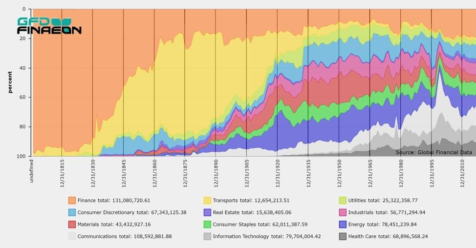

## Table of Contents

## What is a regional stock exchange?

A regional stock exchange is a smaller stock market that operates within a specific geographic area, usually a state or a group of states. These exchanges are different from national stock exchanges, which are bigger and cover the whole country. Regional stock exchanges help local businesses by giving them a place to trade their stocks and raise money. They are important because they make it easier for smaller companies to get the money they need to grow.

Even though regional stock exchanges are smaller, they still follow the rules set by the government to make sure trading is fair and safe. Over time, many regional stock exchanges have merged with bigger national exchanges because of technology and the need to compete. However, some still exist and continue to serve their local communities by offering a platform for trading stocks of local companies. This helps keep money and investment within the region, supporting the local economy.

## How does a regional stock exchange differ from a national stock exchange?

A regional stock exchange is smaller and works in a specific area, like a state or a few states. It helps local businesses by giving them a place to sell their stocks and get money to grow. These exchanges focus on the needs of the local community and keep money within the area. On the other hand, a national stock exchange is much bigger and covers the whole country. It has more companies listed and more people trading stocks. National exchanges are important for big companies that want to reach investors from all over the country.

The main difference between the two is their size and reach. A regional stock exchange is like a local store, serving the people nearby, while a national stock exchange is like a big shopping mall, serving people from all over. Both follow the same rules set by the government to make sure trading is fair and safe. However, because of technology and competition, many regional stock exchanges have joined with national exchanges over time. Still, some regional exchanges remain and continue to help local businesses and the local economy.

## What are some examples of regional stock exchanges around the world?

In the United States, there used to be many regional stock exchanges, but most have merged with bigger national exchanges. One example that still exists is the Philadelphia Stock Exchange, which is now part of the Nasdaq but still focuses on trading options and indexes. Another example is the Chicago Stock Exchange, which is also part of a larger group but continues to serve the Midwest region.

In Europe, there are still some regional stock exchanges. For example, the Wiener Börse in Austria is the main stock exchange for that country and focuses on companies from the region. In Germany, the Börse München (Munich Stock Exchange) serves southern Germany and is part of a larger network of German exchanges.

In Asia, regional stock exchanges are also common. The Bombay Stock Exchange (BSE) in India is one of the oldest in Asia and serves companies mainly from the Mumbai region. In China, the Shenzhen Stock Exchange focuses on smaller companies and technology firms, serving the southern part of the country.

## What types of companies typically list on a regional stock exchange?

Companies that typically list on a regional stock exchange are often smaller and focus on serving their local area. These businesses might be in industries like manufacturing, retail, or services that are important to the local economy. They choose a regional exchange because it's easier and less expensive to list there compared to a big national exchange. This helps them raise money from people who know and understand their business well.

These companies might not be big enough or well-known enough to list on a national exchange yet. By starting on a regional exchange, they can grow and become more established. Over time, if they do well, they might move to a bigger exchange. Regional exchanges give these smaller companies a chance to get the money they need to expand and create jobs in their community.

## What are the benefits of listing on a regional stock exchange for a company?

Listing on a regional stock exchange can be a big help for a company. It's easier and cheaper to list on a regional exchange compared to a big national one. This means smaller companies can get the money they need to grow without spending too much. Also, since regional exchanges focus on local areas, the people buying the company's stocks are often from the same area. This means the company can get support from people who know and care about their business.

Another benefit is that regional exchanges help keep money in the local area. When a company lists on a regional exchange, it can raise money from local investors, which helps the local economy grow. Plus, being on a regional exchange can be a good first step for a company. If it does well, it might later move to a bigger national exchange. This way, the company can start small and grow bigger over time, all while helping its community.

## How does trading occur on a regional stock exchange?

Trading on a regional stock exchange is similar to trading on a bigger national exchange, but it's smaller and focuses on local companies. People who want to buy or sell stocks go through brokers, who are like helpers that know how to do the trading. These brokers use computers and the internet to place orders on the exchange's trading platform. When someone wants to buy a stock, they tell their broker, who then looks for someone who wants to sell that same stock at a price they both agree on. Once they find a match, the trade happens, and the buyer gets the stock while the seller gets the money.

The trading happens during specific hours set by the exchange, usually during the day when most people are awake and working. The exchange makes sure everything is fair and follows the rules. They use computers to keep track of all the trades and make sure no one is cheating. This helps keep the market safe for everyone. Even though regional exchanges are smaller, they still use modern technology to make trading quick and easy for local companies and investors.

## What are the regulatory requirements for companies listed on a regional stock exchange?

Companies listed on a regional stock exchange have to follow rules set by the government and the exchange itself. These rules are there to make sure the market is fair and safe for everyone. For example, companies need to share important information about their business regularly. This includes things like how much money they are making, any big changes happening in the company, and other details that investors need to know. This helps people make smart choices about buying or selling stocks.

The exchange also checks that companies follow these rules. They might ask for reports and do checks to make sure everything is okay. If a company does not follow the rules, they could get in trouble and might even be removed from the exchange. This keeps the market honest and protects investors. Even though regional exchanges are smaller, they still have to follow these strict rules to keep trading fair and safe.

## How do regional stock exchanges contribute to the local economy?

Regional stock exchanges help the local economy by giving smaller businesses a place to get money to grow. These businesses might be factories, shops, or service companies that are important to the area. When these companies list on a regional exchange, they can raise money from people who live nearby. This means the money stays in the local area and helps create jobs and support other local businesses.

Also, regional stock exchanges bring investors and businesses together in the same community. This can lead to more people investing in local companies, which helps them grow even more. When local companies do well, they can hire more people and buy more things from other local businesses. This creates a cycle where the whole area benefits, making the local economy stronger and more successful.

## What are the challenges faced by regional stock exchanges in the era of globalization?

In the era of globalization, regional stock exchanges face big challenges. One of the main problems is competition from bigger, national stock exchanges. These bigger exchanges have more money and technology, so they can offer better services and attract more companies and investors. This makes it hard for regional exchanges to keep up and stay important. They have to work hard to show that they are still valuable to local businesses and investors.

Another challenge is the rise of electronic trading and technology. With the internet, people can trade stocks from anywhere in the world. This means that investors might choose to use bigger, global platforms instead of smaller, regional ones. Regional exchanges need to keep up with technology to stay relevant. They need to find ways to use technology to make trading easier and more attractive for local companies and investors. If they don't, they might lose business to bigger exchanges that are better at using technology.

Despite these challenges, regional stock exchanges can still play an important role. They can focus on helping local businesses and keeping money in the community. By doing this, they can support the local economy and help smaller companies grow. However, they need to be smart about how they use technology and compete with bigger exchanges to stay successful in a global world.

## How has technology impacted the operations and reach of regional stock exchanges?

Technology has changed a lot about how regional stock exchanges work and who they can reach. Before, trading happened in person at the exchange. Now, with computers and the internet, trading can happen online from anywhere. This means people don't have to be in the same city to trade stocks. It's easier for investors from different places to buy and sell stocks on a regional exchange. Technology also helps regional exchanges work faster and handle more trades. This makes them more efficient and able to serve more people.

But technology also brings challenges. Bigger, national stock exchanges use technology to offer better services and attract more companies and investors. This makes it hard for regional exchanges to compete. They need to keep up with technology to stay relevant. If they don't, people might choose to use bigger exchanges instead. Still, technology can help regional exchanges reach more people and make trading easier. By using technology well, they can continue to help local businesses and support the local economy.

## What role do regional stock exchanges play in the overall financial market ecosystem?

Regional stock exchanges are like small but important parts of the big financial market. They help smaller companies in their area by giving them a place to sell their stocks and get money to grow. These companies might be local factories, shops, or service businesses that are important to the community. By listing on a regional exchange, these businesses can raise money from people who live nearby. This keeps money in the local area and helps the local economy get stronger. Regional exchanges also bring local investors and businesses together, making it easier for them to work together and help each other grow.

In the bigger picture, regional stock exchanges add variety to the financial market. They offer a different choice for companies that might not be big enough or ready to list on a national exchange. This helps the overall market by giving more options to both companies and investors. However, regional exchanges face challenges, like competition from bigger national exchanges and the need to keep up with technology. Despite this, they play a key role in supporting local economies and helping smaller companies take their first steps in the financial world.

## What future trends might influence the development and relevance of regional stock exchanges?

In the future, technology will keep changing how regional stock exchanges work. More trading will happen online, making it easier for people from different places to buy and sell stocks on these exchanges. This could help regional exchanges reach more people and grow. But they will also need to keep up with new technology to stay competitive. If they don't, bigger national exchanges might take away their business. Regional exchanges might use new tools like blockchain or AI to make trading faster and safer. This could make them more attractive to both companies and investors.

Another trend that might affect regional stock exchanges is the focus on local and sustainable investing. More people want to invest in companies that are good for their community and the environment. Regional exchanges can help these companies by giving them a place to raise money. This could make regional exchanges more important in the future. But they will need to show that they are helping local businesses and the local economy. If they can do this well, they might become more relevant even as the world becomes more global.

## References & Further Reading

[1]: Gomber, P., Arndt, B., Lutat, M., & Uhle, T. (2011). ["High-frequency trading"](https://papers.ssrn.com/sol3/papers.cfm?abstract_id=1858626). Journal of Business Economics.

[2]: Hasbrouck, J., & Saar, G. (2013). ["Low-latency trading"](https://www.sciencedirect.com/science/article/abs/pii/S1386418113000165). Journal of Financial Markets, 16(4), 646-679.

[3]: Hendershott, T., Jones, C. M., & Menkveld, A. J. (2011). ["Does algorithmic trading improve liquidity?"](https://onlinelibrary.wiley.com/doi/full/10.1111/j.1540-6261.2010.01624.x). The Journal of Finance, 66(1), 1-33.

[4]: Narang, R. K. (2013). ["Inside the Black Box: A Simple Guide to Quantitative and High-Frequency Trading"](https://onlinelibrary.wiley.com/doi/book/10.1002/9781118662717). Wiley.

[5]: Chakraborti, A., Toke, I. M., Patriarca, M., & Abergel, F. (2011). ["Econophysics review: I. Empirical facts"](https://www.researchgate.net/publication/227624084_Econophysics_review_I_Empirical_facts). Reports on Progress in Physics, 74(4), 046901.