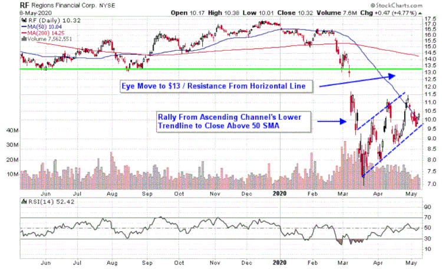

Stock markets serve as pivotal platforms for the buying and selling of securities, enabling companies to raise capital and investors to gain part-ownership or creditor status in corporations, primarily in the form of stocks and bonds. Regional stock exchanges play a crucial role in this ecosystem by catering to local businesses and investors, often providing a more accessible and supportive environment than their national counterparts. These exchanges are integral to financial trading, offering tailored services that enhance the participation of smaller companies and individual investors in the capital markets.

Algorithmic trading, or algo trading, has revolutionized modern trading systems by employing computer algorithms to execute trades based on a predetermined set of rules and conditions. This method allows for trading to be conducted with high speed and precision, minimizing human error and reducing the impact of emotions on trading decisions. As markets have evolved, the significance of algo trading has grown, leading to its widespread adoption across various types of exchanges, including regional ones.

The intersection of regional stock exchanges and algorithmic trading presents a powerful synergy that enhances market efficiency. By integrating algorithmic trading technologies, regional exchanges can improve liquidity and transparency, offering faster execution times and more accurate pricing mechanisms. This fusion not only benefits traders by enabling more efficient order matching and execution but also strengthens the market infrastructure of regions that may otherwise be overlooked by larger national platforms.

This article aims to analyze the synergy between regional stock exchanges and algorithmic trading. It will explore how the integration of these technologies into regional trading enhances market performance and provides valuable opportunities for local economies. By doing so, it highlights the essential role played by regional exchanges within the broader financial system and underscores the transformative potential of algorithmic trading in shaping the future of financial markets.

## Table of Contents

## Understanding Regional Stock Exchanges

Regional stock exchanges play a crucial role in the global financial ecosystem. These exchanges are defined as trading venues that operate within a specific geographical area or region, catering primarily to local businesses and investors. Unlike national stock exchanges, which handle a vast range of securities and attract participants from across the globe, regional stock exchanges focus on providing localized financial services tailored to regional economic needs.

The principal difference between regional and national stock exchanges lies in their scale and scope of operations. National exchanges, such as the New York Stock Exchange (NYSE) in the United States or the Tokyo Stock Exchange in Japan, have broad listings that include multinational enterprises. In contrast, regional stock exchanges typically list smaller to mid-sized companies that may not meet the stringent requirements or wish to compete in the crowded space of national exchanges.

Examples of major regional stock exchanges include Euronext Paris in France, BSE (formerly Bombay Stock Exchange) in India, and the Australian Securities Exchange (ASX). These exchanges have become significant players in their respective regions, offering platforms for smaller businesses to raise capital and investors to diversify their portfolios.

Historically, regional stock exchanges emerged in response to the growing demand for accessible financial markets in various parts of the world. Originally formed to cater to local businesses requiring capital, these exchanges acted as financial hubs supporting economic activities within their regions. Over time, the evolution of technology and globalization has bridged the gap between regional and national exchanges, enabling them to offer more competitive services.

Current trends in regional stock exchanges include modernization efforts driven by technological advancement, such as the adoption of electronic trading platforms and [algorithmic trading](/wiki/algorithmic-trading) systems. Additionally, there is a growing focus on improving regulatory frameworks to enhance transparency and attract more investors. As a result, regional stock exchanges are not just surviving in the modern economy but are evolving and adapting to better serve their participants in an increasingly globalized financial market. 

In summary, while regional stock exchanges differ from national exchanges in several key aspects, their significance in providing localized financial solutions and their adaptive strategies to integrate modern technologies mark them as vital components of the financial trading landscape.

## Role of Regional Stock Exchanges in Financial Trading

Regional stock exchanges play a pivotal role in facilitating financial trading by offering a platform that caters to local businesses and investors. These exchanges provide a tailored environment that accommodates the needs of regional economies, supporting small and medium enterprises (SMEs) that might not meet the listing requirements of national stock exchanges. By enabling local companies to raise capital, regional stock exchanges help stimulate business growth and attract investment within the region.

One of the primary contributions of regional stock exchanges is enhancing market [liquidity](/wiki/liquidity-risk-premium). By allowing more companies to go public, these exchanges increase the [volume](/wiki/volume-trading-strategy) of securities available for trading, thereby improving liquidity. Enhanced liquidity benefits investors by enabling easier entry and [exit](/wiki/exit-strategy) from positions, reducing transaction costs, and facilitating more efficient price discovery. This, in turn, contributes to the economic growth of the region by creating a more dynamic financial environment that supports business expansion and job creation.

Regional stock exchanges complement national exchanges by serving as breeding grounds for companies. As businesses listed on regional exchanges mature, they may opt to transition to larger national exchanges, thus acting as a stepping stone for regional enterprises aspiring for larger capital markets. This complementary relationship ensures a diversified ecosystem where regional exchanges focus on local markets while national exchanges handle a broader spectrum of investors and firms.

Case studies illustrate the impact of successful regional stock exchanges on their local economies. For instance, the Borsa Italiana in Italy has been instrumental in supporting the country's SMEs by providing them with a platform to access capital. Similarly, the Tokyo Stock Exchange's JASDAQ section focuses on emerging companies, fostering innovation and economic development in Japan. These exchanges have demonstrated how regional platforms can drive industrial growth, innovation, and competitiveness by aligning closely with the economic activities of their respective regions.

## Basics of Algorithmic Trading

Algorithmic trading, often referred to as algo trading, is a method of executing trades using pre-programmed instructions that consider variables such as timing, price, and volume. It leverages the speed and processing power of computers to execute trades far faster than a human trader could. This method is integral to modern financial markets due to its efficiency and capability to operate without the psychological biases inherent in human decision-making.

Types of algorithms used in trading vary widely, tailored to specific market conditions and trading strategies. Common types include:

1. **Market Making Algorithms**: These seek to earn a profit on the bid-ask spread by continuously placing buy and sell orders. By providing liquidity to the market, they help stabilize prices.

2. **Trend Following Algorithms**: These rely on technical analysis to identify and exploit market trends. Such algorithms operate on the principle that prices moving in a trend will continue to do so.

3. **Arbitrage Algorithms**: These algorithms exploit price discrepancies of a security in different markets, aiming to buy low in one and sell high in another for risk-free profits.

4. **VWAP (Volume Weighted Average Price) Algorithms**: These aim to execute a trade close to the average market price over a specific time by breaking a large order into smaller ones, minimizing market impact.

5. **Mean Reversion Algorithms**: This type capitalizes on the assumption that prices will revert to their historical mean or average.

The benefits of algorithmic trading are manifold. Speed is a primary advantage; algorithms can analyze multiple indicators and execute trades in milliseconds, capitalizing on fleeting opportunities. Precision is another, as algorithms can make trades at precise times and prices defined beforehand, minimizing manual errors. Additionally, algorithmic trading is devoid of human emotion, which often leads to suboptimal trading decisions driven by fear or greed.

In recent years, current trends in algorithmic trading have seen the proliferation of High-Frequency Trading ([HFT](/wiki/high-frequency-trading-strategies)), where algorithms execute a large number of orders at extremely high speeds. This form of trading requires sophisticated hardware and infrastructure to maintain low latency responses. HFT strategies often rely on fleeting market inefficiencies that only exist for milliseconds or seconds.

Moreover, the integration of [artificial intelligence](/wiki/ai-artificial-intelligence) and [machine learning](/wiki/machine-learning) is transforming algorithmic trading. These technologies enable the analysis of bigger datasets, leading to more robust predictive models capable of adapting to dynamic market conditions.

In summary, the evolution of algorithmic trading strategies reflects broader technological advancements, continually reshaping their role in financial markets and ensuring they remain a critical tool in trading operations.

## Integration of Algo Trading with Regional Stock Exchanges

Regional stock exchanges have increasingly recognized the potential of algorithmic trading technologies to enhance their trading platforms. By integrating these systems, regional exchanges aim to improve their efficiency, attract more investors, and provide more competitive trading services.

### Adoption of Algorithmic Trading Technologies

Regional stock exchanges are adopting algorithmic trading through a phased approach, which typically includes upgrading their technological infrastructure, training personnel, and ensuring compliance with regulatory standards. This adoption often involves partnerships with technology firms to develop or acquire the necessary software and hardware solutions. For instance, exchanges might implement automated trading systems capable of executing pre-programmed trading instructions at high speeds.

### Advantages of Integration

The integration of algorithmic trading into regional stock exchanges offers several advantages:

1. **Increased Efficiency**: Algorithmic trading allows for the rapid execution of trades, reducing latency and improving the overall efficiency of the trading process. This speed is particularly beneficial in markets where price movements are frequent and volatile.

2. **Enhanced Liquidity**: By facilitating more trades in a shorter timeframe, algorithmic trading helps to increase market liquidity. This, in turn, can attract more participants, as traders prefer markets where their orders can be executed quickly and without significant price impact.

3. **Cost Reduction**: Automation reduces the need for manual intervention, leading to lower operational costs for the exchange. This cost-effectiveness can be passed on to traders in the form of reduced fees.

4. **Improved Accuracy**: Algorithms are capable of processing vast amounts of data and making decisions based on pre-defined parameters, thereby reducing human errors that may occur in manual trading.

### Challenges in Implementation

Despite the benefits, regional stock exchanges face several challenges in implementing algorithmic trading systems:

1. **Technological Barriers**: Implementing these systems requires significant upgrades to existing IT infrastructure. Many regional exchanges may not have the necessary resources to invest in these technologies without external support.

2. **Regulatory Compliance**: Ensuring that algorithmic trading systems comply with existing regulations is a complex task. Exchanges must work closely with regulators to ensure transparency and fairness in the use of algorithms.

3. **Risk Management**: The speed and complexity of algorithmic trading can lead to systemic risks if not properly managed. Exchanges must develop robust risk management frameworks to mitigate potential issues such as flash crashes.

4. **Skill Gap**: There is often a lack of skilled personnel who are capable of developing, implementing, and monitoring algorithmic trading systems. Exchanges must invest in training and development to bridge this gap.

### Successful Implementations

Several regional stock exchanges have successfully integrated algorithmic trading systems:

- **Borsa Istanbul**: The Turkish exchange has invested in advanced trading technologies, including algorithmic trading systems, to transform itself into a financial hub in the region. The implementation has led to increased trading volumes and improved market efficiency.

- **Johannesburg Stock Exchange (JSE)**: The JSE has upgraded its trading platform to accommodate high-frequency and algorithmic trading, resulting in enhanced market liquidity and reduced transaction costs.

These examples demonstrate the positive impact that algorithmic trading can have on regional exchanges, paving the way for broader adoption and fostering a more competitive trading environment.

## Technological Advancements and Future Trends in Algo Trading

The technological advancements in AI and machine learning are profoundly shaping the development of trading algorithms. AI techniques, especially [deep learning](/wiki/deep-learning) and [reinforcement learning](/wiki/reinforcement-learning), enable the creation of more sophisticated models capable of identifying patterns and making decisions based on vast datasets. Machine learning algorithms, such as decision trees and neural networks, are employed to predict asset price movements by analyzing historical data and other influencing factors. These methods help in improving the accuracy and efficiency of trading strategies, as they can adapt to new data inputs in real-time, providing a dynamic approach to market analysis.

Blockchain technology is another pivotal development in algorithmic trading. It offers enhanced transparency and security in transactional records, which can bolster trust and reduce fraud in trading processes. Smart contracts, which are programmable agreements executed on blockchain platforms, can automate trading activities based on predefined criteria without manual intervention. Moreover, these contracts ensure compliance with regulatory requirements, reducing the risk of breaches.

Cloud computing offers significant scalability and computational power that support the execution of complex trading algorithms. It allows traders to process enormous amounts of data with minimal latency. The infrastructure provided by services like AWS and Azure supports high-frequency trading operations by providing the necessary resources on demand.

Big data analytics plays a crucial role by providing insights into market behaviors. By analyzing large datasets encompassing market news, social media sentiment, and trading histories, traders can gain a competitive edge. This wealth of information aids in refining trading strategies and enhancing predictive modeling.

Predictions for the future of algo trading in regional stock exchanges suggest increased adoption of these technologies, leading to more robust and adaptive trading environments. The integration of AI and big data will likely result in greater personalization of trading strategies, tailored to the specific characteristics of regional markets. As these technologies become more accessible, regional exchanges are expected to leverage them to boost market efficiency and attract a broader range of participants.

Potential regulatory changes are anticipated to balance innovation with investor protection. Regulators may enforce stricter oversight on the use of AI in trading to mitigate risks associated with automated decision-making. Guidelines ensuring transparency in algorithmic processes and accountability in cases of malfunctioning systems or unintended market impact are expected. The regulatory landscape will likely evolve to address the challenges posed by these cutting-edge technologies, ensuring that they contribute positively to the stability and integrity of financial markets.

## Conclusion

In conclusion, the interplay between regional stock exchanges and algorithmic trading represents a transformative phase in the financial markets. Regional stock exchanges have long served as vital platforms for local businesses and investors, contributing significantly to regional economic growth and market liquidity. By incorporating algorithmic trading technologies, these exchanges are now positioned to further enhance their operational efficiencies and expand their market reach. 

The evolution of financial markets is marked by an increasing integration of advanced trading technologies, which offer unprecedented speed, precision, and reliability. Algorithms, particularly those powered by artificial intelligence and machine learning, have enabled traders to execute large volumes of transactions in milliseconds, thus reducing inefficiencies and capitalizing on market opportunities. This technological sophistication, when applied to regional markets, empowers local exchanges to better compete with their national and global counterparts by offering enhanced liquidity, reduced trading costs, and improved accessibility.

The symbiotic relationship between regional exchanges and algorithmic trading is a catalyst for market evolution, driving an environment conducive to innovation and growth. For regional exchanges to fully capitalize on these opportunities, it is essential to navigate the challenges associated with the integration of new technologies, such as infrastructural demands, regulatory compliance, and the need for robust risk management frameworks.

Looking ahead, the ongoing exploration and adaptation of these technologies will be crucial for sustaining market growth. Stakeholders are encouraged to foster an ecosystem that supports technological advancement while maintaining a keen awareness of the regulatory landscape. As markets continue to evolve, the potential for regional exchanges, empowered by algorithmic trading, to contribute to a dynamic and prosperous financial sector remains vast and promising.

## References & Further Reading

[1]: Gomber, P., Arndt, B., Lutat, M., & Uhle, T. (2011). ["High-frequency trading"](https://papers.ssrn.com/sol3/papers.cfm?abstract_id=1858626). Journal of Business Economics.

[2]: Hasbrouck, J., & Saar, G. (2013). ["Low-latency trading"](https://www.sciencedirect.com/science/article/abs/pii/S1386418113000165). Journal of Financial Markets, 16(4), 646-679.

[3]: Hendershott, T., Jones, C. M., & Menkveld, A. J. (2011). ["Does algorithmic trading improve liquidity?"](https://onlinelibrary.wiley.com/doi/full/10.1111/j.1540-6261.2010.01624.x). The Journal of Finance, 66(1), 1-33.

[4]: Narang, R. K. (2013). ["Inside the Black Box: A Simple Guide to Quantitative and High-Frequency Trading"](https://onlinelibrary.wiley.com/doi/book/10.1002/9781118662717). Wiley.

[5]: Chakraborti, A., Toke, I. M., Patriarca, M., & Abergel, F. (2011). ["Econophysics review: I. Empirical facts"](https://www.researchgate.net/publication/227624084_Econophysics_review_I_Empirical_facts). Reports on Progress in Physics, 74(4), 046901.