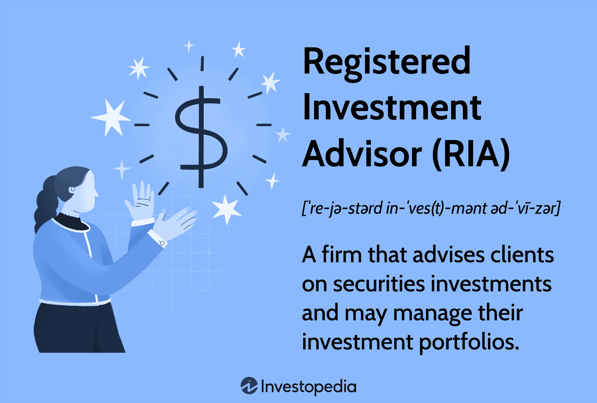

## Table of Contents

## What is a Registered Investment Advisor (RIA)?

A Registered Investment Advisor (RIA) is a company or individual that gives financial advice and manages investments for clients. They are registered with the Securities and Exchange Commission (SEC) or state securities authorities. This registration means they have to follow certain rules to protect their clients.

RIAs help people plan their financial future. They look at a client's money situation and goals, then create a plan to help reach those goals. This can include picking investments like stocks or bonds, and giving advice on things like saving for retirement or buying a house. By working with an RIA, people can get personalized help to make smart choices with their money.

## What are the basic roles and responsibilities of an RIA?

An RIA's main job is to give good financial advice and manage investments for their clients. They look at what their clients want for the future and how much money they have now. Then, they make a plan to help clients reach their goals. This can mean picking the right investments, like stocks or bonds, or helping with big decisions like saving for retirement or buying a home. The RIA works closely with the client to make sure the plan fits their needs.

RIAs also have to follow strict rules to keep their clients safe. They need to be registered with the SEC or state authorities, which means they must be honest and clear about what they do. They have to tell clients about any fees or how they get paid. Plus, they need to keep client information private and avoid any conflicts of interest. This way, clients can trust that their RIA is looking out for their best interests.

## How does one become a Registered Investment Advisor?

To become a Registered Investment Advisor, you need to follow some steps set by the government. First, you have to register with either the Securities and Exchange Commission (SEC) or your state's securities authority. This depends on how much money you manage. If you manage less than $100 million, you usually register with your state. If it's more than that, you register with the SEC. To register, you fill out a form called Form ADV, which asks about your business and how you will serve your clients.

Once you've submitted your Form ADV, you need to meet other requirements. You must pass certain exams, like the Series 65 or Series 66, to show you know about investing and the laws that govern it. You also need to have a clean record, meaning no serious crimes or dishonest behavior. After you're approved, you must follow rules to keep your clients safe, like being honest about fees and keeping their information private. By doing all this, you can become an RIA and help people plan their financial futures.

## What qualifications and licenses are required to become an RIA?

To become a Registered Investment Advisor, you need to have certain qualifications and licenses. You must pass exams like the Series 65 or Series 66. These tests show that you know about investments and the laws that control them. You also need to have a clean record, which means no serious crimes or dishonest actions in your past.

Once you have the right qualifications, you need to register with either the Securities and Exchange Commission (SEC) or your state's securities authority. This depends on how much money you manage. If you manage less than $100 million, you usually register with your state. If it's more than that, you register with the SEC. You fill out a form called Form ADV, which tells about your business and how you will help your clients.

## What is the typical income range for a Registered Investment Advisor?

The income of a Registered Investment Advisor can vary a lot based on things like where they work, how experienced they are, and how many clients they have. On average, an RIA might earn between $70,000 and $150,000 a year. Some RIAs who manage a lot of money or have many clients can make even more, sometimes over $200,000.

RIAs usually earn money in different ways. They might charge a fee based on a percentage of the money they manage for clients, which is often around 1% to 2%. They can also charge hourly rates or flat fees for giving advice. How much they earn depends on how they set up their fees and how well their clients' investments do.

## How do RIAs charge for their services, and what are the common fee structures?

RIAs charge for their services in different ways. The most common way is by charging a fee based on a percentage of the money they manage for their clients. This is called an assets under management (AUM) fee, and it's usually around 1% to 2% of the total amount. For example, if an RIA manages $100,000 for a client, they might charge $1,000 to $2,000 a year. This fee structure means the more money the RIA manages, the more they earn.

Another way RIAs charge is by the hour or with a flat fee for their advice. Hourly rates can range from $100 to $300 per hour, depending on the RIA's experience and location. Flat fees might be charged for specific services, like creating a financial plan, and can range from a few hundred to a few thousand dollars. Some RIAs also use a combination of these methods, charging a mix of AUM fees, hourly rates, and flat fees to fit different client needs.

## What are the key differences between an RIA and other financial advisors?

A Registered Investment Advisor (RIA) and other financial advisors both help people with their money, but they have some big differences. An RIA has to follow strict rules set by the government. They need to register with the SEC or state authorities and pass special tests like the Series 65 or 66. This means RIAs are held to a high standard called the fiduciary standard, which means they must always put their clients' interests first. Other financial advisors might not have to follow these rules and could be held to a lower standard, like the suitability standard, where they only need to suggest investments that are okay for the client, not necessarily the best.

Another big difference is how RIAs and other financial advisors charge for their services. RIAs often charge a fee based on a percentage of the money they manage, called an assets under management (AUM) fee. They might also charge by the hour or a flat fee for advice. Other financial advisors might work on commission, which means they earn money when they sell certain products to clients. This can sometimes lead to conflicts of interest, where the advisor might suggest products that earn them more money, not what's best for the client. Because RIAs usually don't work on commission, they can give more unbiased advice.

## How does the fiduciary duty of an RIA impact their role and client relationships?

The fiduciary duty of an RIA means they have to always put their clients' interests first. This is a big deal because it helps build trust. When clients know their RIA has to think about what's best for them, not what makes the RIA more money, they feel more secure. This duty makes RIAs different from other financial advisors who might not have to follow the same rules. It means RIAs have to be very careful and honest in everything they do for their clients.

Having a fiduciary duty also changes how RIAs work with their clients. They need to explain things clearly and make sure their clients understand their financial plans. RIAs have to avoid any conflicts of interest, which means they can't suggest investments just because they make more money for themselves. This helps create strong, long-lasting relationships because clients know their RIA is looking out for them. It makes the whole process of planning for the future feel more personal and trustworthy.

## What advanced strategies can RIAs use to enhance client portfolios?

RIAs can use advanced strategies like tax-loss harvesting to help their clients save money on taxes. This means selling investments that have lost value to offset any gains from other investments. It's a smart way to lower the tax bill without changing the overall investment plan too much. Another strategy is using asset allocation to spread out the risk. This means putting money into different types of investments, like stocks, bonds, and real estate, so if one type does badly, the others might do well and balance things out.

RIAs can also use something called rebalancing to keep the client's portfolio in line with their goals. Over time, some investments might grow faster than others, which can change the original plan. Rebalancing means selling some of the investments that have grown a lot and buying more of the ones that haven't, to get back to the right mix. This helps keep the risk level where the client wants it. By using these strategies, RIAs can help their clients' money grow in a smart and safe way.

## How do regulatory changes affect the operations and income of RIAs?

Regulatory changes can have a big impact on how RIAs do their work and how much money they make. When the government changes the rules, RIAs might need to spend more time and money to make sure they follow them. For example, if new rules come out about how to report information or what kind of advice they can give, RIAs might need to hire more people or buy new software to keep up. This can cut into their profits because they have to spend more to stay in line with the law.

Also, changes in regulations can change how RIAs earn money. If new rules limit how RIAs can charge for their services or what kinds of investments they can recommend, their income might go down. On the other hand, if the rules make it easier for RIAs to work with more clients or offer new types of services, they might be able to make more money. So, RIAs always have to keep an eye on what's happening with the rules and be ready to adjust how they do things.

## What are the best practices for RIAs to maximize their income and client satisfaction?

To maximize their income, RIAs should focus on building strong, trust-based relationships with their clients. This means being clear and honest about fees and always putting the client's interests first because of their fiduciary duty. RIAs can also offer a wide range of services, like financial planning, tax advice, and estate planning, which can attract more clients and allow them to charge more. Using advanced strategies like tax-loss harvesting and rebalancing can help clients' money grow, which makes them happy and more likely to stay with the RIA. By keeping up with market trends and regulatory changes, RIAs can find new ways to help their clients and make more money.

To boost client satisfaction, RIAs need to listen carefully to what their clients want and need. Regular meetings and clear communication help make sure clients feel heard and valued. RIAs should also be proactive in updating clients about their investments and any changes in the market or regulations that might affect them. By showing they care about the client's financial well-being and offering personalized advice, RIAs can build long-lasting relationships. Happy clients are more likely to refer their friends and family, which can bring in more business and increase the RIA's income.

## How can an RIA expand their business and what are the potential income implications of scaling up?

An RIA can expand their business by reaching out to more people who might need their help. One way to do this is by using the internet and social media to share helpful tips and advice. This can make more people aware of the RIA and what they offer. Another way is by teaming up with other professionals, like accountants or lawyers, who can send clients their way. RIAs can also offer new services, like financial planning or estate planning, which can attract different kinds of clients. By growing their business this way, RIAs can help more people and make more money.

Scaling up a business can change how much money an RIA makes. When an RIA helps more clients or offers more services, they can earn more because they're getting paid by more people. But, growing a business also means spending more money. An RIA might need to hire more people, spend on marketing, or buy new tools to manage more clients. If they can keep their costs lower than the extra money they make, scaling up can lead to a bigger income. But, if costs get too high, it might not be worth it. So, RIAs need to think carefully about how to grow their business in a way that makes sense for them and their clients.

## What are the roles of algorithmic trading in modern investment?

Algorithmic trading, often referred to as algo-trading, involves employing computer algorithms to execute trades automatically based on predefined criteria. This method allows for transactions to occur at extraordinary speed and frequency, taking advantage of small price differences in the market. Algorithmic trading is pivotal in modern investment management, particularly as it influences the strategies employed by Registered Investment Advisors (RIAs) and financial advisors.

### Enhancing Portfolio Performance and Efficiency

RIAs and financial advisors can leverage [algorithmic trading](/wiki/algorithmic-trading) to optimize portfolio performance by minimizing costs and seizing fleeting market opportunities faster than manual trading allows. Algorithms can be programmed to follow specific strategies such as trend-following, [arbitrage](/wiki/arbitrage), or market-making, allowing advisors to tailor approaches that align with client objectives and market conditions.

For example, one common strategy is [statistical arbitrage](/wiki/statistical-arbitrage), where algorithms identify price inefficiencies between related securities. A typical formula used in this process is the Z-score, calculated as:

$$
Z = \frac{(X - \mu)}{\sigma}
$$

where $X$ is the current price, $\mu$ is the mean price, and $\sigma$ is the standard deviation. If the Z-score crosses a certain threshold, the algorithm triggers a buy or sell order.

### Benefits of Algorithmic Trading

1. **Speed and Accuracy**: Algorithms can process a vast amount of data and execute trades within milliseconds, ensuring that trade orders are timely and accurate, minimizing the risks associated with human error.

2. **Backtesting and Strategy Validation**: Algorithms can be tested against historical data to validate their potential effectiveness before being employed in real-time markets. This testing allows advisors to refine strategies, ensuring they are robust and adaptable to market changes.

3. **Cost Efficiency**: Algorithmic trading reduces transaction costs by executing trades at the most advantageous times and prices, often splitting large orders into smaller transactions to reduce their market impact.

### Potential Risks and Concerns

Despite its many advantages, algorithmic trading presents certain risks. High-frequency trading, a subset of algorithmic trading, was heavily scrutinized following incidents of market instability, such as the "Flash Crash" of 2010, where the Dow Jones Industrial Average plummeted drastically within minutes due to automated trading.

The primary risks associated with algorithmic trading include:

- **System Failures and Latency Issues**: Reliance on technological infrastructure means any glitches or delays can lead to significant financial losses. Ensuring robust systems with reliable internet connectivity and backup protocols is crucial.

- **Market Impact**: Large algorithmic trades can inadvertently affect market prices, especially if they are concentrated in illiquid markets or executed contemporaneously with similar strategies by other algorithms.

- **Overfitting in Backtesting**: Algorithms tailored too closely to past data may not perform well in different market conditions, leading to suboptimal performance or losses.

### Conclusion

Algorithmic trading is an indispensable component of the modern investment landscape, transforming the strategies employed by financial advisors and RIAs. Its ability to execute trades efficiently and with precision offers a competitive edge in portfolio management. However, the inherent risks require careful management and strategy validation to ensure these systems enhance, rather than destabilize, the financial services they are designed to improve. As this technology evolves, it will continue to shape the future of investment advisory practices.

## References & Further Reading

[1]: ["Investment Advisers Act of 1940"](https://www.sec.gov/investment/laws-and-rules) - U.S. Securities and Exchange Commission

[2]: ["Algorithmic Trading: Winning Strategies and Their Rationale"](https://www.wiley.com/en-us/Algorithmic+Trading%3A+Winning+Strategies+and+Their+Rationale-p-9781118460146) by Ernest P. Chan

[3]: ["The Intelligent Investor"](https://www.amazon.com/Intelligent-Investor-3rd-Ed/dp/0063356724) by Benjamin Graham - A classic book on investment strategies and fiduciary responsibilities.

[4]: Barber, B. M., & Odean, T. (2000). ["Trading is Hazardous to Your Wealth: The Common Stock Investment Performance of Individual Investors."](https://faculty.haas.berkeley.edu/odean/Papers%20current%20versions/Individual_Investor_Performance_Final.pdf) The Journal of Finance, 55(2), 773-806.

[5]: Financial Industry Regulatory Authority (FINRA). ["Differences Between Investment Advisers and Brokers."](https://www.investopedia.com/ask/answers/how-does-finra-differ-sec/)