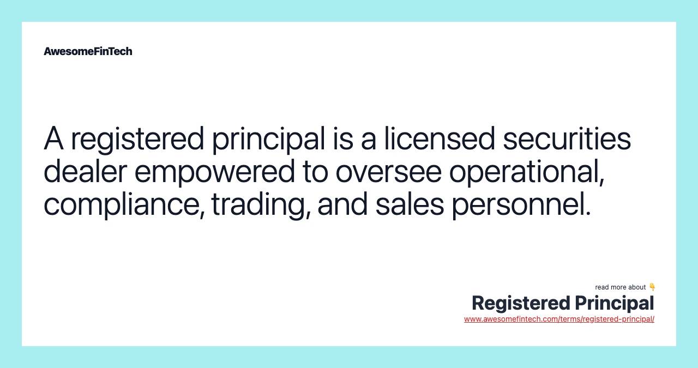

## Table of Contents

## What is a Registered Principal?

A Registered Principal is someone who works at a financial firm and has a special license. This license lets them supervise other people who sell investments like stocks and bonds. They make sure that everyone follows the rules set by the government and industry groups.

Their job is important because they help keep the financial markets fair and safe. They train new employees, check that sales are done correctly, and make sure all the paperwork is in order. Without Registered Principals, it would be harder to trust that investments are being handled properly.

## What are the main responsibilities of a Registered Principal?

A Registered Principal has to make sure that everyone at their financial firm follows the rules. They watch over people who sell investments like stocks and bonds. They check that these salespeople are doing their job right and not breaking any laws or industry rules. This is important because it helps keep the financial markets honest and safe for everyone.

They also train new employees on how to do their jobs properly. This includes teaching them about the rules they need to follow and how to handle investments correctly. Registered Principals also have to keep good records and make sure all the paperwork is done right. Without them, it would be harder to trust that investments are being managed well.

## How does one become a Registered Principal?

To become a Registered Principal, you first need to work at a financial firm that deals with investments like stocks and bonds. You usually start by getting a job as a financial advisor or in a similar role. Once you have some experience, you can apply to take a special exam given by the Financial Industry Regulatory Authority (FINRA). This exam tests your knowledge of the rules and regulations you need to follow in the financial industry.

After you pass the exam, you need to apply for your license. This involves filling out forms and paying a fee. Once FINRA approves your application, you become a Registered Principal. But your job doesn't stop there. You have to keep learning and stay up-to-date with any changes in the rules. This means you might need to take more exams or training courses to keep your license active.

## What qualifications are required to be a Registered Principal?

To become a Registered Principal, you need to work at a financial firm that deals with investments like stocks and bonds. Usually, you start by getting a job as a financial advisor or in a similar role. Once you have some experience, you can apply to take a special exam given by the Financial Industry Regulatory Authority (FINRA). This exam checks if you know the rules and regulations you need to follow in the financial industry.

After you pass the exam, you need to apply for your license. This involves filling out forms and paying a fee. Once FINRA approves your application, you become a Registered Principal. But you have to keep learning and stay up-to-date with any changes in the rules. This means you might need to take more exams or training courses to keep your license active.

## What is the difference between a Registered Principal and other financial professionals?

A Registered Principal is different from other financial professionals because they have a special license that lets them supervise others in the financial industry. While financial advisors or brokers focus on selling investments like stocks and bonds to clients, a Registered Principal makes sure that these sales are done correctly and follow all the rules. They watch over the work of these other professionals, making sure they are not breaking any laws or industry regulations.

Registered Principals also have the responsibility to train new employees and keep good records. This is different from the roles of financial advisors, who mainly work directly with clients, or analysts, who focus on researching investments. A Registered Principal acts as a kind of manager or overseer, ensuring that the whole team at the financial firm operates within the legal and ethical boundaries set by organizations like the Financial Industry Regulatory Authority (FINRA).

## Can a Registered Principal work in different types of financial firms?

Yes, a Registered Principal can work in different types of financial firms. These can include brokerage firms, investment advisory firms, and even banks that offer investment services. The main thing is that the firm deals with investments like stocks and bonds. As long as the firm is registered with the Financial Industry Regulatory Authority (FINRA), a Registered Principal can work there.

The role of a Registered Principal stays the same no matter the type of firm. They always have to make sure that everyone follows the rules, trains new employees, and keeps good records. But the day-to-day work might be a bit different depending on the firm. For example, in a big brokerage firm, a Registered Principal might oversee a large team of financial advisors. In a smaller investment advisory firm, they might have a more hands-on role, working closely with clients and other staff.

## What are the ongoing requirements for a Registered Principal to maintain their status?

To keep being a Registered Principal, you need to keep learning and stay up-to-date with the rules. This means you might have to take more exams or go to training courses. The Financial Industry Regulatory Authority (FINRA) can change the rules sometimes, so you need to know about these changes to do your job right.

Also, you have to follow the rules all the time. If you break them, you could lose your license. You need to keep good records and make sure everyone at your firm is following the rules too. It's a big responsibility, but it helps keep the financial markets fair and safe for everyone.

## How does a Registered Principal ensure compliance with financial regulations?

A Registered Principal makes sure everyone at their financial firm follows the rules by watching over the people who sell investments like stocks and bonds. They check that these sales are done correctly and not breaking any laws or industry rules. This is important because it keeps the financial markets honest and safe for everyone. They do this by reviewing sales records and making sure all the paperwork is done right.

They also train new employees on how to do their jobs properly. This includes teaching them about the rules they need to follow and how to handle investments correctly. By staying up-to-date with any changes in the rules and making sure everyone knows about them, a Registered Principal helps keep the whole team at the financial firm operating within the legal and ethical boundaries set by organizations like the Financial Industry Regulatory Authority (FINRA).

## What role does a Registered Principal play in supervising sales and operations?

A Registered Principal plays a big role in making sure that the sales and operations at a financial firm are done right. They watch over the people who sell investments like stocks and bonds. This means they check that these sales are done correctly and not breaking any laws or rules. They look at sales records to make sure everything is in order. If something is wrong, they fix it to keep the firm honest and safe for everyone.

They also help train new employees. This includes teaching them about the rules they need to follow and how to handle investments the right way. By doing this, they make sure that everyone at the firm knows how to do their job properly. A Registered Principal stays up-to-date with any changes in the rules and makes sure the whole team knows about them too. This helps keep the firm running smoothly and legally.

## How do Registered Principals handle conflicts of interest?

Registered Principals are important in dealing with conflicts of interest at financial firms. They make sure that people selling investments like stocks and bonds do not let their own interests get in the way of what is best for their clients. They watch over sales to see if anyone is pushing a product just because it makes them more money, not because it is good for the client. If they see this happening, they step in to stop it and make sure the right thing is done for the client.

They also set up rules and training to help everyone at the firm understand what a conflict of interest is and how to avoid it. This includes teaching them to always put the client's needs first. By keeping good records and checking them often, Registered Principals can spot any problems early and fix them. This helps keep the firm honest and trusted by clients.

## What advanced training is available for Registered Principals to enhance their skills?

Registered Principals can take advanced training to get better at their jobs. They can go to workshops and seminars that focus on the latest rules and regulations in the financial industry. These events help them learn about new laws and how to make sure their firm follows them. They also get to practice solving problems they might face at work. This training is important because it helps them stay up-to-date and do their job well.

Another type of advanced training is through online courses. These can cover topics like ethics, compliance, and leadership skills. By taking these courses, Registered Principals can learn how to better manage their teams and make sure everyone is following the rules. They also get to learn from experts in the field, which can give them new ideas on how to improve their firm's operations. This ongoing education helps them keep their license and be more effective in their role.

## How do regulatory changes impact the role and responsibilities of a Registered Principal?

When the rules in the financial world change, it affects what a Registered Principal has to do. They need to learn about these new rules quickly and make sure everyone at their firm knows about them too. This means they might have to take more exams or go to training sessions to stay up-to-date. If they don't keep up with the changes, they could lose their license, which is a big deal because it's what lets them supervise others and make sure the firm follows the rules.

These changes can also mean more work for a Registered Principal. They might have to change how they train new employees or update the way they check sales records. It's their job to make sure the firm keeps running smoothly and legally, even when the rules change. By staying on top of these changes, they help keep the financial markets fair and safe for everyone.

## References & Further Reading

[1]: Bergstra, J., Bardenet, R., Bengio, Y., & Kégl, B. (2011). ["Algorithms for Hyper-Parameter Optimization."](https://papers.nips.cc/paper/4443-algorithms-for-hyper-parameter-optimization) Advances in Neural Information Processing Systems 24.

[2]: ["Advances in Financial Machine Learning"](https://www.amazon.com/Advances-Financial-Machine-Learning-Marcos/dp/1119482089) by Marcos Lopez de Prado

[3]: ["Evidence-Based Technical Analysis: Applying the Scientific Method and Statistical Inference to Trading Signals"](https://www.amazon.com/Evidence-Based-Technical-Analysis-Scientific-Statistical/dp/0470008741) by David Aronson

[4]: ["Machine Learning for Algorithmic Trading"](https://github.com/stefan-jansen/machine-learning-for-trading) by Stefan Jansen

[5]: ["Quantitative Trading: How to Build Your Own Algorithmic Trading Business"](https://www.amazon.com/Quantitative-Trading-Build-Algorithmic-Business/dp/1119800064) by Ernest P. Chan