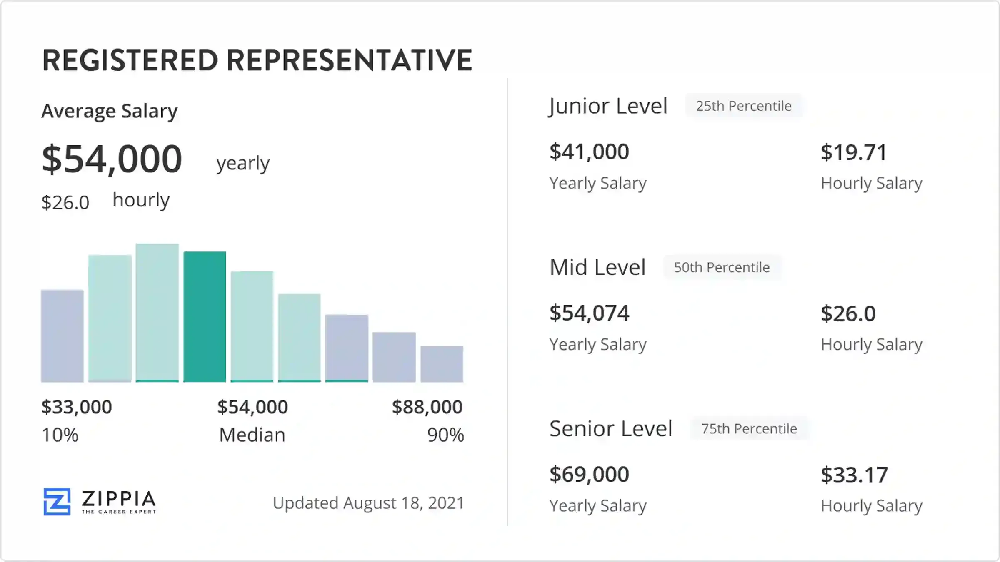

## Table of Contents

## What is a Registered Representative?

A Registered Representative is a person who works for a financial company, like a brokerage firm, and helps people buy and sell investments like stocks and bonds. They need to pass special tests and get a license from a group called FINRA to do this job. This license shows that they know the rules and can be trusted to help people with their money.

These representatives give advice to their clients about where to put their money to grow it over time. They have to follow strict rules to make sure they are always honest and fair. If they do not follow these rules, they can lose their license and get into big trouble. So, it's important for them to always do what's best for their clients.

## What are the basic qualifications needed to become a Registered Representative?

To become a Registered Representative, you need to meet some basic requirements. First, you have to be at least 18 years old. You also need to have a clean record, which means no serious crimes or financial problems that could make people doubt your honesty. Most firms also want you to have at least a high school diploma or something similar, but some might ask for a college degree.

Next, you need to pass a test called the Series 7 exam, which is given by FINRA. This test checks if you know enough about investments and the rules you need to follow. It's not easy, so you'll need to study a lot. After you pass the exam, you have to join a brokerage firm that will sponsor you. They will help you get your license from FINRA, which means you are now a Registered Representative and can start helping people with their investments.

Once you're a Registered Representative, you have to keep learning. There are rules about continuing education, so you'll need to take more classes to stay up to date. This helps make sure you're always giving the best advice to your clients.

## What are the primary roles of a Registered Representative?

A Registered Representative helps people make smart choices with their money. They work at places like banks or investment firms. Their main job is to talk with customers about what they want to do with their money. They help people buy and sell things like stocks and bonds. They also give advice on which investments might be good for their clients, based on what the clients want and how much risk they are okay with taking.

Besides helping with buying and selling, Registered Representatives also need to keep up with all the rules about money and investments. They have to make sure they are always doing things the right way and being honest with their clients. If they do not follow the rules, they could get in trouble and lose their job. So, it's really important for them to always do what's best for the people they help.

## How does a Registered Representative interact with clients?

A Registered Representative talks to clients a lot to understand what they want with their money. They ask questions about how much risk the client is okay with and what their goals are. This helps the representative pick the right investments, like stocks or bonds, that match what the client wants. They explain these choices in a way that's easy to understand, so the client knows what they're getting into.

Once the client decides on an investment, the Registered Representative helps them buy it. They keep in touch to see how the investment is doing and if anything needs to change. If the client has any questions or worries, the representative is there to help. They make sure the client feels supported and informed all the time.

## What are the key responsibilities of a Registered Representative?

A Registered Representative helps people with their investments. They talk to clients to find out what they want to do with their money. They learn about the client's goals and how much risk they are okay with. Then, they suggest investments like stocks or bonds that fit what the client needs. They explain everything clearly so the client understands what they are investing in. When the client decides, the Registered Representative helps them buy the investment.

After the investment is made, the Registered Representative keeps in touch with the client. They check how the investment is doing and see if anything needs to change. If the client has questions or worries, the representative is there to help. They also have to follow strict rules to make sure they are always honest and fair. If they do not follow these rules, they can get in big trouble and lose their job. So, it's really important for them to always do what's best for their clients.

## What ethical standards must a Registered Representative adhere to?

A Registered Representative must follow very important rules to make sure they are always honest and fair. They have to put their clients' interests first, which means they should always do what is best for the client, not for themselves. This includes giving good advice and being clear about any fees or risks involved with the investments they suggest. They also need to keep client information private and not share it with others.

Another big part of their job is to follow all the laws and rules set by FINRA and other groups that watch over the financial world. This means they can't lie or trick people, and they have to report any problems or mistakes right away. If they break these rules, they can lose their license and get into serious trouble. So, it's really important for them to always act in a way that is honest and fair to their clients.

## How is a Registered Representative compensated?

A Registered Representative usually gets paid in two main ways. One way is through commissions. This means they earn money every time a client buys or sells an investment like a stock or a bond. The more their clients trade, the more money the representative makes. The other way is through fees. Some representatives charge their clients a fee based on how much money they are managing for them. This fee is usually a small percentage of the total amount of money.

Sometimes, a Registered Representative might get paid in other ways too. For example, they might get a salary from the company they work for, especially if they are new or work at a big firm. They might also get bonuses if they do a really good job or bring in a lot of new clients. No matter how they get paid, it's important for them to always tell their clients about any fees or commissions, so everyone knows what's going on.

## What are the common challenges faced by Registered Representatives?

One big challenge for Registered Representatives is keeping up with all the rules and regulations. There are a lot of rules they have to follow, and these rules can change. If they make a mistake or break a rule, they could lose their license and get into big trouble. So, they have to keep learning and stay updated all the time. This can be hard because it takes a lot of time and effort.

Another challenge is dealing with clients who might not understand investing. Some clients might get scared if the market goes down, and they might want to sell their investments at the wrong time. The representative has to explain things in a way that makes sense to the client and help them stay calm. It can be tough to manage everyone's different needs and expectations while still doing what's best for them.

Lastly, making money can be a challenge too. Registered Representatives usually get paid through commissions or fees, so if their clients aren't trading a lot or if the market is slow, they might not make much money. They also have to be careful not to push clients into trading too much just to earn more commissions, because that would be against the rules. Balancing their own need to make money with doing the right thing for their clients is a constant challenge.

## How does a Registered Representative stay compliant with regulatory requirements?

A Registered Representative stays compliant with regulatory requirements by always following the rules set by groups like FINRA. They have to pass tests and get a license to show they know these rules. After they start working, they need to keep learning through continuing education classes to stay up to date with any changes in the rules. They also have to report any problems or mistakes right away, so they don't get into trouble.

Another way they stay compliant is by being honest and fair with their clients. This means they have to put their clients' needs first and tell them about any fees or risks with the investments they suggest. They can't lie or trick people, and they have to keep client information private. By following these rules, they make sure they are doing the right thing and staying out of trouble.

## What advanced skills can enhance the effectiveness of a Registered Representative?

A Registered Representative can become better at their job by learning more about the financial world. They should know a lot about different kinds of investments like stocks, bonds, and funds. This helps them give good advice to their clients. They also need to be good at talking to people. They should listen well and explain things in a way that's easy to understand. This makes clients feel more comfortable and trust them more.

Another important skill is being good with technology. Many tools and software can help them keep track of their clients' investments and make smart choices. They should also be good at solving problems. Sometimes, the market can be hard to predict, and they need to figure out the best way to help their clients. By being good at these things, a Registered Representative can do a better job and help their clients reach their goals.

## How do Registered Representatives adapt to changes in financial markets and regulations?

Registered Representatives need to keep learning to stay good at their job. When the financial markets change, like when stock prices go up or down, they have to know about it. They read a lot and take classes to understand these changes. This helps them give good advice to their clients. For example, if a new type of investment comes out, they need to learn about it so they can tell their clients if it's a good choice for them.

They also have to follow new rules that come out. Groups like FINRA make rules to make sure everyone is playing fair. When these rules change, Registered Representatives take more classes to learn about them. They have to do this so they don't break any rules and lose their license. By staying up to date, they can keep helping their clients the right way and avoid getting into trouble.

## What career advancement opportunities are available for experienced Registered Representatives?

Experienced Registered Representatives have many ways to move up in their careers. They can become branch managers at their firm, where they lead a team of other representatives and make sure everyone is following the rules. They might also become financial advisors, where they help clients with more than just buying and selling investments. They can give advice on things like saving for retirement or planning for their kids' college. Some might even start their own financial planning business, where they can be their own boss and help clients in a way that fits their own style.

Another path is to become a trainer or educator. With their experience, they can teach new representatives about the rules and how to do the job well. This can be a good way to share what they've learned and help others succeed. They could also go back to school to get more education, like a degree in finance or business, which can open up even more opportunities. By doing these things, experienced Registered Representatives can keep growing in their careers and help more people with their money.

## References & Further Reading

[1]: ["Facilitating Manipulation of Financial Markets by High Frequency Trading Activity"](https://knowledge.wharton.upenn.edu/podcast/knowledge-at-wharton-podcast/the-impact-of-high-frequency-trading-manipulation-distortion-or-a-better-functioning-market/) by Mumtaz Hussain Shah, Sage Open.

[2]: ["Advances in Financial Machine Learning"](https://www.amazon.com/Advances-Financial-Machine-Learning-Marcos/dp/1119482089) by Marcos Lopez de Prado.

[3]: Terence Lim, ["Behavioral Economics and Finance Leadership: Leadership that Builds Your Business and Career"](https://link.springer.com/book/10.1007/978-3-031-15710-3), Springer Nature.

[4]: ["Handbook of High Frequency Trading"](https://www.sciencedirect.com/book/9780128022054/handbook-of-high-frequency-trading) by Greg N. Gregoriou and Rajna Gibson Brandon.

[5]: ["Quantitative Trading: How to Build Your Own Algorithmic Trading Business"](https://www.amazon.com/Quantitative-Trading-Build-Algorithmic-Business/dp/1119800064) by Ernest P. Chan.