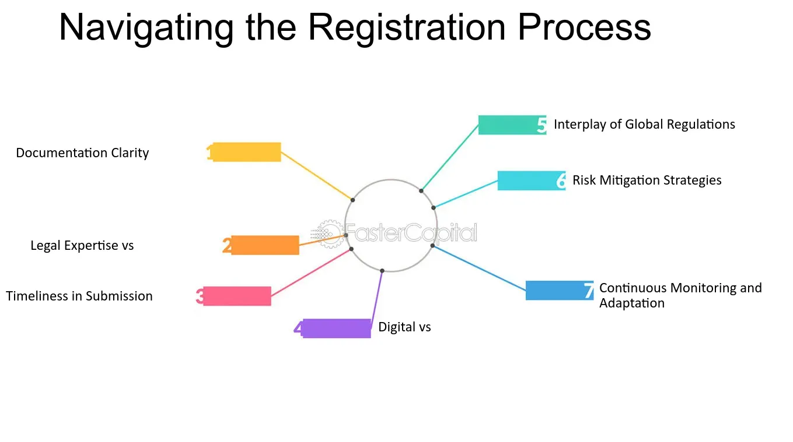

## Table of Contents

## What is the registration process for securities?

The registration process for securities is a way for companies to legally offer stocks, bonds, or other types of securities to the public. This process is overseen by the Securities and Exchange Commission (SEC) in the United States. When a company wants to sell securities, it must first file a registration statement with the SEC. This statement includes important details about the company and the securities being offered, like financial statements, how the company plans to use the money raised, and any risks involved.

After the company submits the registration statement, the SEC reviews it to make sure all the information is accurate and complete. This review can take several weeks or even months. During this time, the company might need to make changes or provide more information. Once the SEC is satisfied, they will declare the registration statement "effective," which means the company can start selling the securities to the public. This process helps protect investors by making sure they have access to all the necessary information before they decide to buy the securities.

## Why is it important to comply with SEC regulations?

Complying with SEC regulations is important because it helps keep the financial markets fair and safe for everyone. When companies follow these rules, they make sure that investors get all the information they need to make smart choices about buying or selling securities. This transparency helps prevent fraud and keeps the market honest. If companies don't follow the rules, they could face big fines or legal trouble, which can hurt their business and reputation.

It's also important because it builds trust in the market. When investors know that companies are playing by the rules, they feel more confident about putting their money into the market. This trust is key for the economy to grow and stay strong. Without it, people might be scared to invest, which could slow down economic progress. So, following SEC regulations is not just good for individual companies, but for the whole financial system.

## What are the basic steps involved in registering securities with the SEC?

When a company wants to sell securities like stocks or bonds to the public, they need to register them with the SEC. The first step is to prepare a registration statement. This is a big document that tells the SEC and potential investors all about the company and the securities they want to sell. It includes things like financial statements, how the company plans to use the money they raise, and any risks people should know about. The company sends this document to the SEC and waits for them to review it.

Once the SEC gets the registration statement, they start checking it to make sure everything is correct and complete. This can take a while, sometimes several weeks or even months. During this time, the company might need to fix things or give more information if the SEC asks for it. When the SEC is happy with everything, they will say the registration statement is "effective." This means the company can finally start selling their securities to the public. This whole process helps make sure investors have all the information they need to make good choices.

## Who needs to register securities with the SEC?

Companies that want to sell securities like stocks or bonds to the public need to register them with the SEC. This rule applies to both new companies that are going public for the first time and existing companies that want to sell more securities. The main goal is to make sure investors get all the important information they need before they decide to buy.

The SEC looks at the registration statement to check if it's correct and complete. This process can take a while, sometimes several weeks or even months. If the SEC finds any issues, the company has to fix them before they can start selling their securities. Once everything is okay, the SEC will say the registration is "effective," and the company can go ahead and offer their securities to the public.

## What are the different types of registration statements?

There are different types of registration statements that companies can use when they want to sell securities. The most common one is called Form S-1. This form is used by companies that are going public for the first time. It includes a lot of details about the company, like their financial statements, how they plan to use the money they raise, and any risks people should know about. Another type is Form S-3, which is used by companies that are already public and have been reporting to the SEC for at least a year. This form is simpler and faster to use because the company already has a track record.

There's also Form S-4, which is used for business combinations like mergers or acquisitions. This form gives information about both companies involved in the deal and how the new securities will work. Form S-8 is used when a company wants to offer securities to its employees, like through a stock option plan. This form is simpler because it's for internal use and doesn't involve selling to the public. Each type of form has its own rules and is used for different situations, but they all help make sure investors get the information they need.

## What is the difference between Form S-1 and Form S-3?

Form S-1 and Form S-3 are both registration statements used by companies to sell securities, but they are used in different situations. Form S-1 is used by companies that are going public for the first time. It's a detailed form that includes a lot of information about the company, like their financial statements, how they plan to use the money they raise, and any risks people should know about. This form is important because it's the first time the company is sharing this information with the public, so it needs to be thorough.

On the other hand, Form S-3 is used by companies that are already public and have been reporting to the SEC for at least a year. This form is simpler and faster to use because the company already has a track record and the public has access to their ongoing reports. Form S-3 is often used for things like secondary offerings, where the company wants to sell more securities to the public after they've already gone public. The main difference is that Form S-1 is for new companies going public, while Form S-3 is for established companies that want to sell more securities.

## How does the SEC review process work for registration statements?

When a company wants to sell securities, they send a registration statement to the SEC. The SEC then starts looking at this statement to make sure all the information is correct and complete. This review can take several weeks or even months. During this time, the SEC might ask the company to fix things or give more information if something is missing or unclear. The company has to respond to these requests and make any needed changes.

Once the SEC is happy with everything in the registration statement, they will say it's "effective." This means the company can start selling their securities to the public. The whole process is important because it helps make sure investors have all the information they need to make good choices. If the SEC finds any big problems or thinks the company isn't telling the truth, they might not let the company sell their securities until everything is fixed.

## What are the common deficiencies found in SEC registration statements?

When the SEC looks at registration statements, they often find some common problems. One big issue is when the financial information isn't right. This can happen if the numbers in the financial statements are wrong or if the company doesn't explain them well enough. Another common problem is when the company doesn't tell investors about all the risks they might face. This means they might not mention things like competition or legal problems that could affect their business.

Another thing the SEC often sees is when the company's story about what they plan to do with the money they raise isn't clear or believable. If investors can't understand how the company is going to use the money, they might not want to buy the securities. Also, if the company doesn't explain how their business works in a way that's easy to understand, that can be a problem too. The SEC wants to make sure all the information in the registration statement is accurate and complete so investors can make smart choices.

## What are the ongoing reporting requirements after registration?

After a company registers its securities with the SEC, it has to keep sending reports to the SEC to let investors know how the company is doing. These reports are really important because they help investors stay updated on the company's financial health and any big changes that happen. The main reports a company has to file are called Form 10-K and Form 10-Q. The Form 10-K is a big report that comes out once a year and gives a detailed look at the company's finances, operations, and risks. The Form 10-Q is a shorter report that comes out every three months and gives a quick update on how things are going.

Besides these main reports, there are also other forms a company might need to file. For example, if something big happens, like a merger or a new CEO, the company has to file a Form 8-K to tell investors about it right away. This keeps everyone in the loop and helps make sure the market stays fair and honest. All these reports are important because they help investors make good choices about whether to keep their money in the company or not.

## How can a company ensure compliance with SEC regulations post-registration?

After registering with the SEC, a company needs to keep following the rules to stay compliant. They have to send regular reports like the Form 10-K every year and the Form 10-Q every three months. These reports tell investors about the company's money situation, how it's doing, and any risks. If something big happens, like a merger or a new CEO, the company also has to file a Form 8-K right away. Keeping up with these reports is important because it helps investors make good choices about their money.

To make sure they're following the rules, a company should have a good system for keeping track of all the reports and deadlines. They might need to hire people who know a lot about SEC rules or work with lawyers and accountants who can help. It's also a good idea to keep learning about any new rules the SEC might make. By staying organized and getting help when they need it, a company can keep doing what the SEC asks and keep the trust of their investors.

## What are the penalties for non-compliance with SEC regulations?

If a company doesn't follow SEC rules, they can get into big trouble. The SEC can fine the company a lot of money. These fines can be really high, sometimes millions of dollars. The SEC can also take the company to court. If they win, the company might have to pay even more money or stop doing certain things. The people in charge at the company, like the CEO or CFO, can also get in trouble. They might have to pay fines or even go to jail if they did something really wrong.

Not following SEC rules can also hurt the company's reputation. If people find out the company isn't being honest or following the rules, they might not want to invest in it anymore. This can make the company's stock price go down and make it harder for them to get money in the future. So, it's really important for companies to follow SEC rules to avoid these big problems.

## What advanced strategies can be used to optimize the registration process and SEC compliance?

To optimize the registration process and ensure SEC compliance, a company can start by using technology to help with all the paperwork. There are special software programs that can keep track of all the documents and deadlines. These programs can remind the company when it's time to send in reports like the Form 10-K and Form 10-Q. They can also help make sure all the information is correct and complete before it gets sent to the SEC. By using these tools, a company can save time and make fewer mistakes, which makes the whole process smoother and faster.

Another smart strategy is to work closely with experts who know a lot about SEC rules. This can include lawyers, accountants, and compliance officers. These experts can help the company understand the rules better and make sure they're doing everything right. They can also help the company prepare for any changes in the rules and keep up with new requirements. By having these experts on their team, a company can stay ahead of any problems and keep their investors happy and informed.

## References & Further Reading

[1]: Lewis, M. (2014). ["Flash Boys: A Wall Street Revolt"](https://en.wikipedia.org/wiki/Flash_Boys) by Michael Lewis.

[2]: SEC Division of Trading and Markets. (2020). ["Risk Management Controls for Brokers or Dealers with Market Access (Rule 15c3-5)"](https://www.ecfr.gov/current/title-17/chapter-II/part-240/subpart-A/subject-group-ECFR541343e5c1fa459/section-240.15c3-5).

[3]: Harris, L. (2015). ["Trading and Exchanges: Market Microstructure for Practitioners"](https://www.amazon.com/Trading-Exchanges-Market-Microstructure-Practitioners/dp/0195144708) by Larry Harris.

[4]: Budish, E., Cramton, P., & Shim, J. (2015). ["The High-Frequency Trading Arms Race: Frequent Batch Auctions as a Market Design Response"](https://academic.oup.com/qje/article/130/4/1547/1916146). Quarterly Journal of Economics.

[5]: ["Securities Exchange Act of 1934"](https://en.wikipedia.org/wiki/Securities_Exchange_Act_of_1934), U.S. Securities and Exchange Commission.