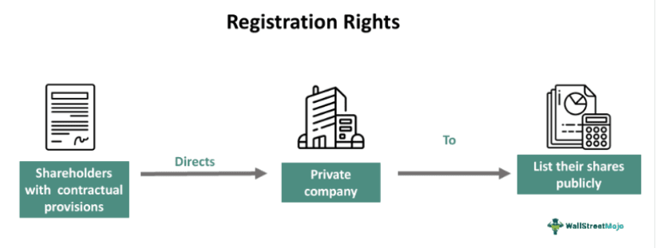

Securities investment is a fundamental aspect of the global financial system, involving the allocation of capital into various financial instruments such as stocks, bonds, and derivatives. This process is aimed at generating returns through capital appreciation, dividends, or interest income. Central to understanding securities investment are two critical components: registration rights and algorithmic trading, both of which have significant influences on the dynamics of the industry.

Registration rights represent a set of legal privileges that allow shareholders, particularly in private companies, to demand that their shares be registered with regulatory authorities for public trading. These rights are vital for creating liquidity in private markets and are often a crucial aspect of investment agreements, particularly during initial public offerings (IPOs) or secondary stock sales. Registration rights are not homogeneous; they can be categorized into demand rights and piggyback rights, each serving distinct purposes in facilitating market access and trading flexibility.

Meanwhile, algorithmic trading has revolutionized the securities markets over recent decades. This form of trading involves the use of sophisticated computer algorithms to execute trades at high speed and volume, often with minimal human intervention. Algorithms can analyze market data, identify trading opportunities, and execute orders within fractions of a second, thus significantly enhancing market efficiency and liquidity. Algorithmic trading employs a variety of strategies, such as arbitrage, market making, and momentum trading, each tailored to capitalize on specific market conditions.

The interplay between registration rights and algorithmic trading illustrates the evolving nature of securities investment. As technological advancements continue to reshape market operations, understanding how these elements interact is essential for investors, firms, and regulators alike. This article provides an in-depth exploration of these facets, offering insights into their roles and interconnections in the broader investment landscape. By examining the complexities of securities investment, this discussion aims to equip readers with the knowledge necessary for navigating the rapidly changing financial environment effectively.

## Table of Contents

## Explaining Securities Investment

Securities investment involves the allocation of financial resources into various financial instruments such as stocks, bonds, and derivatives, with the primary goal of generating returns. At its core, effective securities investment necessitates strategies that aim to maximize returns while concurrently managing and mitigating risks, particularly in markets characterized by volatility. 

To succeed in securities investment, investors employ both fundamental and technical analysis. Fundamental analysis involves evaluating a security's intrinsic value by examining related economic, financial, and other qualitative and quantitative factors. This type of analysis often includes an assessment of a company's financial statements, management team, competitive advantages, industry position, and overall economic environment. For instance, the price-to-earnings ratio (P/E ratio) is a common metric used in [fundamental analysis](/wiki/fundamental-analysis) to gauge whether a stock is over or undervalued.

$$
\text{P/E Ratio} = \frac{\text{Market Value per Share}}{\text{Earnings per Share (EPS)}}
$$

On the other hand, technical analysis focuses on price and [volume](/wiki/volume-trading-strategy) information to forecast future market movements. It involves the use of charts and patterns to identify trends and potential buy or sell signals. Indicators such as moving averages, relative strength index (RSI), and moving average convergence divergence (MACD) are commonly employed tools in technical analysis. These quantitative measures help investors make decisions based on historical price movements and trade volumes. 

Both types of analysis provide insights that are crucial for formulating effective investment strategies. A well-rounded investor will often use a combination of both approaches to gain a comprehensive understanding of potential investment opportunities. In practice, securities investment also requires attention to market trends, [interest rate](/wiki/interest-rate-trading-strategies) fluctuations, and geopolitical contexts which can influence market dynamics and investor sentiment. 

Successful securities investment is thus characterized by informed decision-making, which relies heavily on the rigorous analysis of available data and the systematic application of investment principles to achieve desired financial outcomes.

## Overview of Registration Rights

Registration rights are contractual agreements that enable private shareholders to convert their privately-held shares into publicly-traded ones, thereby creating [liquidity](/wiki/liquidity-risk-premium). These rights are crucial for shareholders who wish to sell their shares in the public market, as they provide a structured process to facilitate such transactions.

**Types of Registration Rights**

There are two primary types of registration rights that shareholders may possess: demand rights and piggyback rights.

1. **Demand Rights**: Demand rights allow shareholders to compel the company to initiate the process of registering their shares with the Securities and Exchange Commission (SEC). This type of right is particularly valuable because it provides shareholders with a mechanism to prompt a public offering, even if the company was not planning one. Demand rights typically outline specific conditions, such as the minimum number of shares that must be offered to exercise these rights and limits on the frequency of demands. The ability to initiate a public offering can be a significant advantage for investors seeking liquidity, especially in scenarios where market conditions are favorable for selling shares.

2. **Piggyback Rights**: Piggyback rights, by contrast, are more passive; they allow shareholders to include their shares in a public offering initiated by the company or another shareholder with demand rights. When the company decides to go public, shareholders with piggyback rights are notified and can choose to "piggyback" their own shares onto the offering. These rights are beneficial for providing liquidity without the complexities associated with initiating the offering themselves, but they depend on the company's decision to register shares.

**Impact on Company Strategies**

The existence of registration rights can significantly influence a company's strategic decisions, particularly regarding the timing and conditions under which it goes public. Companies must take into consideration the potential demands of shareholders holding registration rights when planning their capital-raising activities. The pressure to accommodate shareholder demands can affect the optimal timing of an initial public offering (IPO) or any subsequent offerings, potentially leading to offerings that align more with shareholder needs than with market conditions.

Moreover, registration rights can compel a company to maintain readiness for public offerings, as failure to honor these rights may lead to legal consequences or strained relationships with key shareholders. As a result, companies often negotiate the specifics of registration rights carefully during investment rounds to balance the interests of the company and its investors.

Overall, registration rights play a pivotal role in defining the pathways available for shareholders to gain liquidity and influence the strategic decisions made by companies regarding public offerings.

## Algorithmic Trading: Revolutionizing Markets

Algorithmic trading employs advanced computer programs and algorithms to execute trades in financial markets at speeds and scales that surpass human capability. By using algorithms—detailed instructions pre-defined in the program—trading decisions are made based on real-time data and market analysis, allowing for rapid and high-volume transactions.

One prominent strategy employed in [algorithmic trading](/wiki/algorithmic-trading) is [arbitrage](/wiki/arbitrage), which involves exploiting price differentials of identical or similar financial instruments in different markets or forms. For instance, if a stock is priced differently on two exchanges, an algorithm could buy the stock at the lower price and sell it at the higher price, effectively securing a risk-free profit. Market-making, another common strategy, involves providing liquidity to markets by simultaneously offering to buy and sell securities. Algorithms in this strategy analyze bid and ask spread to decide the quantity and price at which to place orders, thus profiting from the spread.

Regulatory concerns are integral to the operation of algorithmic trading. The Financial Industry Regulatory Authority (FINRA) and the Securities and Exchange Commission (SEC) are two major bodies governing these practices in the United States. They ensure that firms engaging in algorithmic trading adhere to ethical practices and maintain market stability. The developers and traders working with these algorithms must meet specific qualifications, often requiring expertise in quantitative fields such as mathematics, [statistics](/wiki/bayesian-statistics), or computer science. They must not only understand the algorithms themselves but also the underlying financial principles and market structures to design efficient and compliant trading systems.

Regulations also target potential risks associated with algorithmic trading, such as flash crashes—sudden, deep, and rapid market sell-offs caused by automated trading—by mandating risk controls and transparency measures. Furthermore, recent regulatory changes focus on enhancing system integrity and protecting investor interests, aiming to adapt to the evolving landscape of technology-driven finance.

Algorithmic trading has fundamentally transformed financial markets, enhancing liquidity, reducing costs, and increasing market efficiency. However, it also necessitates rigorous regulation to mitigate associated risks and ensure market integrity.

## Intersection Between Registration Rights and Algorithmic Trading

Algorithmic trading refers to the use of computer programs and algorithms to execute trades at speeds and volumes that far exceed human capabilities. These platforms play a significant role in optimizing investment portfolios by incorporating registration rights, which help realize benefits such as enhanced liquidity and streamlined trading processes.

Registration rights allow shareholders of private companies to demand the public registration of their shares or to tag along with the company's shares during a public offering. These rights can significantly impact investment strategies, especially when paired with algorithmic trading platforms. These platforms utilize advanced algorithms to manage portfolios that may include securities with registration rights, ensuring optimal timing and execution of trades based on precise market data and trends. Automated algorithms can swiftly assess the impact of a company going public or private shares being introduced to the market, allowing investors to make quick, informed decisions.

Algorithmic trading enhances the liquidity options these rights provide by enabling high-speed transactions and seamless access to various markets. For example, when a shareholder exercises their registration rights, the resulting public offering or sale can introduce a significant volume of new shares into the market. Algorithmic trading systems can absorb this influx by automatically executing trades at optimal prices, maintaining liquidity, and stabilizing the market. This technology ensures that the increased share volume is managed effectively, preventing potential disruptions in trading.

Moreover, technology streamlines the complexities involved in exercising registration rights. The traditional process of registering shares for public offerings involves intricate legal and regulatory procedures, which can be cumbersome and time-consuming. Algorithmic trading platforms can integrate these processes, providing real-time analysis, compliance checks, and documentation management, thus reducing the administrative burden on investors and companies. Additionally, they can utilize [artificial intelligence](/wiki/ai-artificial-intelligence) and [machine learning](/wiki/machine-learning) to predict the best times for executing these rights, accounting for historical data, market conditions, and investor behavior. 

The integration of registration rights within algorithmic trading platforms reflects the progressive intersection of legal mechanisms and advanced technology, thereby creating more dynamic and responsive investment portfolios. This synergy paves the way for a more efficient securities market where technological advancements support financial strategies.

## Regulatory Considerations

Understanding the legal framework surrounding registration rights and algorithmic trading is crucial for participants in the securities industry. Regulatory bodies like the Financial Industry Regulatory Authority (FINRA) and the U.S. Securities and Exchange Commission (SEC) provide structured guidelines that dictate how these financial activities should operate to protect market integrity and investors.

Registration rights are typically governed by securities laws that ensure transparency and fairness in the market. These rights allow shareholders of private companies the ability to sell shares on public exchanges. Key regulations focus on processes that securities must undergo before being publicly traded, including due diligence and disclosure requirements. The legal obligation to register securities with the SEC is intended to ensure that investors have accurate information to make informed decisions. Recent regulatory updates emphasize reducing administrative burdens while maintaining rigorous checks to prevent fraudulent activity.

Algorithmic trading, due to its complexity and speed, poses unique regulatory challenges. FINRA and the SEC have imposed regulations to maintain ethical deployment of algorithms, focusing on preventing market manipulation and ensuring fair competition. Regulations require developers and traders in this domain to adhere to strict compliance with existing financial laws. These include maintaining robust risk management systems, ensuring algorithm accuracy, and continuously monitoring their impact on market conditions. Recent changes have called for enhanced transparency in algorithmic strategies, and tighter controls around high-frequency trading to mitigate systemic risk.

The convergence of registration rights and algorithmic trading also brings regulatory considerations to the fore. With technology facilitating rapid execution and broader market access, there is a heightened need for regulations that accommodate new trading paradigms while safeguarding investor interests. Compliance with registration processes and ensuring ethical trading practices are at the heart of these regulatory updates.

In summary, the legal framework surrounding registration rights and algorithmic trading encompasses a comprehensive set of guidelines that aim to harmonize technological advancements with market stability and investor protection. Staying informed on these evolving regulations is essential for investors and firms seeking to optimize their roles in the securities markets.

## Future Trends and Innovations

Securities investment is poised for significant transformation driven by technological advancements, particularly through innovations such as blockchain and artificial intelligence (AI). These technologies promise to revolutionize the efficiency and capability of both registration processes and trading strategies.

Blockchain technology, known for its secure and immutable ledger system, offers the potential to streamline registration processes. By eliminating intermediaries, blockchain can reduce the time and cost associated with traditional registration, while enhancing transparency and security. This digital ledger could ensure that transactions are recorded in a decentralized and tamper-proof manner, thus revolutionizing the management of registration rights. Smart contracts, a feature of blockchain, could automate and enforce the terms embedded in registration agreements, reducing the likelihood of disputes and manual errors.

Artificial Intelligence, with its capacity for data analysis and pattern recognition, is driving further innovation in trading strategies. Machine learning models can analyze vast amounts of market data to generate predictive insights that inform trading decisions. The ability of AI to process information at speeds far exceeding human capability facilitates the development of more sophisticated algorithmic trading models. These models can interpret complex datasets to optimize trading portfolios and adapt to market changes dynamically.

The future of algorithmic trading is intricately linked with evolving market conditions and regulatory landscapes. The use of AI in trading systems necessitates robust regulatory frameworks to ensure ethical deployment and compliance. Regulators are increasingly focusing on defining clear guidelines to manage the risks associated with AI-driven trading, such as market manipulation and system malfunctions.

Integration of blockchain and AI in securities investment is likely to foster a more seamless and efficient market environment. Investment firms might increasingly rely on these technologies to enhance decision-making processes, optimize asset management, and mitigate risks. As technology continues to advance, it is expected that the securities industry will witness the emergence of new tools and platforms that leverage these innovations to gain competitive advantages. 

The ongoing technological evolution in securities investment underscores the importance of adaptability and foresight. Market participants who embrace these advancements are likely to secure enhanced operational efficiencies and better investment outcomes in an increasingly digitized financial landscape.

## Conclusion

In modern securities investment, registration rights and algorithmic trading play vital roles. Registration rights empower private shareholders by providing mechanisms to initiate public offerings, thus facilitating liquidity and offering more avenues for financial maneuvering. These rights vary, including demand and piggyback rights, each enabling firms and investors to adopt flexible strategies when considering public listings of shares. 

Algorithmic trading, on the other hand, has revolutionized how securities are traded by employing sophisticated computer algorithms for rapid and high-volume transactions. This has not only increased the efficiency and speed of trading but also made it possible to exploit market opportunities in real-time. By incorporating complex strategies like arbitrage and market-making, algorithmic trading significantly enhances market liquidity and allows for more precise investment strategies.

The intersection of registration rights and algorithmic trading is evident in how technology facilitates market access and optimizes the execution of securities trades. It effectively reduces the complexities involved in exercising registration rights, making the process smoother and more dynamic.

Remaining informed about regulatory changes and technological advancements is crucial for leveraging registration rights and algorithmic trading effectively. As regulatory bodies like FINRA (Financial Industry Regulatory Authority) and the SEC (Securities and Exchange Commission) continue to update compliance requirements and standards, staying abreast of these changes is vital. These regulations ensure ethical practices and protect market integrity while fostering innovation.

Forward-thinking investors and firms are encouraged to harness the potential of these tools. By embracing the advancements in algorithmic trading and understanding the strategic application of registration rights, stakeholders can enhance their investment outcomes. The careful integration of these elements, driven by evolving technologies such as blockchain and artificial intelligence, sets the foundation for future advancements and more sophisticated investment strategies.

## References & Further Reading

[1]: Boone, Andrew L., & Mulherin, J. Harold. (2007). ["How Are Firms Sold?"](https://onlinelibrary.wiley.com/doi/10.1111/j.1540-6261.2007.01225.x) Journal of Finance, 62(2), 847-875.

[2]: Ferri, Michael, & Prior, Julian. (2010). ["Historical Insights into Algorithmic Trading Relevance to Modern Growth,"](https://github.com/stefan-jansen/machine-learning-for-trading) The Journal of Trading.

[3]: Lopez de Prado, Marcos. (2018). ["Advances in Financial Machine Learning."](https://www.amazon.com/Advances-Financial-Machine-Learning-Marcos/dp/1119482089) Wiley Finance.

[4]: Chan, Ernest P. (2009). ["Quantitative Trading: How to Build Your Own Algorithmic Trading Business."](https://github.com/ftvision/quant_trading_echan_book) Wiley Trading. 

[5]: Black, Fischer & Scholes, Myron. (1973). ["The Pricing of Options and Corporate Liabilities."](https://www.cs.princeton.edu/courses/archive/fall09/cos323/papers/black_scholes73.pdf) Journal of Political Economy, 81(3), 637-654.

[6]: Bayes, Thomas. (1763). ["An Essay towards Solving a Problem in the Doctrine of Chances."](https://probabilityandfinance.com/pulskamp/Bayes/bayesessay-rjp.pdf) Philosophical Transactions of the Royal Society of London.