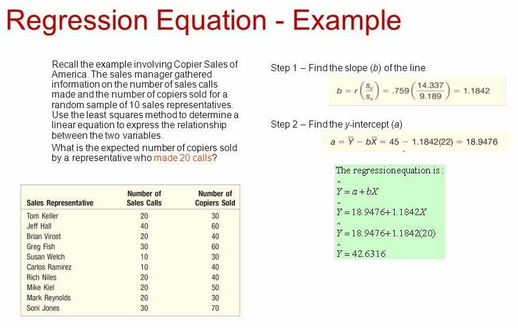

## Table of Contents

## What is regression analysis?

Regression analysis is a statistical method used to understand the relationship between a dependent variable and one or more independent variables. It helps to predict how changes in the independent variables will affect the dependent variable. For example, a business might use regression analysis to see how changes in advertising spending could impact sales.

There are different types of regression analysis, but the most common one is linear regression. In linear regression, the relationship between the variables is modeled as a straight line. This line can be used to make predictions about future outcomes based on the data. For instance, if you know how much it rains, you can use linear regression to predict how many umbrellas will be sold.

Regression analysis is useful in many fields, such as economics, finance, and social sciences. It helps researchers and analysts make informed decisions by providing a clearer picture of how different factors are related. By understanding these relationships, people can make better predictions and plan more effectively for the future.

## What are the different types of regression analysis?

There are several types of regression analysis, each suited for different kinds of data and situations. The most common type is linear regression, which assumes a straight-line relationship between the independent and dependent variables. It's great for simple predictions, like guessing how much ice cream will be sold based on the temperature. Another type is multiple regression, which is similar to linear regression but uses more than one independent variable. For example, it can help predict a house's price by considering its size, location, and age all at once.

Logistic regression is used when the dependent variable is categorical, meaning it has categories like "yes" or "no," instead of being a number. It's often used in medical fields to predict the likelihood of a disease based on various risk factors. Polynomial regression is used when the relationship between variables isn't a straight line but a curve. It's useful for things like predicting the growth rate of plants over time. Lastly, ridge regression and lasso regression are types used when you have many independent variables, helping to prevent the model from overfitting by adding a penalty to the regression equation.

Each type of regression analysis has its own strengths and is chosen based on the nature of the data and the specific question being asked. By selecting the right type of regression, analysts can make more accurate predictions and gain deeper insights into the relationships between variables.

## How do you choose the right type of regression analysis for your data?

Choosing the right type of regression analysis depends on the kind of data you have and what you want to learn from it. If your data has just one independent variable and you think the relationship with the dependent variable is a straight line, then linear regression is a good choice. It's simple and works well for straightforward predictions. But if you have more than one independent variable, you might want to use multiple regression. This lets you see how several factors together affect the outcome, like how both temperature and humidity might affect ice cream sales.

Sometimes, the relationship between your variables isn't a straight line but more like a curve. In that case, polynomial regression could be better because it can fit curved lines to your data. If your dependent variable is not a number but a category, like "pass" or "fail," then logistic regression is the way to go. It helps predict the probability of something happening, like whether a student will pass an exam based on their study hours. Lastly, if you have a lot of independent variables and you're worried about overfitting, ridge or lasso regression can help by adding a penalty to keep the model simpler and more reliable.

In the end, [picking](/wiki/asset-class-picking) the right type of regression comes down to understanding your data and your goals. By choosing the right method, you can make better predictions and gain more useful insights from your analysis.

## What is the difference between simple and multiple regression?

Simple regression and multiple regression are two types of linear regression. Simple regression is used when you want to see how one thing affects another thing. For example, if you want to know how the temperature affects ice cream sales, you would use simple regression. It's called "simple" because it only looks at one independent variable, like temperature, to predict the dependent variable, like ice cream sales.

Multiple regression, on the other hand, is used when you want to see how several things together affect one thing. For instance, if you want to predict a house's price, you might look at its size, location, and age all at once. Multiple regression is more complex because it considers more than one independent variable, like size, location, and age, to predict the dependent variable, like the house's price. This helps you understand how all these factors work together to influence the outcome.

## How do you interpret the results of a regression analysis?

When you look at the results of a regression analysis, you're trying to understand how the independent variables affect the dependent variable. The most important thing to look at is the regression coefficients. These numbers tell you how much the dependent variable changes when the independent variable changes by one unit. For example, if you're looking at how temperature affects ice cream sales, a coefficient of 2 means that for every degree the temperature goes up, ice cream sales go up by 2 units. You also want to check the p-value, which tells you if the relationship you found is likely to be real or just a coincidence. A small p-value (usually less than 0.05) means the relationship is probably real.

Another thing to look at is the R-squared value. This number tells you how well your model fits the data. It's a percentage that shows how much of the change in the dependent variable can be explained by the independent variables. For example, an R-squared of 80% means that 80% of the changes in ice cream sales can be explained by the temperature. The rest might be due to other things you didn't include in your model. By looking at these numbers, you can understand how strong the relationship is between your variables and how well your model works for making predictions.

## What are the assumptions of linear regression?

Linear regression makes some important guesses about your data to work well. One big guess is that the relationship between your independent and dependent variables is a straight line. This means if you draw a line through your data points, it should fit pretty well. Another guess is that the errors, or the differences between your line and the actual data points, are normally spread out. This means they should be randomly scattered around the line, not bunched up on one side or the other. Also, these errors should have the same spread all along the line, not getting bigger or smaller as your independent variable changes.

Another important guess is that your independent variables are not too closely related to each other. If they are, it can mess up your results, making it hard to tell which variable is really affecting the dependent variable. Lastly, linear regression assumes that your data points are independent of each other. This means that knowing one data point shouldn't help you guess another one. For example, if you're looking at how temperature affects ice cream sales, the sales on one day shouldn't tell you much about the sales on another day. By checking these guesses, you can make sure your linear regression results are reliable and useful.

## How do you test for the assumptions of linear regression?

To test the assumptions of linear regression, you can start by checking if the relationship between your independent and dependent variables is a straight line. You can do this by making a scatter plot of your data and seeing if a straight line fits well. If the points look like they follow a curve instead, you might need to use a different kind of regression. You can also use a tool called a residual plot to check if the errors are randomly spread out. If the errors look like they're bunched up on one side or the other, or if they get bigger or smaller as your independent variable changes, then the assumption of normally distributed errors with constant variance might not hold.

Another way to check the assumptions is to look at the correlation between your independent variables. You can use something called a correlation matrix to see if any of your variables are too closely related. If they are, you might have a problem called multicollinearity, which can make it hard to tell which variable is really affecting your dependent variable. Finally, you can test for independence of your data points by thinking about how your data was collected. If your data points are related to each other, like sales data from different days of the week, you might need to adjust your analysis to account for this. By checking these things, you can make sure your linear regression results are trustworthy and useful.

## What is multicollinearity and how does it affect regression analysis?

Multicollinearity happens when two or more independent variables in your regression analysis are closely related to each other. Imagine you're trying to predict a house's price using its size and the number of rooms. Size and number of rooms are often related because bigger houses usually have more rooms. When variables are like this, it's hard for the regression model to figure out which one is really affecting the house price.

This can cause big problems in your analysis. It can make the coefficients of your variables unreliable, meaning you can't trust the numbers that tell you how much each variable affects the dependent variable. It can also make it seem like none of your variables are important, even if they really are. To fix this, you might need to remove one of the related variables or combine them into one. By doing this, you can make your regression analysis more accurate and easier to understand.

## How can you handle outliers in regression analysis?

Outliers are data points that are very different from the others. They can mess up your regression analysis by pulling your line of best fit away from where it should be. If you keep outliers in your data, your predictions might not be as good as they could be. So, it's important to find and deal with outliers before you do your analysis.

There are a few ways to handle outliers. One way is to just take them out of your data set. If an outlier is clearly a mistake, like a typo, it's okay to remove it. But if you're not sure, you can try another method called winsorizing. This means you change the outlier to be closer to the other data points, but you don't take it out completely. Another way is to use a type of regression that can handle outliers better, like robust regression. By choosing the right method, you can make your regression analysis more accurate and reliable.

## What are some advanced regression techniques and when should they be used?

Advanced regression techniques go beyond the basics of linear and multiple regression, helping to deal with more complex data and relationships. One such technique is ridge regression, which is useful when you have a lot of independent variables and you're worried about overfitting. Overfitting happens when your model fits the data too well, including the noise, and doesn't work as well for new data. Ridge regression adds a penalty to the coefficients to keep them from getting too big, making the model simpler and more reliable. Another advanced method is lasso regression, which is similar to ridge regression but can actually set some coefficients to zero, effectively removing less important variables from the model. This is great when you want to reduce the number of variables you're working with.

Another advanced technique is polynomial regression, which you use when the relationship between your variables isn't a straight line but a curve. This can help you fit more complex patterns in your data, like how a plant's growth rate might change over time. Then there's logistic regression, which is used when your dependent variable is categorical, like "yes" or "no." It's often used in fields like medicine to predict the likelihood of a disease based on various risk factors. Lastly, there's quantile regression, which looks at different parts of the data distribution rather than just the average. This can be helpful if you're interested in how the relationship between variables changes at different levels, like understanding how income affects spending differently for low-income versus high-income groups. Each of these advanced techniques can help you get a better understanding of your data and make more accurate predictions.

## How do you validate a regression model?

To make sure your regression model is good and works well, you need to validate it. One way to do this is by splitting your data into two parts: a training set and a test set. You use the training set to build your model, and then you use the test set to see how well it predicts new data. If your model does a good job on the test set, that's a sign it's working well. Another way to validate your model is by using cross-validation. This means you split your data into several smaller parts, build your model on all but one part, and then test it on the part you left out. You do this over and over, each time leaving out a different part, and then you average the results. This helps you see how well your model works across different parts of your data.

Another important thing to check is how well your model fits the data. You can do this by looking at the R-squared value, which tells you how much of the change in your dependent variable is explained by your independent variables. A higher R-squared means your model fits the data better. But you also need to check for overfitting, which happens when your model fits the training data too well but doesn't work as well on new data. To check for overfitting, you can compare how well your model does on the training set versus the test set. If it does much better on the training set, it might be overfitting. By using these methods, you can make sure your regression model is reliable and useful for making predictions.

## What are the common pitfalls in regression analysis and how can they be avoided?

One common pitfall in regression analysis is not checking the assumptions of the model. Linear regression, for example, assumes that the relationship between your variables is a straight line and that the errors are normally distributed and have the same spread. If these assumptions aren't true, your results might not be reliable. To avoid this, you can use scatter plots and residual plots to check if the assumptions hold. If they don't, you might need to use a different type of regression or transform your data to fit the assumptions better.

Another pitfall is overfitting, which happens when your model fits the data too well, including the noise, and doesn't work as well for new data. This can make your predictions less accurate. To prevent overfitting, you can use techniques like cross-validation, where you split your data into several parts and test your model on each part. You can also use methods like ridge or lasso regression, which add a penalty to the coefficients to keep the model simpler and more reliable.

Lastly, multicollinearity is a problem when your independent variables are too closely related to each other. This can make it hard to tell which variable is really affecting the dependent variable and can make your coefficients unreliable. To avoid multicollinearity, you can check the correlation between your variables using a correlation matrix. If you find variables that are too closely related, you might need to remove one of them or combine them into a single variable. By being aware of these common pitfalls and taking steps to avoid them, you can make your regression analysis more accurate and trustworthy.

## What is the understanding of statistical modeling in trading?

Statistical modeling is essential in the field of trading for analyzing and comprehending financial data. By applying statistical methods, traders can systematically identify patterns, correlations, and trends within complex and often large datasets. This analysis aids in predicting future price movements and uncovering lucrative investment opportunities.

Traders employ a wide array of statistical models, ranging from straightforward linear regression to more sophisticated machine learning algorithms. Each model has its specific applications and advantages within the trading domain. For instance, linear regression helps establish the relationship between a dependent variable, such as stock price, and one or more independent variables. Its simplicity and ease of implementation make it a commonly used tool in trading.

In practice, a linear regression model might be used to forecast a stock's closing price based on historical data of trading volumes and previous closing prices. The model can be expressed with the equation:

$$
y = \beta_0 + \beta_1x_1 + \beta_2x_2 + \cdots + \beta_nx_n + \epsilon
$$

where $y$ is the predicted closing price, $\beta_0$ is the intercept, $\beta_1, \beta_2, \ldots, \beta_n$ are the coefficients for each independent variable $x_1, x_2, \ldots, x_n$, and $\epsilon$ represents the error term.

For more complex scenarios, traders turn to [machine learning](/wiki/machine-learning) algorithms like decision trees, support vector machines, and neural networks. These models can capture nonlinear relationships in data, offering more robust predictions in dynamic market conditions. For example, a [neural network](/wiki/neural-network) might be trained to predict stock prices based on a variety of inputs, such as macroeconomic indicators, sentiment analysis from social media, and historical price patterns.

Here's an example of how a simple linear regression model could be implemented in Python using the `scikit-learn` library:

```python
import numpy as np
from sklearn.model_selection import train_test_split
from sklearn.linear_model import LinearRegression
from sklearn.metrics import mean_squared_error

# Example dataset with two independent variables and one dependent variable
X = np.array([
    [100, 200],
    [120, 230],
    [130, 250],
    [150, 300],
    [170, 330],
])  # trading volume, previous closing price
y = np.array([110, 125, 135, 160, 175])  # current closing price

# Split the dataset into training and testing sets
X_train, X_test, y_train, y_test = train_test_split(X, y, test_size=0.2, random_state=42)

# Create and train the model
model = LinearRegression()
model.fit(X_train, y_train)

# Make predictions
y_pred = model.predict(X_test)

# Evaluate the model
mse = mean_squared_error(y_test, y_pred)
print(f'Mean squared error: {mse}')
```

This simple yet powerful tool allows traders to quickly implement and test various strategies on historical data, thereby gaining insights into potential future performance. The power of statistical modeling is its ability to distill vast amounts of data into actionable intelligence, providing traders with an edge in increasingly competitive financial markets.

## What is the Role of Regression Analysis in Financial Markets?

Regression analysis is an essential statistical technique used in the financial markets to explore the relationships between various financial variables and predict future trends. At its core, regression analysis helps traders and analysts understand the dependency of a variable, often an asset price, on one or more independent variables. This understanding can be pivotal in making informed trading decisions.

Traders frequently leverage regression analysis to forecast future stock prices based on historical data. The fundamental idea is to utilize past price movements and other relevant financial indicators as independent variables to project future prices, which serve as the dependent variable. The method's predictive capabilities are vital in formulating trading strategies and assessing potential risks.

### Types of Regression Analysis Methods

Regression analysis encompasses various methods, each with distinct applications in the financial markets:

1. **Linear Regression**: This is the most straightforward form of regression analysis, where the relationship between the dependent and independent variables is presumed to be linear. The model is expressed as:
$$
   Y = \beta_0 + \beta_1X + \epsilon

$$

   Here, $Y$ is the dependent variable (e.g., future stock price), $\beta_0$ is the intercept, $\beta_1$ is the coefficient of the independent variable $X$, and $\epsilon$ represents the error term. Linear regression is instrumental in examining the direct impact of one or more independent variables on the dependent variable.

2. **Logistic Regression**: Unlike linear regression, logistic regression is used when the dependent variable is categorical, typically binary. This technique is often applied in trading scenarios where the outcome could be a binary decision, such as whether to buy or sell a stock. The logistic function, or sigmoid function, models the probability of a certain class or event:
$$
   P(Y=1) = \frac{1}{1 + e^{-(\beta_0 + \beta_1X)}}

$$

3. **Polynomial Regression**: This method extends the concept of linear regression by considering polynomial relationships between the independent and dependent variables. This approach is beneficial when the relationship between variables is non-linear. The model takes the form:
$$
   Y = \beta_0 + \beta_1X + \beta_2X^2 + \ldots + \beta_nX^n + \epsilon

$$

   Polynomial regression can capture more complex patterns in data, which might be missed by simple linear regression.

### Application in Trading

In financial markets, regression analysis refines trading algorithms' accuracy. By employing regression techniques, traders can enhance their models to predict stock prices more precisely, mitigate risks, and optimize portfolio management. For example, a trader might use linear regression to identify trends and [momentum](/wiki/momentum) in stock prices, logistic regression to decide on entry and [exit](/wiki/exit-strategy) points based on market signals, or polynomial regression to capture cyclical patterns more accurately.

Regression analysis also aids in optimizing trading algorithms by providing a framework to backtest strategies using historical data. By evaluating how changes in variables such as interest rates, market indices, or economic indicators impact asset prices, traders can adjust their algorithms for improved performance.

In summary, regression analysis is a powerful tool in financial markets, providing a statistical foundation for effective trading strategies by modeling the relationships between various economic variables and predicting future trends. As traders continue to navigate complex market environments, the precision and insights offered by regression models remain invaluable.

## How can one develop algorithmic trading strategies using statistical methods?

Algorithmic trading strategies are fundamentally rooted in statistical methods that allow traders to automate and optimize their decision-making processes. These strategies rely on statistical models and regression analysis to facilitate the accurate forecasting of market trends and the execution of trades based on well-defined parameters. 

Statistical models serve as the backbone of algorithmic systems by identifying trends and relationships within market data. These models range from basic to advanced, including linear regression, which examines the linear relationship between a dependent variable and one or more independent variables. This approach is useful for predicting future asset prices based on historical values. For example, a simple linear regression model can be expressed as:

$$
Y = \beta_0 + \beta_1 X + \epsilon
$$

where $Y$ represents the dependent variable (e.g., asset price), $X$ is the independent variable (e.g., time), $\beta_0$ and $\beta_1$ are the coefficients, and $\epsilon$ denotes the error term.

Beyond linear regression, other sophisticated techniques like logistic regression and polynomial regression are employed depending on the complexity of the trading scenario. These methods help refine trading strategies by providing insights into non-linear relationships and probabilities of certain events occurring within the market.

Building a trading algorithm commences with the conceptualization of the trading strategy. This involves defining clear objectives, such as maximizing returns or minimizing risk, and identifying relevant market indicators. Once the strategy is conceptualized, statistical tools are employed to analyze historical data, facilitating the development of a model that reliably predicts market movements.

Subsequently, these predictions are encoded into a trading algorithm. For example, a Python-based algorithm might use libraries such as NumPy and SciPy for statistical analysis or pandas for data handling. A simple example of integrating a linear regression model into a trading algorithm using Python might look like this:

```python
import pandas as pd
from sklearn.model_selection import train_test_split
from sklearn.linear_model import LinearRegression

# Load market data
data = pd.read_csv('market_data.csv')

# Define independent and dependent variables
X = data[['feature1', 'feature2']]  # Independent variables
Y = data['asset_price']  # Dependent variable

# Split data into training and test sets
X_train, X_test, Y_train, Y_test = train_test_split(X, Y, test_size=0.2, random_state=42)

# Create and train the model
model = LinearRegression()
model.fit(X_train, Y_train)

# Make predictions
predictions = model.predict(X_test)

# Output predictions
print(predictions)
```

In recent years, the introduction of machine learning and AI has revolutionized [algorithmic trading](/wiki/algorithmic-trading) strategies. Machine learning algorithms, such as neural networks and support vector machines, can manage more complex patterns and deliver superior predictive accuracy. These tools enhance the algorithm's ability to process vast datasets, adapt to new market conditions, and refine trading strategies over time.

AI techniques, including [deep learning](/wiki/deep-learning), are particularly powerful in processing unstructured data types like text and images, which can be crucial for sentiment analysis and other expanded trading strategies. As machine learning continues to advance, it provides unparalleled capabilities for developing adaptive and highly efficient trading algorithms, shaping the future of algorithmic trading.

## References & Further Reading

[1]: Bergstra, J., Bardenet, R., Bengio, Y., & Kégl, B. (2011). ["Algorithms for Hyper-Parameter Optimization."](https://papers.nips.cc/paper/4443-algorithms-for-hyper-parameter-optimization) Advances in Neural Information Processing Systems 24.

[2]: ["Advances in Financial Machine Learning"](https://www.amazon.com/Advances-Financial-Machine-Learning-Marcos/dp/1119482089) by Marcos Lopez de Prado

[3]: ["Evidence-Based Technical Analysis: Applying the Scientific Method and Statistical Inference to Trading Signals"](https://www.amazon.com/Evidence-Based-Technical-Analysis-Scientific-Statistical/dp/0470008741) by David Aronson

[4]: ["Machine Learning for Algorithmic Trading"](https://github.com/PacktPublishing/Machine-Learning-for-Algorithmic-Trading-Second-Edition) by Stefan Jansen

[5]: ["Quantitative Trading: How to Build Your Own Algorithmic Trading Business"](https://www.amazon.com/Quantitative-Trading-Build-Algorithmic-Business/dp/0470284889) by Ernest P. Chan