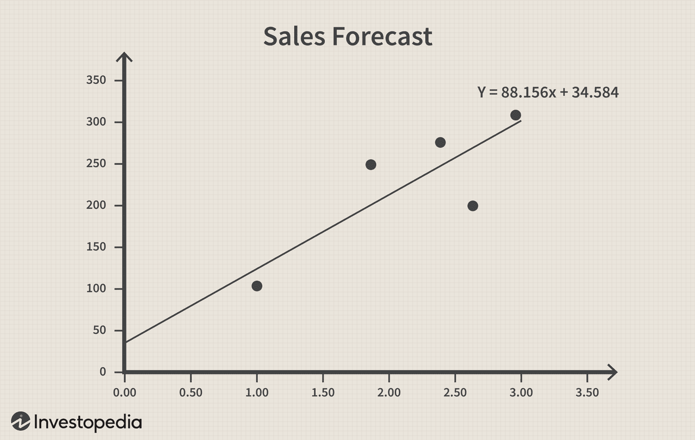

Statistical methods have become indispensable in today's data-driven business environment, offering essential tools for analyzing complex data and informing strategic decisions. Among these methods, regression analysis stands out as a powerful technique for forecasting and modeling relationships between variables. This method involves understanding how the typical value of the dependent variable changes when any one of the independent variables is varied, while the other independent variables remain fixed.

Businesses increasingly rely on regression analysis to distill insights from vast datasets, enabling them to make informed, data-driven decisions. For instance, executives may utilize regression models to optimize marketing strategies by examining the relationship between advertising spend and sales performance. These models enhance predictive capabilities by identifying trends and patterns that are not immediately apparent, thus allowing businesses to anticipate market shifts and adjust their operations proactively.



In the rapidly evolving field of algorithmic trading, regression analysis is crucial for developing sophisticated trading strategies. Traders utilize regression models to establish connections between market variables, such as price movements and trading volumes, helping them predict future price trajectories and execute trades with precision. By quantifying these relationships, regression analysis facilitates the creation of automated trading algorithms that operate based on predetermined criteria, thereby increasing efficiency and minimizing human error.

This article explores how regression analysis serves as a pivotal tool at the intersection of business analysis and algorithmic trading. Through a combination of statistical rigor and computational power, regression analysis provides a framework for interpreting complex data landscapes, enabling more accurate predictive modeling and strategic decision-making across various sectors.

## Table of Contents

## Understanding Regression Analysis

Regression analysis is a fundamental statistical method employed to understand the relationships between a dependent variable and one or more independent variables. This analytical technique is pivotal in various business contexts, facilitating the prediction of performance metrics and financial outcomes.

At its core, regression analysis estimates coefficients that represent the relationship between variables. The simplest form, linear regression, assumes a straight-line relationship between the dependent variable ($Y$) and a single independent variable ($X$). The relationship is expressed as:

$$
Y = \beta_0 + \beta_1X + \epsilon
$$

where $\beta_0$ is the intercept, $\beta_1$ is the slope coefficient, and $\epsilon$ represents the error term.

Multiple regression extends this concept by incorporating multiple independent variables to predict a dependent variable. This model is particularly useful in business when several factors might influence an outcome, such as sales or customer behavior. The general form of the multiple regression equation is:

$$
Y = \beta_0 + \beta_1X_1 + \beta_2X_2 + \ldots + \beta_nX_n + \epsilon
$$

Logistic regression, another variant, is used when the dependent variable is categorical, often binary. Instead of predicting a continuous outcome, it models the probability of a certain class or event. The logistic regression function is given by:

$$
\text{logit}(p) = \ln\left(\frac{p}{1-p}\right) = \beta_0 + \beta_1X_1 + \ldots + \beta_nX_n
$$

where $p$ represents the probability of the presence of the characteristic of interest.

Polynomial regression is applied when the relationship between the independent variable and the dependent variable is non-linear. It uses polynomial equations to model such relationships, allowing for greater flexibility in modeling complex datasets.

Businesses employ these regression models for predicting trends, assessing risks, and optimizing processes. By analyzing past data, companies can forecast future performance metrics, like sales growth or market demand, thus aiding strategic decisions. Regression analysis also evaluates risk by identifying and quantifying the impact of certain variables, such as interest rates or commodity prices, on business outcomes. Moreover, optimization processes benefit from regression analysis by fine-tuning operational strategies, thus improving efficiency and profitability.

In practical applications, tools like Python's libraries, such as Statsmodels and Scikit-learn, are widely used for implementing and interpreting regression models. These libraries provide comprehensive functionalities for model fitting, evaluation, and refinement, significantly aiding business analysts and data scientists in their predictive modeling efforts.

## Applications of Regression Analysis in Business

Regression analysis holds paramount importance in various business applications, significantly contributing to forecasting, risk management, and decision-making processes. Businesses employ regression techniques to uncover insights, streamline operations, and optimize strategies, thereby enhancing overall performance and efficiency.

One of the primary applications of regression analysis is in sales prediction. Companies leverage regression models to analyze historic sales data and extract patterns that assist in forecasting future sales performance. For instance, linear regression can establish the relationship between sales and independent variables such as marketing expenditure, seasonality, or economic indicators. By using the equation $Y = \beta_0 + \beta_1X_1 + \beta_2X_2 + ... + \beta_nX_n + \epsilon$, where $Y$ represents the sales, $X_1, X_2, ..., X_n$ are the independent variables, $\beta$ coefficients measure their respective contributions, and $\epsilon$ is the error term, businesses can predict future sales figures under various scenarios.

Another significant avenue for regression analysis is understanding customer behavior. By analyzing customer data, companies can apply regression techniques to evaluate factors influencing purchasing decisions or customer retention rates. Logistic regression, for example, is frequently used to model binary outcomes such as purchase decisions (buy/no buy) based on independent variables like demographic information, purchase history, and online activity. This enables organizations to tailor marketing campaigns and loyalty programs to better suit their target audience.

Furthermore, regression analysis is instrumental in streamlining operations. Businesses often use it to identify key drivers of operational efficiency and optimize resource allocation. For example, multiple regression models can help determine the impact of workforce size, skill levels, and technology investments on production metrics like output quality or processing time. Consequently, firms can make informed decisions regarding resource deployment and process enhancements.

In financial analysis, regression plays a crucial role in evaluating the effects of macroeconomic indicators, such as GDP and interest rates, on financial performance. By quantifying these relationships, companies can gauge potential risks and prepare contingency plans. This application is vital for risk management, enabling firms to develop strategies that mitigate exposure to economic fluctuations.

Overall, regression analysis serves as a cornerstone for businesses striving to make data-driven decisions. Its ability to provide predictive insights and model complex relationships makes it an invaluable tool for enhancing organizational strategy and achieving competitive advantage.

## Algorithmic Trading and Regression Analysis

Algorithmic trading is a method of executing orders using automated pre-programmed trading instructions. It leverages the power of computer algorithms to respond to market conditions with speed and precision unattainable by human traders. A critical aspect of [algorithmic trading](/wiki/algorithmic-trading) is the ability to predict market trends and make informed trading decisions, which is where regression analysis plays a pivotal role.

Regression analysis serves as a foundational framework for building predictive models in algorithmic trading. By exploring the relationship between a dependent variable, such as stock prices, and one or more independent variables, such as historical prices or economic indicators, regression models can provide insights into future price movements. These models analyze historical data and identify patterns that could indicate future trends, enhancing the trader's ability to make timely decisions.

Among the various types of regression analysis, linear regression is perhaps the most basic but widely used model. It aims to establish a linear relationship between the dependent and independent variables. The linear regression equation is typically represented as:

$$
y = \beta_0 + \beta_1 x + \epsilon
$$

where $y$ is the dependent variable (e.g., stock price), $x$ is the independent variable (e.g., time), $\beta_0$ is the intercept, $\beta_1$ is the slope of the line, and $\epsilon$ is the error term.

For more complex relationships, other types of regression models like multiple regression or polynomial regression can be employed. These models can consider multiple factors simultaneously, providing a more comprehensive analysis of the factors impacting market movements.

By applying regression models in algorithmic trading, traders can sift through large datasets efficiently, identifying correlations and trends that may not be immediately apparent. This process involves using software tools and programming libraries like Python's Statsmodels or scikit-learn, which offer a suite of statistical functions and [machine learning](/wiki/machine-learning) capabilities for implementing regression models.

Python code to perform a simple linear regression using Statsmodels might look like this:

```python
import numpy as np
import pandas as pd
import statsmodels.api as sm

# Sample data
data = {
    'time': np.arange(10),
    'price': [10, 12, 14, 13, 15, 18, 20, 21, 22, 24]
}
df = pd.DataFrame(data)
X = sm.add_constant(df['time'])  # Adds a constant term to the predictor
y = df['price']

# Fit the model
model = sm.OLS(y, X).fit()

# Get the prediction
predictions = model.predict(X)

# Display the summary of the regression
print(model.summary())
```

In algorithmic trading, time is of the essence. The integration of regression models enables the rapid assessment and execution of trades based on real-time data analysis and trend prediction. As financial markets continue to grow in complexity, the application of advanced regression techniques, coupled with machine learning, allows traders to devise robust strategies and maintain a competitive edge.

## Implementing Regression Models in Algo Trading

Traders implement regression models, such as linear and logistic regression, to forecast price movements in algorithmic trading. Linear regression models estimate the relationship between a dependent variable and one or more independent variables using the equation:

$$
y = \beta_0 + \beta_1x_1 + \beta_2x_2 + \ldots + \beta_nx_n + \epsilon
$$

where $y$ is the dependent variable, $\beta_0$ is the y-intercept, $\beta_1, \beta_2, \ldots, \beta_n$ are coefficients for each independent variable $x_1, x_2, \ldots, x_n$, and $\epsilon$ represents the error term. In trading, $y$ might represent a future stock price, while the $x$ variables could include historical price data, volume, or other financial indicators.

Logistic regression, on the other hand, is used when the outcome variable is binary, such as predicting whether the price will go up or down. The logistic regression model applies the logistic function to the linear equation, yielding probabilities that allow traders to make classifications based on a threshold, typically 0.5.

The synergy of machine learning techniques with regression models further enhances the accuracy of these predictions. For instance, traders might use regularized linear models such as Lasso or Ridge regression to prevent overfitting — a prevalent issue in financial predictions due to noisy data. Ensemble methods, like bagging and boosting, can also be employed to combine multiple regression models, reducing variance and bias and improving overall prediction reliability.

Traders often turn to Python libraries like Statsmodels and scikit-learn for implementing these models. Statsmodels provides comprehensive tools for estimation, testing, and evaluation of statistical models. For example, a simple linear regression model in Python using Statsmodels can be implemented as follows:

```python
import statsmodels.api as sm

# Example dataset
X = df[['feature_1', 'feature_2']]  # Independent variables
y = df['target']  # Dependent variable
X = sm.add_constant(X)  # Adds constant term for intercept

# Fit the linear regression model
model = sm.OLS(y, X).fit()

# Summary of the model
print(model.summary())
```

This code snippet initializes a regression model using observed market data where 'feature_1' and 'feature_2' could represent different market indicators and 'target' is the response variable, such as future price. The model's summary provides key statistical insights, aiding traders in evaluating prediction reliability.

Algorithmic trading systems continuously adapt to new data with machine learning models alongside regression techniques, allowing traders to refine models as market conditions evolve. This data-driven approach requires rigorous model validation, [backtesting](/wiki/backtesting) over historical data, and ongoing real-time testing to ensure the model's effectiveness and robustness.

## Challenges and Considerations

Ensuring data quality and avoiding overfitting are significant challenges in regression analysis, especially within the context of algorithmic trading. Data quality is paramount since the predictive accuracy of regression models, used in algorithmic trading, heavily depends on the integrity and relevance of financial data. Inconsistent or erroneous data can lead to incorrect predictions, resulting in potential financial losses. High-quality datasets allow traders to construct robust regression models that can better capture the underlying market dynamics.

Overfitting is another critical issue that needs attention. Overfitting occurs when a regression model learns the noise present in the training data rather than the actual signal, leading to poor predictive performance on unseen data. This is particularly problematic in trading where models must perform well in real-time dynamic markets. To combat overfitting, traders often adopt techniques such as cross-validation, regularization, and pruning methods. For example, Lasso (Least Absolute Shrinkage and Selection Operator) is a regularization technique that helps prevent overfitting by imposing a penalty on the absolute size of coefficients, effectively shrinking some coefficients to zero and thereby selecting a simpler model.

The volatile nature of financial markets means that traders must continuously validate and update their models. Market conditions change rapidly due to economic, political, and other unforeseen events. Therefore, it is crucial to incorporate mechanisms for regular model evaluation and update. This may involve retraining models on newer datasets or adjusting model parameters to better reflect current market conditions.

Algorithmic traders also face ethical and regulatory challenges. Ethical challenges arise from the necessity of ensuring that trading algorithms operate fairly and do not manipulate markets. On the regulatory front, stringent compliance and oversight measures must be adhered to. Traders must ensure their models comply with regulations such as the European Union's Markets in Financial Instruments Directive (MiFID II) or the U.S. Securities and Exchange Commission (SEC) regulations. These regulations are in place to promote market integrity and protect investor interests.

In conclusion, maintaining high data quality, avoiding overfitting, and staying compliant with ethical and regulatory standards are essential considerations for effectively implementing regression analysis in algorithmic trading. As technology evolves, these challenges will need continuous attention and adaptation.

## Conclusion

Regression analysis is indispensable in both business analysis and algorithmic trading due to its robust capability to predict and model complex relationships between variables. By determining the strength and nature of these relationships through different regression models, businesses and traders can make informed decisions that optimize outcomes and enhance strategic positioning. These models are particularly effective in handling large datasets, which are prevalent in today's data-centric environments.

The predictive power of regression analysis lies in its mathematical rigor, which can be harnessed through various types of regression techniques such as linear regression, logistic regression, and more complex forms like polynomial regression. The general form of a linear regression model can be expressed as:

$$
y = \beta_0 + \beta_1 x_1 + \beta_2 x_2 + \ldots + \beta_n x_n + \epsilon
$$

where $y$ is the dependent variable, $x_1, x_2, \ldots, x_n$ are independent variables, $\beta_0, \beta_1, \beta_2, \ldots, \beta_n$ are the coefficients, and $\epsilon$ is the error term.

As technological advancements continue, the integration of regression analysis with [artificial intelligence](/wiki/ai-artificial-intelligence) (AI) and machine learning (ML) potentiates further enhancement of its applications. Machine learning techniques such as neural networks and support vector machines can uncover non-linear relationships and patterns that traditional regression models might miss. For example, using Python libraries like TensorFlow or PyTorch, traders and analysts can build sophisticated ML models that learn from data to create more accurate and adaptable trading algorithms.

The fusion of regression analysis with AI techniques not only augments prediction accuracy but also enables real-time processing and the ability to adapt to dynamic environments. This is particularly valuable in algorithmic trading, where swift decision-making is crucial. The continuous evolution of computational power and algorithmic strategies will undoubtedly expand the scope of regression analysis, solidifying its essential role in decision-making across domains.

In conclusion, as the landscape of technology evolves, so does the potential for regression analysis to transform the way businesses and traders approach problem-solving. By harnessing its predictive capabilities and integrating it with cutting-edge technologies, stakeholders can achieve greater precision and efficiency in their operations.

## References & Further Reading

- Bergstra, J. et al. (2011). 'Algorithms for Hyper-Parameter Optimization.' This paper discusses methods for optimizing hyper-parameters, which are crucial in developing efficient machine learning models, including those used in regression analysis for algorithmic trading.

- Lopez de Prado, M. 'Advances in Financial Machine Learning'. This book provides a comprehensive guide to the intersection of machine learning and finance. It offers insights into how advanced methodologies, including regression analysis, enhance trading strategies and predictive models.

- Aronson, D. 'Evidence-Based Technical Analysis'. Aronson's work emphasizes the importance of using data-driven methodologies for technical analysis. The text explores the implementation of statistical tools like regression analysis to substantiate trading strategies.

- Chan, E. P. 'Quantitative Trading: How to Build Your Own Algorithmic Trading Business'. Chan's book is an essential resource for traders interested in creating algorithmic trading strategies. It covers the practical application of quantitative techniques, such as regression models, to develop and deploy trading algorithms.

