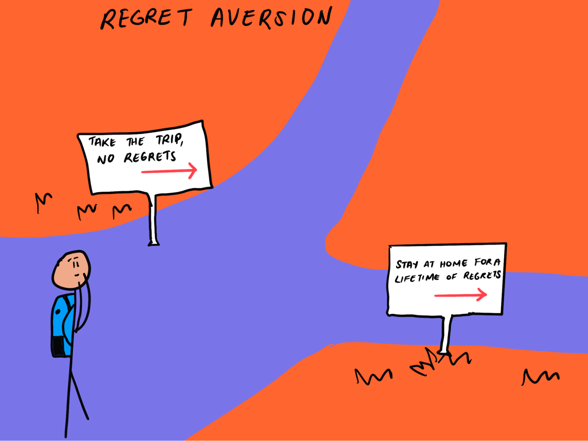

## Table of Contents

## What is regret avoidance in the context of financial markets?

Regret avoidance in financial markets is when people make choices to avoid feeling bad about their decisions later. They might choose not to invest in something that could lose money, even if it could also make money. This is because they want to avoid the regret they would feel if they lost money.

This behavior can lead people to make safer choices, like keeping their money in a savings account instead of investing in stocks. While this might feel safer, it can also mean missing out on chances to make more money. So, regret avoidance can protect people from losses, but it can also stop them from gaining more.

## How does regret avoidance influence investor behavior?

Regret avoidance makes investors play it safe. They might avoid buying stocks that could lose value, even if those stocks could also go up a lot. This is because they don't want to feel bad if they lose money. So, they might stick to safer investments like bonds or savings accounts. This can mean they miss out on bigger gains, but it also means they don't have to worry as much about losing money.

This behavior can also make investors hold onto losing investments for too long. They might think, "If I sell now, I'll regret it if the price goes back up." So, they wait, hoping the price will recover. But this can lead to even bigger losses if the price keeps dropping. Regret avoidance can protect investors from some risks, but it can also stop them from making smarter choices that could lead to better results.

## What are common examples of regret avoidance in trading?

Regret avoidance often shows up when traders avoid buying stocks that they think might go down in value. They might see a stock that has a lot of potential to grow, but if there's also a chance it could drop, they might choose not to buy it. This is because they want to avoid the regret of losing money. Instead, they might put their money in safer places like savings accounts or bonds, even though these don't offer as much chance for big gains.

Another common example is when traders hold onto losing stocks for too long. They might have bought a stock that starts to drop in value, but they don't want to sell it because they think it might go back up. They worry that if they sell and the stock does recover, they'll regret their decision. So, they wait, hoping the price will rise again. But this can lead to bigger losses if the stock keeps falling.

In both cases, regret avoidance makes traders miss out on opportunities. They might avoid risky stocks to feel safer, but this can mean missing out on big gains. Or they might hold onto losing stocks too long, hoping to avoid regret, but end up losing more money. Regret avoidance can make trading feel safer, but it can also stop traders from making the best choices for their money.

## How can regret avoidance lead to suboptimal financial decisions?

Regret avoidance can lead to bad financial choices because it makes people too scared to take risks. They might avoid buying stocks that could make them a lot of money because they're afraid of losing money and feeling bad about it. So, instead of trying to grow their money, they keep it in safe places like savings accounts or bonds. These are safer, but they don't grow as much, so people miss out on bigger gains.

Also, regret avoidance can make people hold onto losing investments for too long. They don't want to sell a stock that's going down because they think it might go back up. They worry that if they sell and the price does go up later, they'll feel really bad about their decision. So, they wait and hope the price will recover. But if the stock keeps dropping, they end up losing even more money. This way, regret avoidance can stop people from making smarter choices that could lead to better financial results.

## What psychological theories explain regret avoidance in finance?

Regret avoidance in finance can be explained by a couple of psychological theories. One theory is called Prospect Theory. This theory says that people feel the pain of losing money more strongly than the joy of gaining money. So, they might choose to avoid investments that could lose money, even if those investments also have a chance to make a lot of money. They want to avoid the bad feeling of regret if they lose money, so they stick to safer choices.

Another theory is called Regret Theory. This theory focuses on how people make decisions to avoid feeling bad about them later. In finance, people might not invest in something risky because they don't want to regret it if it goes wrong. They might also hold onto losing investments because they think they'll regret selling if the price goes back up. Both theories show how the fear of regret can make people avoid certain financial decisions, even if those decisions could lead to better outcomes.

## How can investors measure the impact of regret avoidance on their portfolio?

Investors can measure the impact of regret avoidance on their portfolio by looking at how much they're missing out on by choosing safe investments over riskier ones. For example, if they keep all their money in a savings account or bonds instead of stocks, they can compare the growth of their portfolio to what it could have been if they had invested in stocks. They might find that their portfolio grew slower than it could have because they were trying to avoid the regret of losing money.

Another way to measure the impact is by looking at how long they hold onto losing investments. If they're holding onto stocks that keep dropping in value because they're afraid of selling and then seeing the price go back up, they can calculate how much more they've lost by waiting. This shows them the cost of trying to avoid the regret of selling too soon. By understanding these impacts, investors can see how regret avoidance might be stopping them from making better financial decisions.

## What strategies can be used to mitigate the effects of regret avoidance?

To help reduce the effects of regret avoidance, investors can start by setting clear goals and sticking to a plan. They should decide what they want their money to do and make a plan to reach those goals. This way, they can make choices based on their plan, not on fear of losing money. For example, if their goal is to grow their money over time, they might decide to put some of it into stocks, even if those stocks could go down. By following their plan, they can feel more confident in their decisions and less worried about regretting them later.

Another strategy is to use a method called dollar-cost averaging. This means investing a fixed amount of money at regular times, no matter what the market is doing. This can help reduce the fear of buying at the wrong time because investors are spreading out their purchases. Over time, this can make them feel less regret about any single investment decision. By using these strategies, investors can make better choices and not let the fear of regret stop them from growing their money.

## How does regret avoidance differ across various financial markets?

Regret avoidance can show up differently depending on the financial market. In the stock market, people might avoid buying stocks that could lose value because they don't want to feel bad if they lose money. They might stick to safer investments like bonds instead, even if stocks could make them more money over time. In the real estate market, regret avoidance might make people hold onto a property that's losing value because they're afraid it might go up later if they sell it. They don't want to regret selling too soon, so they wait and hope the price will recover.

In the cryptocurrency market, regret avoidance can be even stronger because the prices can change a lot very quickly. People might be too scared to buy cryptocurrencies because they've heard stories of big losses. They might miss out on big gains because they're trying to avoid the regret of losing money. Each market has its own risks and rewards, and regret avoidance can make people miss out on opportunities in different ways depending on the market they're in.

## What role does regret avoidance play in the disposition effect?

Regret avoidance plays a big part in the disposition effect. The disposition effect is when people are more likely to sell stocks that are doing well and hold onto stocks that are losing money. They do this because they want to avoid feeling bad about their decisions. If they sell a stock that's going up, they feel good because they made money. But if they sell a stock that's going down, they might feel bad because they lost money. So, to avoid that bad feeling, they hold onto the losing stocks, hoping they'll go back up.

This behavior comes from wanting to avoid regret. People don't want to sell a losing stock and then see it go back up later because that would make them feel really bad. So, they wait, even if it means losing more money. On the other hand, they're quick to sell winning stocks because they want to lock in their gains and feel good about their choices. This way, regret avoidance makes people hold onto losers and sell winners, which can lead to bad financial decisions.

## How can financial advisors help clients overcome regret avoidance?

Financial advisors can help clients overcome regret avoidance by first helping them set clear financial goals and making a plan to reach those goals. They can explain how sticking to the plan can lead to better results than making choices based on fear of losing money. For example, if a client's goal is to grow their money over time, the advisor might suggest putting some money into stocks, even if stocks can go down. By focusing on the plan and the long-term goals, clients can feel more confident in their decisions and less worried about regretting them later.

Advisors can also teach clients about dollar-cost averaging, which means investing a fixed amount of money at regular times, no matter what the market is doing. This can help clients feel less scared about buying at the wrong time because they're spreading out their purchases. Over time, this can make them feel less regret about any single investment decision. By using these strategies, financial advisors can help clients make better choices and not let the fear of regret stop them from growing their money.

## What are the long-term consequences of regret avoidance on investment performance?

Regret avoidance can hurt investment performance over the long term. When people avoid investing in stocks because they're scared of losing money, they might miss out on big gains. Stocks can grow a lot over time, but if people keep their money in safer places like savings accounts or bonds, their money won't grow as much. This means they might end up with less money than they could have had if they had taken some risks.

Also, holding onto losing investments for too long because of regret avoidance can lead to bigger losses. People might wait and hope a stock will go back up, but if it keeps dropping, they lose even more money. Over time, this can really hurt their investment performance. By trying to avoid feeling bad about their choices, people can end up making decisions that stop their money from growing as much as it could.

## How can advanced statistical models be used to predict and counteract regret avoidance in algorithmic trading?

Advanced statistical models can help predict and counteract regret avoidance in algorithmic trading by analyzing past trading data to find patterns where traders might be avoiding certain investments out of fear of regret. These models can look at how often traders choose safer investments over riskier ones, even when the riskier ones could lead to bigger gains. By understanding these patterns, the models can predict when regret avoidance might be influencing trading decisions. For example, if the model sees that a trader often holds onto losing stocks for too long, it can flag this behavior and suggest when it might be better to sell.

To counteract regret avoidance, these models can be programmed to make trading decisions based on data and logic rather than emotions. They can use strategies like dollar-cost averaging, where the algorithm invests a fixed amount of money at regular times, no matter what the market is doing. This helps spread out the risk and can make the trader feel less worried about buying at the wrong time. By using these models, traders can make more rational choices and avoid the pitfalls of regret avoidance, leading to better long-term investment performance.

## References & Further Reading

[1]: Thaler, R. H., & Barberis, N. (2003). ["A Survey of Behavioral Finance."](https://www.nber.org/papers/w9222) National Bureau of Economic Research.

[2]: Shiller, R. J. (2008). ["The Subprime Solution: How Today’s Global Financial Crisis Happened, and What to Do about It."](https://www.jstor.org/stable/j.cttq94jd) Princeton University Press.

[3]: Kahneman, D., & Tversky, A. (1979). ["Prospect Theory: An Analysis of Decision under Risk."](https://www.jstor.org/stable/1914185) Econometrica, 47(2), 263-292.

[4]: Shiller, R. J. (2000). ["Irrational Exuberance."](https://www.amazon.com/Irrational-Exuberance-Robert-J-Shiller/dp/0767923634) Princeton University Press.

[5]: Chan, E. P. (2009). ["Quantitative Trading: How to Build Your Own Algorithmic Trading Business."](https://github.com/ftvision/quant_trading_echan_book) Wiley.

[6]: Jansen, S. (2020). ["Machine Learning for Algorithmic Trading."](https://github.com/stefan-jansen/machine-learning-for-trading) Packt Publishing.