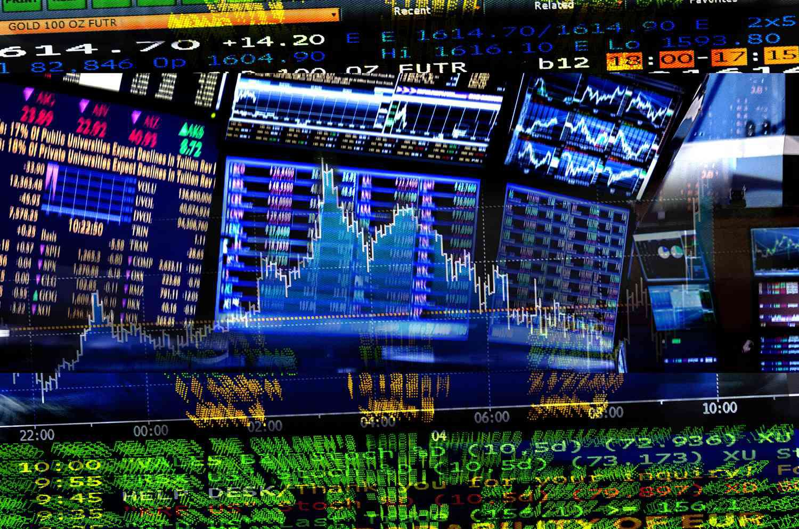

Regret theory is a concept rooted in behavioral economics and psychology that examines how the anticipation of regret can influence decision-making processes. This theory posits that individuals often evaluate their choices based on the potential regret they might experience as a result of those choices. Unlike expected utility theory, which assumes individuals make rational decisions aimed at maximizing expected outcomes, regret theory recognizes the emotional dimensions influencing decisions. People tend to not only weigh the potential outcomes of their choices but also consider how they might feel about these outcomes, particularly in comparison to other options that were available to them.

The psychological basis of regret theory is deeply connected to human emotions and cognitive processes. Anticipated regret can lead individuals to alter their decisions to minimize future regret, while realized regret occurs post-decision and reflects dissatisfaction with the outcome. These emotions are critical in shaping behavior and are supported by various psychological studies demonstrating how individuals often seek to avoid situations that could lead to regret, even if it means potentially sacrificing better outcomes.

Algorithmic trading, a method that utilizes algorithms to execute financial securities orders, increasingly integrates psychological principles to optimize decisions and predict market behavior more accurately. The field of finance has recognized that purely quantitative approaches may overlook essential behavioral factors, such as emotions and biases that influence market participants. By incorporating psychology into trading algorithms, developers aim to create systems that better understand and simulate the decision-making processes of human traders.

The purpose of this article is to explore how regret theory, alongside other psychological insights, can be applied in the development and execution of algorithmic trading. Understanding the role of emotions and regret in financial decision-making can lead to the creation of more robust and adaptive trading algorithms that account for human behavior, potentially enhancing trading performance.

The significance of merging psychology with financial algorithms is profound. It allows for the creation of decision-making frameworks that not only rely on logical and statistical analysis but also acknowledge and incorporate human emotional responses. This blending of disciplines promises to advance the effectiveness of algorithmic trading systems, offering new tools for navigating the complex emotions and behaviors that drive market dynamics. This article aims to lay the groundwork for understanding how regret theory and psychology can be effectively integrated into algorithmic trading systems, promising a deeper comprehension of human decision-making in financial markets.

## Table of Contents

## The Fundamentals of Regret Theory

Regret Theory is a concept rooted in behavioral economics and decision theory. It was developed as an alternative to the traditional Expected Utility Theory (EUT) and was introduced in the early 1980s by Graham Loomes and Robert Sugden. Unlike EUT, which assumes that individuals make rational decisions to maximize expected utility based solely on outcomes, Regret Theory considers the emotional reactions related to different choices, particularly focusing on the regret or satisfaction stemming from the decisions.

### Key Concepts

**Anticipated Regret**

Anticipated regret refers to the expectation of regret associated with a future decision, influencing the decision-making process beforehand. It posits that individuals anticipate the regret they might feel if they make a particular decision that turns out unfavorably. This anticipation can significantly affect their choices, pushing them toward safer or regret-minimizing options.

**Realized Regret**

Realized regret occurs after a decision is made and the outcome is observed. It is the actual feeling of regret an individual experiences when the result of their choice is suboptimal compared to a forgone alternative. This concept highlights the emotional aftermath of decision-making, where individuals reflect on what could have been, had they chosen differently.

**Decision Making**

Incorporating anticipated and realized regret into decision-making processes offers a more comprehensive view than traditional approaches. Instead of merely calculating expected outcomes' utilities, individuals weigh potential regret's emotional impact, often opting for choices that minimize potential regret.

### Differentiation from Expected Utility Theory

Regret Theory deviates from Expected Utility Theory by integrating emotions and psychological factors into decision-making models. While EUT assumes rationality and outcome-centric evaluations, Regret Theory acknowledges human behavior's complexity, where emotions like regret play a crucial role. In EUT, decision-makers select options that provide the maximum expected utility based on probability-weighted outcomes:

$$
U(x) = \sum p_i \cdot u(x_i)
$$

where $U(x)$ is the expected utility of decision $x$, $p_i$ is the probability of outcome $i$, and $u(x_i)$ is the utility of outcome $x_i$.

In contrast, Regret Theory would [factor](/wiki/factor-investing) into the model the potential for regret, modifying decisions based on emotional predictions rather than pure utility calculations.

### Examples of Regret Theory in Everyday Decision-Making

Regret Theory manifests in various everyday situations. For instance, a consumer deciding whether to purchase an expensive gadget might consider the regret they might feel if they miss out on future savings versus the satisfaction of immediate ownership. Similarly, an investor contemplating a risky stock might weigh the potential regret of losing money against the regret of missing out on significant gains.

### Psychological Basis

The psychological foundation of Regret Theory lies in the emotional responses associated with decision outcomes. Emotions such as regret, disappointment, and remorse are central, influencing not only immediate reactions but also future decision-making tendencies. Behavioral reactions to regret can vary, with some individuals learning from the experience to make better decisions in the future, while others might develop avoidance strategies to minimize potential regret, sometimes at the cost of potential gains.

In summary, Regret Theory extends traditional decision-making models by incorporating psychological and emotional dimensions, offering a more realistic reflection of human behavior. It underscores the importance of emotions in shaping decisions and reveals complex human dynamics beyond mere utility maximization.

## Psychological Insights: The Role of Emotions in Trading

Emotions play a crucial role in shaping trading decisions, often leading individuals away from purely rational choices. Traders are frequently swayed by emotive factors such as regret and the fear of missing out (FOMO), which can significantly impact their behavior and decision-making processes.

Regret, a negative emotion stemming from the realization that a different decision could have yielded a better outcome, influences traders by causing them to second-guess their choices. This often results in taking hasty actions such as selling prematurely to lock in gains or holding onto losing positions in hopes that the market will reverse. Such behavior contrasts with the purely rational decision-making model proposed by expected utility theory.

Similarly, FOMO, the anxiety that an exciting or interesting event may currently be happening elsewhere, can lead traders to enter positions based on market trends or rumors, rather than based on thorough analysis. The psychological impact of regret and FOMO on trading strategies has been documented in various studies. For instance, traders who experienced previous losses may exhibit a pattern of risk-averse behavior, while those who missed profitable opportunities may engage in risk-seeking actions to compensate for missed gains.

Emotional bias, the tendency to make decisions influenced by emotions rather than objective evidence, can lead to suboptimal trading outcomes. This bias often results in traders deviating from strategic plans and succumbing to crowd behavior, which may amplify market [volatility](/wiki/volatility-trading-strategies). For instance, during market bubbles, traders influenced by herd mentality may buy overvalued assets, disregarding [fundamental analysis](/wiki/fundamental-analysis).

Emotional regulation is paramount for maintaining objectivity in trading decisions. Traders with the ability to manage their emotions and resist impulsive behavior are more likely to adhere to disciplined trading strategies. Techniques such as mindfulness, developing robust trading plans, and utilizing stop-loss orders can help mitigate the effects of emotional bias and promote rational decision-making. By ensuring that decisions are driven by data and analysis rather than emotions, traders can enhance their performance and reduce the likelihood of incurring losses due to irrational behavior.

## Algorithmic Trading: Integrating Psychology

Algorithmic trading, which involves the use of computer algorithms to execute trading orders, has gained prominence due to its ability to process large volumes of data swiftly and accurately. It's a method that optimizes trading by making quick, data-driven decisions. Initially rooted in quantitative models focusing on market data and trends, [algorithmic trading](/wiki/algorithmic-trading) has evolved to incorporate behavioral insights, acknowledging the significant impact of psychology on market movements.

The integration of psychology into trading algorithms is a growing trend aimed at enhancing decision-making processes. Behavioral finance, which studies the effects of psychological factors on investors' decisions, provides essential insights for this integration. Traders are often influenced by emotions such as fear, greed, and regret, which can lead to irrational decision-making. By accounting for these psychological factors, trading algorithms can reduce the impact of human emotion and behavioral biases, potentially leading to more effective trading strategies.

Regret theory is particularly significant in this context. It focuses on the emotional responses traders experience when comparing the outcomes of their decisions against alternative actions. A trader might experience regret if a different decision could have resulted in a more favorable outcome. By incorporating regret theory, algorithms can be designed to minimize anticipatory regret—fear of future regret—and actual regret, thereby encouraging actions which optimize long-term outcomes rather than short-term emotional relief.

Algorithms that integrate psychological principles offer various advantages. First, they can help in risk management by anticipating emotional reactions that might lead to overly aggressive or overly timid trading behaviors. Algorithms equipped with behavioral insights can enhance the consistency and rationality of trading decisions. Moreover, they may improve performance by leveraging historical data to identify patterns related to emotional biases, allowing for preemptive adjustments in strategy.

Several algorithms have successfully harnessed psychological principles. For example, some employ sentiment analysis, which uses natural language processing to gauge market sentiment from news, social media, and other textual data sources. By understanding collective emotional states, these algorithms adjust trading strategies accordingly. Other models might utilize [reinforcement learning](/wiki/reinforcement-learning), where the algorithm is trained to predict the emotional response of a trader based on past behaviors and outcomes, helping to generate strategies that align more closely with rational expectations rather than emotional impulses.

Overall, the collaboration between psychology and technology in algorithmic trading design provides promising avenues for innovation. As our understanding of human behavior deepens and computational techniques improve, the opportunity to craft robust algorithmic systems that operate attentively to human psychological patterns continues to expand, promising consistently more balanced and effective trading systems.

## Applications of Regret Theory in Algorithmic Trading

To apply regret theory in the development of trading algorithms, it is essential to integrate psychological insights into quantitative models. The process begins with formulating a model that anticipates trader regret and adapts accordingly. A fundamental approach involves understanding the regret function, R(x), which quantifies the potential regret associated with a particular decision relative to other choices. This mathematical representation helps machines assess not only possible gains but also emotional responses to potential losses.

To mitigate feelings of regret, algorithms can simulate decision-making environments to foresee outcomes that might lead to regret. By using scenario analysis, the algorithm evaluates various paths and chooses the sequence that minimizes expected regret. For instance, if an algorithm is based on the premise $R_t = E[R(x_t)]$, where $R_t$ represents regret at time $t$, it intentionally selects an option that offers the least adverse emotional outcomes when compared to alternatives.

Historical data analysis plays a crucial role in adjusting these models. By analyzing past market data, trading systems can identify patterns and scenarios that have historically led to the highest degrees of regret. These scenarios are encoded as variables that the algorithm prioritizes to avoid, thus aligning future trading actions with reduced psychological bias. This enables the algorithm to correct potential biases derived from emotions such as fear or overconfidence.

Examples of trading algorithms incorporating regret theory include those designed for portfolio management. Here, algorithms adjust asset allocations dynamically, based on the anticipated regret of underperformance against a benchmark. The minimum-regret criterion ensures portfolios are rebalanced periodically to optimize decision-making outcomes, maintaining performance within desirable emotional thresholds.

In evaluating the impact of regret-informed algorithms on trading performance, it is evident that these models can outperform traditional algorithms by reducing emotionally-driven errors. Regret-based models tend to show enhanced accuracy in predicting market movements, as they incorporate human-like decision considerations. By tackling both financial and emotional objectives, regret-informed algorithms provide a more comprehensive approach to market engagement, fostering balanced decision-making that aligns with both investor goals and psychological comfort.

## Challenges and Future Directions

Integrating regret theory into trading algorithms presents several challenges. One major challenge is accurately quantifying regret, as it's a highly subjective emotion influenced by individual psychological nuances. Translating such a qualitative experience into a quantitative metric suitable for algorithmic processes requires sophisticated modeling. Furthermore, algorithms need to be trained on extensive and diverse datasets to generalize well, but emotional and psychological data can be difficult to collect and often lack the granularity needed for precise modeling.

Another pitfall is the potential for overfitting psychological insights. While algorithms can be programmed to understand common human biases, there's a risk of overly anchoring on historical emotional patterns, which might not always predict future trader behavior due to the ever-evolving nature of financial markets. This could lead to suboptimal trading decisions during periods of market volatility.

Technological advancements, however, are providing new tools to manage these challenges. Machine learning and [artificial intelligence](/wiki/ai-artificial-intelligence) can model complex psychological states by analyzing vast amounts of behavioral data, capturing subtle patterns in trader sentiment. Natural language processing facilitates the analysis of sentiment data from market news and social media, offering algorithms a broader perspective on market sentiment.

The future of psychology-based algorithmic trading appears promising. Trends indicate increased use of [deep learning](/wiki/deep-learning) models capable of adaptive learning, allowing algorithms to evolve with changing emotional dynamics in real-time. Such models potentially simulate human-like learning, identifying and adjusting to novel patterns of behavior as new data becomes available.

Predicting the continued integration of psychology with technology in financial markets, we might witness the emergence of hybrid systems. These would use neural networks to capture complex emotional states and predictive analytics to inform trading strategies. The convergence of fields such as behavioral finance, neuroscience, and artificial intelligence is expected to push the boundaries further, potentially leading to more robust, emotion-aware trading systems that emulate human decision-making processes more closely than ever before. Continued interdisciplinary research is essential to advancing these technologies, ensuring that trading algorithms can fully leverage psychological insights while maintaining adaptability and robustness in a fast-paced market environment.

## Conclusion

Regret theory has emerged as a crucial psychological framework, significantly impacting decision-making processes in both psychological and trading domains. Understanding its role allows for a paradigm shift in how decisions are formulated and executed, particularly in environments that rely heavily on uncertainty and risk, such as financial markets.

In algorithmic trading, regret theory provides valuable insights by enabling systems to consider the emotional responses of traders, particularly regarding the anticipation and realization of regret. Regret-informed algorithms aim to minimize the adverse psychological impacts of missed opportunities, subsequently fostering more resilient and adaptive trading strategies. This approach bridges the gap between human psychology and financial technology, offering the potential for more sophisticated decision-making processes that are not solely reliant on traditional economic theories, such as expected utility theory.

Combining psychology with financial technology serves multiple benefits. It enables the development of trading algorithms that account for human emotions and biases, potentially leading to more robust trading performances. By considering emotional factors such as fear of missing out and regret, these systems can better align with the psychological state of traders, thereby enhancing both the efficiency and effectiveness of trading strategies.

Emerging opportunities in behavioral finance present a promising frontier for future developments. As technology and psychological research advance, the integration of comprehensive psychological insights into financial algorithms could pave the way for innovations in trading methodologies and decision support systems. The potential for algorithmic systems to incorporate adaptive learning based on psychological principles encourages a continued exploration of this interdisciplinary field.

The encouragement for ongoing research and development cannot be overstated. As behavioral finance progresses, an enhanced understanding of psychological influences on financial decisions will likely lead to more sophisticated financial tools and systems. This continuous evolution highlights the importance of investing in interdisciplinary collaborations to expand the capabilities and applications of regret theory and psychological insights in the dynamic world of financial markets.

## References & Further Reading

[1]: Loomes, G., & Sugden, R. (1982). ["Regret Theory: An Alternative Theory of Rational Choice Under Uncertainty."](https://academic.oup.com/ej/article-abstract/92/368/805/5220411) Journal of Economic Theory, 50(1), 1-25.

[2]: Kahneman, D., & Tversky, A. (1979). ["Prospect Theory: An Analysis of Decision under Risk."](https://www.jstor.org/stable/1914185) Econometrica, 47(2), 263-291.

[3]: Thaler, R. H. (2016). ["Behavioral Economics: Past, Present, and Future."](https://www.aeaweb.org/articles?id=10.1257/aer.106.7.1577) American Economic Review, 106(7), 1046-1078.

[4]: Shapira, Z., & Venezia, I. (2001). ["Patterns of Behavior of Professionally Managed and Independent Investors."](https://papers.ssrn.com/sol3/papers.cfm?abstract_id=286784) Journal of Financial and Quantitative Analysis, 36(2), 245-263.

[5]: Barberis, N., & Thaler, R. (2003). ["A Survey of Behavioral Finance."](https://www.nber.org/papers/w9222) Handbook of the Economics of Finance, 1, 1053-1128.

[6]: Menkhoff, L. (2010). ["The Use of Sentiment Analysis Tools in Financial Markets."](https://www.sciencedirect.com/science/article/pii/S0378426610001755) Journal of Economic Surveys, 24(4), 627-655.

[7]: [The Psychology of Investing](https://www.amazon.com/Psychology-Investing-John-R-Nofsinger/dp/0367748185) by John Nofsinger

[8]: [The Little Book of Behavioral Investing: How Not to Be Your Own Worst Enemy](https://archive.org/details/littlebookofbeha0000mont) by James Montier