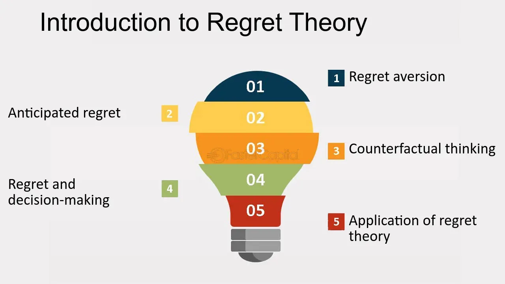

## Table of Contents

## What is Regret Theory and how does it differ from other decision-making theories?

Regret Theory is a way of thinking about how people make choices. It says that when people decide, they think about how they might feel bad later if they pick the wrong thing. For example, if you choose a certain job and it turns out to be bad, you might regret not choosing a different job. This theory focuses on the emotions of regret and disappointment, and how these feelings can affect what we decide to do.

Regret Theory is different from other decision-making theories because it puts a lot of importance on feelings, especially the fear of regret. Other theories, like Expected Utility Theory, focus more on the math of deciding, looking at the chances of different outcomes and their values. They don't pay as much attention to emotions. Another theory, Prospect Theory, does look at emotions but focuses more on how people see gains and losses, not just regret. So, Regret Theory is unique because it centers on the emotional impact of possibly making the wrong choice.

## Who developed Regret Theory and when was it first introduced?

Regret Theory was developed by two economists named Graham Loomes and Robert Sugden. They introduced this theory in 1982. Loomes and Sugden wanted to understand how people make decisions when they think about how they might feel bad later if they choose the wrong thing.

Before Regret Theory, many decision-making theories focused on numbers and probabilities, but Loomes and Sugden thought emotions were important too. They believed that the fear of feeling regret could really change what people decide to do. Their work helped show that emotions play a big role in our choices, and it's been used to explain many kinds of decisions, from buying things to making big life choices.

## What are the key components of Regret Theory?

Regret Theory has two main parts: regret and rejoicing. Regret is the bad feeling you get when you think you made the wrong choice. For example, if you pick a movie to watch and it's boring, you might regret not choosing a different movie. Rejoicing is the opposite; it's the good feeling you get when you think you made the right choice. If the movie you picked turns out to be great, you feel happy and glad you chose it.

These feelings of regret and rejoicing are important because they affect how people make decisions. When choosing, people think about how they might feel later. They try to avoid choices that could lead to regret and go for ones that might lead to rejoicing. This means that the fear of feeling bad can be a big part of deciding what to do. Regret Theory helps explain why people sometimes make choices that don't seem to make sense if you just look at the numbers and chances.

## How does regret influence decision-making processes?

Regret can really change how people make choices. When people think about what might happen if they pick the wrong thing, they can get scared of feeling bad later. This fear of regret can make them avoid certain choices, even if those choices might have good outcomes. For example, someone might not try a new job because they're afraid it won't work out and they'll regret leaving their old job. So, they stick with what they know, even if the new job could be better.

This fear of regret can also make people think more about their choices. They might spend a lot of time thinking about all the different things that could happen, trying to pick the choice that will make them feel the least regret later. This can lead to careful thinking and planning, but it can also make deciding harder and take longer. In the end, the goal is often to make a choice that they won't look back on and wish they had done something different.

## What psychological mechanisms underlie the experience of regret?

Regret is a feeling that comes from thinking about choices we made in the past. When we feel regret, it's because we believe we could have made a better decision. This feeling often happens when we compare what actually happened with what could have been. For example, if you chose to go to a movie instead of a party, and the movie was bad, you might feel regret if you hear the party was fun. This comparison between the real outcome and the imagined better outcome is a key part of regret.

The psychological mechanisms behind regret involve several steps. First, we need to realize we made a choice and that there were other options. Then, we have to think about what might have happened if we chose differently. This is called counterfactual thinking. After that, we feel the emotion of regret when we believe the other choice would have been better. Our brains are good at imagining different outcomes, and this ability helps us learn from our mistakes. But it can also make us feel bad if we focus too much on what we could have done differently.

## Can you explain the difference between anticipated regret and experienced regret?

Anticipated regret is what we think we might feel bad about before we make a choice. It's like guessing how we'll feel later if we pick the wrong thing. For example, if you're thinking about buying a new phone, you might worry that you'll regret it if it turns out to be bad. This kind of regret can help us make better choices because we try to avoid doing things that might make us feel bad later.

Experienced regret is the actual feeling of regret that happens after we've made a choice and something goes wrong. It's the real emotion you feel when you look back and wish you had done something different. For instance, if you bought that new phone and it broke quickly, you might feel experienced regret because you wish you had chosen a different phone. This kind of regret can teach us lessons for the future, but it can also make us feel sad or disappointed about what happened.

## How is Regret Theory applied in the field of economics?

In economics, Regret Theory helps explain why people make certain choices, even when those choices don't seem to make the most sense if you just look at the numbers. Economists use this theory to understand how the fear of feeling bad later can affect what people decide to do. For example, when people are buying things, they might choose a product they know well instead of a new one that might be better, just because they're afraid they'll regret [picking](/wiki/asset-class-picking) the wrong thing. This helps economists see that people's decisions aren't just about money and numbers; emotions play a big part too.

Regret Theory is also used to study how people make big choices, like investing money or choosing a job. Economists look at how the fear of regret can make people avoid taking risks, even when those risks might lead to big rewards. For example, someone might stick with a safe investment instead of a risky one that could make them more money, just because they're scared of losing it all and feeling regret. By understanding this, economists can better predict how people will act in different situations and create better models for how the economy works.

## What role does Regret Theory play in consumer behavior and marketing?

Regret Theory plays a big role in understanding how people buy things. When people shop, they think about how they might feel bad later if they pick the wrong product. This fear of regret can make them stick with brands they know well, even if there might be better options out there. For example, someone might keep buying the same type of phone because they're scared they'll regret trying a new brand that could be worse. Marketers use this idea to make their products seem like safe choices that won't lead to regret. They might show how their product is reliable or has been around for a long time, making people feel more comfortable choosing it.

In marketing, Regret Theory helps companies create ads and messages that reduce the fear of making a bad choice. Marketers might offer guarantees or easy return policies to make people feel less worried about regretting their purchase. They also use customer reviews and testimonials to show that others are happy with the product, which can make new buyers feel more confident. By understanding that people want to avoid feeling regret, marketers can design their strategies to make their products seem like the best and safest choice, encouraging more sales.

## How can Regret Theory be used to improve decision-making in healthcare?

Regret Theory can help doctors and patients make better choices in healthcare by thinking about how they might feel bad later if they pick the wrong treatment. For example, if a doctor suggests a new medicine that might work better but has more risks, the patient might feel scared of regretting trying it if it doesn't work out. By talking about these feelings, doctors can help patients understand the risks and benefits better. They can also offer choices that feel safer, like sticking with a treatment that's been used for a long time, even if it's not the newest option.

In healthcare, understanding regret can also help with big decisions like choosing surgery or not. If a patient is worried about regretting a surgery that might not help, the doctor can explain the chances of success and what might happen if they don't have the surgery. This way, the patient can make a choice that they feel good about later. By considering how regret might affect their decisions, healthcare providers can help patients feel more confident and less worried about making the wrong choice.

## What are some common criticisms or limitations of Regret Theory?

One common criticism of Regret Theory is that it can be hard to measure how much people might regret a choice. Feelings like regret are personal and can change a lot from one person to another. What might make one person feel really bad might not bother someone else at all. This makes it tricky for researchers to use Regret Theory to predict what people will do, because everyone's feelings of regret are different.

Another limitation is that Regret Theory focuses a lot on emotions and might not always explain why people make choices based on other things, like money or logic. Sometimes, people make decisions without thinking about how they'll feel later. They might choose based on what they think is the best option right now, without worrying about regret. So, Regret Theory might not cover all the reasons behind every decision people make.

## How have recent studies expanded or challenged the traditional views of Regret Theory?

Recent studies have looked at how Regret Theory might work differently in different situations. Some research shows that people might feel less regret if they can change their minds later. For example, if you can return a product you bought, you might not worry as much about regretting your choice. This idea has made some researchers think that Regret Theory should include how easy it is to fix a bad decision. They also found that people might feel more regret about choices that affect other people, like choosing a gift for a friend. This has led to new ways of thinking about how regret works in social situations.

Other studies have challenged the idea that regret always makes people avoid risks. Some people might actually take more risks because they're scared of regretting not trying something new. This is called "regret aversion," where the fear of missing out pushes people to do things they might not have done otherwise. These findings suggest that Regret Theory might need to think about how regret can make people act in different ways, not just make them more careful. Overall, these new studies show that regret is a complex feeling that can affect decisions in many different ways, and Regret Theory might need to change to keep up with these new ideas.

## What are the future directions for research in Regret Theory?

Future research in Regret Theory might look at how technology and the ability to change choices can affect regret. For example, with online shopping and easy returns, people might feel less worried about regretting a purchase. Researchers could study how these kinds of changes make people feel and decide differently. They might also explore how regret works in different cultures, since what makes someone feel bad in one place might not be the same in another. Understanding these differences could help make Regret Theory more useful around the world.

Another direction for future research could be looking at how regret affects big choices over a long time, like career or health decisions. Scientists might study how people feel about these choices years later and how that feeling of regret or happiness changes. They could also look at how teaching people about regret might help them make better choices. By learning more about how regret works in different situations and over time, researchers can make Regret Theory even better at explaining why people do what they do.

## What are the fundamentals of regret theory?

Regret Theory is a concept rooted in behavioral economics and decision theory. It was developed as an alternative to the traditional Expected Utility Theory (EUT) and was introduced in the early 1980s by Graham Loomes and Robert Sugden. Unlike EUT, which assumes that individuals make rational decisions to maximize expected utility based solely on outcomes, Regret Theory considers the emotional reactions related to different choices, particularly focusing on the regret or satisfaction stemming from the decisions.

### Key Concepts

**Anticipated Regret**

Anticipated regret refers to the expectation of regret associated with a future decision, influencing the decision-making process beforehand. It posits that individuals anticipate the regret they might feel if they make a particular decision that turns out unfavorably. This anticipation can significantly affect their choices, pushing them toward safer or regret-minimizing options.

**Realized Regret**

Realized regret occurs after a decision is made and the outcome is observed. It is the actual feeling of regret an individual experiences when the result of their choice is suboptimal compared to a forgone alternative. This concept highlights the emotional aftermath of decision-making, where individuals reflect on what could have been, had they chosen differently.

**Decision Making**

Incorporating anticipated and realized regret into decision-making processes offers a more comprehensive view than traditional approaches. Instead of merely calculating expected outcomes' utilities, individuals weigh potential regret's emotional impact, often opting for choices that minimize potential regret.

### Differentiation from Expected Utility Theory

Regret Theory deviates from Expected Utility Theory by integrating emotions and psychological factors into decision-making models. While EUT assumes rationality and outcome-centric evaluations, Regret Theory acknowledges human behavior's complexity, where emotions like regret play a crucial role. In EUT, decision-makers select options that provide the maximum expected utility based on probability-weighted outcomes:

$$
U(x) = \sum p_i \cdot u(x_i)
$$

where $U(x)$ is the expected utility of decision $x$, $p_i$ is the probability of outcome $i$, and $u(x_i)$ is the utility of outcome $x_i$.

In contrast, Regret Theory would [factor](/wiki/factor-investing) into the model the potential for regret, modifying decisions based on emotional predictions rather than pure utility calculations.

### Examples of Regret Theory in Everyday Decision-Making

Regret Theory manifests in various everyday situations. For instance, a consumer deciding whether to purchase an expensive gadget might consider the regret they might feel if they miss out on future savings versus the satisfaction of immediate ownership. Similarly, an investor contemplating a risky stock might weigh the potential regret of losing money against the regret of missing out on significant gains.

### Psychological Basis

The psychological foundation of Regret Theory lies in the emotional responses associated with decision outcomes. Emotions such as regret, disappointment, and remorse are central, influencing not only immediate reactions but also future decision-making tendencies. Behavioral reactions to regret can vary, with some individuals learning from the experience to make better decisions in the future, while others might develop avoidance strategies to minimize potential regret, sometimes at the cost of potential gains.

In summary, Regret Theory extends traditional decision-making models by incorporating psychological and emotional dimensions, offering a more realistic reflection of human behavior. It underscores the importance of emotions in shaping decisions and reveals complex human dynamics beyond mere utility maximization.

## References & Further Reading

[1]: Loomes, G., & Sugden, R. (1982). ["Regret Theory: An Alternative Theory of Rational Choice Under Uncertainty."](https://academic.oup.com/ej/article-abstract/92/368/805/5220411) Journal of Economic Theory, 50(1), 1-25.

[2]: Kahneman, D., & Tversky, A. (1979). ["Prospect Theory: An Analysis of Decision under Risk."](https://www.jstor.org/stable/1914185) Econometrica, 47(2), 263-291.

[3]: Thaler, R. H. (2016). ["Behavioral Economics: Past, Present, and Future."](https://www.aeaweb.org/articles?id=10.1257/aer.106.7.1577) American Economic Review, 106(7), 1046-1078.

[4]: Shapira, Z., & Venezia, I. (2001). ["Patterns of Behavior of Professionally Managed and Independent Investors."](https://papers.ssrn.com/sol3/papers.cfm?abstract_id=286784) Journal of Financial and Quantitative Analysis, 36(2), 245-263.

[5]: Barberis, N., & Thaler, R. (2003). ["A Survey of Behavioral Finance."](https://www.nber.org/papers/w9222) Handbook of the Economics of Finance, 1, 1053-1128.

[6]: Menkhoff, L. (2010). ["The Use of Sentiment Analysis Tools in Financial Markets."](https://www.sciencedirect.com/science/article/pii/S0378426610001755) Journal of Economic Surveys, 24(4), 627-655.

[7]: [The Psychology of Investing](https://www.amazon.com/Psychology-Investing-John-R-Nofsinger/dp/0367748185) by John Nofsinger

[8]: [The Little Book of Behavioral Investing: How Not to Be Your Own Worst Enemy](https://archive.org/details/littlebookofbeha0000mont) by James Montier