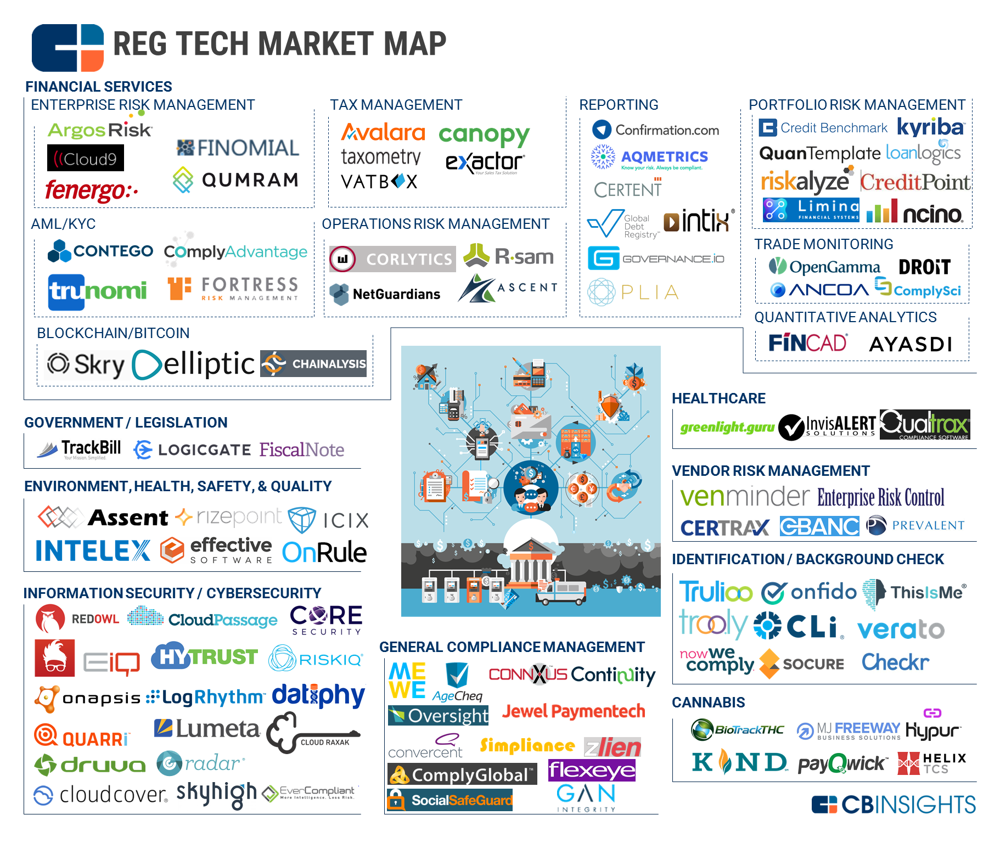

## Table of Contents

## What is RegTech and why is it important?

RegTech, short for Regulatory Technology, is a type of software that helps businesses follow rules and laws. It makes it easier for companies to keep track of all the rules they need to follow and report information to the government correctly. RegTech uses technology like artificial intelligence and data analytics to make this process faster and less prone to mistakes.

RegTech is important because it helps companies save time and money. Instead of having lots of people manually checking and reporting, RegTech can do it quickly and accurately. This also reduces the risk of getting fined for not following the rules. As rules and laws keep changing, RegTech helps companies stay up-to-date and compliant without too much hassle.

## What are the main applications of RegTech?

RegTech has many uses, one of which is helping with regulatory reporting. Companies need to send a lot of information to the government to show they are following the rules. RegTech makes this easier by automatically collecting and organizing the data, then sending it in the right format. This helps avoid mistakes and saves time.

Another big use of RegTech is in compliance management. This means making sure that a company is always following the latest rules and laws. RegTech can keep track of changes in regulations and alert companies about what they need to do. It also helps with risk management by spotting areas where a company might not be following the rules and fixing them before they become a problem.

Lastly, RegTech is used for identity verification and anti-money laundering (AML). It helps banks and other financial companies check who their customers are and make sure they are not involved in illegal activities. By using technology, RegTech can quickly and accurately verify identities and monitor transactions for any suspicious activity, helping to keep financial systems safe and secure.

## How does RegTech help in regulatory compliance?

RegTech helps businesses follow the rules by making compliance easier and faster. It uses special software to keep track of all the rules a company needs to follow. This software can automatically collect data, organize it, and send reports to the government in the right way. This means companies don't have to spend as much time and money on paperwork and can avoid mistakes that might lead to fines.

RegTech also helps companies stay up-to-date with new rules. It watches for changes in laws and tells companies what they need to do to keep following them. This is really helpful because rules can change a lot, and it can be hard for companies to keep up. By using RegTech, companies can quickly adjust to new rules without worrying about missing something important.

## What are the benefits of using RegTech solutions?

Using RegTech solutions helps companies save time and money. Instead of having lots of people working on paperwork and checking rules, RegTech can do it all quickly with computers. This means companies don't need to spend as much on staff to handle compliance. It also means they can avoid mistakes that might lead to big fines from the government. By using RegTech, businesses can focus more on their main work instead of worrying about keeping up with all the rules.

RegTech also makes it easier for companies to stay up-to-date with new rules. Laws and regulations can change a lot, and it can be hard for companies to keep track of everything. RegTech watches for these changes and tells companies what they need to do to stay compliant. This helps businesses adjust quickly without missing important updates. Overall, RegTech makes the whole process of following rules simpler and less stressful for companies.

## Can you list some common RegTech tools and their functions?

Some common RegTech tools include compliance management software, regulatory reporting tools, and identity verification systems. Compliance management software helps companies keep track of all the rules they need to follow. It alerts them when rules change and helps them make sure they are doing everything right. Regulatory reporting tools collect data from different parts of a company and organize it into reports that can be sent to the government. This makes it easier for companies to show they are following the rules without making mistakes.

Identity verification systems are another type of RegTech tool. They help banks and other financial companies check who their customers are. This is important for stopping illegal activities like money laundering. These systems use technology to quickly and accurately verify identities and monitor transactions for anything suspicious. By using these tools, companies can keep their financial systems safe and secure while also making sure they are following the rules.

## How do RegTech solutions integrate with existing systems?

RegTech solutions often connect with the systems a company already uses. They do this by using special software that can talk to other software. This means RegTech can get information from different parts of a company, like their accounting or customer data systems, without needing to start from scratch. It makes things easier because the company doesn't have to change everything they are already doing. They can just add RegTech on top of what they have.

Once connected, RegTech solutions can work smoothly with the existing systems. They can pull data, check it, and send reports without messing up the company's regular work. This helps the company keep following the rules without having to stop and do a lot of extra work. By working together, RegTech and the company's systems make sure everything stays organized and compliant.

## What are the challenges faced by companies when implementing RegTech?

One big challenge companies face when implementing RegTech is getting everything to work together. RegTech needs to connect with the systems a company already uses, like their accounting or customer data systems. This can be hard because different systems might not talk to each other easily. Companies might need to spend time and money to make sure everything works smoothly together. If they don't, the RegTech might not be able to get the right information or send reports correctly.

Another challenge is making sure everyone in the company knows how to use the new RegTech tools. People might be used to doing things the old way, and changing can be hard. They might need training to learn how to use the new software. If they don't understand it well, they might make mistakes or not use it at all. This can slow down the whole process of getting the company to follow the rules better.

Lastly, keeping up with all the changing rules can be tough. Even with RegTech, companies need to make sure the software stays updated with the latest laws. If it doesn't, they might still end up not following the rules. This means they need to keep checking and updating their RegTech, which can take more time and effort.

## Who are the key players in the RegTech industry?

Some of the main companies in the RegTech industry are working hard to help other businesses follow rules easily. Companies like ComplyAdvantage, which helps with checking if customers are who they say they are, and preventing money laundering. Another big player is RegTech Associates, which gives advice and tools to help companies manage compliance. Then there's Trulioo, which also focuses on verifying identities quickly and accurately.

These companies are important because they make special software that can watch for changes in laws and help businesses keep up. For example, ComplyAdvantage uses technology to spot risky customers and transactions. RegTech Associates helps companies understand what they need to do to follow the rules, and Trulioo makes sure that people are who they say they are, which is very important for banks and other financial companies. Together, these key players make it easier for businesses to stay compliant without spending too much time and money.

## What are some case studies of successful RegTech implementations?

One successful case of RegTech implementation is at HSBC, a big bank. They used a RegTech tool called ComplyAdvantage to help stop money laundering. Before, they had to check customers by hand, which took a lot of time and could miss things. With ComplyAdvantage, they could check customers quickly using computers. This helped them find risky customers faster and saved them a lot of time and money. It also made their bank safer and helped them follow the rules better.

Another example is at Standard Chartered Bank. They used a RegTech solution called Trulioo for identity verification. Before, checking who their customers were took a long time and was hard to do right. With Trulioo, they could check identities quickly and accurately. This helped them make sure their customers were who they said they were, which is important for stopping illegal activities. It also made it easier for them to follow the rules about knowing their customers.

## How is AI and machine learning being used in RegTech?

AI and machine learning are used in RegTech to make it easier for companies to follow rules. They help by looking at a lot of data quickly and finding patterns that people might miss. For example, AI can check if a customer is who they say they are by looking at different pieces of information. This helps stop things like money laundering because AI can spot if someone is trying to do something illegal. It also makes it faster for companies to report to the government because AI can organize all the data and fill out forms automatically.

Machine learning is also important because it can learn from the data it sees. Over time, it gets better at spotting what is normal and what might be a problem. This means it can help companies keep up with new rules without needing to change everything. For example, if a new law comes out, machine learning can quickly learn what the company needs to do to follow it. This makes it easier for companies to stay compliant and saves them time and money because they don't need as many people to check everything by hand.

## What future trends can we expect in the RegTech sector?

In the future, we can expect RegTech to use even more advanced technology like artificial intelligence and machine learning. These tools will get better at understanding and following rules, making it easier for companies to stay compliant. For example, AI might be able to predict changes in laws before they happen, helping companies prepare ahead of time. This would save companies a lot of time and money because they won't have to rush to change things when new rules come out.

Another trend we might see is more use of blockchain technology in RegTech. Blockchain can help keep records safe and make it easier to share information between different parts of a company or with the government. This could make reporting and compliance even faster and more accurate. As these technologies improve, RegTech will become even more important for helping companies follow the rules without a lot of hassle.

## How can small and medium-sized enterprises (SMEs) benefit from RegTech?

Small and medium-sized enterprises (SMEs) can benefit a lot from RegTech because it helps them follow rules without spending too much time and money. Instead of hiring lots of people to check all the rules and fill out reports, SMEs can use RegTech software to do it automatically. This saves them money because they don't need as many staff for compliance work. It also means they can avoid mistakes that might lead to fines from the government, which can be really helpful for smaller businesses that don't have a lot of extra money to spend.

RegTech also makes it easier for SMEs to keep up with new rules. Laws and regulations can change a lot, and it can be hard for smaller businesses to keep track of everything. RegTech watches for these changes and tells SMEs what they need to do to stay compliant. This helps them adjust quickly without missing important updates. Overall, using RegTech helps SMEs focus more on their main business instead of worrying about keeping up with all the rules.

## References & Further Reading

[1]: Bergstra, J., Bardenet, R., Bengio, Y., & Kégl, B. (2011). ["Algorithms for Hyper-Parameter Optimization."](https://dl.acm.org/doi/10.5555/2986459.2986743) Advances in Neural Information Processing Systems 24.

[2]: ["Advances in Financial Machine Learning"](https://www.amazon.com/Advances-Financial-Machine-Learning-Marcos/dp/1119482089) by Marcos Lopez de Prado

[3]: U.S. Commodity Futures Trading Commission (CFTC). ["Regulation Automated Trading (Reg AT)."](https://www.cftc.gov/PressRoom/PressReleases/7283-15)

[4]: U.S. Securities and Exchange Commission (SEC). ["Risk Management Controls for Brokers or Dealers with Market Access."](https://www.sec.gov/files/rules/final/2010/34-63241.pdf) (2010).

[5]: Deloitte. ["The RegTech Universe on the Rise."](https://www2.deloitte.com/lu/en/pages/technology/articles/regtech-companies-compliance.html) (2021).

[6]: ["Quantitative Trading: How to Build Your Own Algorithmic Trading Business"](https://github.com/LucindaYa/quant-resources/blob/master/Quantitative%20Trading%20How%20to%20Build%20Your%20Own%20Algorithmic%20Trading%20Business.pdf) by Ernest P. Chan