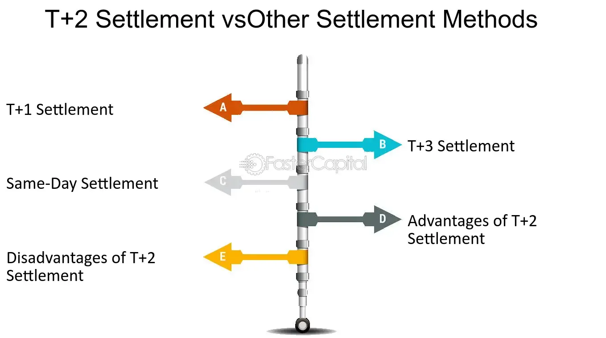

## Table of Contents

## What is a regular-way trade?

A regular-way trade is a common type of transaction in the financial markets where the buyer and seller agree to settle the trade within a standard time frame. For stocks and bonds, this is usually two business days after the trade date, known as T+2. This standard settlement period helps to ensure that both parties have enough time to prepare and complete the necessary paperwork and transfer of funds or securities.

Regular-way trades are different from other types of trades, like cash trades or next-day settlements, which have shorter settlement times. The use of a regular-way trade helps to bring order and predictability to the market, making it easier for investors and traders to plan their activities. It also reduces the risk of one party not fulfilling their part of the deal, as there is a set time frame for the transaction to be completed.

## How does a regular-way trade differ from other types of trades?

A regular-way trade is different from other types of trades because it follows a standard time frame for settling the transaction. For stocks and bonds, this usually means the trade is settled two business days after the trade date, which is called T+2. This standard time frame helps everyone know when the trade will be completed, making it easier to plan and reducing the chance that someone won't do their part of the deal.

Other types of trades can have different settlement times. For example, a cash trade settles on the same day the trade is made, which is much faster than a regular-way trade. There are also next-day settlements, where the trade is completed one business day after the trade date. These faster settlement times can be useful in certain situations, but they also require quicker action from both the buyer and the seller. Regular-way trades are the most common because they give everyone a bit more time to get everything ready, making the process smoother and more predictable.

## What are the typical settlement periods for regular-way trades?

Regular-way trades usually settle two business days after the trade date. This is called T+2. It means that if you buy or sell a stock or bond, the money and the security will change hands two days later. This gives both the buyer and the seller enough time to get everything ready and make sure the trade goes smoothly.

For some other types of investments, like government securities, the settlement period might be different. For example, government securities often settle one business day after the trade date, which is called T+1. But for most stocks and bonds that people trade, the regular-way trade settlement period is T+2. This standard time frame helps keep the market orderly and predictable.

## Can you explain the process of executing a regular-way trade?

When you decide to buy or sell a stock or bond using a regular-way trade, you start by placing an order with your broker. You tell them what you want to buy or sell, how much, and at what price. Your broker then sends your order to the stock exchange, where it gets matched with someone who wants to do the opposite trade. Once your order is matched, the trade is considered executed, and you get a confirmation from your broker telling you the details of the trade.

After the trade is executed, the next step is to wait for the settlement. For a regular-way trade, this happens two business days after the trade date, which is called T+2. During this time, your broker and the other person's broker work together to make sure everything is ready for the trade to be settled. On the settlement date, the money and the securities are exchanged. If you bought something, the money leaves your account, and the stock or bond goes into your account. If you sold something, the opposite happens. This process makes sure that everyone gets what they agreed to in the trade.

## What are the key components involved in a regular-way trade?

The key components of a regular-way trade are the trade order, the execution, and the settlement. When you want to buy or sell a stock or bond, you place an order with your broker. This order includes what you want to trade, how much, and at what price. Your broker then sends your order to the stock exchange, where it gets matched with someone who wants to do the opposite trade. Once your order is matched, the trade is executed, and you receive a confirmation from your broker with the details of the trade.

After the trade is executed, the next step is the settlement, which happens two business days after the trade date, known as T+2. During this time, your broker and the other person's broker make sure everything is ready for the trade to be settled. On the settlement date, the money and the securities are exchanged. If you bought something, the money leaves your account, and the stock or bond goes into your account. If you sold something, the opposite happens. This process ensures that everyone gets what they agreed to in the trade, making it smooth and predictable.

## How do regular-way trades impact the liquidity of financial markets?

Regular-way trades help keep financial markets liquid by setting a standard time for when trades get settled. When everyone knows that trades will settle two business days after they're made, it makes it easier for people to buy and sell things quickly. This standard time helps create a smooth flow of buying and selling, which makes the market more active and easier to use. If people can count on trades settling on time, they're more likely to trade, which keeps the market moving and liquid.

Also, regular-way trades reduce the risk of one person not doing what they promised. Because everyone knows the trade will settle in two days, it's less likely that someone will back out or not have the money or securities ready. This trust makes people more willing to trade, which adds to the market's [liquidity](/wiki/liquidity-risk-premium). When people feel safe and sure about their trades, they trade more often, which keeps the market active and liquid.

## What are the risks associated with regular-way trades?

Regular-way trades have some risks, even though they are the most common type of trade. One big risk is that something could go wrong during the two days before the trade settles. For example, the price of the stock or bond could change a lot, which means you might end up paying more or getting less than you expected. Another risk is that the person you're trading with might not be able to pay or deliver the securities on time. This can cause problems and delays, which can be frustrating and costly.

Another risk is related to the overall market. If there's a big event or news that affects the market, it could make your trade less valuable by the time it settles. This is called market risk, and it's something you have to think about when you're trading. Even though regular-way trades help make the market more predictable, these risks can still happen and affect your trades.

## How do regulations affect regular-way trades?

Regulations play a big role in how regular-way trades work. They set the rules that everyone has to follow when they buy or sell stocks and bonds. For example, regulations decide how long it takes for a trade to settle, which for regular-way trades is usually two business days. This helps keep the market fair and orderly, so everyone knows what to expect. Without these rules, trading could be confusing and risky, and people might not want to trade as much.

Regulations also help protect people who are trading. They make sure that brokers and other people involved in trades do their jobs properly and don't cheat or make mistakes. For example, there are rules that say brokers have to keep your money and securities safe while they're waiting for the trade to settle. These rules help make sure that regular-way trades go smoothly and that everyone gets what they're supposed to get. This trust in the system is important for keeping the market active and safe for everyone.

## What role do clearinghouses play in regular-way trades?

Clearinghouses are very important for regular-way trades. They act like a middleman between the people who are buying and selling stocks or bonds. When a trade happens, the clearinghouse steps in and makes sure that both the buyer and the seller do what they promised. This means the clearinghouse takes the risk away from the people trading. If someone can't pay or deliver the securities, the clearinghouse steps in and makes sure the trade still happens.

This role of the clearinghouse helps make regular-way trades safer and more reliable. It gives people more confidence to trade because they know there's someone making sure everything goes smoothly. The clearinghouse also helps with the settlement process, making sure that the money and the securities get to the right places on time. This is really important for regular-way trades, which settle two business days after the trade happens.

## How can technology enhance the efficiency of regular-way trades?

Technology can make regular-way trades faster and easier. Computers and special software help brokers and clearinghouses do their jobs better. They can match buyers and sellers quickly, keep track of all the trades, and make sure everything is ready for the trade to settle in two days. This means fewer mistakes and less waiting around. Also, technology lets people trade from anywhere using their phones or computers, which makes the market more active and easier to use.

Another way technology helps is by making the whole process safer. With technology, it's easier to check that everyone is who they say they are and that they have the money or securities they need. This reduces the chance of fraud or problems during the trade. Plus, technology can help keep better records and make sure all the rules are followed, which makes the market more trustworthy and efficient.

## What are some common strategies used by traders in regular-way trading?

Traders use different strategies when they do regular-way trades. One common strategy is called [day trading](/wiki/day-trading-spy). Day traders buy and sell stocks within the same day, hoping to make a profit from small changes in the stock's price. They use a lot of information and special tools to decide when to buy and sell. Another strategy is called swing trading. Swing traders hold onto stocks for a few days or weeks, trying to make money from bigger changes in the stock's price. They look at things like company news and market trends to make their decisions.

Another strategy is called buy and hold. People who use this strategy buy stocks and keep them for a long time, like months or years. They believe that over time, the stock's price will go up, and they can make a good profit. This strategy is less about quick trades and more about believing in the long-term growth of a company. All these strategies can work well in regular-way trading because they take advantage of the standard two-day settlement period, which gives traders a bit of time to plan and make their moves.

## How do global market differences affect regular-way trade practices?

Global market differences can change how regular-way trades work in different places. In some countries, the time it takes for a trade to settle might be different. For example, in the United States, regular-way trades usually settle in two business days, but in some other countries, it might take one day or even three days. These differences can make it harder for people who want to trade across borders because they have to keep track of different rules and times.

These differences also affect how traders plan their strategies. If a trader wants to buy and sell stocks in different countries, they need to think about when the trades will settle and how that might affect their money. For example, if they sell a stock in one country and want to use that money to buy a stock in another country, they have to make sure the money is ready in time. This can make trading more complicated and risky, but it also gives traders more chances to make money if they can handle the differences well.

## References & Further Reading

[1]: Fabian K., & Gebicke, M. (2018). ["Optimizing T+2 Settlements: Enhancing Efficiency in the Post-Trade Environment."](https://www.broadridge.com/_assets/pdf/br_e-book_transforming-post-trade-processing-with-fix-march-2022.pdf) Deloitte Report.

[2]: Securities and Exchange Commission (2022). ["SEC Adopts Rule Shortening the Securities Transaction Settlement Cycle."](https://www.sec.gov/rules-regulations/2023/02/34-96930) U.S. Securities and Exchange Commission.

[3]: Harris, L. (2003). ["Trading and Exchanges: Market Microstructure for Practitioners."](https://www.amazon.com/Trading-Exchanges-Market-Microstructure-Practitioners/dp/0195144708) Oxford University Press.

[4]: Tsang, A., et al. (2020). ["Artificial Intelligence in Financial Markets."](https://link.springer.com/book/10.1057/978-1-137-48880-0) Springer.

[5]: Tapscott, D., & Tapscott, A. (2016). ["Blockchain Revolution: How the Technology Behind Bitcoin Is Changing Money, Business, and the World."](https://dl.acm.org/doi/10.5555/3051781) Penguin Books.