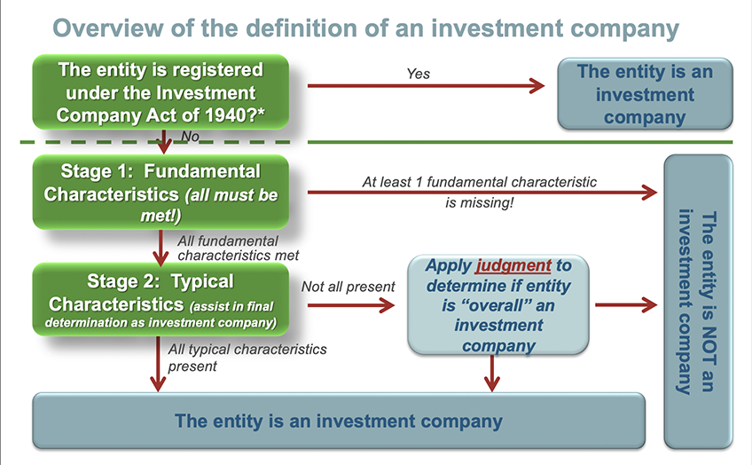

## Table of Contents

## What is a Regulated Investment Company (RIC)?

A Regulated Investment Company (RIC) is a type of company that helps people invest their money. It is often used for mutual funds and other types of investment funds. The main goal of a RIC is to make it easier for people to invest in a variety of stocks, bonds, and other assets without having to manage them directly.

RICs are regulated by the government to make sure they follow certain rules. This helps protect the people who invest their money in these companies. One big benefit of investing in a RIC is that it can help reduce the amount of taxes you have to pay on your investment earnings. This makes RICs a popular choice for many investors looking to grow their money over time.

## What are the main types of RICs?

The main types of RICs are mutual funds and exchange-traded funds (ETFs). Mutual funds are RICs that pool money from many investors to buy a variety of stocks, bonds, or other assets. They are managed by professionals who make decisions about which investments to buy and sell. This makes it easier for people to invest without having to pick individual stocks themselves.

ETFs are similar to mutual funds but they trade on stock exchanges like individual stocks. This means you can buy and sell [ETF](/wiki/etf-trading-strategies) shares throughout the day at market prices. ETFs often try to match the performance of a specific index, like the S&P 500, by holding the same stocks in the same proportions as the index. This can be a good way to get broad market exposure with a single investment.

Both mutual funds and ETFs offer diversification, which means spreading your money across many different investments to reduce risk. They also have tax advantages because RICs do not pay corporate taxes on their earnings as long as they meet certain requirements, such as distributing at least 90% of their taxable income to shareholders each year.

## How does a company qualify as a RIC?

To qualify as a Regulated Investment Company (RIC), a company needs to meet certain rules set by the government. First, the company must be a domestic corporation that is registered under the Investment Company Act of 1940. This means it is legally allowed to operate as an investment company in the United States. Second, the company must have most of its income coming from investments like dividends, interest, and capital gains. At least 90% of its income should be from these sources.

In addition to the income rules, the company must also follow rules about what it invests in. At least 50% of the company's total assets must be in cash, cash items, government securities, or other securities of other RICs. Also, no more than 25% of the company's total assets can be invested in any one issuer, except for government securities and other RICs. Finally, the company must distribute at least 90% of its taxable income to its shareholders each year. If it meets all these requirements, the company can qualify as a RIC and enjoy special tax benefits.

## What are the benefits of investing in a RIC?

Investing in a Regulated Investment Company (RIC) can be a smart move because it helps you spread your money across many different investments. This is called diversification, and it can lower your risk. Instead of putting all your money into one stock or bond, a RIC lets you own a little bit of many different things. This way, if one investment does poorly, it won't hurt your whole portfolio as much. Plus, RICs are managed by professionals who know a lot about investing, so you don't have to do all the work yourself.

Another big benefit of RICs is the tax advantage. RICs don't have to pay corporate taxes on their earnings as long as they give at least 90% of their taxable income back to shareholders each year. This means more money stays in your pocket instead of going to taxes. For example, if you invest in a mutual fund or an ETF, which are types of RICs, you might pay less in taxes compared to other types of investments. This can make a big difference over time, helping your investments grow faster.

## How are RICs taxed at the corporate level?

RICs are special because they don't have to pay corporate taxes on their earnings. This is a big deal. As long as a RIC gives at least 90% of its taxable income back to its shareholders each year, it doesn't have to pay taxes on that income at the corporate level. This rule helps RICs keep more money to reinvest or distribute to investors.

Instead of the RIC paying taxes, the shareholders pay taxes on the income they receive from the RIC. This can be dividends, interest, or capital gains. The tax rates that apply to shareholders depend on their own tax situation. So, the tax burden shifts from the company to the people who own shares in it.

## What are the tax implications for investors in RICs?

When you invest in a RIC, like a mutual fund or an ETF, you need to know about the taxes you might have to pay. RICs pass most of their earnings on to you, the investor. These earnings can come in the form of dividends, interest, or capital gains. You'll have to pay taxes on these earnings based on your own tax situation. Dividends and interest are usually taxed as ordinary income, which means they could be taxed at your regular income tax rate. Capital gains, on the other hand, might be taxed at a lower rate if you hold the investment for more than a year.

One cool thing about RICs is that they don't pay corporate taxes on their earnings, as long as they give at least 90% of their income to shareholders. This can mean more money for you because the RIC isn't losing a chunk of its earnings to taxes. However, you still need to report and pay taxes on the income you get from the RIC. It's important to keep track of these distributions because they can affect your tax return. If you're not sure how this works, talking to a tax professional can help you understand your specific situation better.

## How do RICs handle capital gains and losses?

RICs like mutual funds and ETFs handle capital gains and losses by passing them on to their investors. When a RIC sells an investment for more than it paid, it makes a capital gain. If it sells for less, it has a capital loss. These gains and losses are added up throughout the year. At the end of the year, if the RIC has more gains than losses, it will distribute these net capital gains to its shareholders. This means you, as an investor, will get a share of these gains, and you'll have to pay taxes on them.

On the other hand, if the RIC has more losses than gains, it can use these net capital losses to offset future gains. This means the RIC can [carry](/wiki/carry-trading) these losses forward to reduce the taxes it might have to pay on gains in future years. This can be helpful because it can lower the amount of taxable income the RIC has to distribute to shareholders. As an investor, you won't directly benefit from these losses in the year they happen, but they can help the RIC manage its taxes better in the long run.

## What are the reporting requirements for RICs?

RICs have to follow certain rules when it comes to reporting their financial information. They need to send out a yearly report to their shareholders that shows how the RIC did over the past year. This report includes details like how much money the RIC made, how it was invested, and any fees that were charged. RICs also have to file a special form with the government called Form N-CSR. This form gives the government a lot of the same information that goes into the shareholder report, but it's more detailed and helps the government keep an eye on what the RIC is doing.

In addition to the yearly report, RICs need to send out another report every six months. This mid-year report updates shareholders on the RIC's performance and any big changes that have happened since the last yearly report. Both the yearly and mid-year reports help shareholders understand how their investments are doing and make sure the RIC is following the rules. If a RIC doesn't follow these reporting rules, it could get in trouble with the government, so it's important for them to keep everything up to date and accurate.

## How do RICs distribute dividends and what are the tax treatments of these dividends?

RICs, like mutual funds and ETFs, give out dividends to their investors regularly. These dividends come from the income the RIC earns from its investments, such as interest from bonds or dividends from stocks. Usually, RICs pay out these dividends every three months, but some might do it more often. When a RIC decides to distribute dividends, it tells its shareholders how much they will get based on how many shares they own. This money can be sent directly to the investor's bank account or reinvested to buy more shares of the RIC.

The tax treatment of dividends from RICs can be a bit tricky. There are two main types of dividends: ordinary dividends and qualified dividends. Ordinary dividends are taxed at your regular income tax rate, which can be pretty high. Qualified dividends, on the other hand, are taxed at a lower rate, similar to long-term capital gains. To be considered qualified, the dividends need to meet certain rules set by the government. When you get your dividends, you'll get a form called a 1099-DIV that tells you how much you received and whether it's ordinary or qualified. This helps you figure out how much tax you owe on your dividends when you file your taxes.

## What are the differences in tax treatment between RICs and other investment vehicles like REITs?

RICs and REITs both offer special tax benefits, but they handle taxes differently. RICs, like mutual funds and ETFs, don't pay corporate taxes on their income as long as they distribute at least 90% of their taxable income to shareholders. This means the tax burden shifts to the investors, who pay taxes on the dividends, interest, and capital gains they receive. Dividends from RICs can be either ordinary or qualified. Ordinary dividends are taxed at the investor's regular income tax rate, while qualified dividends are taxed at a lower rate, similar to long-term capital gains.

REITs, or Real Estate Investment Trusts, also don't pay corporate taxes if they distribute at least 90% of their taxable income to shareholders. However, the dividends from REITs are usually taxed differently. Most dividends from REITs are considered ordinary dividends and are taxed at the investor's regular income tax rate. Unlike RICs, REIT dividends are less likely to qualify for the lower tax rate on qualified dividends. This is because REITs often earn income from rents and mortgage interest, which don't meet the criteria for qualified dividends. So, while both RICs and REITs offer tax advantages, the type of income and how it's taxed can be different.

## How do international investors in RICs handle tax considerations?

International investors in RICs need to think about taxes in both their home country and the United States. When you invest in a RIC like a mutual fund or an ETF, you get dividends, interest, and capital gains. In the U.S., you'll have to pay taxes on these earnings. The U.S. government might take out a part of your dividends as a withholding tax before you even get them. This is usually around 30%, but it can be lower if your home country has a tax treaty with the U.S. You'll need to file a form called a W-8BEN to claim any benefits from these treaties.

On top of U.S. taxes, you might also have to pay taxes in your home country on the income you get from the RIC. This can lead to double taxation, where you pay taxes twice on the same money. To avoid this, many countries have tax treaties with the U.S. that can help reduce or eliminate the double taxation. It's a good idea to talk to a tax advisor who knows about international taxes. They can help you understand how to report your RIC earnings and claim any tax credits or deductions you're eligible for.

## What advanced strategies can be used to optimize tax outcomes when investing in RICs?

One advanced strategy to optimize tax outcomes when investing in RICs is to use tax-efficient funds. Some RICs, like index funds and ETFs, are designed to minimize the amount of taxable income they distribute to shareholders. These funds often have lower turnover, which means they buy and sell investments less often. This can help reduce capital gains distributions, which are taxable events. By choosing these types of RICs, you can keep more of your investment earnings because you'll have less tax to pay each year.

Another strategy is to be smart about when you buy and sell your RIC shares. If you hold onto your shares for more than a year before selling, any capital gains you make will be considered long-term and taxed at a lower rate. You can also use a strategy called tax-loss harvesting. This means selling shares that have gone down in value to realize a loss, which you can then use to offset any gains you've made. This can help lower your overall tax bill. It's a good idea to talk to a tax advisor to make sure you're using these strategies in the best way possible for your situation.

## References & Further Reading

[1]: Bergstra, J., Bardenet, R., Bengio, Y., & Kégl, B. (2011). ["Algorithms for Hyper-Parameter Optimization"](https://dl.acm.org/doi/10.5555/2986459.2986743). Advances in Neural Information Processing Systems 24.

[2]: ["Advances in Financial Machine Learning"](https://www.amazon.com/Advances-Financial-Machine-Learning-Marcos/dp/1119482089) by Marcos Lopez de Prado

[3]: ["Evidence-Based Technical Analysis: Applying the Scientific Method and Statistical Inference to Trading Signals"](https://www.amazon.com/Evidence-Based-Technical-Analysis-Scientific-Statistical/dp/0470008741) by David Aronson

[4]: ["Machine Learning for Algorithmic Trading"](https://github.com/stefan-jansen/machine-learning-for-trading) by Stefan Jansen

[5]: ["Quantitative Trading: How to Build Your Own Algorithmic Trading Business"](https://www.amazon.com/Quantitative-Trading-Build-Algorithmic-Business/dp/1119800064) by Ernest P. Chan