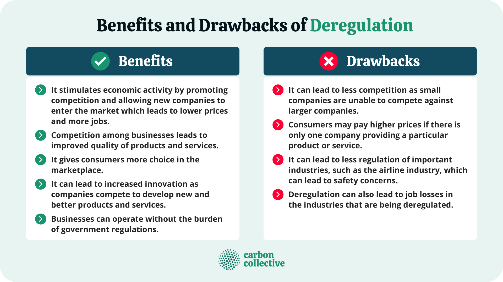

## Table of Contents

## What is a regulated market?

A regulated market is a type of market where the government or a special agency makes rules to control how businesses operate. These rules are meant to protect people who buy things and to make sure that companies behave fairly. For example, in a regulated market, there might be rules about how much a company can charge for its products or services, or rules about the quality of the products they sell.

Regulated markets are common in areas like healthcare, finance, and utilities. The idea is to prevent big companies from taking advantage of customers or from working together to set high prices. By having these rules, the government tries to make sure that the market works in a way that is good for everyone, not just the companies. This can lead to a more stable and fair economy.

## What are the main objectives of market regulation?

The main objectives of market regulation are to protect consumers and ensure fair competition. When the government sets rules for the market, it wants to make sure that people who buy things are treated fairly. This means companies can't trick people or sell them bad products. Regulations also stop companies from working together to set high prices, which can hurt customers. By protecting consumers, market regulation helps keep the economy healthy and fair for everyone.

Another important goal is to maintain stability and trust in the market. When people know there are rules in place, they feel more confident about buying things and investing their money. This trust is very important for the economy to grow. Regulations also help prevent big problems, like financial crises, by making sure companies follow certain standards. This way, the market can work smoothly and people can feel safe participating in it.

Overall, market regulation aims to create a level playing field where businesses can compete fairly, consumers are protected, and the economy remains stable. By setting clear rules and enforcing them, governments try to make sure that the market benefits everyone, not just a few big companies.

## How does regulation affect market competition?

Regulation can help make market competition fairer by stopping big companies from doing things that hurt smaller businesses. For example, rules can stop big companies from setting prices too high or making deals with each other to control the market. This helps smaller companies have a better chance to compete because they can offer their products at fair prices. When the market is more balanced, it's good for everyone because it gives people more choices and can lead to better products and services.

However, too much regulation can sometimes make it harder for companies to compete. If there are too many rules, it can be expensive and complicated for businesses to follow them. This can make it tough for new companies to start up or for small businesses to grow. They might not have the money or resources to deal with all the regulations. So, while some regulation is good to keep the market fair, too much can slow down competition and make it harder for businesses to succeed.

## What are the common types of regulations in financial markets?

In financial markets, there are several common types of regulations that help keep things fair and safe. One type is rules about how companies can raise money from investors. These rules make sure that companies tell the truth about their business and how they plan to use the money. This helps investors make smart choices and not get tricked by false information. Another type of regulation is about how banks and other financial companies can lend money or invest. These rules make sure that banks don't take too many risks with people's money, which can help prevent big problems like bank failures.

Another important set of regulations in financial markets is about protecting people who invest their money. These rules make sure that people get clear and honest information about where they are putting their money. They also make sure that people who give investment advice, like financial advisors, are honest and fair. This helps people feel more confident about investing and protects them from losing money because of bad advice or scams. Overall, these regulations help keep the financial markets stable and fair for everyone involved.

## Can you list some benefits of operating in a regulated market?

Operating in a regulated market has many benefits. One big benefit is that it protects customers. When there are rules in place, companies can't trick people or sell them bad products. This makes people feel safe when they buy things. Another benefit is that it helps keep the market fair. Big companies can't team up to set high prices, which gives smaller businesses a chance to compete. This means more choices for customers and can lead to better products and services.

Another advantage of a regulated market is that it makes the economy more stable. When people know there are rules, they trust the market more. This trust is important because it makes people more willing to spend money and invest. This can help the economy grow. Also, regulations can prevent big problems, like financial crises, by making sure companies follow certain standards. This helps the market work smoothly and keeps everyone's money safe.

## What are the potential drawbacks of market regulation?

One potential drawback of market regulation is that it can make things more complicated and expensive for businesses. When there are a lot of rules, companies need to spend time and money to make sure they follow them. This can be hard for small businesses because they might not have enough money or people to deal with all the rules. It can also make it harder for new businesses to start up because they have to learn and follow all the regulations right from the beginning.

Another problem with market regulation is that it can slow down competition. If the rules are too strict, it can be tough for companies to come up with new ideas or change how they do things. This can make the market less exciting and less likely to have new products or services. Too much regulation can also lead to a situation where big companies find ways to use the rules to their advantage, making it harder for smaller companies to compete.

## How do regulations impact small businesses versus large corporations?

Regulations can be tougher on small businesses than on large corporations. Small businesses often don't have a lot of money or people to help them understand and follow all the rules. This means they might have to spend a lot of time and money just to make sure they're doing everything right. Sometimes, the cost of following the rules can be too high for a small business, making it hard for them to grow or even stay open. On the other hand, large corporations usually have more resources. They can hire experts to help them with regulations, so it's easier for them to follow the rules without it hurting their business as much.

However, regulations can also help small businesses in some ways. They can stop big companies from doing things that make it hard for small businesses to compete, like setting prices too high or making secret deals. When the market is more fair, small businesses have a better chance to succeed. But finding the right balance is important. Too many rules can make it hard for small businesses to grow, while not enough rules can let big companies take over the market. So, regulations need to be careful and fair to help both small businesses and large corporations.

## What role do regulatory bodies play in maintaining market stability?

Regulatory bodies are really important for keeping the market stable. They make rules that companies have to follow, which helps stop big problems before they start. For example, they can make sure banks don't take too many risks with people's money. This helps prevent things like bank failures, which can hurt the whole economy. By watching over the market and making sure everyone plays by the rules, regulatory bodies help keep things calm and steady.

Another way regulatory bodies help is by making sure everyone has the right information. They make companies tell the truth about their business, so people can make smart choices about where to put their money. When people trust the market because they know it's being watched, they're more likely to spend and invest. This trust is a big part of what keeps the economy going strong. So, by keeping an eye on things and making sure the rules are followed, regulatory bodies play a key role in keeping the market stable.

## How do international regulations affect global trade?

International regulations can make global trade smoother and fairer. When countries agree on rules for things like safety standards or how to treat workers, it's easier for businesses to sell their products in different countries. For example, if every country has the same rules about how safe a toy needs to be, a toy company can make one kind of toy and sell it all over the world without having to change it for each country. This can help businesses save money and time, and it can make sure that products are safe no matter where they're sold.

But sometimes, international regulations can also make global trade harder. If countries have very different rules, it can be tough for businesses to follow them all. A company might have to change how it makes its products to meet the rules in one country, but then those changes might not work for another country. This can make it expensive and complicated for businesses to sell their products in many places. Also, if some countries have stricter rules than others, it can be hard for businesses from those countries to compete with businesses from places with fewer rules.

## What are some examples of successful regulatory frameworks?

One good example of a successful regulatory framework is the European Union's General Data Protection Regulation (GDPR). This set of rules helps protect people's personal information. It makes sure that companies tell people what they do with their data and let them control it. Since GDPR started, it has helped people feel safer about sharing their information online. It has also made companies more careful about how they use data, which is good for everyone.

Another example is the U.S. Food and Drug Administration (FDA). The FDA makes rules about food and medicine to keep people safe. They check new medicines before they can be sold to make sure they work and are safe. They also watch over food to make sure it's not harmful. Because of the FDA, people can trust that the food they eat and the medicine they take are safe. This helps keep people healthy and the economy strong.

## How can regulations be improved to better serve market participants?

Regulations can be improved by making them simpler and easier to understand. When rules are too complicated, it's hard for businesses, especially small ones, to follow them. If regulations were clearer and written in simple language, it would be easier for everyone to know what they need to do. This could help businesses spend less time and money on figuring out the rules and more time on growing and serving their customers. Also, regulators could work with businesses to find out what rules are really needed and which ones might be too much. This way, regulations can be more focused on what's important, like protecting customers and keeping the market fair.

Another way to improve regulations is by making sure they are fair for all sizes of businesses. Right now, big companies often have an easier time following the rules because they have more money and people to help them. But if regulations were designed to be easier for small businesses to follow, it would give them a better chance to compete. This could mean giving small businesses more time to meet new rules or offering them help to understand and follow the regulations. By making regulations more fair, the market can be more balanced, which is good for everyone.

## What are the current trends and future directions in market regulation?

Right now, one big trend in market regulation is using technology to make things better. Regulators are using computers and data to watch over the market more closely. This helps them spot problems faster and make sure companies are following the rules. Another trend is focusing more on protecting the environment. More and more, regulations are making sure that businesses don't harm the planet. This is important because people want to buy from companies that care about the environment.

In the future, market regulation might become even more about using technology. Things like [artificial intelligence](/wiki/ai-artificial-intelligence) could help regulators keep an eye on the market in new ways. This could make the market safer and more fair. Also, as the world gets more connected, international regulations might become more important. Countries might work together more to make rules that help global trade and protect people everywhere. This could make it easier for businesses to sell their products all over the world.

## References & Further Reading

[1]: ["Advances in Financial Machine Learning"](https://www.amazon.com/Advances-Financial-Machine-Learning-Marcos/dp/1119482089) by Marcos Lopez de Prado

[2]: ["Quantitative Trading: How to Build Your Own Algorithmic Trading Business"](https://www.amazon.com/Quantitative-Trading-Build-Algorithmic-Business/dp/1119800064) by Ernest P. Chan

[3]: Hendershott, T., & Riordan, R. (2013). ["Algorithmic Trading and the Market for Liquidity"](https://www.jstor.org/stable/43303831). Journal of Financial and Quantitative Analysis, 45(6), 1469-1486.

[4]: Aldridge, I. (2013). ["High-Frequency Trading: A Practical Guide to Algorithmic Strategies and Trading Systems"](https://www.amazon.com/High-Frequency-Trading-Practical-Algorithmic-Strategies/dp/1118343506).

[5]: ["Machine Learning for Algorithmic Trading"](https://github.com/stefan-jansen/machine-learning-for-trading) by Stefan Jansen