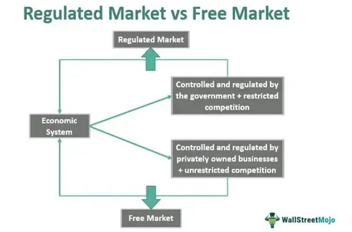

Market regulation in finance is pivotal in shaping economic activities by setting the frameworks within which financial transactions occur. These regulations are established by government entities and industry organizations to ensure stability, transparency, and fairness in market operations. In the context of rapid technological advancements like algorithmic trading, understanding the nuances of these regulations becomes even more essential. Algorithmic trading, where computers execute trades based on predefined instructions, has transformed financial markets by increasing the speed and volume of trading activities.

While algorithmic trading offers efficiency and precision, it also introduces complexities and potential risks, such as market manipulation or system failures. Regulations in this domain seek to address these challenges by setting rules that promote market integrity and protect against abuses. This duality highlights the necessity of a well-calibrated regulatory framework that balances innovation with safeguarding market participants.

Examining the advantages and disadvantages of regulated markets allows traders, investors, and policymakers to navigate the financial landscape more effectively. By appreciating how different regulatory measures impact financial activities, stakeholders can make informed decisions that align with both their strategic goals and compliance obligations.

This article aims to provide a comprehensive exploration of regulated markets, focusing particularly on algorithmic trading. By dissecting the benefits and constraints imposed by regulations, the analysis seeks to equip readers with insights into creating strategies that not only comply with existing rules but also leverage the opportunities within these structured environments. This understanding is crucial as financial markets continue to evolve amidst the growing influence of technology.

## Table of Contents

## Understanding Regulated Markets

A regulated market is characterized by oversight from government bodies or industry groups to ensure the smooth functioning and integrity of economic transactions. Regulation in this context serves multiple purposes: promoting fairness, ensuring transparency, and enhancing operational efficiency. These objectives are crucial for maintaining the confidence of investors and consumers alike, thereby fostering a stable economic environment.

The mechanisms of regulated markets typically involve a range of legislative and administrative processes aimed at monitoring and guiding market activities. These can include licensing requirements, periodic audits, disclosure mandates, and the enforcement of standards for financial reporting. For example, many financial markets are regulated to prevent fraudulent activities and to protect investors' interests, which can otherwise be jeopardized by unregulated practices.

Historically, regulated markets have evolved significantly. In the early 20th century, particularly after the 1929 stock market crash, many countries recognized the need for strict regulatory frameworks to prevent economic crises. This realization led to the establishment of regulatory bodies such as the Securities and Exchange Commission (SEC) in the United States, which was created as part of the New Deal to regulate and oversee financial markets.

Furthermore, the evolution of technology and globalization has necessitated updates to regulatory practices. The advent of digital trading and the globalization of financial markets have introduced new kinds of risks and challenges, pushing regulators to adapt. Mechanisms such as real-time data monitoring, automated compliance checks, and international regulatory cooperation have become integral components of modern market regulation.

Ultimately, regulated markets provide a structured environment that balances the interests of various stakeholders while maintaining market integrity. The historical evolution of these markets underscores the dynamic nature of regulation, which must continually adapt to address emerging economic realities and technological advancements.

## Pros of Regulated Markets

Regulated markets offer numerous advantages that can significantly impact economic stability and consumer protection. One of the primary benefits of regulation is the protection it affords consumers by ensuring product safety and financial stability. Regulations set standards that businesses must adhere to, reducing the risk of substandard or harmful products entering the market. These standards help to maintain quality control and safeguard public health and safety.

Market confidence is another crucial benefit provided by robust regulatory frameworks. When markets are regulated, participants are assured of a certain level of fairness and transparency in operations. This assurance reduces the potential for deceitful practices that can undermine market confidence. Regulatory bodies often implement measures to detect and prevent fraud, protecting both businesses and investors. For example, enforcing stringent financial reporting and auditing requirements helps to prevent financial scandals that could negatively impact market perception.

A stable environment for investment is a hallmark of well-regulated markets. Regulations create a predictable market landscape, which is essential for long-term investment planning. Investors are more likely to commit capital in environments where rules are clear, and their rights as stakeholders are protected. Regulatory oversight helps mitigate systemic risks, such as those seen during financial crises, by ensuring that institutions maintain adequate capital reserves and follow prudent risk management practices.

Regulated markets are instrumental in setting the stage for sustainable economic growth by balancing the need for free enterprise with the necessity of protective oversight. This balance ensures markets that are not only competitive but also aligned with the broader economic goals of stability and growth.

## Cons of Regulated Markets

Regulated markets, while essential for ensuring stability and fairness, often impose costs and restraints that may inhibit economic growth. One of the primary disadvantages of such regulatory frameworks is the compliance costs that businesses must bear. For many companies, especially smaller firms with limited resources, these costs can be significant and may include expenses related to legal services, reporting requirements, and administrative processes. According to a study by the Competitive Enterprise Institute, regulatory compliance can account for up to 20% of a small business's annual budget, which can significantly impact their financial viability and competitiveness.

Moreover, regulations often come with constraints that can stifle innovation, particularly in fast-evolving sectors like technology. Startups and small enterprises, which typically drive innovation, may face challenges due to burdensome regulations that require significant time and resources to navigate. As a result, these firms may struggle to bring new products to market quickly, hindering technological advancement and competitiveness.

The rigidity of some regulatory frameworks can also create obstacles in industries where rapid change is a constant. In the tech sector, for example, new business models and technological innovations can be inhibited if regulations fail to adapt to these advancements. This lack of flexibility can lead to scenarios where regulations are either outdated or irrelevant, thus impeding progress.

A balance must be achieved to avoid creating an environment where regulations are so stringent that they deter entrepreneurship and growth. Policymakers need to consider the dynamic nature of modern markets and explore approaches such as regulatory sandboxes that allow for experimentation and innovation within a controlled and supportive regulatory environment.

In conclusion, while the intention behind market regulation is to ensure fairness and stability, the potential drawbacks, including high compliance costs and innovation constraints, cannot be overlooked. Implementing adaptive and flexible regulations is crucial to fostering a conducive environment for economic growth and innovation.

## Market Regulation and Algorithmic Trading

Algorithmic trading utilizes computer algorithms to execute market trades based on pre-determined criteria. These criteria often involve complex calculations and statistical models, enabling the execution of trades at speeds and volumes unattainable by human traders. The role of regulations in [algorithmic trading](/wiki/algorithmic-trading) is to prevent manipulative practices such as spoofing, where traders place orders they intend to cancel to influence stock prices, and to ensure a level playing field among participants.

Regulatory frameworks for algorithmic trading are designed to maintain market integrity and fairness. One key aspect of these regulations is the imposition of checks and balances to prevent market manipulation, including pre-trade risk controls and real-time monitoring systems. These measures are intended to detect and restrict activities such as quote stuffing, where excessive orders are placed to create confusion and manipulate prices.

The restrictive nature of regulations can impose limitations on algorithmic trading strategies. Compliance with regulatory standards often necessitates significant investments in technology and infrastructure, particularly for advanced monitoring and risk management systems. This can be especially burdensome for smaller firms lacking the financial resources of their larger counterparts.

However, regulations also provide benefits. By ensuring transparency and reducing the potential for manipulation, they enhance market confidence, encouraging greater participation from retail and institutional investors alike. Moreover, regulations can foster a more stable trading environment, reducing the likelihood of dramatic market disruptions caused by algorithmic errors or malicious activities.

The impact of regulations is not universal and varies depending on the specific market and jurisdiction. For example, the European Union's Markets in Financial Instruments Directive II (MiFID II) imposes stringent requirements on algorithmic and high-frequency trading firms, including comprehensive record-keeping and algorithm testing protocols. These measures are designed to prevent systemic risk but may also limit the rapid development and deployment of algorithmic strategies.

Balancing the restrictive and beneficial elements of regulation presents ongoing challenges. Policymakers must continuously adapt regulatory approaches to address the evolving nature of technology and financial markets. This dynamic landscape requires a careful consideration of how regulations can protect market integrity while fostering innovation and competitiveness within the industry.

## Case Studies of Regulated Markets

The Securities and Exchange Commission (SEC) is the primary regulatory body overseeing the U.S. stock market. Established in 1934 in response to the Wall Street Crash of 1929, the SEC's main objectives are to protect investors, maintain fair and efficient markets, and facilitate capital formation. It achieves this by enforcing securities laws, requiring public companies to disclose financial and other significant information, and regulating brokerage firms and exchanges. The SEC's regulatory measures have significantly enhanced transparency, reduced fraud, and boosted investor confidence in the U.S. financial markets.

Globally, financial systems vary in their regulatory approaches, often influenced by the economic, political, and cultural contexts of each country. Some countries, like the United States and the United Kingdom, have robust regulatory frameworks with comprehensive oversight to ensure market stability and investor protection. For instance, the U.K.'s Financial Conduct Authority (FCA) shares similar responsibilities with the SEC in overseeing financial markets and protecting consumers.

In contrast, less regulated financial systems may encourage rapid economic growth by minimizing constraints on business activities. However, they can also expose markets to higher risks of fraud, financial instability, and insufficient consumer protection. A prominent example is the financial turmoil experienced by several emerging markets, where insufficient regulation and oversight led to crises that affected global financial stability.

Specific regulatory measures, such as the increase in disclosure requirements for algorithmic trading, underscore the need for transparency and fairness in markets utilizing advanced technologies. Algorithmic trading, which uses automated, pre-programmed strategies to make trading decisions at high speed, poses unique challenges to regulators. The potential for market manipulation and systemic risk necessitates stringent regulations. The SEC and other regulatory bodies have enacted rules that require firms to disclose their algorithmic trading practices, ensuring that these activities do not disrupt market integrity.

These case studies highlight the varying impacts of regulation on financial systems. Regulated markets generally offer stability and protect stakeholder interests but may also encounter restrictions that could impede innovation and growth. Conversely, less regulated markets offer flexibility but may become prone to [volatility](/wiki/volatility-trading-strategies) and crises. The challenge for policymakers lies in finding an optimal balance that harnesses the benefits of regulation while mitigating its drawbacks.

## The Balance of Regulation

Finding the right balance in market regulation remains a persistent challenge for policymakers globally. Effective regulatory strategies must ensure that markets operate fairly and efficiently while fostering innovation and economic growth. Achieving this balance is vital as markets become increasingly complex due to technological advancements and the integration of global economies.

One crucial strategy is adopting a flexible regulatory framework that can adapt to technological progress and changing market conditions. By employing a principles-based approach, regulators can provide guidance without dictating specific compliance methods, allowing firms to innovate within set boundaries. This approach contrasts with a rules-based framework, which may be overly prescriptive and stifle creativity.

Regulators must also focus on fostering an environment of transparency and accountability. Transparent markets build investor confidence and facilitate fair competition. Policymakers can enhance transparency through disclosure requirements that compel firms to provide detailed information about their activities. This is particularly relevant in sectors such as algorithmic trading, where understanding the underlying processes and strategies is essential to prevent market manipulation.

Another consideration is the need for cross-border regulatory cooperation. As markets become more globally interconnected, divergent regulatory standards can lead to inefficiencies and [arbitrage](/wiki/arbitrage) opportunities. Harmonizing regulations across jurisdictions can reduce these risks, ensuring stable international markets. Collaborative bodies such as the Financial Stability Board and the International Organization of Securities Commissions play essential roles in aligning global regulatory efforts.

Effective regulation must also consider the rapid pace of technological advancement. Emerging technologies, particularly in the financial sector, require regulators to stay informed and proactive. Regulatory sandboxes offer one solution, providing a controlled environment where firms can test innovative products without immediately being subject to the full scope of regulation. This allows regulators to understand the implications of new technologies and tailor policies appropriately.

In the digital age, data protection and cybersecurity are also pivotal elements of market regulation. As financial transactions increasingly rely on digital platforms, safeguarding personal data and ensuring resilient cybersecurity frameworks become critical both to protect consumer interests and maintain market integrity.

Finally, the future of market regulation should incorporate stakeholder engagement, ensuring diverse perspectives inform policy decisions. This approach involves soliciting input from a broad range of actors, including industry experts, consumer advocates, and academics. By considering multiple viewpoints, regulators can create more inclusive and robust regulatory frameworks that address a wide array of concerns.

In summary, finding the right balance in market regulation requires a multifaceted approach, considering the dynamic nature of global markets and technological advancements. A flexible, transparent, and cooperative framework, combined with stakeholder engagement and a focus on data security, can encourage growth while protecting market participants’ interests.

## Conclusion

Regulated markets present a dynamic landscape with various advantages and disadvantages that profoundly influence market participants. The primary benefit of regulation is the creation of a reliable framework that enhances market integrity, deterring fraudulent activities and boosting investor confidence. Regulations typically ensure that information is transparently and accurately disclosed, thereby preventing market manipulation and fostering a fair trading environment.

However, the constraints posed by regulation can also hamper business operations, imposing financial burdens through compliance costs and stifling innovation, particularly when regulation struggles to keep pace with rapid technological advancements. Firms, especially smaller ones, may find it challenging to adapt swiftly to stringent regulatory requirements, potentially limiting market entry and reducing competitiveness.

Tailoring regulatory approaches to specific industries and market conditions is crucial for maintaining the delicate balance between protective oversight and economic growth. Industry-specific strategies can mitigate the negative impact of regulation while enhancing its positive outcomes. For instance, regulations that accommodate technological advancements like algorithmic trading can ensure that new trading practices align with regulatory objectives without stifling innovation.

As markets and technologies evolve, continuous adaptation of regulatory frameworks is essential to preserve fairness, transparency, and economic prosperity. This involves not only updating regulations to address new market realities but also engaging with stakeholders to understand the implications of regulatory changes. Policymakers must maintain a forward-looking perspective to ensure that regulations are responsive, relevant, and effective in a rapidly changing global market environment. By doing so, they can safeguard the benefits of regulation while minimizing potential drawbacks, ultimately contributing to a robust and equitable economic system.

## References & Further Reading

[1]: ["Advances in Financial Machine Learning"](https://www.amazon.com/Advances-Financial-Machine-Learning-Marcos/dp/1119482089) by Marcos Lopez de Prado

[2]: ["Quantitative Trading: How to Build Your Own Algorithmic Trading Business"](https://www.amazon.com/Quantitative-Trading-Build-Algorithmic-Business/dp/1119800064) by Ernest P. Chan

[3]: Hendershott, T., & Riordan, R. (2013). ["Algorithmic Trading and the Market for Liquidity"](https://www.jstor.org/stable/43303831). Journal of Financial and Quantitative Analysis, 45(6), 1469-1486.

[4]: Aldridge, I. (2013). ["High-Frequency Trading: A Practical Guide to Algorithmic Strategies and Trading Systems"](https://www.amazon.com/High-Frequency-Trading-Practical-Algorithmic-Strategies/dp/1118343506).

[5]: ["Machine Learning for Algorithmic Trading"](https://github.com/stefan-jansen/machine-learning-for-trading) by Stefan Jansen