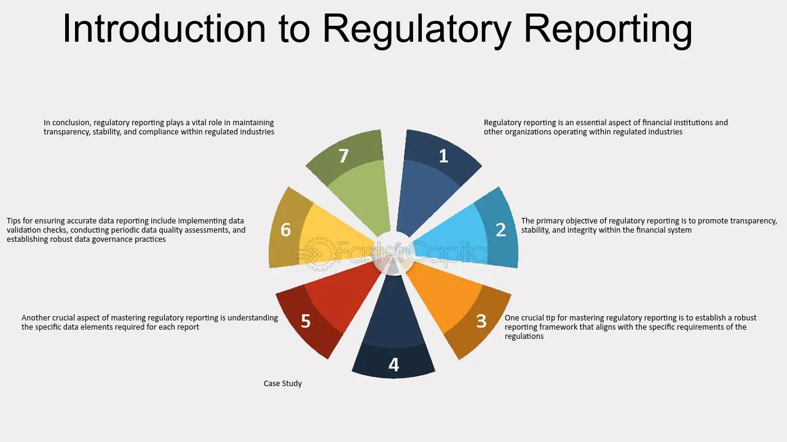

## Table of Contents

## What is Regulation 9 and what is its purpose?

Regulation 9 is a set of rules made by the government to control air pollution. It focuses on reducing harmful particles and gases that come from different sources like factories and vehicles. The main goal of Regulation 9 is to make the air cleaner and safer for everyone to breathe.

The purpose of Regulation 9 is to protect public health and the environment. By setting limits on how much pollution can be released, it helps prevent diseases caused by dirty air, like asthma and heart problems. It also aims to make the environment better for plants and animals, which can suffer from polluted air.

## Who does Regulation 9 apply to?

Regulation 9 applies to businesses and industries that release pollution into the air. This includes factories, power plants, and companies that use a lot of energy or produce a lot of waste. These businesses have to follow the rules set by Regulation 9 to make sure they do not pollute the air too much.

It also applies to vehicle owners and transportation companies. Cars, trucks, and buses release gases that can harm the air. Regulation 9 sets rules for how much pollution these vehicles can produce. This helps keep the air clean for everyone.

In some cases, Regulation 9 can also affect regular people. If you live in an area with strict air quality rules, you might need to follow certain guidelines, like not using fireplaces or burning yard waste, to help keep the air clean.

## What are the key components of Regulation 9?

Regulation 9 has several important parts that help control air pollution. One key part is setting limits on how much pollution can come from factories and power plants. These limits are called emission standards. They tell businesses the most amount of harmful gases and particles they can release into the air. Another important part is rules for vehicles. Cars and trucks have to meet certain standards to make sure they do not release too much pollution. This helps keep the air clean when people are driving.

Another key component is monitoring and reporting. Businesses have to check their pollution levels and report them to the government. This helps make sure they are following the rules. If they are not, they might have to pay a fine or make changes to reduce pollution. Regulation 9 also includes plans for what to do if the air gets too dirty. These plans can involve telling people to stay inside or businesses to reduce their pollution until the air gets better.

Overall, Regulation 9 works by setting clear rules, making sure they are followed, and having plans in place to protect the air we breathe. It helps keep the environment safe for everyone by reducing harmful pollution from different sources.

## How does Regulation 9 differ from other regulations?

Regulation 9 is special because it focuses only on air pollution. Other regulations might cover water pollution or waste management, but Regulation 9 is all about keeping the air clean. It sets strict rules for how much pollution can come from factories, power plants, and cars. This makes it different from other rules that might be more general or cover different kinds of pollution.

Another way Regulation 9 is different is that it makes businesses check their pollution levels and report them. Not all regulations require this kind of monitoring. By doing this, Regulation 9 helps make sure that the air stays clean and safe. It also has special plans for what to do if the air gets too dirty, which is something you might not find in other regulations.

## What are the compliance requirements under Regulation 9?

Under Regulation 9, businesses and industries have to follow strict rules to keep the air clean. They need to make sure they do not release too much pollution into the air. This means they have to use special equipment or change how they work to meet the pollution limits set by the regulation. They also need to keep track of their pollution levels and report them to the government regularly. If they do not follow these rules, they might have to pay a fine or make changes to reduce their pollution.

Vehicle owners and transportation companies also have to follow Regulation 9. Cars, trucks, and buses need to meet certain standards to make sure they do not release too much pollution. This means they might need to use cleaner fuels or have special devices to control their emissions. If the air gets too dirty, everyone might need to follow special rules, like not using fireplaces or burning yard waste, to help clean the air.

## What are the penalties for non-compliance with Regulation 9?

If businesses or industries do not follow Regulation 9, they can get in trouble. They might have to pay a fine, which is like a punishment in money. The fine can be big, depending on how much they broke the rules. Sometimes, they might have to stop working until they fix the problem and make the air clean again. This is to make sure they take the rules seriously and do what they can to keep the air safe for everyone.

For vehicle owners and transportation companies, not following Regulation 9 can also lead to fines. If a car or truck is releasing too much pollution, the owner might have to pay money or fix the vehicle to meet the rules. In really bad cases, the vehicle might not be allowed to drive until it is fixed. This helps make sure that cars and trucks do their part in keeping the air clean.

## How can organizations ensure they are compliant with Regulation 9?

Organizations can make sure they follow Regulation 9 by keeping a close eye on how much pollution they release. They need to use special tools and machines to check their pollution levels all the time. If they see that they are releasing too much pollution, they should fix it right away. They also need to write down their pollution numbers and send them to the government regularly. This helps the government know if they are following the rules.

Another way organizations can stay compliant is by training their workers. Everyone should know about Regulation 9 and what they need to do to keep the air clean. They should also have a plan for what to do if something goes wrong and they start releasing too much pollution. By having good plans and making sure everyone knows what to do, organizations can avoid breaking the rules and keep the air safe for everyone.

## What are some common challenges faced when implementing Regulation 9?

One common challenge when implementing Regulation 9 is the cost. Businesses have to spend money on new equipment or technology to meet the pollution limits. This can be expensive, especially for small companies. They might need to change how they work or use different materials, which can also cost a lot. Sometimes, they might not have enough money to make these changes right away, so it can take time to become compliant.

Another challenge is keeping track of pollution levels. Businesses need to monitor their emissions all the time, which can be hard. They need special tools and trained people to do this right. If something goes wrong with the monitoring equipment, it can be difficult to fix quickly. This can lead to problems with reporting the right numbers to the government, which can make it hard to stay compliant.

Lastly, understanding and following all the rules can be tricky. Regulation 9 has a lot of details and different parts that businesses need to know. They might need to hire experts to help them understand everything and make sure they are doing things right. If they miss something or make a mistake, they could get in trouble, even if they are trying their best to follow the rules.

## Are there any exemptions or special considerations under Regulation 9?

Regulation 9 does have some special rules for certain businesses or situations. Small businesses might not have to follow all the same rules as big companies. This is because small businesses might not have as much money to spend on new equipment or changes. Also, if a business is doing something really important for the community, like making medicine, they might get some extra time to meet the pollution limits. This helps make sure important things can still happen while the air stays clean.

Sometimes, there are special times when the rules can be a bit different. If there is a big emergency, like a natural disaster, the government might let businesses release a bit more pollution for a short time. This helps them keep working during the emergency. But they have to go back to following the normal rules as soon as they can. These special rules help balance keeping the air clean with letting important work continue.

## How does Regulation 9 impact international businesses?

Regulation 9 can affect international businesses that operate in countries where the regulation is in place. If an international company has factories or offices in these countries, they need to follow the same rules as local businesses. This means they have to make sure their pollution levels meet the standards set by Regulation 9. They might need to spend money on new equipment or change how they work to keep the air clean. This can be hard for companies that are used to different rules in other countries.

Sometimes, international businesses have to report their pollution levels to the government in the country where Regulation 9 applies. They need to keep track of their emissions and make sure they are following all the rules. If they do not, they could get fined or have to stop working until they fix the problem. This can be tricky because the rules might be different from what they are used to, but it helps make sure the air stays clean for everyone.

## What recent changes or updates have been made to Regulation 9?

Recently, Regulation 9 has been updated to make the rules even stricter. The government wants to make the air cleaner and safer, so they have lowered the limits on how much pollution factories and cars can release. They also added new rules for checking pollution levels more often. This means businesses have to use better equipment and keep closer track of their emissions to make sure they are following the new rules.

These updates also include more help for small businesses. The government knows that meeting the new rules can be hard for them, so they have made some special rules to give small businesses more time to make changes. They have also added more ways for businesses to report their pollution levels, making it easier to stay compliant. These changes help balance keeping the air clean with making it possible for all businesses to follow the rules.

## What future trends or developments might affect Regulation 9?

In the future, Regulation 9 might change because of new technology. As we find better ways to control pollution, the rules might get stricter. For example, new machines might help factories release less pollution, so the government could lower the limits even more. Also, if we start using more electric cars, the rules for vehicle emissions might change. This would help make the air even cleaner.

Another thing that could affect Regulation 9 is climate change. As the weather gets hotter and storms get worse, the government might want to do more to protect the air. This could mean adding new rules to Regulation 9 to help fight climate change. For example, they might ask businesses to use less energy or release less pollution during bad weather. These changes would help keep the air safe and clean for everyone.

## References & Further Reading

[1]: U.S. Office of the Comptroller of the Currency. ["Annual Review Requirements"](https://www.occ.treas.gov/news-issuances/bulletins/2008/bulletin-2008-10.html). OCC Fiduciary Activities.

[2]: Securities and Exchange Commission (SEC). ["Algorithmic Trading: Compliance with SEC Rules"](https://www.sec.gov/files/Algo_Trading_Report_2020.pdf). SEC Rules and Regulations.

[3]: Marcos Lopez de Prado. ["Advances in Financial Machine Learning"](https://www.amazon.com/Advances-Financial-Machine-Learning-Marcos/dp/1119482089). Wiley Finance.

[4]: David Aronson. ["Evidence-Based Technical Analysis: Applying the Scientific Method and Statistical Inference to Trading Signals"](https://www.amazon.com/Evidence-Based-Technical-Analysis-Scientific-Statistical/dp/0470008741). Wiley Trading.

[5]: Stefan Jansen. ["Machine Learning for Algorithmic Trading: Predictive models to extract signals from market and alternative data for systematic trading strategies with Python"](https://www.amazon.com/Machine-Learning-Algorithmic-Trading-alternative/dp/1839217715). Packt Publishing.

[6]: Ernest P. Chan. ["Quantitative Trading: How to Build Your Own Algorithmic Trading Business"](https://www.amazon.com/Quantitative-Trading-Build-Algorithmic-Business/dp/0470284889). Wiley Trading.