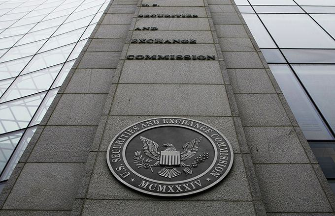

The world of investing is vast and complex, offering a multitude of options for both individual and institutional investors. Among these options, Regulation A stands out as an interesting framework for companies aiming to raise capital through securities offerings without undergoing the complete rigors of SEC registration. Regulation A, commonly referred to as "Reg A," originated from the Securities Act of 1933, which provides certain exemptions from registration. This regulatory pathway is particularly appealing for small to medium-sized enterprises, as it allows them flexibility in accessing public capital markets while avoiding some of the more stringent requirements traditionally associated with SEC registration.

Algorithmic trading, often shortened to algo trading, has significantly reshaped the investment landscape. By utilizing complex algorithms and computing power, this approach offers opportunities for improved efficiency, precision, and speed in executing trades. Algo trading is not limited to a specific segment of the market; rather, it has permeated various aspects of trading activities, from high-frequency trading to sophisticated investment strategies executed over longer periods. 



This article examines the intersection of Regulation A offerings and algorithmic trading. It focuses on the tiers of Regulation A—specifically, the distinctions between Tier 1 and Tier 2—and their implications for companies and investors. Tier 1 permits offerings up to $20 million, with fewer regulatory requirements, whereas Tier 2 allows offerings of up to $75 million, accompanied by greater regulatory compliance, including audited financial statements and continuous reporting obligations. Understanding these tiers is crucial for stakeholders to leverage the benefits of Regulation A effectively.

Incorporating algo trading within the context of Regulation A offerings introduces new dimensions to the trading landscape. It could potentially enhance the efficiency of securities trading under Regulation A by optimizing investment outcomes through data-driven strategies. By examining the confluence of these concepts, investors and companies can navigate the modern financial ecosystem more effectively, identifying opportunities for diversification and strategic growth.

As the financial environment continues to evolve, a comprehensive understanding of Regulation A offerings and algo trading will prove essential for making informed investment and capital-raising decisions.

## Table of Contents

## Understanding Regulation A

Regulation A, originating from the Securities Act of 1933, offers a significant exemption from the registration requirements mandated by the Securities and Exchange Commission (SEC) for public securities offerings. This exemption provides companies with an alternative avenue for raising capital, bypassing some of the stringent requirements typically associated with full SEC registration. By opting for Regulation A, companies can engage in public offerings without undergoing the traditional, often burdensome, registration process.

In 2015, Regulation A was notably updated through the implementation of what is commonly referred to as "Regulation A+," which introduced two distinct tiers of offerings. This update was designed to enhance the flexibility with which companies could approach public offerings, making it a more viable option for a broader range of entities. The bifurcation into Tier 1 and Tier 2 offerings caters to different company sizes and capital-raising needs, thus expanding the utility and attractiveness of Regulation A as a fundraising mechanism.

Beyond the structural changes, Regulation A allows companies to engage directly with potential investors, giving them the ability to test the waters before finalizing an offering. This provision can be instrumental in gauging investor interest and adapting the offering accordingly.

For companies considering this route, understanding the intricacies of Regulation A is crucial. This includes knowledge of the eligibility criteria, disclosure requirements, and the overall implications of choosing either Tier 1 or Tier 2 offerings. Having a thorough grasp of these elements helps ensure that companies can effectively leverage Regulation A to meet their capital-raising goals while maintaining compliance with regulatory standards.

## Regulation A: Tier 1 vs. Tier 2

Regulation A is segmented into two distinct tiers, offering different pathways for companies aiming to raise capital through securities offerings. These tiers—Tier 1 and Tier 2—provide unique benefits and come with specific requirements tailored to meet varying corporate and investor needs.

**Tier 1** allows companies to raise up to $20 million in a 12-month period. It is designed with fewer regulatory burdens, thereby making it an attractive option for smaller companies or those looking to avoid the rigorous demands of traditional securities offerings. Importantly, Tier 1 does not impose ongoing reporting obligations after the offering period is complete. This factor can substantially lower the compliance costs for companies, making capital raising more accessible. However, companies opting for Tier 1 must still comply with the blue sky laws of each state where the securities are sold, which can entail state-level documentation and approval processes.

**Tier 2**, on the other hand, permits offerings up to $75 million within the same 12-month timeframe, thus catering to larger capital needs. However, it imposes more stringent requirements, including the need for audited financial statements and ongoing reporting obligations to the Securities and Exchange Commission (SEC). These requirements ensure greater transparency and protection for investors, potentially increasing investor confidence and participation. Unlike Tier 1, Tier 2 preempts state blue sky laws, which can simplify the regulatory landscape for companies operating across multiple states.

The choice between Tier 1 and Tier 2 has substantial implications for both issuing companies and potential investors. Companies must evaluate their capital requirements, the willingness to bear compliance costs, and the geographical scope of their offerings. For investors, understanding these tiers is crucial to assessing the risk, regulatory oversight, and disclosure levels associated with their investment. As such, the decision not only influences how companies strategize their capital-raising efforts but also determines the nature and availability of investment opportunities within the financial market.

## The Role of Algorithmic Trading

Algorithmic trading stands as a transformative force in modern financial markets, characterized by the use of complex algorithms to execute trades at speeds and frequencies that are impossible for human traders. This method of trading, which relies heavily on mathematical models and computational technology, has redefined market practices by offering enhanced precision and speed.

Integrating [algorithmic trading](/wiki/algorithmic-trading) with Regulation A offerings can open new avenues for both issuing companies and investors by potentially streamlining the trading process. One significant advantage is the automation of transactions, which reduces the time between the decision to trade and the actual trading action, enhancing market [liquidity](/wiki/liquidity-risk-premium) and efficiency. Algorithms can quickly analyze market conditions, historical data, and real-time information to make informed trading decisions, thus lowering transaction costs and improving execution quality.

Regarding Regulation A's Tier 1 and Tier 2 offerings, algorithmic trading can harness their specific characteristics to optimize investment returns. Tier 1 offerings, which cap at $20 million, are not subject to ongoing reporting requirements, potentially resulting in less public information availability. However, algorithmic systems can mitigate this by employing sophisticated algorithms that predict price movements based on limited data, such as historical trading patterns and macroeconomic indicators.

For Tier 2 offerings, where companies can raise up to $75 million and are required to provide audited financial statements and ongoing SEC reporting, algorithms can process the detailed financial disclosures to refine trading strategies. This transparency allows for the development of models that incorporate a broader array of factors, improving risk assessment and investment outcomes.

Algorithmic trading can adapt its strategies to the [volatility](/wiki/volatility-trading-strategies) and risk profiles of these tiers. For example, by using a combination of [machine learning](/wiki/machine-learning) and statistical [arbitrage](/wiki/arbitrage), algorithms can identify price inefficiencies specific to Regulation A securities and exploit these for potentially higher returns. The capacity to execute trades rapidly allows the capitalization of fleeting market opportunities which might otherwise be missed in manual trading.

Incorporation of strategies such as market-making, where algorithms provide liquidity by continuously offering buy and sell quotes, or [momentum](/wiki/momentum) trading, which capitalizes on the continuation of existing market trends, are examples of how algorithmic trading can leverage Regulation A offerings. Both strategies can enhance the attractiveness of Regulation A securities by providing reliable liquidity and facilitating price discovery.

Despite these potential benefits, incorporating algorithmic trading in Regulation A offerings presents certain challenges. A primary concern is the risk of exacerbating market volatility through erroneous trades triggered by poorly designed algorithms. Moreover, there is the challenge of ensuring compliance with the evolving regulatory landscape governing algorithmic trading.

Overall, algorithmic trading holds significant potential to optimize the trading of securities within the Regulation A framework. By leveraging the speed, precision, and analytical power of algorithm-driven strategies, both investors and companies can better navigate the nuances of securities offerings under Regulation A.

## Investment Opportunities and Considerations

Investors considering Regulation A offerings must evaluate the distinct characteristics of the investment tiers and the potential influence of algorithmic trading on their investment strategies. Regulation A provides a viable option for diversifying portfolios by granting access to securities that may not be available through conventional offerings.

Understanding the level of risk associated with Regulation A offerings is crucial. Tier 1 offerings, due to lower capital limits of up to $20 million, may present a different risk profile compared to Tier 2 offerings, which allow for raising up to $75 million but come with stricter regulatory requirements, including the need for audited financial statements and ongoing reporting obligations to the SEC. The inclusion of audited financial statements in Tier 2 offerings can assist investors in performing due diligence and evaluating financial health, thereby potentially mitigating risk.

Algorithmic trading, with its inherent speed and precision, can play a significant role in optimizing investment outcomes in Regulation A offerings. For instance, algorithmic strategies can be employed to swiftly analyze market conditions and execute trades in response to specific market signals. This capability allows investors to capitalize on the dynamic nature of market movements and make informed decisions quickly.

Python offers powerful tools for implementing basic algorithmic trading strategies that could be applied to Regulation A securities. A simple example can be outlined using the following pseudocode:

```python
import pandas as pd

# Generate historical price data for a security
price_data = pd.read_csv('security_data.csv')

# Calculate the moving averages
short_window = 40
long_window = 100

price_data['Short_MA'] = price_data['Close'].rolling(window=short_window, min_periods=1).mean()
price_data['Long_MA'] = price_data['Close'].rolling(window=long_window, min_periods=1).mean()

# Define trading signals based on moving averages
def generate_signals(data):
    signals = pd.DataFrame(index=data.index)
    signals['Signal'] = 0.0

    # Generate buy signal
    signals['Signal'][short_window:] = np.where(data['Short_MA'][short_window:] > data['Long_MA'][short_window:], 1.0, 0.0)

    # Generate sell signal
    signals['Position'] = signals['Signal'].diff()

    return signals

signals = generate_signals(price_data)

# Display the signals
print(signals)
```

By implementing such algorithmic strategies, investors could potentially exploit price trends and generate returns in Regulation A markets.

Assessing the potential market for securities offered under Regulation A is another critical consideration. Understanding market demand and liquidity, especially for Tier 2 offerings given their higher compliance costs and investment limits, is essential. Since Tier 2 offerings involve a broader market due to their increased caps, they sometimes attract institutional investors, enhancing liquidity compared to Tier 1 offerings.

Ultimately, Regulation A facilitates access to unique investment opportunities while allowing investors to tap into underrepresented segments of the market. The flexibility afforded by the two tiers presents varying levels of exposure and opportunities depending on the investor's risk tolerance and strategic goals. As such, thorough evaluation of the potential investment outcomes, alongside the use of advanced trading methodologies like algorithmic trading, can significantly influence the decision-making process for astute investors.

## Conclusion

Regulation A provides companies with a flexible yet structured pathway to raise capital through public offerings, bypassing some of the stringent requirements of full SEC registration. This alternative capital-raising strategy is marked by the distinction between Tier 1 and Tier 2 offerings, each with unique benefits and obligations that cater to varying needs. As such, both emerging and established companies can tailor their approach to suit their financial and regulatory capacities.

The integration of algorithmic trading into Regulation A offerings significantly enhances this flexibility by increasing market efficiency and broadening access to potential investors. Algo trading, recognized for its speed and precision, can optimize the market presence of both Tier 1 and Tier 2 securities, providing investors with streamlined avenues for asset diversification. The nuanced interplay between these investment tiers and algorithmic trading strategies is vital for investors and companies aiming to maximize their financial outcomes.

Looking ahead, future developments in financial regulation and technology will inevitably influence the trajectory of Regulation A offerings and algo trading. Emerging technologies and evolving regulatory frameworks will require investors and companies to stay informed and adaptable. This ongoing evolution underscores the importance of strategic planning and informed decision-making to leverage these opportunities effectively in a dynamic financial landscape.

## References & Further Reading

[1]: Wang, J., Zhang, L., & Zhao, Y. (2021). ["A survey on the recent development of algorithmic trading strategies on stock markets."](https://www.sciencedirect.com/science/article/pii/S2095809920302502) Decision Support Systems, 142.

[2]: Securities and Exchange Commission. ["Regulation A"](https://www.sec.gov/resources-small-businesses/exempt-offerings/regulation).

[3]: Weiss, D. (2015). ["Regulation A+: The New Mini-IPOs and Their Implications."](https://www.ipohub.org/article/regulation-a-plus-mini-ipo) Journal of Law and Policy, 23(1).

[4]: Azbel, A. (2021). ["Algorithmic Trading: Winning Strategies and Their Rationale."](https://books.google.com/books/about/Algorithmic_Trading.html?id=CIwCTVqEj4oC) Wiley.

[5]: Lopez de Prado, M. (2018). ["Advances in Financial Machine Learning."](https://www.amazon.com/Advances-Financial-Machine-Learning-Marcos/dp/1119482089) Wiley.