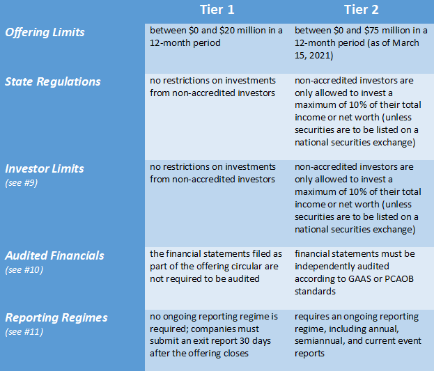

## Table of Contents

## What is Regulation A?

Regulation A is a set of rules from the U.S. Securities and Exchange Commission (SEC) that helps small businesses raise money. It allows companies to sell stocks or other securities to the public without going through the full process of a traditional initial public offering (IPO). This makes it easier and less expensive for smaller companies to get the funds they need to grow.

There are two tiers in Regulation A. Tier 1 lets companies raise up to $20 million in a 12-month period. Tier 2 allows companies to raise up to $75 million. Both tiers have different rules about how much information companies need to share with investors and the public. This helps protect investors by making sure they have enough information to make smart choices about where to put their money.

## What are the main purposes of Regulation A?

The main purpose of Regulation A is to help small businesses raise money more easily. It allows these companies to sell stocks or other securities to the public without going through the complicated and expensive process of a traditional initial public offering (IPO). This makes it simpler for small businesses to get the funds they need to grow and expand.

Another important purpose of Regulation A is to protect investors. The regulation has rules about how much information companies need to share with the public. This helps investors make informed decisions about where to put their money. By having two tiers, Tier 1 and Tier 2, Regulation A can balance the needs of small businesses with the need to keep investors safe.

## How does Regulation A differ from other exemptions like Regulation D?

Regulation A and Regulation D are both ways for companies to raise money without a full IPO, but they work differently. Regulation A is designed for small businesses and lets them sell securities to the general public. It has two tiers: Tier 1 allows companies to raise up to $20 million, and Tier 2 allows up to $75 million. Companies using Regulation A need to file an offering statement with the SEC and share information with the public, which helps protect investors by making sure they have enough information to make good choices.

On the other hand, Regulation D is more about private placements, where companies can sell securities to a smaller group of investors, often accredited investors who have a lot of money or experience. Regulation D has different rules, like Rule 506(b) and Rule 506(c), which let companies raise unlimited amounts of money but with restrictions on how they can advertise and who can invest. Unlike Regulation A, Regulation D doesn't require companies to share as much information publicly, making it a bit less transparent but often easier and quicker for companies to use.

In summary, Regulation A is more public-focused and aims to help small businesses while protecting a broader range of investors. Regulation D is more private, aimed at raising money from a smaller, often more sophisticated group of investors, with less public disclosure required.

## What are the two tiers of Regulation A?

The first tier of Regulation A is called Tier 1. It lets companies raise up to $20 million in a year. Companies that use Tier 1 have to share some information with the public, but not as much as a full IPO. This tier is good for smaller companies that want to raise money without too much hassle. It's also easier for these companies to sell their securities to the general public.

The second tier of Regulation A is called Tier 2. It allows companies to raise up to $75 million in a year. Companies using Tier 2 need to share more information with the public than those using Tier 1. This helps protect investors by making sure they know more about the company they are investing in. Tier 2 is for companies that need more money to grow but still want an easier way to raise funds than a full IPO.

## What are the key differences between Tier 1 and Tier 2 of Regulation A?

Tier 1 of Regulation A lets companies raise up to $20 million in a year. It's easier for smaller companies because they don't have to share as much information with the public. This makes it simpler and less expensive for them to sell their securities to everyday people. Tier 1 is great for companies that need a bit of money to grow but don't want to go through a big, complicated process.

Tier 2 of Regulation A allows companies to raise up to $75 million in a year. This tier is for companies that need more money but still want an easier way to get it than a full IPO. Companies using Tier 2 have to share more information with the public than those using Tier 1. This helps keep investors safer by giving them more details about the company they are investing in. Both tiers help small businesses raise money, but Tier 2 is for those needing a bigger amount and willing to share more information.

## What are the eligibility requirements for companies to use Regulation A?

To use Regulation A, a company must be organized in the United States or Canada. The company should not be a shell company or a blank check company, which means it should have some business operations or assets. Also, the company cannot be an investment company as defined by the Investment Company Act of 1940. This helps make sure that only real businesses can use Regulation A to raise money.

There are some more rules that depend on whether a company is using Tier 1 or Tier 2 of Regulation A. For Tier 1, the company needs to file an offering statement with the SEC and share some information with the public. For Tier 2, the company has to share more information and also needs to provide ongoing reports after the offering. Both tiers have different limits on how much money a company can raise, so the company needs to pick the right tier based on how much money it needs and how much it is willing to share with the public.

## What is the maximum amount of money a company can raise under each tier of Regulation A?

Under Tier 1 of Regulation A, a company can raise up to $20 million in a year. This tier is good for smaller companies that don't need a lot of money and don't want to share too much information with the public. It's an easier way for them to get funds from everyday people without going through a big, complicated process.

Tier 2 of Regulation A lets a company raise up to $75 million in a year. This tier is for companies that need more money but still want an easier way to get it than a full IPO. Companies using Tier 2 have to share more information with the public to help keep investors safe. Both tiers help small businesses raise money, but Tier 2 is for those needing a bigger amount and willing to share more details.

## What are the ongoing reporting requirements for companies that use Regulation A?

Companies that use Tier 2 of Regulation A have to keep sharing information with the public after they raise money. They need to file a report every year and also need to file a special report if something big happens, like a change in the company's business or if they sell a lot of their stock. This helps keep investors up to date on what's going on with the company.

Companies using Tier 1 of Regulation A don't have to do as much ongoing reporting. They only need to file a report if something really important happens, like a big change in their business. This makes it easier for smaller companies to use Tier 1 without having to do a lot of extra work after they raise money.

## How does the SEC review process work for Regulation A offerings?

When a company wants to use Regulation A to raise money, they have to send an offering statement to the SEC. This statement has details about the company and what they want to do with the money. The SEC looks at this statement to make sure it has all the right information and that the company is following the rules. This review can take a few weeks or even a few months, depending on how busy the SEC is and if they need more information from the company.

Once the SEC finishes their review, they will either say the offering can go ahead or they might ask for more information or changes. If everything is okay, the company can start selling their securities to the public. But if the SEC finds problems, the company has to fix them before they can move forward. This process helps make sure that investors get all the information they need to make smart choices about where to put their money.

## What are the investor qualification requirements for participating in Regulation A offerings?

Anyone can invest in a Regulation A offering, no matter how much money they have. This is different from some other ways of raising money, where only rich people can invest. With Regulation A, everyday people can buy the company's stocks or other securities. This makes it easier for small businesses to get money from a lot of different people.

There are some limits on how much money someone can invest in a Regulation A offering if they are using Tier 2. If someone's income or net worth is less than $124,000, they can invest the greater of 10% of their yearly income or net worth, or up to $2,500. If their income or net worth is more than $124,000, they can invest up to 10% of their yearly income or net worth, with no dollar limit. These rules help protect people who might not have a lot of money to lose.

## What are some common challenges companies face when using Regulation A?

One common challenge companies face when using Regulation A is the time and cost of the SEC review process. It can take a few weeks or even months for the SEC to look over the offering statement and make sure everything is right. This can slow down the company's plans to raise money. Also, companies might need to pay lawyers and other experts to help them get everything ready for the SEC, which can be expensive.

Another challenge is making sure they share enough information with the public. For Tier 2, companies have to keep filing reports after they raise money, which can be a lot of work. Even for Tier 1, they need to tell the public if something big happens. This can be hard for small companies that don't have a lot of people to help with all the paperwork. But it's important because it helps keep investors safe and informed.

## How has Regulation A evolved since its inception, and what future changes might we expect?

Regulation A has changed a lot since it started. In the beginning, it was hard for small companies to use because it had strict rules and didn't let them raise much money. But in 2012, the JOBS Act made big changes to Regulation A. It created two new tiers, Tier 1 and Tier 2, which let companies raise more money and made the rules easier to follow. This helped more small businesses use Regulation A to get the money they need to grow.

In the future, Regulation A might keep changing to help more companies and protect investors even better. The SEC might make the rules easier for small companies to follow, so they can raise money without too much hassle. They might also update the rules to keep up with new ways of raising money, like using the internet and social media. These changes could make it even easier for small businesses to grow and for everyday people to invest in them.

## References & Further Reading

[1]: Wang, J., Zhang, L., & Zhao, Y. (2021). ["A survey on the recent development of algorithmic trading strategies on stock markets."](https://www.sciencedirect.com/science/article/pii/S2095809920302502) Decision Support Systems, 142.

[2]: Securities and Exchange Commission. ["Regulation A"](https://www.sec.gov/resources-small-businesses/exempt-offerings/regulation).

[3]: Weiss, D. (2015). ["Regulation A+: The New Mini-IPOs and Their Implications."](https://www.ipohub.org/article/regulation-a-plus-mini-ipo) Journal of Law and Policy, 23(1).

[4]: Azbel, A. (2021). ["Algorithmic Trading: Winning Strategies and Their Rationale."](https://books.google.com/books/about/Algorithmic_Trading.html?id=CIwCTVqEj4oC) Wiley.

[5]: Lopez de Prado, M. (2018). ["Advances in Financial Machine Learning."](https://www.amazon.com/Advances-Financial-Machine-Learning-Marcos/dp/1119482089) Wiley.