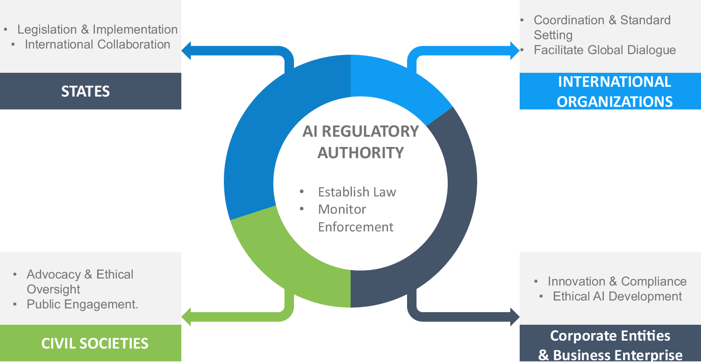

## Table of Contents

## What is Regulation AA?

Regulation AA is a rule set by the Federal Reserve in the United States. It focuses on preventing unfair practices in the credit card industry. The rule makes sure that credit card companies treat customers fairly and clearly explain their terms.

The main goal of Regulation AA is to protect consumers. It requires credit card companies to be honest about fees, interest rates, and other charges. By doing this, it helps people make better choices about using credit cards and avoids surprises from hidden costs.

## Who does Regulation AA apply to?

Regulation AA applies to credit card companies and banks that issue credit cards in the United States. It makes sure these companies follow fair practices when dealing with customers. This means they have to be clear about the costs and terms of using a credit card.

The rule helps protect people who use credit cards. It makes sure that credit card companies tell customers about fees, interest rates, and other charges in a way that is easy to understand. This helps people know what they are agreeing to when they use a credit card, so they can make smart choices and avoid unexpected costs.

## What is the purpose of Regulation AA?

Regulation AA is a rule from the Federal Reserve in the United States. Its main purpose is to make sure that credit card companies treat people fairly. This rule helps stop credit card companies from using unfair practices when they deal with customers.

The rule makes credit card companies explain their fees, interest rates, and other charges clearly. This way, people can understand what they are agreeing to when they use a credit card. By making things clear and fair, Regulation AA helps people make better choices about using credit cards and avoid surprises from hidden costs.

## When was Regulation AA established?

Regulation AA was established by the Federal Reserve in the United States. It started in 1988. This rule was made to make sure that credit card companies treat people fairly.

The main goal of Regulation AA is to stop credit card companies from using unfair practices. It makes them explain their fees, interest rates, and other charges clearly. This helps people understand what they are agreeing to when they use a credit card.

## What are the key components of Regulation AA?

Regulation AA has several key parts that help make sure credit card companies treat people fairly. One main part is that it requires these companies to clearly tell customers about any fees, interest rates, and other charges. This means that when you get a credit card, the company has to explain everything in a way that is easy to understand. This helps you know exactly what you're agreeing to when you use the card.

Another important part of Regulation AA is that it stops credit card companies from using unfair practices. For example, they can't change the terms of your card without telling you first. They also can't charge you fees that are hidden or not clearly explained. This rule helps protect you from surprises and makes sure that the credit card company plays by the rules.

## What are the prohibited practices under Regulation AA?

Regulation AA stops credit card companies from doing things that are unfair to customers. One thing they can't do is change the terms of your credit card without telling you first. This means they can't suddenly increase your [interest rate](/wiki/interest-rate-trading-strategies) or add new fees without giving you a heads-up. They also can't make you pay for things that were not clearly explained to you from the start. This helps make sure you know what you're agreeing to when you use your credit card.

Another thing that Regulation AA stops is hidden fees. Credit card companies can't charge you for things that are not clearly listed in your agreement. For example, they can't add a fee for using your card at certain places if they didn't tell you about it beforehand. This rule helps you avoid surprises and makes sure the credit card company is honest about all the costs involved.

## How does Regulation AA impact financial institutions?

Regulation AA makes financial institutions, like banks and credit card companies, follow strict rules about how they treat customers. They have to be very clear about fees, interest rates, and other charges. This means they can't hide any costs or surprise people with new fees without telling them first. If they don't follow these rules, they can get in trouble with the Federal Reserve. This makes them think carefully about how they do business and makes sure they treat people fairly.

Because of Regulation AA, financial institutions have to spend more time and money making sure their terms are easy to understand. They need to make sure all their paperwork is clear and that they tell customers about any changes to their credit card terms. This can be a lot of work, but it's important because it helps build trust with customers. When people know they are being treated fairly, they are more likely to keep using the credit card and feel good about the company.

## What are the penalties for violating Regulation AA?

If a credit card company breaks the rules of Regulation AA, they can get in big trouble. The Federal Reserve can make them pay fines. These fines can be a lot of money, and they depend on how bad the mistake was and how many people it affected. The fines are meant to make sure the companies follow the rules and treat people fairly.

Besides fines, the Federal Reserve can also make the credit card company fix the problem. They might have to give money back to the customers who were treated unfairly. This helps make things right for the people who were hurt by the company's actions. By having these penalties, Regulation AA makes sure that credit card companies think twice before doing anything unfair.

## How is Regulation AA enforced?

Regulation AA is enforced by the Federal Reserve. They make sure that credit card companies follow the rules and treat people fairly. If a company breaks the rules, the Federal Reserve can step in and take action. They do this by looking at complaints from customers and checking the company's practices to see if they are doing anything wrong.

If the Federal Reserve finds that a credit card company is not following Regulation AA, they can make the company pay a fine. The amount of the fine depends on how serious the mistake was and how many people it affected. Besides fines, the Federal Reserve can also make the company fix the problem. This might mean giving money back to the customers who were treated unfairly. By enforcing Regulation AA, the Federal Reserve helps make sure that credit card companies play by the rules and treat people right.

## What are the recent amendments to Regulation AA?

Regulation AA has been updated a few times to keep up with changes in the credit card industry. One big change happened in 2010 with the Credit Card Accountability Responsibility and Disclosure (CARD) Act. This law added new rules to Regulation AA to make credit card companies even more clear about their fees and interest rates. It also stopped them from raising interest rates on existing balances without a good reason and made them give people at least 45 days' notice before making any big changes to their card terms.

Another important update came in 2011 when the Federal Reserve made some changes to how credit card companies have to show their billing statements. The new rules made it easier for people to understand their bills and see how much they owe. These updates to Regulation AA help make sure that credit card companies keep treating people fairly and that customers know exactly what they are agreeing to when they use a credit card.

## How does Regulation AA interact with other financial regulations?

Regulation AA works together with other financial rules to make sure people are treated fairly when they use credit cards. One important rule it connects with is the Truth in Lending Act (TILA). TILA makes credit card companies tell people about the costs of borrowing money in a clear way. Regulation AA adds to this by making sure that credit card companies can't surprise people with hidden fees or change the rules without telling them first. By working together, these rules help make sure that everything about credit cards is easy to understand and fair.

Another rule that Regulation AA works with is the Credit Card Accountability Responsibility and Disclosure (CARD) Act. This act came in 2010 and added more rules to Regulation AA to stop credit card companies from doing things like raising interest rates on existing balances without a good reason. It also made them give people more time to understand changes to their card terms. Together, Regulation AA and the CARD Act make sure that credit card companies treat people fairly and that customers know what they are agreeing to when they use a credit card.

## What are the best practices for compliance with Regulation AA?

To follow Regulation AA, credit card companies should always be clear about their fees, interest rates, and other charges. They need to make sure that all their terms are easy for people to understand. This means writing everything in simple language and avoiding any hidden costs. If they need to change the terms of a credit card, they should tell their customers at least 45 days before the change happens. This gives people time to decide if they want to keep using the card or not.

Another good practice is to train employees well so they know all about Regulation AA. This way, everyone in the company can help make sure they are following the rules. Credit card companies should also keep an eye on their practices and listen to customer complaints. If they find any problems, they should fix them quickly. By doing these things, credit card companies can make sure they are treating people fairly and staying in line with Regulation AA.

## References & Further Reading

[1]: ["Unfair or Deceptive Acts or Practices (UDAP) - A Guide for Financial Institutions"](https://www.occ.gov/publications-and-resources/publications/comptrollers-handbook/files/unfair-deceptive-act/pub-ch-udap-udaap.pdf) Federal Deposit Insurance Corporation.

[2]: ["Dodd-Frank Wall Street Reform and Consumer Protection Act: Its Effect on Consumer Protection"](https://en.wikipedia.org/wiki/Dodd%E2%80%93Frank_Wall_Street_Reform_and_Consumer_Protection_Act) Board of Governors of the Federal Reserve System.

[3]: Lopez de Prado, M. (2018). ["Advances in Financial Machine Learning."](https://www.amazon.com/Advances-Financial-Machine-Learning-Marcos/dp/1119482089) Wiley.

[4]: Chan, E. (2009). ["Quantitative Trading: How to Build Your Own Algorithmic Trading Business."](https://github.com/ftvision/quant_trading_echan_book) Wiley.

[5]: ["Algorithmic Trading: Overview, Examples, and Software Options"](https://www.investopedia.com/articles/active-trading/101014/basics-algorithmic-trading-concepts-and-examples.asp) Investopedia.