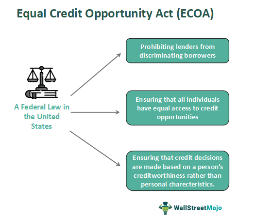

## Table of Contents

## What is Regulation B?

Regulation B is a rule from the government that helps make sure everyone is treated fairly when they want to borrow money, like getting a loan or a credit card. It stops banks and other lenders from being unfair to people because of things like their race, gender, or age. This rule is important because it helps make sure that everyone has an equal chance to get the money they need.

The rule also says that if someone asks for a loan, the bank has to tell them if they can have it or not within a certain time. If the bank says no, they have to explain why. This helps people understand what they need to do better next time they ask for a loan. It makes the whole process clearer and fairer for everyone.

## What is the Equal Credit Opportunity Act (ECOA)?

The Equal Credit Opportunity Act (ECOA) is a law that makes sure everyone is treated fairly when they want to borrow money. It stops banks and other lenders from saying no to someone just because of things like their race, color, religion, national origin, sex, marital status, age, or because they get public assistance. The law wants to make sure that everyone has an equal chance to get a loan or a credit card.

ECOA also says that if a bank or lender says no to someone's request for credit, they have to give a reason why. This helps people understand what they need to do to get approved next time. The law helps keep things clear and fair for everyone who wants to borrow money.

## How do Regulation B and the ECOA work together?

Regulation B and the Equal Credit Opportunity Act (ECOA) work together to make sure everyone is treated fairly when they want to borrow money. Regulation B is a set of rules that comes from the ECOA. It tells banks and lenders exactly what they need to do to follow the law. The main job of Regulation B is to stop banks from being unfair to people because of things like their race, gender, or age. It makes sure that everyone gets a fair shot at getting a loan or a credit card.

Both Regulation B and ECOA say that if someone asks for a loan, the bank has to tell them yes or no within a certain time. If the bank says no, they have to explain why. This helps people understand what they need to do better next time. By working together, Regulation B and ECOA make the whole process of borrowing money clearer and fairer for everyone. They help make sure that nobody is left out just because of who they are.

## Who does the ECOA protect?

The Equal Credit Opportunity Act (ECOA) protects a lot of people. It makes sure that banks and lenders can't say no to someone just because of things like their race, color, religion, where they come from, their sex, if they're married or not, how old they are, or if they get help from the government. This means that everyone, no matter who they are, has a fair chance to get a loan or a credit card.

ECOA also helps people by making sure that if a bank says no to their request for credit, they have to explain why. This helps people know what they need to do to get approved next time. By protecting all these different groups, ECOA makes borrowing money fair and clear for everyone.

## What types of credit transactions are covered under the ECOA?

The Equal Credit Opportunity Act (ECOA) covers many types of credit transactions. This means it helps make things fair when people want to borrow money in different ways. It includes things like getting a loan to buy a house, a car, or even just getting a credit card. It also covers loans for things like starting a business or going to school. If you're asking for any kind of credit, ECOA is there to make sure you're treated fairly.

ECOA also applies to other kinds of credit that might not be as common. For example, if you're trying to get credit from a store to buy things over time, or if you're getting a loan from a family member or friend, ECOA can still help make sure everything is fair. It's all about making sure no one is treated badly just because of who they are when they're trying to borrow money.

## What are the key prohibitions under Regulation B?

Regulation B has some important rules that banks and lenders have to follow. It says they can't treat people unfairly when they want to borrow money. This means they can't say no to someone just because of their race, color, religion, where they come from, their sex, if they're married or not, how old they are, or if they get help from the government. It's all about making sure everyone has a fair chance to get a loan or a credit card.

Another big rule under Regulation B is that banks have to tell people yes or no within a certain time when they ask for credit. If the bank says no, they have to explain why. This helps people understand what they need to do better next time. By following these rules, Regulation B helps make borrowing money fair and clear for everyone.

## How can someone file a complaint if they believe their rights under the ECOA have been violated?

If someone thinks their rights under the Equal Credit Opportunity Act (ECOA) have been violated, they can file a complaint with the government. They should contact the Consumer Financial Protection Bureau (CFPB). The CFPB is there to help people who have problems with banks and lenders. You can file a complaint online on their website, by phone, or by mail. When you file a complaint, you need to give details about what happened, like the name of the bank or lender, the date, and what they did that you think was unfair.

After you file a complaint, the CFPB will look into it. They might ask the bank or lender for more information. If they find that the bank or lender did something wrong, they can make them fix it. This could mean giving you the loan or credit you were asking for, or making the bank pay you back for any harm they caused. It's important to keep records of everything, like letters or emails from the bank, because this can help the CFPB with their investigation.

## What are the requirements for notifying applicants of action taken on their credit applications?

When someone applies for credit, banks and lenders have to tell them what's happening with their application. If the bank says yes or no to the credit request, they have to let the person know within 30 days. If they need more time to decide, they can take up to 90 days, but they have to tell the person why they need more time. This makes sure people don't wait too long to find out if they can get the credit they want.

If the bank says no to the credit request, they have to explain why. They can't just say no without giving a reason. The reason has to be clear and easy to understand. This helps people know what they need to do better next time they apply for credit. By doing this, banks and lenders make the whole process fair and clear for everyone.

## How does Regulation B address the collection of information about an applicant's race, ethnicity, and sex?

Regulation B has rules about when banks can ask about an applicant's race, ethnicity, and sex. Usually, banks can't ask these questions when someone is applying for credit. This is to make sure they don't use this information to treat people unfairly. But there are some times when it's okay to ask. For example, if the bank is doing a home loan and they need the information for government reports, then they can ask. But they have to make it clear that answering these questions is optional and won't affect the loan decision.

When banks do collect this information, they have to be careful. They can't use it to decide if someone gets a loan or not. The information is only used for special reports that help the government make sure everyone is treated fairly. If a bank asks about race, ethnicity, or sex, they have to do it in a way that doesn't make the applicant feel uncomfortable. They also have to keep this information private and separate from the loan application, so it doesn't influence their decision.

## What are the specific rules regarding the evaluation of an applicant's income under Regulation B?

When banks look at someone's income to decide if they can have a loan or credit, Regulation B says they have to be fair. They can't say no just because the income comes from things like public assistance, part-time work, or even child support. All types of income have to be considered equally. This rule helps make sure that everyone gets a fair chance, no matter where their money comes from.

Banks also have to be careful when they ask about someone's income. They can't ask for information that's not needed to make a decision about the credit. For example, if someone is married, the bank can't ask about their spouse's income unless the spouse is going to be responsible for the loan too. This makes sure that the focus stays on the applicant's ability to pay back the loan, not on other things that don't matter.

## How does Regulation B handle the issue of spousal signatures on credit applications?

Regulation B says that banks can't make someone's spouse sign a credit application just because they are married. If someone wants a loan or credit, the bank can only ask the spouse to sign if they are going to use the credit too, or if they are going to help pay it back. This rule helps make sure that people are treated fairly and that banks don't force someone's spouse to be responsible for a loan they didn't ask for.

This rule also means that banks can't ask about a spouse's income unless the spouse is going to be responsible for the loan. If the person applying for credit is married, the bank can't make them get their spouse's income information just because they are married. It's all about making sure that the decision to give someone credit is based on their own ability to pay it back, not on their spouse's money or signature.

## What are the penalties for non-compliance with Regulation B and the ECOA?

If banks or lenders don't follow Regulation B and the Equal Credit Opportunity Act (ECOA), they can get in big trouble. The government can make them pay money as a punishment. This money is called a fine. The fine can be a lot, depending on how bad the bank messed up. Also, if someone gets hurt because the bank didn't follow the rules, that person can take the bank to court. If they win, the bank might have to pay them money too, to make up for what happened.

The government can also make the bank fix what they did wrong. This could mean giving someone the loan or credit they should have gotten, or changing their rules to make sure they follow the law from now on. If the bank keeps breaking the rules, the government might even stop them from giving out loans or credit until they fix their problems. All these punishments are there to make sure banks treat everyone fairly when they want to borrow money.

## References & Further Reading

[1]: ["Regulation B (Equal Credit Opportunity Act)"](https://www.consumerfinance.gov/rules-policy/regulations/1002/) - Consumer Financial Protection Bureau

[2]: Lopez de Prado, M. (2018). ["Advances in Financial Machine Learning"](https://www.amazon.com/Advances-Financial-Machine-Learning-Marcos/dp/1119482089). Wiley.

[3]: Chan, E. P. (2008). ["Quantitative Trading: How to Build Your Own Algorithmic Trading Business"](https://github.com/ftvision/quant_trading_echan_book). Wiley.

[4]: Arnuk, S. L., & Saluzzi, J. (2012). ["Broken Markets: How High Frequency Trading and Predatory Practices on Wall Street are Destroying Investor Confidence and Your Portfolio"](https://ptgmedia.pearsoncmg.com/images/9780132875240/samplepages/0132875241.pdf). FT Press.

[5]: ["Interagency Fair Lending Examination Procedures"](https://www.fdic.gov/regulations/examinations/fairlend.pdf) - Federal Financial Institutions Examination Council

[6]: U.S. Government Accountability Office. (2014). ["Dodd-Frank Act Regulations: Impact on Community Banks, Credit Unions and Systemically Important Nonbank Financial Companies"](https://en.wikipedia.org/wiki/Office_of_National_Drug_Control_Policy).

[7]: Jansen, S. (2020). ["Machine Learning for Algorithmic Trading"](https://github.com/stefan-jansen/machine-learning-for-trading). Packt Publishing.

[8]: "Disparate Impact and Equal Credit Opportunity: A Legal Overview" - Congressional Research Service Report. Available through the Library of Congress.